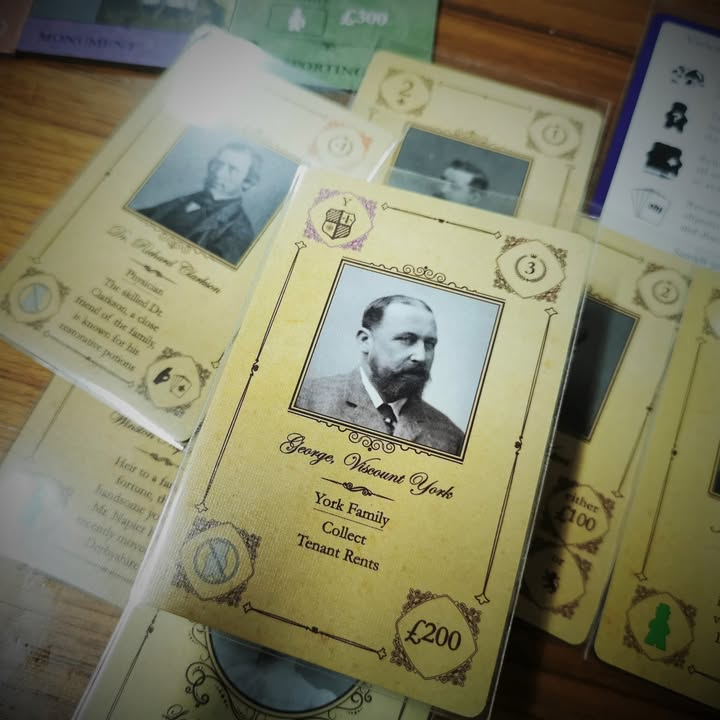
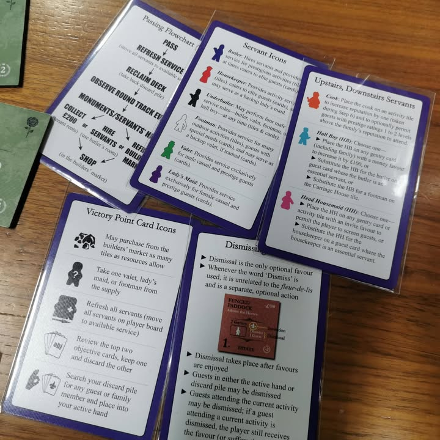

Obsession #bite_size #จริงๆเรียกบ่นจะเหมาะกว่า

เกมยูโรว่าด้วยการมาส่งเสริมขยับขยายธุรกิจของตระกูลในยุควิคตอเรียของอังกฤษผ่านการจัดงานเลี้ยงอู้ฟู่อวดร่ำอวดรวย ผลงานของ Dan Hallagan

.
ไอเดียเกมคือในตาหนึ่งเราจะต้อง activate ห้องหนึ่งห้องที่เรามี โดยห้องจะต้องการคนงาน (คนรับใช้ที่มีความสามารถแตกต่างกันนิดหน่อย) ในการทำงาน แล้วห้องมันก็จะบอกว่าเราต้องเล่นการ์ดจากมือกี่ใบ ไม่ขาดไม่เกิน 

.
คนงานพอใช้แล้วคนงานก็ต้องรอไปอีกสองรอบก่อนจะวนมาให้ใช้ใหม่ ส่วนการ์ดก็ลงกองทิ้ง เราก็อั้นๆไว้จนเลือกทำแอคชั่น reset เพื่อเก็บการ์ดกับคนงานขึ้นมือ

.
พวกการ์ดในมือก็จะเรียกว่าแขก นัยว่าเราต้องจัดงานเลี้ยงเชิญแขกโน้นนี้มาให้เงินให้ชื่อเสียงเรา แล้วแขกกับห้องหลายๆอันถ้าชื่อเสียงเรายังไม่พอก็จะเล่นไม่ได้ ก็ต้องปั่นๆลงการ์ดเพิ่มชื่อเสียงบ้าง หาเงินมาซื้อห้องใหม่บ้าง เล่นวนๆ 20 รอบก็จบ

---

.
ต้องออกตัวก่อนว่าผมเล่นไปครั้งเดียวและเล่นในจำนวนผู้เล่นที่สุดแสนจะไม่เวิร์คนั้นคือ 6 คนที่แม่งทำให้การรอมันนานโคตรๆสำหรับเกมที่ไม่ได้มีอะไรซับซ้อน สิ่งหนึ่งที่พูดให้ได้แน่นอนคืออย่าหาทำเลยเล่นเกมนี้เกิน 4 คน (ใน BGG นี้โหวตกัน best 2 ด้วยซ้ำ)

.
Top 100 Strategy game ..... you gotta be kidding me.

.
ผมไม่ได้เกลียดเกมนี้นะ แค่รู้สึกว่ามัน out of place ไปหน่อย คือใน 100 เกมเนี่ยมีเกมนี้เกมเดียวที่ผมไม่เก็ทว่ามาได้ไง นี้ถึงกับสงสัยว่าเล่นถูกปล่าวเลย (ซึ่งก็แย่หน่อยที่เล่นถูกแล้ว)

.
ปัญหาใหญ่ที่เจอเลยคือ ...... การ์ดซ้ำซากที่สุ่มมาแบบไม่ได้มีลูกเล่นอะไรเลย 

.
คือเกมนี้มันมีของให้ gain จากการ์ดแค่ 2 อย่าง....คือเงินกับชื่อเสียง แล้วการ์ดแต่ละใบก็เพิ่มอยู่แค่สองอย่างเนี้ยต่างกันอย่างละนิดละหน่อย 

.
แล้วให้การ์ดมากองเบ้อเริ่มเลย แต่ความหลากหลายเชิงความสามารถนี้อยู่ในระดับขี้เกียจ พ่วงภาพขาวดำเพลนๆ

.
อีกอย่างที่ปัญหาคล้ายๆกันคือตึกมันสุ่มชื่อโน้นนี้มาเยอะแยะแต่ความสามารถมันก็ซ้ำๆกันนั้นแหละ ได้โน้นนี้ต่างกันนิดนึง ทิศทางในการเล่นมันก็จะวนๆซ้ำๆไปเรื่อยๆ แล้วตึกมันออกมาสุ่มฉิบหายไม่มีหลักการอะไรเลย แล้ว mission ในมือมันชอบให้เราหยิบตึกโน้นนี้ที่ไม่รู้จะออกมาเมื่อไร

.
โดยทั่วไปผมคิดว่ามันเป็นเกมที่เล่นได้แบบเรื่อยๆเพลินๆนะ  แต่ไม่มีรู้สึกว่ามันมีอะไรที่โดดเด่นมากพอจากเกมทั่วไป  ถ้าให้เรทคงซัก 'กบเฉย'  (แต่ถ้าเล่น 6 คนนี้เอาไปเผา เสรดดดดดจะหลับรอ ไม่ได้มีอะไรให้คิดมากพอ) มันสนุกดีถ้าเล่น 60 นาทีจบ แต่ถ้านานกว่านั้นคือน่าเบื่อทันที (แต่กติกาหลายอันก็รุงรังเกินเกม 60 นาทีไปหน่อย)

--------------------------------
หมวด Bite Size (พอดีคำ) นี้กะว่าจะเขียนอะไรสั้นๆประมาณนี้ล่ะกัน ใหม่บ้าง ซ้ำบ้าง เกมที่ขี้เกียจเขียนบ้าง เขียนๆไว้ก่อนเผื่อมีอารมณ์อาจจะขยายไปลง Thought บ้าง จริงๆอยากเขียนสั้นกว่านี้ แต่ยังอดไม่ได้ที่จะต้องอธิบายอะไรเพิ่มตามนิสัย เดี๋ยวค่อยๆปรับไปล่ะกัน

