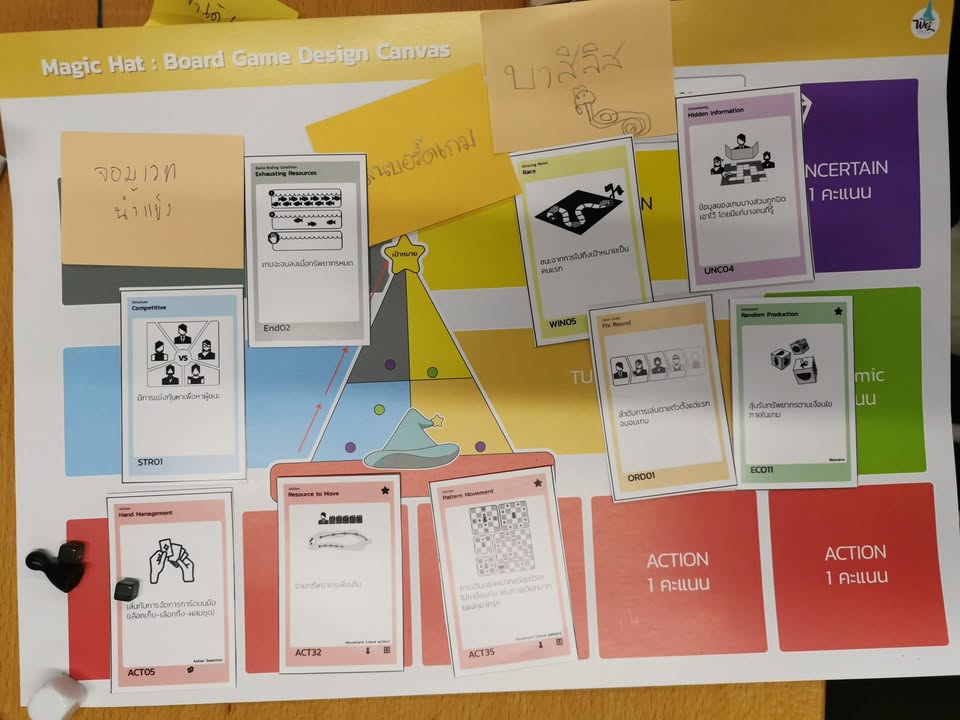
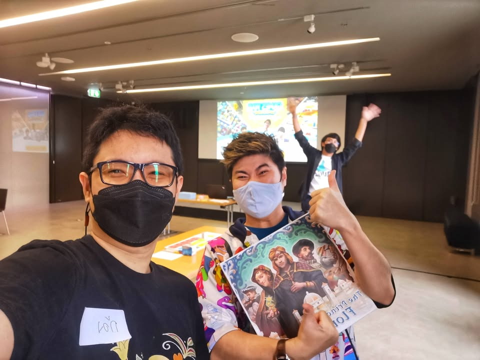
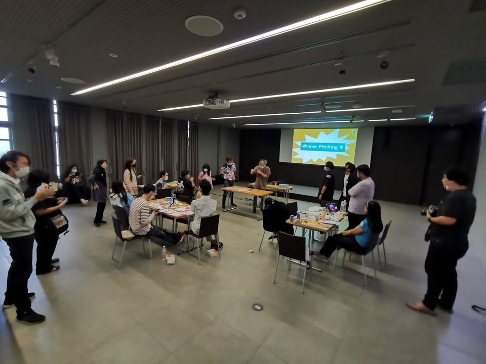

ผลงานการออกแบบเกมแรกของฉันคือเกมปาร์ตี้!!

▪️ Game War เป็นกิจกรรมออกแบบเกมที่เรียกได้ว่าเป็นงานทดลองชิ้นใหม่ที่ทาง Wizards of Learning  ทำออกมา โดยไอเดียของมันคือการที่ให้ผู้ร่วมกิจกรรมได้ทดลองเรียนรู้การออกแบบเกมโดยใช้ 'ชุดการ์ดอธิบายกลไกเกม' ที่ทางทีมงานจัดทำไว้

▪️ ตัวการ์ดที่ว่าก็คือ collection ของกลไกและเงื่อนไขต่างๆในเกมมาแบ่งหมวดหมู่ในเข้าใจง่าย หลักๆจะอิงมาจากหนังสือชื่อ Building Blocks of Tabletop Game Design: An Encyclopedia of Mechanisms

▪️ รูปแบบกิจกรรมจะเป็นงานเดี่ยว แต่ก็มีการแบ่งกลุ่มที่ให้โจทย์ตั้งต้นแตกต่างกัน ในกลุ่มของผมก็ได้ตามนี้

theme: จอมเวทน้ำแข็ง (สุ่มจากข้อความที่ผู้เข้าร่วมใส่ไว้หน้างาน)

theme event: เล่นบอร์ดเกม  (สุ่มจากข้อความที่ผู้เข้าร่วมใส่ไว้หน้างาน)

end game condition: ทรัพยากรหมด

win condition: race - เคลียร์เงื่อนไข

structure: มีการแข่งหาผู้ชนะ

turn: fixed round (เล่น mini game ชนะมาแล้วทีมเลือกอันนี้)

uncertain: ข้อมูลบางส่วนมีการปิดไว้

▪️ ส่วนกลไกที่ได้รับมาคือ

hand management: มีการบริหารการ์ดในมือ

resources to move: จ่ายทรัพยากรเพื่อเดิน

pattern movement: หมากมีการเดินที่แตกต่างกัน

▪️ พ่วงกับต้องมีการใช้ลูกเต๋าด้วยอย่างน้อยหนึ่งลูกและในระหว่าง pitching จะให้ใช้การ์ดได้แค่ 15 ใบในการช่วยเดโม

▪️ เป้าหมายคือการพยายามออกแบบโดยใช้ของพวกนี้ให้ได้มากที่สุด

▪️ จริงๆพวกเงื่อนไขบางอย่างมันค่อยๆงอกมาตอนหลัง แต่ของผมเองเนี่ยตอนที่เห็นโจทย์ก็คิดไว้ประมาณเกมที่มีผู้เล่นสองคนแล้วก็ให้เล่นการ์ดชักเย่อดึงหมากกลับไปกลับมาอะไรประมาณนั้น

▪️ แต่พอช่วงกลางกิจกรรมทีมเล่น mini game แพ้เลยถูกบังคับให้เพิ่มอุปกรณ์อีกอย่างเข้ามาให้เกมนั้นคือ ที่เป่าลมงานปาร์ตี้ที่มันเป็นม้วนๆอ่ะ แบบพอได้มาแล้วผมแม่งแบบปิ๊งแว๊บมาเลยเว้ยว่าเดี๋ยวกูเอาเกมทรงนี้แหละ!!

▪️ เกมที่ผมออกแบบเลยจะเป็นส่วนผสมของ flick 'em up + command & color system (memori 44)

- คือผมจะทำเกมที่เราจะใช้ไอ้ที่เป่าปาร์ตี้เนี่ยเป่าเพื่อผลักเอา token สีๆไปมาไปในสนาม

- โดยในสนามจะมี zone เครื่องหมายที่เราอยากให้สีไปอยู่ตรงนั้น

- ผู้เล่นจะมี mission ลับด้วยว่าอยากให้ zone ไหนมีหมากสีอะไรอยู่บ้าง (race + hidden obj)

- แต่ว่าเราอยากจะยิงสีมั่วๆไม่ได้นะ ต้องทิ้งการ์ดสีในมือให้ตรงด้วย จะทิ้งการ์ดหรือจะใช้ effect ก็ได้ (hand mangment + spent resources to move)

- แล้วสีเนี่ยผมก็กำหนดเงื่อนไขไปอีกว่าห้ามสีเดียวกันชนกัน และต้องเล็งไปยังสีที่กำหนด (pattern movement)

- ส่วนลูกเต๋าผมจะให้มันทอยออกมาเป็นหน้า ซ้าย กลาง ขวา เพราะว่าผมจะแบ่งสนามออกเป็นสามส่วนแบบ memori 44 คือต้องทอยเพื่อบอกว่าเราจะได้ขยับหมากใน zone ไหนด้วย

- และแน่นอนว่าเราต้องดริฟอีกหน่อยเพื่อบอกว่าการ์ดในกองจั่วคือทรัพยากร หมดกองก็จบเกม

- ส่วนกระดานไม่ใช่เพราะผมใช้โต๊ะ!!! (แอบไปหยิบการ์ด variable setup มาเพิ่ม จัดฉากได้ดั่งใจ)

▪️ ว่ากันตามจริงผมมั่นใจในเชิง creativity ของงานตัวเองในแง่การเอาอุปกรณ์เป่ามาใช้อยู่พอดู ตั้งใจใช้มาก แต่นั้นแหละพอดีคนในทีมเค้าคิดแบบอื่น เลยไม่ได้เป็นตัวแทนทีมเข้ารอบ pitch ขั้นถัดไป ..... งื้ออออ 

▪️ ทั้งนี้ในแง่ว่าทำได้แล้วเราพอใจก็คือสนุกจัดๆล่ะ ข้อเสียคือพอเราปรับตัวได้ง่ายเกินไปใครโยนอะไรมาเราก็ดริฟเลือดซิบๆเป็นเกมออกมาได้หมดนี้ลำบากใจจริงๆ เวลาว่างผมเยอะมาก ตรงนี้ไม่ได้บอกว่าตัวเองเจ๋งกว่าคนอื่น แต่อยู่ๆเราก็ค้นพบว่าองก์ความรู้เราที่รู้เยอะไปแล้วฝุ้งเพ้อเจ้อ แบบ curse of knowledge แต่ถ้าเค้ากำหนด scope มาดีๆเราก็ตีมิกซ์โจทย์ได้ชิลมัก (ส่วนสนุกไหมนี้ก็นะ......)

▪️ ว่ากันโดยรวมก็เป็นกิจกรรมที่สนุกกว่าที่คิดไว้เยอะเลย เท่าที่คุยจากมุมมองมือใหม่ตัวกิจกรรมอาจจะต้องเพิ่มแนวทางประยุกต์ใช้ให้เห็นภาพมากกว่านี้ เพราะกลุ่มนี้จะเหวอๆหน่อยเพราะอาจจะไม่เคยเจอตัวอย่างการใช้กลไกที่ยกมา แต่จากมุมคนที่เล่นเกมมาเยอะประมาณหนึ่งการเอาโจทย์ที่ได้มาสร้างสรรค์เกมในระดับ prototype ในเวลาแค่ 2 ชั่วโมงหน่อยๆก็ถือเป็น light brain workout ที่สนุกดี

▪️ ตรงนี้ก็อาจจะต้องดูต่อไปว่าทางทีมงานจะเอาประสบการณ์ในวันนี้เอาทำอะไรต่อ แต่ถ้ามีอีกก็อยากให้ทุกคนไปลองร่วมกันดูครับ

ว่าแต่มีค่ายไหนอยากได้ปาร์ตี้เกมบายบอร์ดแล้วบ่นไปทำต่อมั้งครับ ฮา

