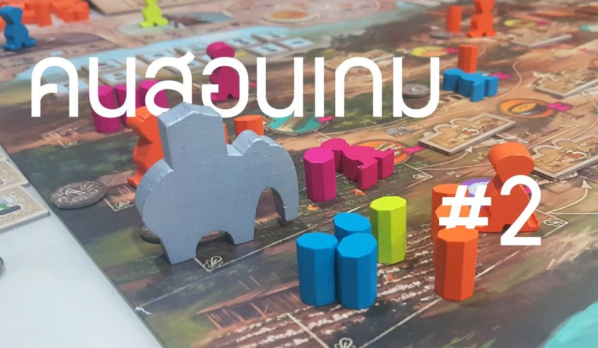
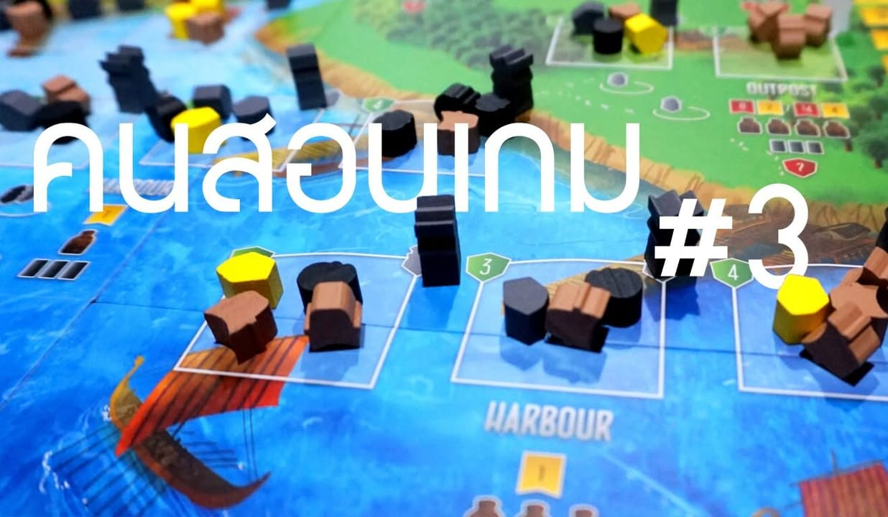

รวมแง่มุมสั้นๆบางมุมของการเป็นคนสอนเกมชาวบ้านที่เคยเขียนไว้ ไหนๆกำลังรื้อมาลงเวบก็เลยถือโอกาสแยกมารีรันไว้ที่เดียวกันซักหน่อย

---
title: คนสอนเกม- ลุยเลย...อย่าพล่ามเยอะ
tags: [กบเล่าเรื่อง]
---
รอบนี้อยากจะเล่าบางแง่มุมของผมที่มักจะต้องรับบทสอนเกมเป็นประจำ ซึ่งจริงๆแล้วเนี่ยก็เป็นสิ่งที่ผมชอบทำมากอย่างหนึ่ง (สอนดีปล่าวไม่รู้ แต่ก็เชื่อว่าก็ **'คล่อง'** พอควร..... แต่ก็น่าจะรู้เรื่องแหละเพราะก็เล่นกันได้จนจบเกม ฮา) ส่วนชื่อตอนก็ใส่ไว้งั้งๆเผื่อคิดตอนใหม่ออก.....

ในหลายๆแง่แล้วผมมองการสอนเกมเป็น **'เกม'** โดยตัวมันเองอย่างหนึ่ง เป้าหมายของผมคือจะสอนยังไงให้คนเค้าเก็ทแล้วก็เข้าไปเล่นเกมได้เร็วที่สุด สไตล์ที่ผมชอบใช้คือ สอนเงื่อนไขชนะก่อน แล้วตามด้วยวิธีทำแต้ม แล้วค่อยไล่ว่าทำแอ๊คชั่นอะไรถึงได้แต้ม ส่วนอะไรที่ผมตัดสินใจว่าไม่จำเป็นก็จะค่อยๆคายตอนที่คิดว่าจำเป็น คือเน้นโครงสร้างของเกมและ **'ทำไปเพื่ออะไร'** สำคัญกว่า **'ทำยังไง'** (จุดที่น่าสนใจอีกอย่างคือ คายกฎออกมาตอนไหนเค้าถึงรู้สึกว่าเราไม่ได้กั๊ก)

ส่วนหนึ่งก็มาจากนิสัยส่วนตัวของผมเองที่เป็นคนประเภททนฟังกติกายาวๆแล้วจะหลับ แถมพล่ามไปเยอะๆก็ลืมอยู่ดี ตัวอย่างแบบที่ฟังสอนแล้วผมมักจะตามเกมได้ช้าคือแนวเปิดเรื่องพร้อมไล่อธิบายแต่ล่ะแอ๊คชั่นแบบละเอียดๆยาวไปตั้งแต่ต้นตนจบเกม...คร่อก

เวลาสอนผมเลยใช้แนวคิดของ Miller's law ที่ชื่อ **'7 ± 2'** ที่หมายถึงว่า มนุษย์เนี่ยนะปลาทองจะตายจำได้แค่ทีล่ะไม่กี่อย่างเท่านั้นแหละ (5-9 อย่าง หรือ 7 บวกลบ 2 นั้นเอง) คือผมไม่ชอบการสอนแบบอัดมันทุกอย่าง ลงทุกรายละเอียด แล้วพอคนฟังลืมๆไปบ้างก็มาเอาแต่ย้ำว่าก็ผมสอนไปแล้วนะครับ.... รู้สึกว่าแบบนั้นออกจะไร้ความรับผิดชอบไปซักหน่อย (แต่ถ้าบอกหลายทีแล้วยังไม่จำก็น่าจะโดนด่าอยู่)

> ตัวอย่างถ้าเป็นเกมอย่าง Agricola ที่เป็น Worker Placement ที่เราจะต้องส่งคนงานไปเก็บของมาสร้างฟาร์ม แล้วก็มีกติกาย่อยเยอะจุด ผมก็จะเริ่มจากการวางเรียงตอนจบให้ดูก่อนเลยว่าฟาร์มแสนสุขจะหน้าตาเป็นยังไง เกมมีวัตถุดิบแบบไหน ต้องหยิบอะไรเพื่อมาสร้างอะไร (จะเลี้ยงสัตว์ต้องมีคอก จะมีคอกต้องเอาไม้มาทำรั้ว) อะไรประมาณนั้น ส่วนพวกแอ๊คชั่นลงไปแล้วเก็บของได้อะไรนี้ท้ายสุดแต่ก็พูดแบบผ่านๆ พอจะเปลี่ยนยุคทีก็จะหยิบมาเปิดให้ดูก่อนว่าอีกสองสามรอบหน้าเราจะเจออะไร เรื่องต้นรอบจะมีเติมของผมก็รอให้ถึงรอบที่สองก่อนค่อยทำให้ดู รายละเอียดของแต่ล่ะการสอนจะเปลี่ยนไปตามคนเล่น บางกลุ่มจะใช้วิธีเล่นแบบไม่มี draft การ์ดอาชีพแต่ว่าหยิบการ์ดแรงๆให้ 1-2 ใบแล้วสุ่มๆให้ก็มี บางวงก็จะข้ามเรื่อง renovate ไปเลยการ์ดมาค่อยบอก ไรเงี้ย

แต่ว่าแต่ล่ะคนก็มีวิธีในการเรียนรู้ที่ต่างกันออกไป เอาวิธีผมไปใช้กับบางคน เค้าอาจจะด่ามาว่าสอนไม่เห็นได้เรื่องก็เป็นได้......

อีกอย่างที่มีส่วนช่วยเยอะมากในการสอนเกมใหม่ก็คือ player aid ดีๆที่ช่วยสรุปแอ๊คชั่นที่ทำได้ หรือพวกเฟสในเกม บางเกมก็ทำมาดีมากชี้ๆสอนตาม player aid ได้เลย บางเกมก็กากแบบไม่เห็นบอกอะไรที่กูอยากจะรู้เลย บางเกมจากเกมง่ายเป็นเกมยากเพราะมีกติกาแปลกๆแต่ดันไม่มี player aid บอก ปกติถ้าเกมที่ออกมาซักพักแล้วผมมักจะไปดูหาไฟล์ใน BGG ก่อนเลย ว่ามีใครทำ player aid หรือ short rule summary ไว้ไหม.... ที่แปลกคือ เวลาคนเล่นเกมมาเรียบเรียง player aid เองมักจะใช้งานได้ดีกว่าของที่มาจากผู้ผลิต

ในอีกแง่การสอนมันก็คือบททดสอบสุดท้ายของการอ่านกติกา ที่เราจะต้องเอามาถ่ายทอดให้คนอื่นมาร่วมเล่นเกมกับเราได้ ตรงนี้ก็เป็นทั้งความตื่นเต้น และความกลัวไปพร้อมๆกัน คือกลัวสอนไม่รู้เรื่องคนเล่นไม่เข้าใจ แต่ก็ตื่นเต้นนะว่ากูจะได้เล่นเกมที่กูทนทรมารอ่านมาตั้งนานแล้ว!!!

คือจริงๆแล้วผมน่ะไม่ชอบอ่านกติกาเท่าไรหรอกนะเพราะพื้นฐานเป็นคนสมาธิสั้น แต่ถ้าไม่อ่านเอง สอนเอง เราก็จะไม่ได้เล่นเกมที่เราอยากเล่นนะสิ!!!!
 
> **สรุป: ถ้าฟังคนอื่นแล้วไม่เก็ท ก็อ่านเองสิว่ะ!!**

---
title: คนสอนเกม- เกมแรกมีไว้เรียนรู้]
tags: [กบเล่าเรื่อง]
---
ต่อจากคร่าวก่อน พอเขียนแล้วมีคนแสดงความคิดเห็นกันหลายคน (นานๆจะมีซักโพสหนึ่งที่มีคนคุยเยอะ ดีใจมาก สงสัยรีวิวมันจะน่าเบื่อไป ฮา) หนึ่งในหัวข้อคุยที่น่าสนใจก็คือ **'เกมแรก'** กับผู้เล่นหลายแบบ บางคนก็ชอบแบบค่อยๆสอน (ตามข้อเขียนก่อนหน้า) บางคนก็ชอบแบบสอนกฎให้หมดแม๊กไรงี้ รอบนี้ก็เลยขอยกมุมมองของผมกับ 'เกมแรก' มาเล่าสู่กันฟัง

> แต่ต้องขอออกตัวไว้ว่าผมพูดแค่ในมุมมองกับประสบการณ์ของผมเท่านั้นนะ ไม่ได้คิดว่าแนวคิดที่เขียนๆไว้มันจะเป็นไกด์ไลน์สูตรสำเร็จอะไร

---

อีกแนวคิดที่ผมใช้กับเกมแรกบ่อยๆคือ **'เกมแรกมีไว้เรียนรู้'** คือเน้นจบให้ไว ไม่ต้องคิดเยอะ สัมผัสด้วยร่างกาย แล้วค่อยมาต่อรอบสอง โดยมักจะใช้แนวคิดนี้กับทั้งคนที่ฟังกฎเราอยู่ แล้วก็กับตัวเองในฐานะคนสอนด้วย

ที่บอกว่าในฐานะคนสอนด้วย ก็คือผมมองการเล่นของผมเวลาสอนว่ามันคือมูฟที่เอาไว้แสดงให้ดูว่าเกมมันเล่นยังไง ไม่ใช่มัวแต่ออกท่ายากแล้วกลายเป็นเกมแทบไม่เดินเพราะคนเล่นงงว่าทำอะไรดีหว่า (อันนี้กรณีที่เล่นนั้นเล่นเป็นแล้วนะ) บางทีก็อาจจะต้องเล่นท่าที่เราเสียเปรียบนิดหน่อยเป็น show case ให้ดูว่าเกมมันเล่นยังไง แต่ว่าไม่ใช่ว่าเล่นแบบยอมให้คนอื่นชนะ แค่อาจจะ sub-optimal นิดนึง คือผมมีแนวคิดตอนสอนอีกอย่างว่าเราต้องเล่นดั่งราชสีห์ถล่มมือใหม่ให้ราบ แต่ต้องทำด้วย mindset ว่าเราต้องการแสดงให้ดูว่าเกมเล่นยังไง ไม่ใช่มาตั้งใจกั๊กทีเด็ดมาตบเด็ก (จริงๆแล้วรู้สึกว่าทำแบบนั้นน่าเกลียดนะ อะไรจะอยากชนะขนาดนั้น.....)
แต่ถ้าพึ่งเล่นรอบแรกก็จะบอกว่า **"กูก็ไม่รู้หว่ะ เล่นๆลอง flow กันก่อนนะ"**

ความร่วมมือของคนในวงที่จะเล่นให้ไว เพื่อที่ทุกคนจะได้จับ flow ของเกมได้ก็สำคัญเหมือนกัน ผมคิดว่าเราไม่จำเป็นต้องเล่นครบทุกแบบก็ได้ เล่นของตัวเองบ้าง มองคนอื่นเล่นบ้างเรียนรู้เกมกันไป หลายๆเกมถ้ามันมีผลเยอะก็อาจจะเดโมไปซักหนึ่งรอบใหญ่ หรือไม่ก็ซักประมาณ 10-20% แล้วค่อย reset ใหม่ (แต่ถ้าดูทรงแล้วมือใหม่เค้ากำลังไปได้สวยก็อาจจะเล่นต่อไปเลย)

คือบางเกมกว่าจะเก็ทก็โน้นแหละจบเกม อย่าง Troyes ที่โคตร opaque มาก ( opaque [ทึบแสง]-- เกมแบบที่อธิบายกฎจบแล้วก็ยังไม่เข้าใจว่าเกมมันเป็นยังไง ต้องเล่นหลายรอบ) กว่าคนจะเข้าใจว่าเกมมันต้องเล่นประมาณไหนก็น่าจะแถวๆ 60% ของเกม ส่วนมากผมจะให้ reset ตอนรอบสอง (จากหก) เพราะจะเห็น flow เกมครบแล้ว แต่ในตอนแรกที่ยังงงๆอยู่ผมจะบอกให้เดินไปมั่วๆนั้นแหละ เดี๋ยวเริ่มใหม่

ถ้าเป็นเกมที่ผมเล่นมาหลายครั้งแล้ว อีกทริคที่ผมใช้บ่อยคือช่วงต้นเกม จะบอกเลย **'มูฟไหนก็ดีทำๆไปเหอะ'** โดยไม่ได้บอกว่าเล่นแบบไหนจะเป็นสายไหน พอเค้าเริ่มไปได้ซักหน่อย เราค่อยไปไกด์บอกว่า "ถ้าเริ่มมาแบบนี้ก็น่าจะไปทางนี้ๆต่อ ลองเล่นโดยใช้แนวคิดประมาณนี้ ลองสร้างอันโน้น แล้วพยายามทำอันนี้ดูนะ" วิธีนี้จะเหมาะกับเกมที่มีสายการเล่นชัดนิดนึง

แต่แนวการสอนแบบนี้ก็ไม่เหมาะกับผู้เล่นสาย **'ข้าต้องวินเกมแรก'** เท่าไร เพราะสายนี้จะชอบรู้ทุกข้อมูลตั้งแต่แรก จะเหมาะกับผู้เล่นสาย **'ลงมือทำ'** แบบผมเองมากกว่า แต่ปกติไม่ค่อยเจอสายอยากรู้ทุกเม็ดเท่าไร ที่เจอส่วนมากที่เจอจะเป็นคนที่มีทักษะการเล่นสูงพอที่มักจะตั้งคำถาม หรือตั้งข้อสงสัยเกี่ยวกับกติกาได้เองอยู่แล้ว กลุ่มนี้ก็จะถามมาเลยไม่ต้องลำบากให้เราหาจังหวะคาย

 
> **สรุป: เกมแรกมีไว้เรียนรู้ -- รีบๆเล่นสิว่ะ!! จะได้เริ่มเกมใหม่!!!**

---
title: คนสอนเกม- พิธีกรรมก่อนเริ่มเล่น
tags: [กบเล่าเรื่อง]
---
ในกลุ่มที่ผมเล่นอยู่ประจำ ผมมักจะอยู่ในกลุ่มคนจำพวก **'ทีมสอนเกม'** อันเป็นกลุ่มคนประเภท สายซื้อ/สายอ่านกฎ ที่หลายครั้งถ้าไม่เอาเกมคนอื่นมาอ่าน ก็จะมีคนซื้อเกมมาให้อ่าน (ฮา) ตำแหน่งนี้จะกึ่งอาสาสมัครนิดหน่อย คือเวลาจัดวงเล่นเกมจะเป็นเป้าแรกๆที่โดน **'แยก'** ไปสอนวงที่ยังไม่เคยเล่นเกมนั้นๆ

คือธรรมชาติของกลุ่มที่ผมเล่น เราจะมองหน้าคนที่เหลือหรือดูตามความสนใจก่อน (นึกภาพสเกาเตอร์ใน Dragonball ประกอบ) แล้วค่อยเลือกเกมที่เหมาะกับคน (และเจ้าของอยากเล่น) ออกมากาง โดยในกลุ่มเวลามารวมตัวกันก็จะหยิบเกมที่ตัวเองอยากเล่นอยากบิ้ว กับเกมเผื่อตามสถานะการณ์ติดตัวมาจำนวนหนึ่ง

คือในกลุ่มผมเองถึงจะนัดเล่นกันบ่อยพอควร (อาทิตย์ล่ะสองวัน) แต่เราเล่นเกมซ้ำกันน้อยมากเพราะหยิบเกมใหม่ออกมาตลอด เล่นกันได้สองสามอาทิตย์ก็เปลี่ยนเกมล่ะ (ส่วนมากเกมใหม่มาจะกระหน่ำเล่นก่อนแล้วค่อยเปลี่ยน) ด้วยขนาดกลุ่มที่มีคนหลักสิบแวะเวียนกันไปๆมาๆ ต่อให้หยิบเกมที่กางมาสามสี่รอบแล้วก็ยังมักจะมีอย่างน้อย 1 คนที่ยังไม่เคยเล่นเกมนั้นๆอยู่ดี (ยากมากอ่ะ ที่จะหยิบมาแล้วไม่ต้องสอน นานๆจะเจอซักเกม อย่างน้อยๆก็ต้องมารีวิวกฎคร่าวกันให้ซักรอบ บางเกมกางมาแล้ว 20+ รอบก็ยังมีคนให้สอนอยู่ดี) พูดอีกนัยหนึ่งก็คือสำหรับผมแล้ว การสอนก่อนเริ่มเล่นนี้มันก็คือส่วนหนึ่งของการ setup เกมนั้นแหละ ครั้งไหนที่สามารถเล่นเกมได้โดยไม่ต้องสอนนี้จะรู้สึกตกใจว่าเหมือนขาดอะไรไปเลยทีเดียว.....

บางทีคนที่พึ่งมาเล่นเกมด้วยกันครั้งแรกๆ ก็มักจะมีเลเยอร์ของความ **'เกรงใจ'** เยอะประมาณนึง จำพวกว่า "ไม่ต้องลำบากสอนก็ได้", "เล่นเกมที่เล่นเป็นอยู่แล้วก็ได้", "เอาเกมที่พี่อยากเล่นดีกว่า" ส่วนตัวผมเองโดยร้อยล่ะ 98% (และผมมโนเอาว่าคนสอนเกมส่วนมากน่าจะคิดคล้ายๆกัน) ผมพูดได้ค่อนข้างเต็มปากว่า 'ไม่มีปัญหาเลยครับ ยินดีสอนมาก' แบบตรงตามตัวอักษร ไม่ใช่เพราะต้องการรักษามารยาทแต่อย่างใด....

> ยกเว้นมนุษย์ประเภทอยู่ๆเปิดมา "สอนหน่อย เล่นไม่เป็น" แบบห้วนๆอ่ะนะ ...... ได้ยินล่ะขึ้น

> ถ้าพูดให้ชัดคือไม่ชอบพวกงอมืองอเท้า รอให้เราเคี้ยวหญ้าแล้วยัดเข้าปากให้เท่าไร แต่เอาจริงๆพูดงี้ก็ไม่ตรงเท่าไร เพราะส่วนใหญ่คนที่เล่นไม่เป็นแล้วให้ผมสอนตลอดแต่ผมก็ยินดีสอนนะ สนุกด้วยที่ได้สอน แต่มันจะมีคุณสมบัติร่วมบางอย่างของพวกเอาแต่อ้าปากพะงาบๆ ที่มันแตกต่างกับพวกที่น่าสอนเยอะๆอยู่อ่ะ

ส่วนเรื่องเอาเกมที่คนสอนอยากเล่นดีกว่า คุณอาจจะไม่เข้าใจแต่โอกาสที่ผมจะได้หยิบเกมเก่าๆมากางอ่ะไม่ค่อยมีหรอก ก็อาศัยตอนกลุ่มหน้าใหม่โผล่มาเนี่ยแหละ ค่อยเนียนๆรีรันเกมเก่าๆที่อยากเล่น

แต่จริงๆแล้วในเชิงจิตวิทยาผมก็ชอบที่เรายังมีความรู้สึกเกรงใจกันอยู่นะ คือมันเป็นคุณสมบัติแบบที่คนดีๆเค้ามีกัน แบบรู้สึกได้รับความช่วยเหลือ แล้วรู้สึกอ่ะเราควรจะตอบแทนหน่อยไหม แต่ที่พูดไปก็ไม่ใช่อะไรแค่อยากจะบอกว่า สำหรับวงเล่นเกมส่วนใหญ่แล้ว การที่พึ่งโผล่มาใหม่ แล้วต้องสอนเล่นน่ะ มันไม่เป็นภาระอะไรเท่านั้นเอง

