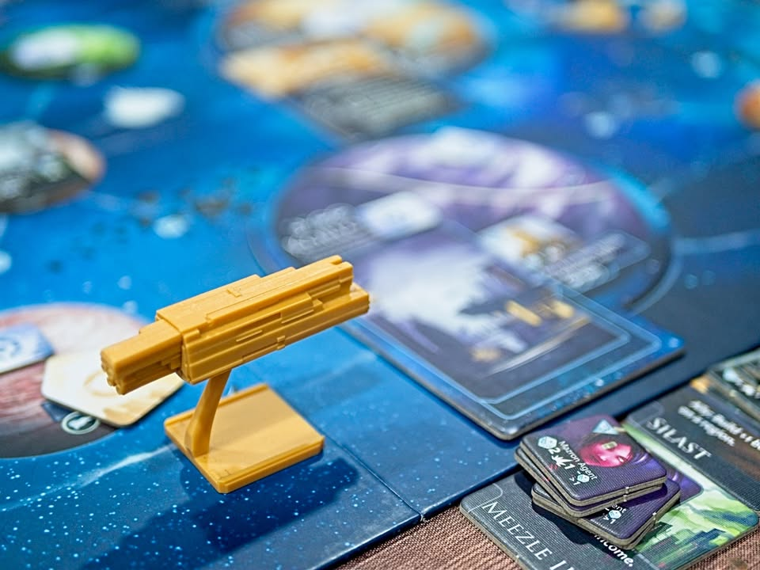
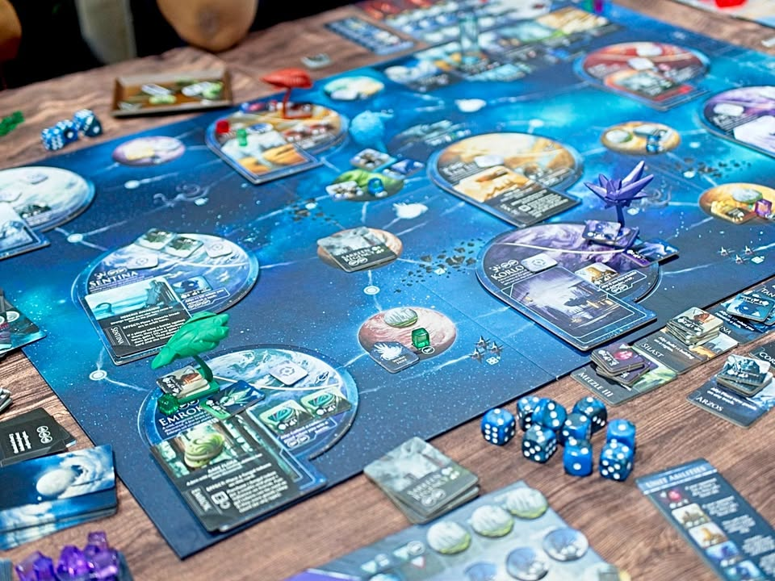
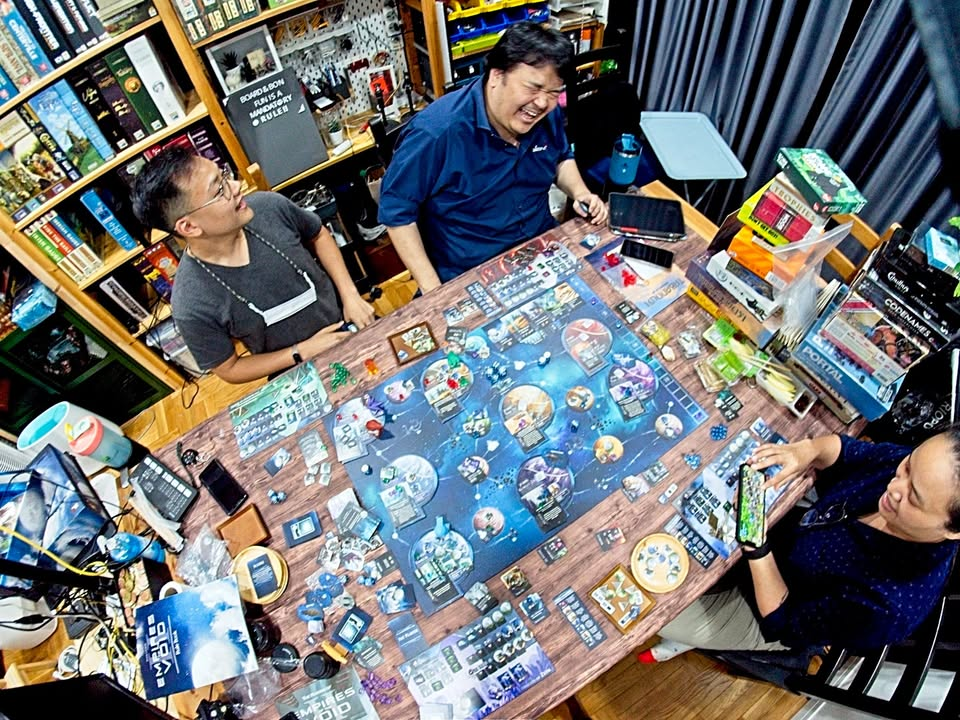
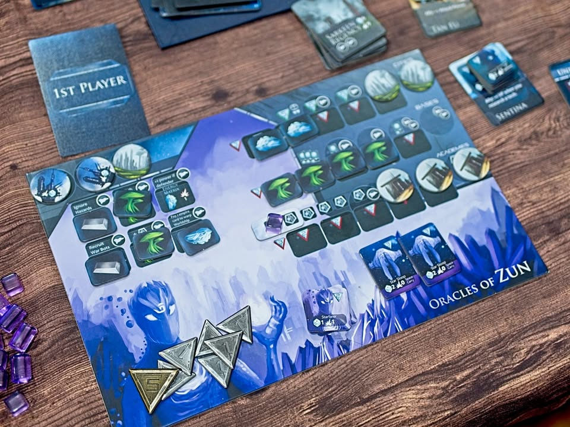
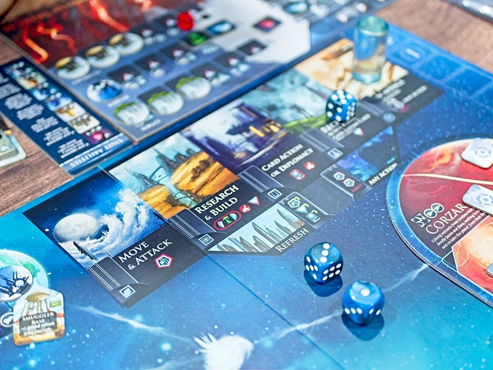

ผมคิดไอเดียทำเพจออกอันนึงล่ะ คือ 'Board Game & Side dish' ประมาณว่าทำอาหาร ของกินเล่นแล้วก็ลงพร้อมกับตอนเล่นเกมไรงี้ จะเล่าสตอรี่ย์พร้อมแทรกตัวเลือกอาหารเข้าไปหน่อย

.
เสนอเฉยๆนะเพราะทำอาหารเองไม่เป็น แต่คิดว่าเออมันน่าจะเป็น content ลูกผสมที่น่าสนใจดี อาจจะเปลี่ยนเป็นเหล้าเป็นกาแฟอะไรก็ว่าไปตามสไตล์ ใครเห็นว่าเข้าท่าก็เอาไปใช้ได้เลยยยยยย

.
จริงๆไอเดียเรื่อง side dish นี้ผมเอามาจาก Guga Foods อีกที คือมันรายการมาทำ dry aged stake หลายๆแบบ แต่หลังๆมันก็จะทำ side dish โชว์ด้วยว่าไม่ได้มีแต่เนื้อนะเฟ้ย ก็เออดูน่ากินดี

.
ส่วนเกมชื่อ Empires of the Void II เกมลูกผสมกึ่งๆ 4x กึ่งๆ Sandbox ที่จริงๆก็เพลินๆดี แต่เสียดายที่มันไปไม่สุดซักทาง แต่ในฐานะความพยายามในการออกแบบนี้ดีเลย 

.
จริงๆมันควรจะเป็นเกมที่เอามาอยู่ในรายการเคลียร์ที่แต่ดันลืม เลยเอามากางๆเล่นเลยหน่อยกัน

 เคยเขียนถึงไว้นานล่ะ - https://sisadar.github.io/empires-of-the-void-ii/

