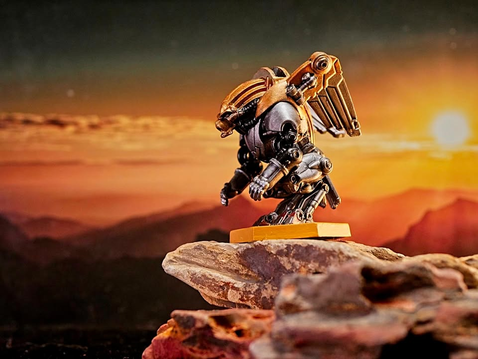
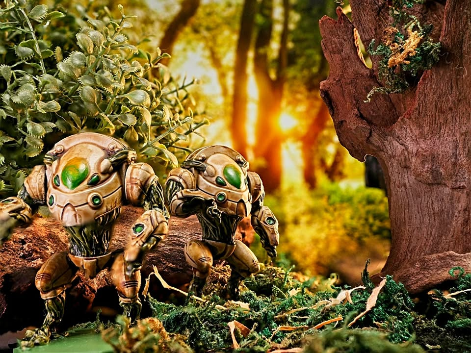
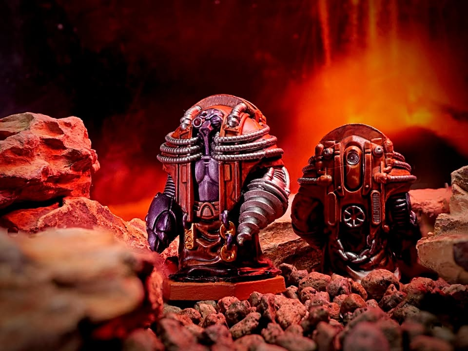
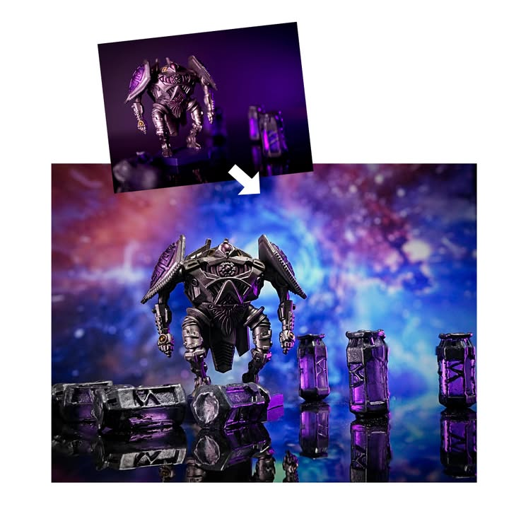
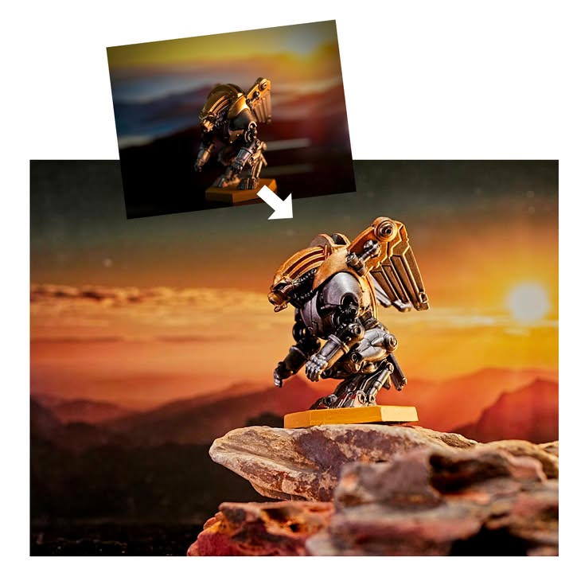
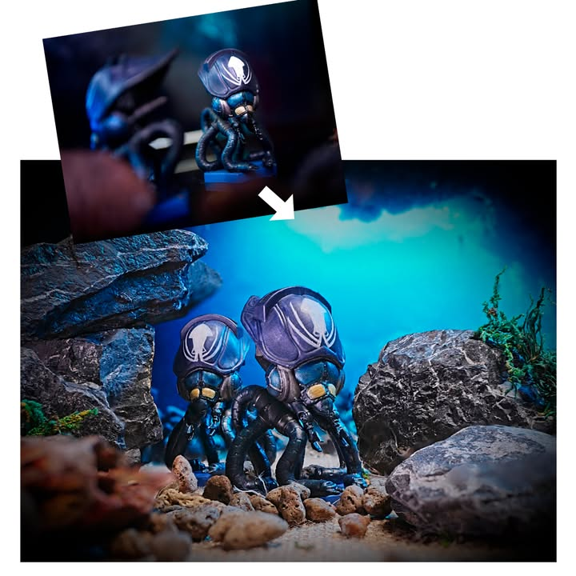
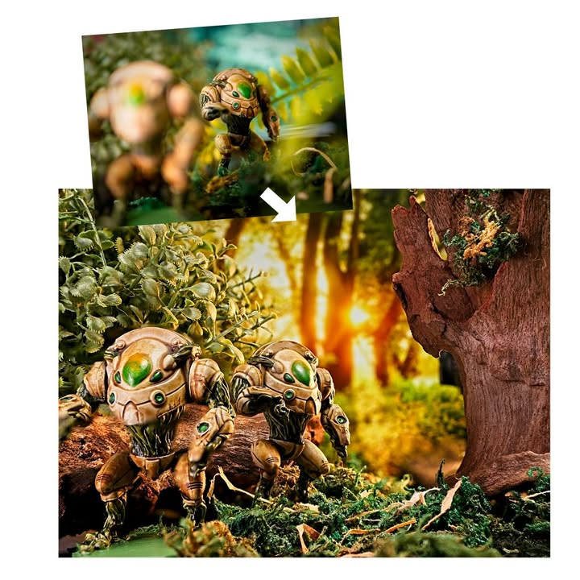
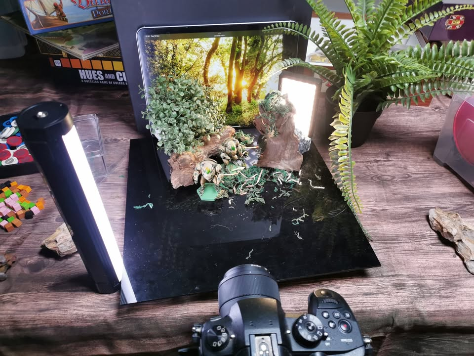
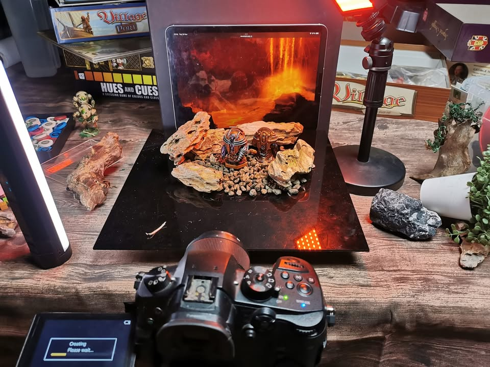

จริงๆก็ไม่ได้อยากบ่นเรื่องเดิมซ้ำซ้อนนะ แต่วันก่อนผมเซงมากจริงๆโดน reject รูปรัวๆเนี่ย เลยดับความหงุดหงิดด้วยการถ่ายใหม่แม่มอีกรอบ ไปกดสั่งหินตู้ปลามาจัดใหม่ แล้วก็ถ่ายให้ชัดทุกระยะไปเลย แล้วก็แก้ feedback เรื่องฉากหลังเบลอไปด้วย

.
อาร์ หากเราถูกขับเคลื่อนด้วยความแค้นมันก็จะออกมาดูดีกว่าเดิม แต่ถ้าไม่ผ่านอีกก็ไม่ทำอีกรอบละนะ -_- (แต่ถ้าทำใหม่อีกทีอาจจะทำ long exposed ไม่ก็เอามาทำ manual stacking เองเพราะ output จาก GH5 มันได้แค่ jpeg)

.
รอบนี้เปลี่ยนมาใช้เลนส์ 25mm (50mm FF) แทนที่จะเป็น 60mm (120mm FF) เพราะว่าจะใช้ feature auto stacking เลยต้องใช้เลนส์ที่มี auto focus  

.
หากชอบก็ฝากไปกด like กัน หน่อยนะครับ https://boardgamegeek.com/boardgame/185343/anachrony/images

.
ส่วนตัวมีปีกนี้ต้องถ่ายใหม่รอบที่ 3 เพราะโดน reject ข้อหามีตัวเดียว เลยทำใหม่ใส่ 3 ตัวแม่ม

------
disclosure: กล่องของผมเอง แต่ว่าไม่ได้ทำสีเองนะ สนใจทำสีโทนนี้ก็ไปติดต่อ Bewitched boardgame cafe ได้เลย

