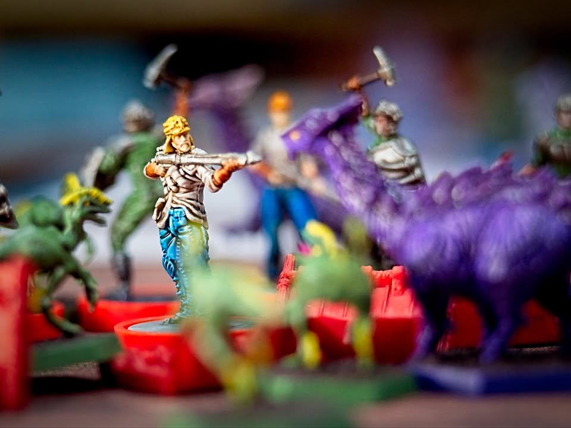
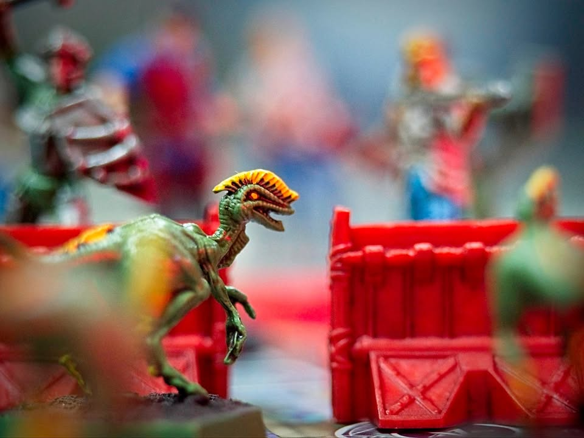
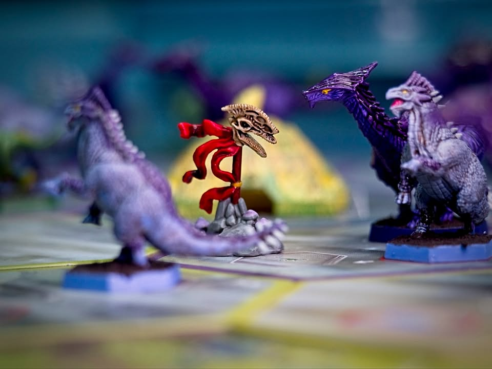
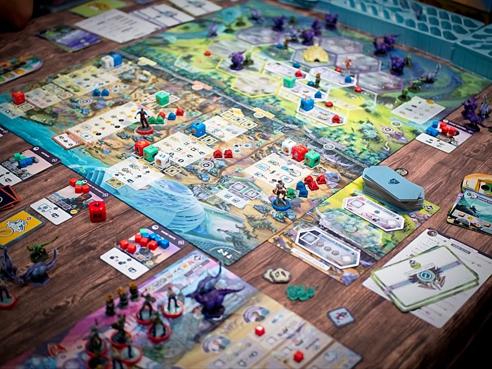
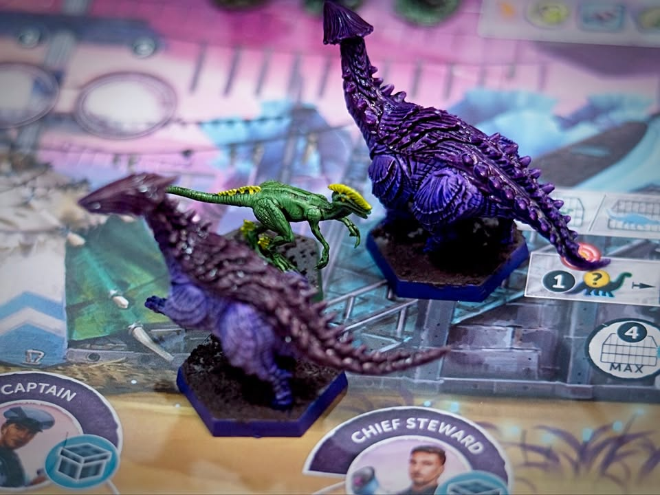
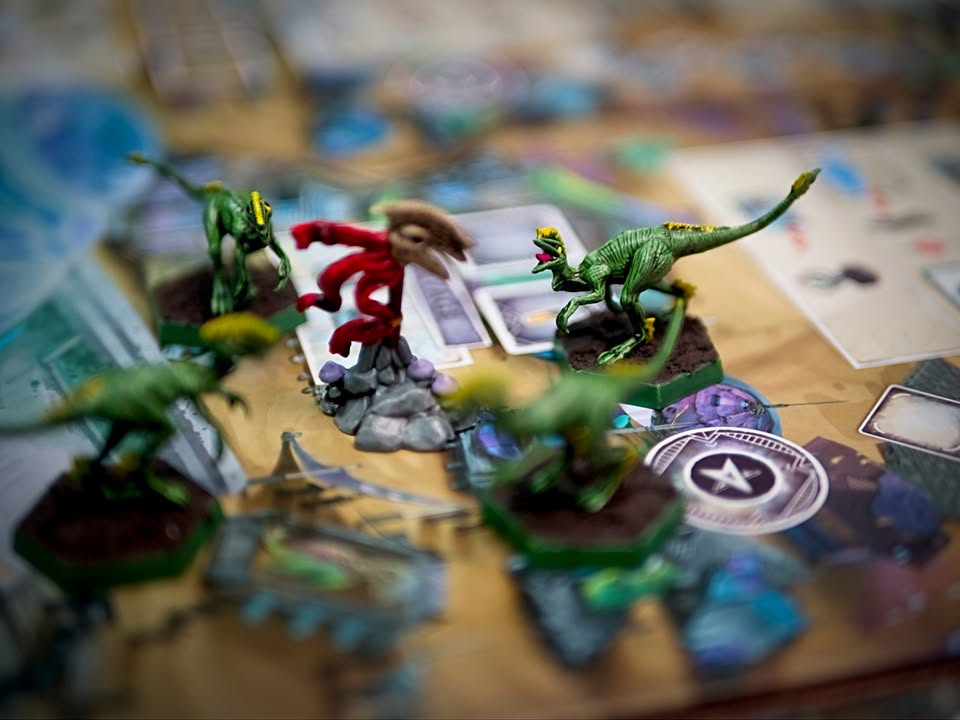
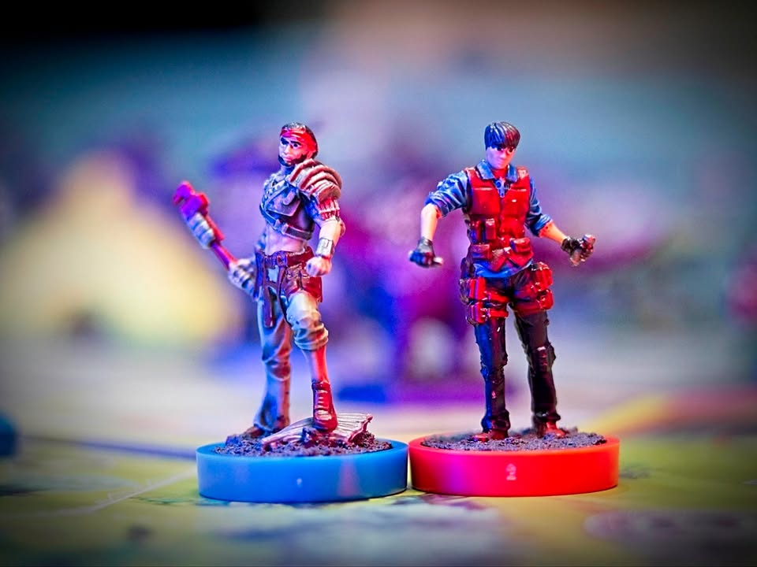
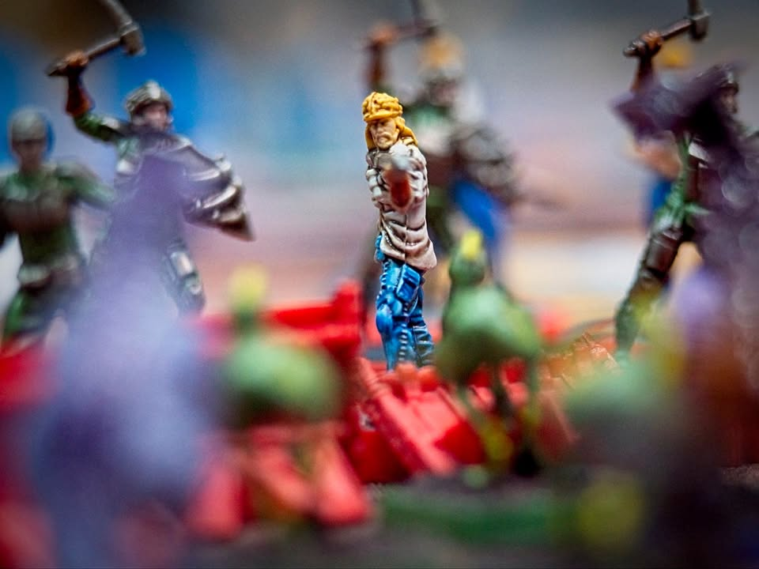
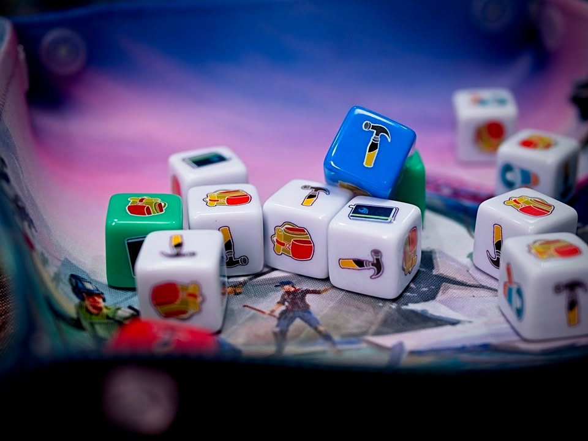

วันก่อนเพจเพื่อนบ้านเอา Perseverance: Castaway Chronicles มาให้ลองเล่นก็เลยได้โอกาสเล่นตอน 2 แบบ 2p ดูก็เลยคิดว่าจะเอามาเล่าถึงแบบคร่าวๆไว้หน่อย

.
คือเกมเนี่ยปูไว้ว่าจะเล่นได้ 4 ตอนตอน 3-4 เป็นไงไม่รู้แต่ว่าตอน 1 เนี่ยจะเริ่มจากที่เรามาติดเกาะที่ไดโนเสาร์เต็มไปหมด เราก็จะมาเล่นเกมที่พยายามจะสร้างแค้มป์ไปพร้อมกับป้องกันไดโนเสาร์

.
ส่วนตอน 2 ที่ผมได้เล่นคือแค้มป์พร้อมแล้ว เราจะมาบุกเข้าไปยังส่วนกลางของเกาะกัน ไอเดียของเกมจะเป็น dice drafting ที่เราผลัดกันหยิบเต๋าไปทำแอคชั่น ก็มีเตรียมทหารแล้วเอาไปเปิดพื้นที่ หรือจะล่าไดโนเสาร์ ไม่ก็ลงไปสำรวจพื้นที่ (อันนี้เดาว่าพัฒนาต่อมาจากโมดูลสำรวจซากตึกของ Anachrony มั้ง แต่ทำออกมาดีกว่ามาก) 

.
สิ่งที่ทำให้เกมนี้น่าสนใจคือเรื่อง tech tree ที่มีหลายท่าหลายสาย เกมเล่นได้หลายแบบมาก มีทั้งสายยิงทิ้งเก็บของ สายเก็บมาเลี้ยงไว้แปรรูปทีหลัง สายสร้างแค้มป์ สายสำรวจ 

.
จุดที่ทำให้เกมเข้มไปอีกคือระหว่างเราเลือกหมวดแอคชั่นเนี่ย สีของลูกเต๋ากับสิ่งปลูกสร้างในแต่ละโซนมันมีความเป็น majority control ในตัวว่าใครจะได้แต้มจากโซนไหนแล้วเอาไปแข่งจัดอันดับอีกที ระบบ majority ก็มีหลายเลเยอร์ทำเอาเล่นตอนแรกก็งงงวยจับทางไม่ถูกอยู่เหมือนกันเพราะอะไรก็น่าทำไปหมด (และแน่นอนว่าแอคชั่นน้อยมว๊ากกกกกก)

.
ในแง่หนึ่งก็คือมีกลิ่น signature การเล่นของค่ายที่เอาระบบพื้นๆมีปรุงผสมกันได้ดีอย่างที่เราเห็นมาจาก Anachrony, Trickerion

.
ข้อเสียที่รู้สึกสำหรับเกมค่ายนี้เลยคือพยายามมากเกิ๊นนนนนน ที่จะสร้างภาษาสร้างไอคอนกันหยุบหยับไปหมด เรียกได้ว่าเล่นครั้งแรกนี้มัวแต่ถามไอคอนกัน กับด้วย learning curve มันเลยเหมาะที่จะเล่นมาตั้งแต่ตอนที่ 1 ก่อนกับวงเดิมๆเพื่อเรียนรู้ระบบ แต่จะข้ามมาเลยก็ไม่ผิดอะไรแค่รู้สึกว่าเริ่ม 1 ก่อนน่าจะดีกว่า

.
ข้อเสียอีกอย่างในฝั่งมินิคือแต่ละตัวเนี่ยมันมีหลายท่าทำให้เวลาเก็บแม่มโคตรเสียเวลาเลย เพราะหยิบๆใส่ไม่ได้ต้องมาดูว่าตัวนี้ท่าไหนต้องใส่เหลี่ยมไหน ก็ชวนทำให้ขี้เกียจกางเอาได้ง่ายๆเหมือนกัน ถ้าเน้นเสพเกมเอา standee ก็พอแล้วครับ (แต่มาคิดอีกทีถ้ามี meeple ทรงไดโนเสาร์สวยๆก็น่าจะเหมาะ)

.
ตอนแรกผมไม่ค่อยสนใจเท่าไรเพราะเกมยังไม่ครบแล้วราคาไม่ถูกนัก (ในแง่ความไม่ครบจริงๆมันก็จบในตัวแล้วนะ) กับผมค่อนข้างกลัวมากๆเรื่องมีหลายเกมแล้วผสมอุปกรณ์กัน แบบมันน่าจะลืมกับจำกติกายากไรงี้ แล้วก็รู้สึกว่า MindClash หลายๆเกมมันลีลาเกินไป แต่เกมนี้คิดว่าถ้าค่ายเปิดเกมใหม่ก็อาจจะสั่งตามหลังมานะ สนุกอยู่ แต่ก็ไม่ใช่ระดับยอมเสียเงินซื้อ resell บวกราคาเพราะเกมก็แพงอยู่แล้ว 

.
ไม่รู้จะได้ซ้ำอีกไหม แต่เปิดไว้ก่อนว่าชอบละกัน

. 
ส่วนอาหารมื้อนี้เป็นผัดกะเพราหมูกรอบไข่ดาวร้านแถวบ้าน รสเผ็ดจัดจ้านตามความซี๊ดของเกม แต่ผมไม่ได้กินนะของเจ้าของเกมโน้น ของเผ็ดเอาไปเผาทิ้ง!!

.
กับผลงานลงสีนี้เป็นของ Heavy Meeple  เพจบ้านใกล้ของเรานี้เอง เห็นว่าถ้าว่างก็มีรับ commission ทำสีด้วยนะ สนใจก็ลองไปถามๆดูได้ มีแล้วทำให้ดูน่าเล่นขึ้นอีกจมเลย

