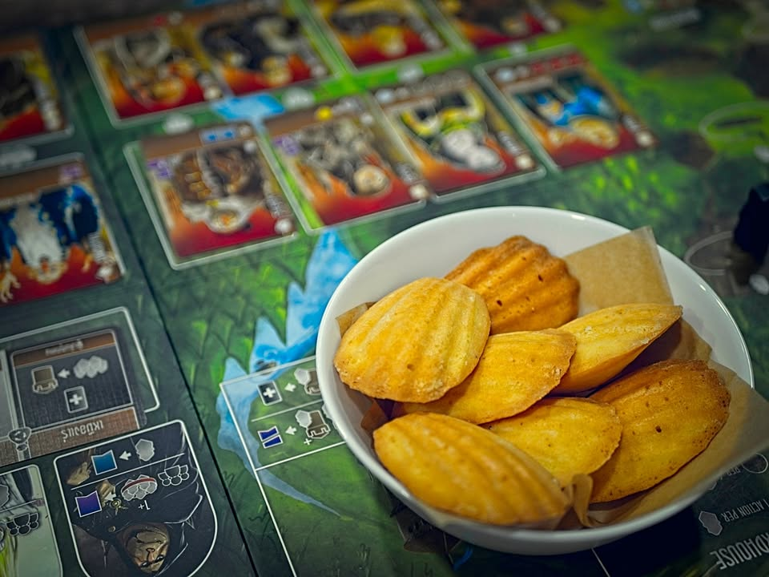
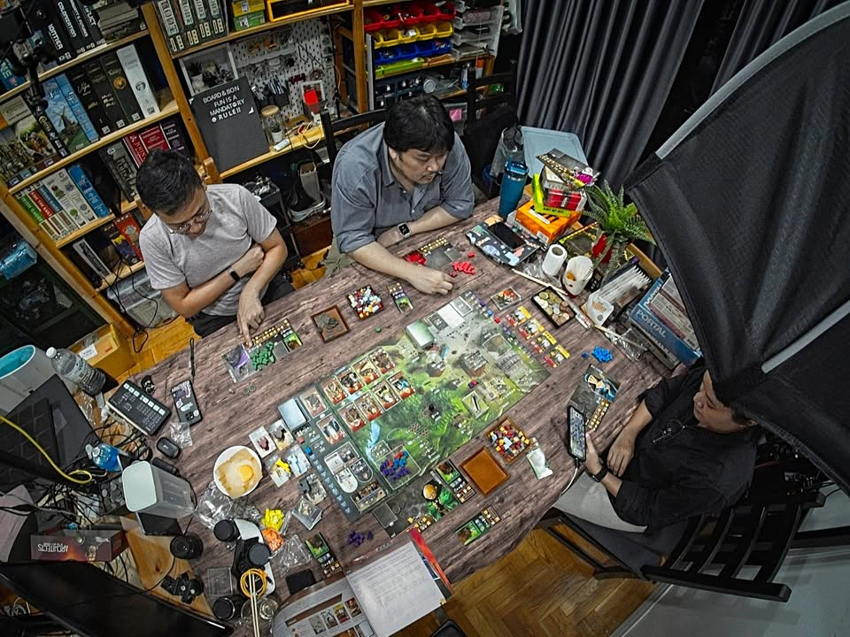
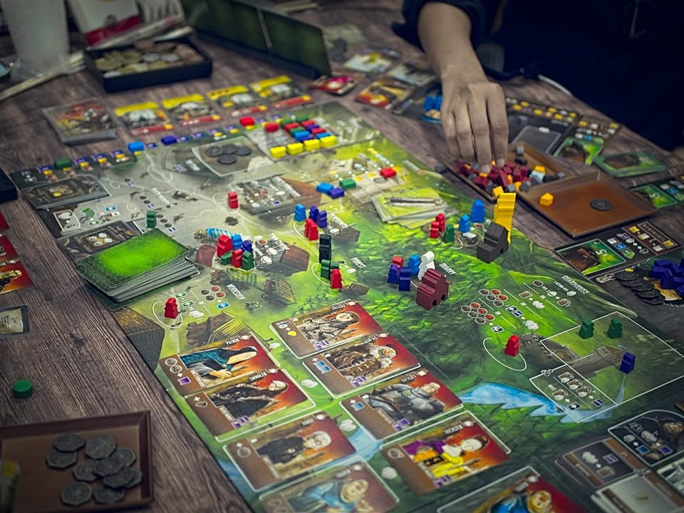

.
เนื่องจากรอบก่อนซื้อแซลมอนมาเยอะมาก มารอบนี้เพื่อนบ้านเลยทำ Salmon Gravelax (กราฟลักซ์)  หรือแซลมอนดองมาให้กิน ขั้นตอนเค้าว่าไม่ได้ยุ่งยากอะไรแค่เอาปลามาดองกับเกลือและน้ำตาลเท่านั้นเอง โดยสูตรของเพื่อนบ้านจะมีเสริมด้วยผักชีฝรั่งและเลม่อนนิดหน่อย รสชาติออกมาดีมาก คือหนึบแน่นเหมาะกับการกินร่วมกับแครกเกอร์มักๆ (แต่แครกเกอร์ไม่เหมาะกับวงเล่นเกมเท่าไรมันกรอบแบบฝุ่นผงร่วง)

.
บังเอิญมากว่าวันนี้ภรรยาก็ทำ 'มาดแลน' มาให้กินด้วย ถ้าพูดให้เข้าใจง่ายๆหน่อยก็อารมณ์ขนมไข่แต่จะแน่นและไม่ฟูเท่า พร้อมกับมีการเสริมรสเลม่อนเข้าไป ทานตอนอบร้อนๆนี้อร่อยจัด

.
Architects of the West Kingdom เนี่ยสำหรับผมแล้วเป็นเกมเดียวของ S J Macdonald และ Shem Phillips ที่ยังเก็บไว้อยู่ อันอื่นโล๊ะไปหมดล่ะ (อันที่หนักหน่อยมีแต่เกมงึมงำไม่ถูกชะตา) พอใส่ตัวเสริมครบเนี่ยก็เป็นเกมที่เรียกได้ว่าสมบูรณ์มากเกมหนึ่งสำหรับเกมระดับกลาง กติกาไม่ยุ่งยากมีสายการเล่นหลากหลาย ยิ่งได้ตัวเสริมล่าสุดมามีเจ้าหญิงกับพ่อค้ามืดเนี่ยทำให้ไดนามิคเกมขยับได้แบบไม่น่าเชื่อ อยู่ๆบางช่องก็ฮ็อตขึ้นมาเฉยๆ ถ้าใครมีเกมนี้ผมแนะนำมากว่าจัดไปเลยเสริมให้มันครบๆ สนุกกว่าตัวหลักอย่างเดียว 2 เท่าเลย

.
จริงๆกล่องผมมีบักหน่อยๆ คือตัวหลักเป็น en แต่ตัวเสริมซื้อไทย (เพราะถูก...) เวลาเปิดการ์ดทีก็จะมีสะดุดๆต้องแปลเทียบสถานที่นิดนึง แต่ก็ไม่ได้มีปัญหาอะไรกับการเล่นนะ

