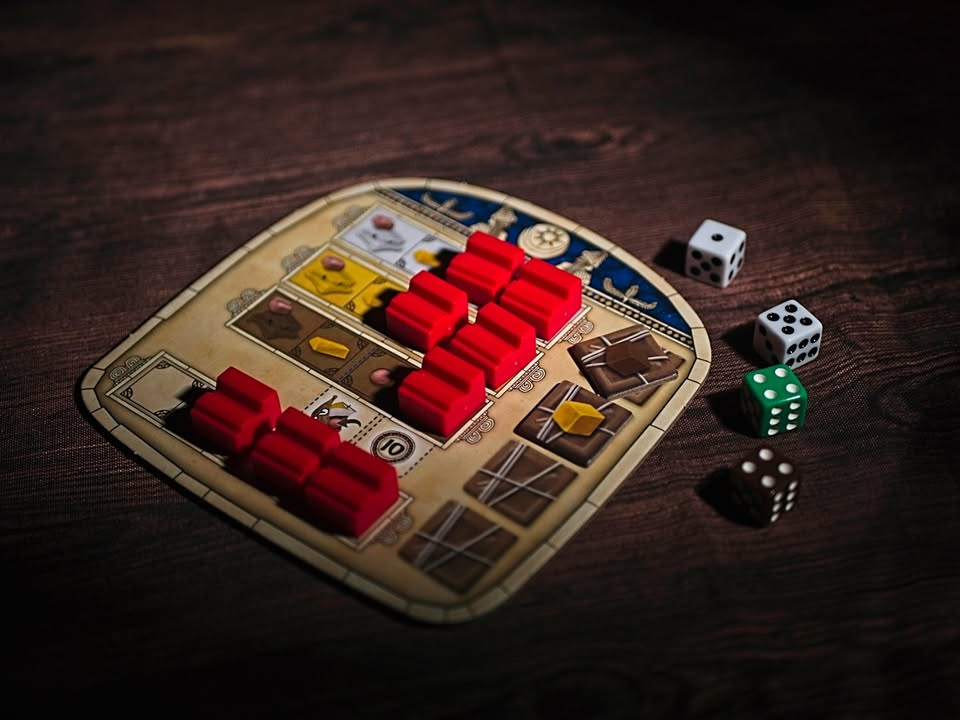
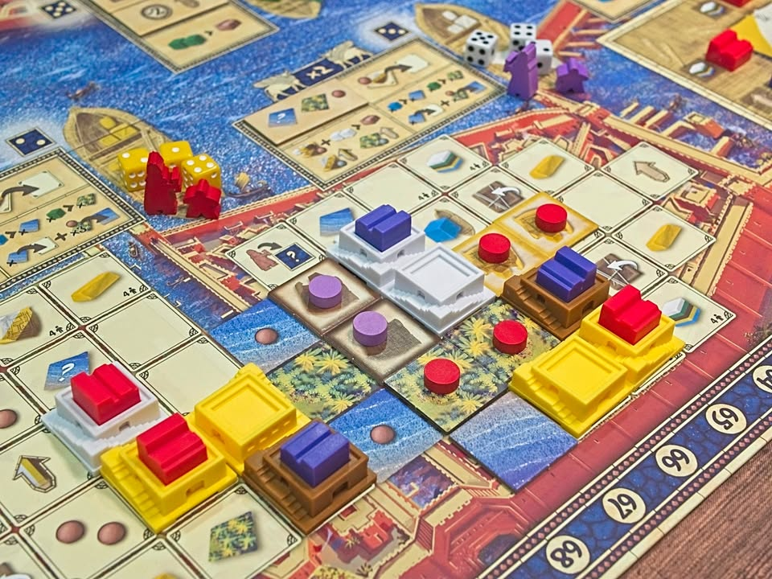
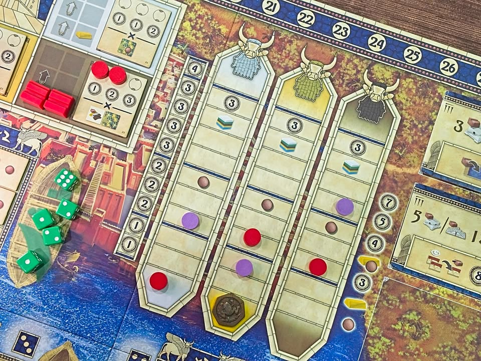

Tabannusi: Builders of Ur #thought

เกมยูโรระดับกลางหนักที่เราจะมาร่วมกันสร้างเมือง Ur (อูร์) เมืองโบราณของชาวสุเมเรียน ที่เรียกได้ว่าเป็นแหล่งอารายธรรมยุคแรกอยู่ในเมโสโปรเตเมียตั้งแต่ยุค 4,000 BC (หรือ 6 พันปีก่อนโน้นนน ) ผลงานใน T-Series จาก David Spada และ Daniele Tascini (Tzolk'in, Teotihuacan)

.
ซึ่งก็แน่นอนว่าธีมก็ใส่มาพอให้วาดภาพปกได้ตามสไตล์เกมยูโรทั่วไปนะ ส่วนชื่อเกมรอบนี้ไม่ใช่ชื่อเมือง เพราะ Tabannusi นั้นเป็นภาษาสุเมเรียนแปลว่า 'สร้าง' (build)

.
กลไกขับเคลื่อนเกมนี้คือ Dice Drafting ที่เกมมีการแบ่งพื้นที่การทำแอคชั่นออกเป็น 5 ส่วน ในแต่ละส่วนจะมีการทอยเต๋าที่มีสีตามพื้นที่ไม่ปนกัน ตอนเล่นเราจะมีคนงานวางยืนไว้ว่าเรากำลังทำแอคชั่นอยู่ในโซนไหน

.
การทำแอคชั่นนั้นเราจะหยิบเต๋าได้แค่ในโซนที่เราอยู่เท่านั้น พอหยิบมาเนี่ยสีเต๋าก็จะกลายร่างเป็น cube สีโง่ๆเอาไว้จ่ายโน้นนี้ ส่วนหน้าเต๋าจะกำหนดว่าตาหน้าเราต้องไปทำแอคชั่นที่ไหน ในแต่ละโซนก็จะมีแอคชั่นของตัวเองโดยหลักๆจะเป็นการสร้างตึก ที่เหลือจะเป็นพวกเทคเอาไว้แหกกฎ

.
ทุกครั้งที่เต๋าในพื้นที่ไหนหมดก็จะมีการคิดคะแนนในในพื้นที่นั้นๆ ก่อนเอาเต๋าไปโรลใหม่ และเมื่อเต๋าหมดครบจำนวนที่กำหนดก็จะคิดคะแนนทุกพื้นที่อีกรอบเป็นอันจบเกม

---
> 🐸 - กบชอบ 

.
ไอเดียการคิดแต้มหลักของเกมจะมาจากการสร้างตึก 3 สีที่ไม่มีความหมายอะไร กลุ่มตึกของเราจะได้แต้มเท่าไรก็ขึ้นอยู่กับว่าเราเดินแทรคตัวคูณแต้มสีนั้นๆได้เยอะแค่ไหน ว่าง่ายๆเรามีตึกสีไหนเยอะเราก็อยากไปเดินแทรคเพิ่มตัวคูณสีนั้น

.
แต่โดยทั่วไปแล้ว เราแทบจะไม่สามารถเพิ่มตัวคูณ 'ด้วยตัวเอง' ได้เลย

.
คืออย่างที่บอกว่าเกมนี้ไอเดียคือการสร้างตึกแต่ว่าการวางมีขั้นตอนสองอย่าง อย่างแรกคือต้องวางแปลนจองที่ไว้ก่อน ขั้นสองคือค่อยเอาตึกมาวางบนแปลนที่จองไว้ 

.
เราจะวางตึกไว้ที่แปลงของใครก็ได้ แต่ถ้าวางบนที่ของตัวเองจะต้องมีค่าใช้จ่ายเพิ่มแพงๆในขณะที่วางทับของคนอื่นจะไม่มีค่าใช้จ่ายเพิ่ม!!

.
ซี่งตรงนี้จะย้อนกลับไปที่การเดินตัวคูณแต้มสีที่บอกว่าเราขึ้นเองแทบไม่ได้ เพราะถ้าแปลนที่เราวางไว้ถูกคนอื่นสร้างทับ เราก็จะได้เดินตัวคูณแต้มสีนั้นๆด้วยซึ่งมันดันเป็นวิธีหลักที่เราจะได้เดินแทรคของเราในเกมนี้

.
ไอเดียหลักของเกมก็เลยจะวนอยู่กับแนวคิดว่า  'แล้วฉันจะเดินแทรคสีนี้ของตัวเองได้ยังไงว่ะ?' เพราะท่าหลักที่เราจะเอาขึ้นแทรคคูณแต้มได้อย่างเป็นกอบเป็นกำนั้นคือการที่คนอื่นมาสร้างตึกบนแปลนของเรา 

.
แต่ถ้าเราอยากสร้างตึกสีนี้ เราก็ต้องวางแปลนให้คนอื่นมาวางทับ แล้วอ้าวเราจะได้วางตึกของเราเมื่อไรน่ะ? ถ้าคนอื่นไม่สร้างให้ เราจะสามารถทำเองได้ไหม?  ถ้าไม่มีคนมาสร้างซักทีจำนวนเม็ดที่เอาไว้จองที่เราก็มีจำกัดมากเลยนะ ดึงคืนมาไม่ได้อีก

.
ตรงนี้เกมมันเลยมีความคิดแบบร่วมมือเพื่อผลประโยชน์กันกลายๆเพราะถ้ามีคนอื่นมาสร้างตึกสีนั้นก็แปลว่าเค้าก็ต้องอยากได้ตัวคูณเพิ่มด้วยการสร้างแปลนให้คนอื่นมาสร้างทับเหมือนกัน ในแง่มุมนี้การแข่งขันในเกมจะมีส่วนของ demand/supply ที่เราต้องคอยดูทางลมอยู่เหมือนกันว่าควรจะสร้างหรือรอแปลนสีไหน

.
เป็นเกมที่ตอนแรกชาวแก๊งเก็งกันว่าผมน่าจะไม่ชอบเพราะความ interlock แบบย้อนหน้าย้อนหลังของมัน แต่สำหรับเกมนี้ผมเล่นแล้วสนุกนะ เพราะรู้สึกว่ามันใส่มาในทรงที่น่าสนใจดีบีบให้ต้องใช้ลำดับความคิดอีกแบบที่เอาจริงๆผมก็ยังไม่ค่อยเข้าใจเท่าไรว่ามันควรจะเล่นแบบไหน แต่มันมีความอยากวิ่งวนให้คุ้มๆพร้อมกับความเอ๊ะๆๆดี

.
แต่ไอ้จุดที่ผมเองก็ยังนึกไม่ออกว่าเกมมันเล่นยังไงกับมันมีความพึ่งคนอื่นอยู่ประมาณหนึ่งก็มีความคิดว่าเกมมันเล่นยากจนน่ารำคาญได้เหมือนกัน เพราะความสมประโยชน์ในเกมนี้มันไม่ค่อยมี คือเราอยากทับของคนอื่นเพราะว่ามันถูกเฉยๆ ถ้ามีหลายคนเราก็จะเลือกคนที่มีตัวคูณสีน้อยแต่อาจจะไม่ได้สร้างตึกสีที่เราอยากได้แทนไรงี้ -_- 

.
นอกจากจุดชี้ขาดในระบบหลักว่าจะชอบไม่ชอบวิธีคิดของเกมนี้ไหม ผมก็ไม่เจอจุดไหนที่ไม่ชอบนะ ระบบเกมทำมาเข้าใจง่ายก็วางแผนหยิบของทำแอคชั่นทั่วไป แล้วต้องมองล่วงหน้าหลายขั้นเพราะต้องดูด้วยว่าที่ๆจะเดินไปมันมีหน้าเต๋าให้เราเดินไปไหนต่อบ้าง แต่เกมก็มีระบบจ่ายเพื่อวาร์ปได้ตามใจอยู่มันเลยไม่เครียดมาก แต่ด้วยความที่จำนวนทรัพยากรมันจำกัดก็สร้างความอึดอัดได้ดี

.
อนึ่งน่าจะเป็นเกมไม่กี่เกมที่มีโอกาสได้เล่นทั้งแบบ 2/3/4 คนก่อนมาเขียน ในความเห็นส่วนตัวก็คิดว่าสนุกทุกจำนวนครับ แต่ยังไม่เคยเล่น solo นะ เป็นเกมกลุ่ม 'สนุก' และวุ่นวายน้อย (ในเชิงระบบ แต่ 'เยอะ' ในเชิงลำดับความคิด) ใน T-Series สำหรับผมเลย 

---

😍 กบโปรด - อวยไส้แตก ยากมากที่เล่นแล้วจะรู้สึกไม่สนุก

😁 กบชอบ - พร้อมจะเล่นตลอด

🙂 กบโอเค - ชอบในบางแง่มุม แต่อาจจะเล่นไม่บ่อยหรือเล่นแค่บางอารมณ์

😐 กบเฉย - ไม่ได้เกลียดอะไร ถ้าไม่มีตัวเลือกอื่นก็เล่นได้อยู่

🖕 กบไม่เล่น - ไม่ตรงจริต (ไม่ได้แปลว่าห่วยหรือไม่ดี) ขอเล่นเกมอื่นล่ะกัน

อนึ่ง : เป็นความรู้สึกในความ "อยากจะหยิบมาเล่นไหม?" ของผมเอง ไม่ได้เกี่ยวอะไรกับคุณภาพของเกม ดูให้เป็นแค่ "อีกความคิดเห็นหนึ่ง" เท่านั้นก็พอนะครับ :)

