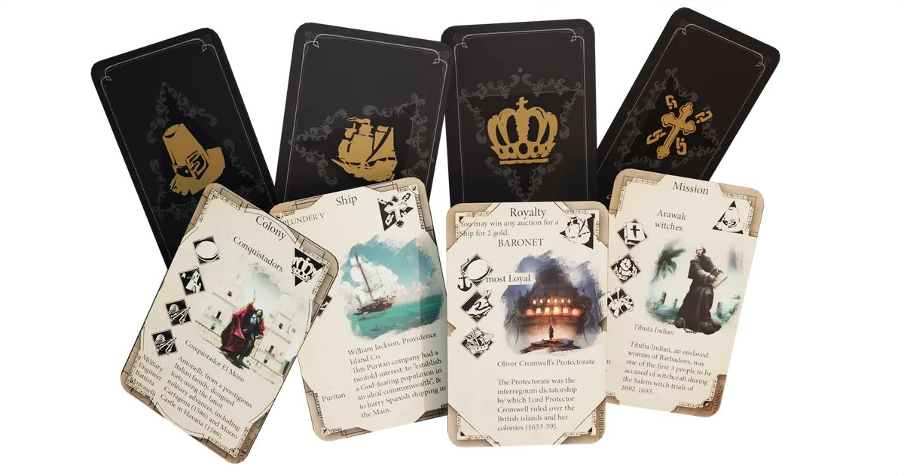
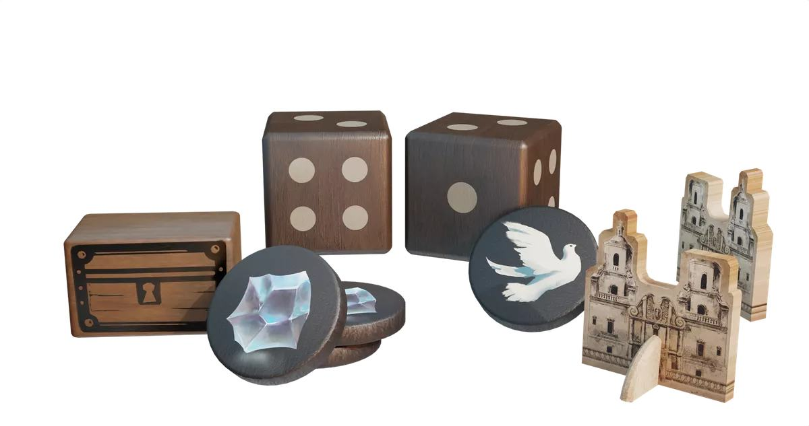
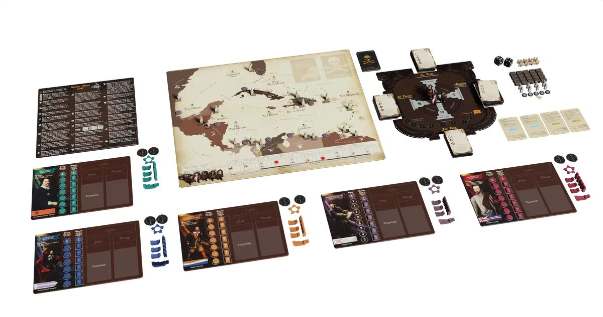

Pax Hispanica เกมใหม่ของ Pax Series ที่ผมชอบมากเปิดให้สั่งจองแล้วเริ่มจัดส่งปี 2024 (เขียนปีไม่ผิด) โดยรอบนี้เล่นได้ถึง 5 คนและเราจะมาอยู่ในยุคโจรสลัดแห่งคาริบเบี้ยนกัน

.
ครั้งนี้เราจะได้เป็นชาติยุโรปที่เข้ามาตักตวงความรุ่มรวยของอเมริกาใต้ที่เค้าบอกว่าจะนำเสนอเกี่ยวกับการเดินเรือที่มีทั้งการค้าขายและปล้นสดมโดยเราจบเกมได้ 4 แบบ ซึ่งก็เชื่อได้ว่าน่าจะมีเกร็ดประวัติศาสตร์ให้เราอ่านกันอย่างอิ่มเอม

.
เรียนตามตรงว่ารอมันใกล้ๆมาค่อยซื้อก็ได้ นานเกิ๊นส่ง 2024 โน้น แถมหน้าตาดูไม่มีอะไรน่าดึงดูด อุปกรณ์ก็ดูงั้นๆมาก ตัว deluxe ก็ไม่ได้ดูดีขี้นซักเท่าไร แผนที่ตัวหนังสือเยอะดูไม่เหมาะกับกระดานผ้าเลยเพราะมันจะอ่านยาก คือดร็อปลงเรื่อยๆเลยเทียบกับตอนที่เริ่มย้ายค่ายมาใหม่ๆ 

.
คือผมรู้สึกว่า Pax Series นี้ตั้งแต่โดนค่าย ion games ซื้อค่ายไปแล้วทำเกมกล่องใหญ่นี้มันเริ่มจะไร้สาระขึ้นเรื่อยๆ Pax Viking งี้มันก็สนุกนะแต่ว่ามันก็เริ่มเสียอารมณ์ความเป็น Pax ไปเยอะเหมือนกัน แต่มาเกมนี้คือแบบแห้งมากไม่มีสีเลย design บอร์ดโน้นนี้ก็บ้านๆจนน่าตกใจ

.
สรุปคือผมรอซื้อแน่นอน แต่ไม่ค่อยตื่นเต้นล่ะ

.
ตอนแรกนึกว่าเกมมันจะลง KS สรุปให้พรีตรงๆแทนนะไปตามนี้ได้เลยถ้าอยากได้ early bird โดยจะมีทั้งฉบับธรรมดาและ deluxe ที่เปลี่ยนพวก punch board เป็นไม้ https://iongamedesign.com/collections/games

