Weather Machine #first_impression #bite_size

เข้! งงเหลือหลายตอนแรกนึกว่าจะเผา....เสือกสนุกเฉย

จบรีวิว.

.
ถ้าขยายความอีกหน่อยก็

.
เรียงเกมของ Vital ตามอารมณ์กบๆก็จะประมาณนี้ 

😁 On Mars, Weather Machine
🙂 The Gallerist
😐 Vinhos
.
.
.
.
😡 CO2, Kanban, Escape Plan 
.
.
🤬 Lisboa

.
ที่เหลือออกแนวเล่าอารมณ์เป็นส่วนมาก ไม่ได้คิดวิเคราะห์อะไร

.
มื้อนี้เล่นพร้อมไก่จ้อแช่แข็งตราห้าดาวครับ เค้าบอกให้อุ่นเวฟ 2 นาที แต่ผมใช้หม้อลมร้อน 15 นาทีนะ เดี๋ยวนี้ชอบหม้อลมร้อนมากกว่าเพราะว่ามันกรอบนอกกว่าเวฟ

.
กับขอบคุณหมอพีทจาก Heavy Meeple กับ คุณแบงค์จาก งงเหลือหลาย เล่นอะไรก็สนุก มากครับที่แวะมาเล่นด้วยกัน สำหรับผมเองนี้คิดว่าเกมของ Vital นี้สำคัญมากเลยนะที่ต้องหาคนสอนที่จะลำดับเรื่องให้เราเข้าใจเกมนี้ได้ แล้วก็วงที่ช่วยทำให้เกมลื่นไหลไม่ติดขัด (อ่านว่าไม่ AP...) คือผมมีปัญหาเรื่อง format การลำดับข้อมูลเยอะอยู่ถ้าเล่าสไตล์ gm หลายร้านนี้อาจจะกลายเป็นเกมเผาเกมทิ้ง

.
เกมเนี่ยธีมมันก็ไปได้อยู่แหละแต่ถือว่าหลวมมากสำหรับนักออกแบบคนนี้ เกมมันว่าด้วย ศจ สติเฟื่องแม่มคิดเครื่องควบคุมสภาวะอากาศมาแล้วเสือกทำโลกปั่นป่วนไปหมด เราในฐานะผู้ช่วยมือเอกก็ต้องมาตามล้างเช็ดให้... จบ

.
ไอเดียหลักของเกมมันจะหลายขยักนิดนึง (โอเคจริงๆก็ไม่นิด) คือเราอยากจะไปช่วยบรรเทาภัยพิบัติจากอากาศ ซึ่งการที่เราจะทำได้เราก็ต้องไปสะสมไทล์ความรู้เกี่ยวกับอากาศนั้นๆมาก่อน พอครบก็ทำการตีพิมพ์แล้วค่อยเอาเปเปอร์ตีพิมพ์ไปช่วยกู้โลกทำแต้มไรงี้

.
เกมนี้ flow เดินจะมีกลิ่นแบบ Kanban นั้นคือมีกลุ่มแอคชั่นให้ทำอยู่แค่ 4 โซน คนงานของเราก็ต้องเดินวนๆอยู่แค่นั้นแหละห้ามอยู่ที่เดิม โดยจะมี ศจ คอยเดินย้ายทีไปมาให้เกะกะเล่นเป็นระยะ แต่ก็ไม่ได้เป็นระบบตรวจงานบีบคั้นแบบเจ๊ซานดร้าใน Kanban ที่เราต้องมานั่งขยันทำตามเป้าหมายให้ได้ กระนั้นก็มีหลายจังหวะมากที่แบบลุงงงงงงงงงงง ออกไปโว๊ยยยยยยเกะกะ! อยู่หลายทีเหมือนกัน

.
เกมนี้เป็นเกมที่มีเป้าใหญ่อันเดียวที่เอาไว้ผูกการเล่นเอาไว้หลวมๆคือการเอางานวิจัยไปช่วยโลก แต่ว่าไม่ได้บังคับอะไร เดินทำแต้มจากระหว่างทางได้หลายท่าจากตรงอื่น ก็อาจจะทำให้สมาธิหลุดลืมไปเหมือนกันว่ามาทำตรงนี้ทำไมแต่แรก ตรงนี้ก็ถือเป็นส่วนหนึ่งที่ทำให้เกมยาก เพราะลำดับความคิดให้ชัดตั้งแต่จนจบไม่ถนัดนัก

.
ทรัพยากรในเกมจะไปทาง resource management ทั่วไปนะ คือเดินไปเก็บของตรงนี้รอไปจ่ายตรงโน้นชิงจังหวะปกติ แต่ช่องเก็บของมันจำกัดหน่อย และเกมเน้นโบนัสของฟรีจากช่องนี้ไปจ่ายช่องโน้นมากกว่าที่จะให้เราไปหยิบซื้อตรงๆ  แต่เกมไม่ใช้ระบบส้นตีนแบบใน Kanban ที่แบบหยิบแปลนรถมาเพื่อผลิตรถให้คนอื่นตัดหน้าเอาไปวิ่งส่งไรงี้ แล้วก็ไม่ต้องมานั่งติด interlock เอาโน้นเอานี้ไม่ได้แบบเกมเหี้ย Lisboa คือมันเป็นเกมวางแผนหยิบทรัพยากรพร้อมหาทาง optimized ที่ท่าเล็กๆเยอะหน่อยแค่นั้นแหละ

.
ด้วยความที่ไม่มีระบบ punishment อะไรแบบซานดร้าใน Kanban หรือการกู้เหนื่อยๆแบบใน Vinhos ถ้าคนที่ชอบความปวดหัวแซบๆก็อาจจะคิดว่าเกมมันไม่เผ็ดเท่าไร แต่เรื่องความเหนื่อยตอนคิดนี้ก็ไม่ได้ต่างจากเกมอื่นๆของนักออกแบบคนนี้นะ

.
เกม Weather Machine นี้ผมมองว่าเป็นเกมที่ถ้าผ่าน Learning Curve ซัก 3 รอบไปได้นี้คือสนุกมากแน่ ถ้าวงเป็นสายเล่นซ้ำนี้แนะนำเลย แต่ถ้าเล่นชิมนิดๆแล้วเปลี่ยนจานนี้คืออย่าเลยเพราะมันมองไม่ออกจริงๆว่าจะต้องทำอะไรบ้างแล้วมันจะไปคอมโบต่อยอดกันยังไง เพราะเกมมันมีจังหวะลีลารับส่งท่าเล็กๆเยอะ

.
ตอนนี้ให้กบชอบไปก่อน ถ้าได้เล่นซ้ำกับวงที่พร้อมๆนี้อาจจะไปอยู่กบโปรดก็ได้ แต่จะให้ซื้อตอนนี้ราคาก็ถือว่าแพงอยู่ กับวงขาประจำแอบคิดว่าอาจจะไม่ได้กางบ่อย คงไม่รีบขวนขวายเท่าไร แต่ก็คุณภาพอุปกรณ์นี้ก็จัดว่าดีสมราคาตามมาตราฐานค่ายครับ

.
อนึ่งค่ายนำเข้าไม่ได้ให้อะไรมานะถึงไม่ได้เผา เล่นเองละชอบ แต่ถ้าคนสอนสไตล์ไม่ตรงนี้คิดว่าคงมีเผาทิ้งเหมือนกัน ตอนฟังนี้มึนๆเดินมั่วๆตามเค้าอยู่สองสามรอบ ตอนจะจบยังงงๆบางโฟลว์อยู่เลย โชคดีที่หลายครั้งมีของพอดีไม่งั้นติดบักยาว

.
ผมชนะด้วยนะเกมนี้ :D

.
อีกนิดคืองานภาพของ Ian O'Toole ในเกมนี้งดงามมาก มีลายเส้นสวยๆพริ้วๆดูเพลินตา ประหนึ่งจะบอกเราว่ากูไม่ได้เป็นแต่หยิบสีแพนโทนแล้วเทสีเรียบๆโครมๆนะเว้ยยย 

--------------------------------
หมวด Bite Size (พอดีคำ) นี้กะว่าจะเขียนอะไรสั้นๆประมาณนี้ล่ะกัน ใหม่บ้าง ซ้ำบ้าง เกมที่ขี้เกียจเขียนบ้าง เขียนๆไว้ก่อนเผื่อมีอารมณ์อาจจะขยายไปลง Thought บ้าง จริงๆอยากเขียนสั้นกว่านี้ แต่ยังอดไม่ได้ที่จะต้องอธิบายอะไรเพิ่มตามนิสัย เดี๋ยวค่อยๆปรับไปล่ะกัน

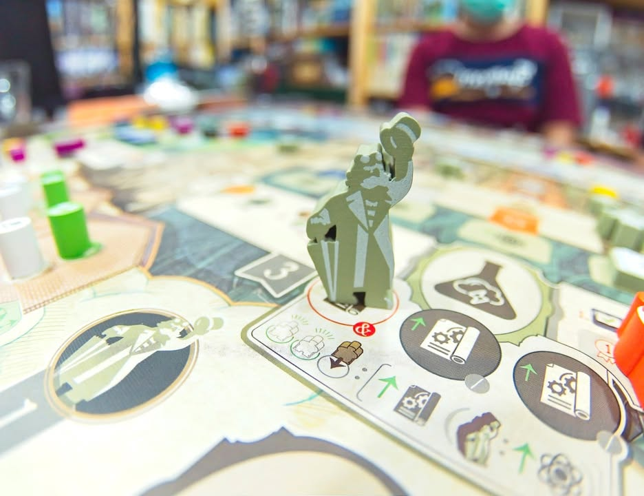

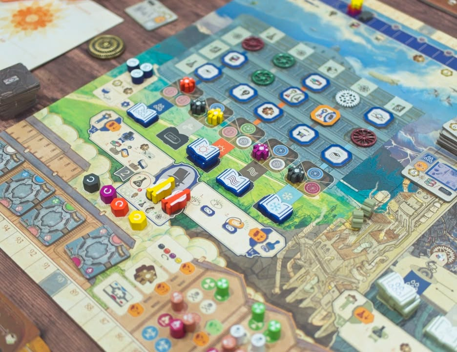

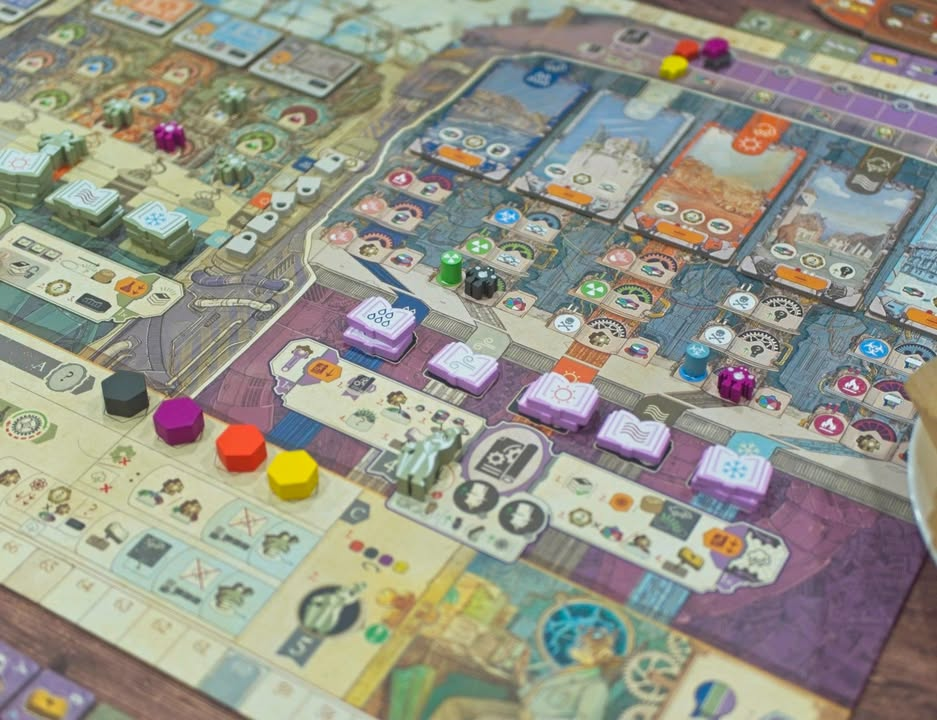

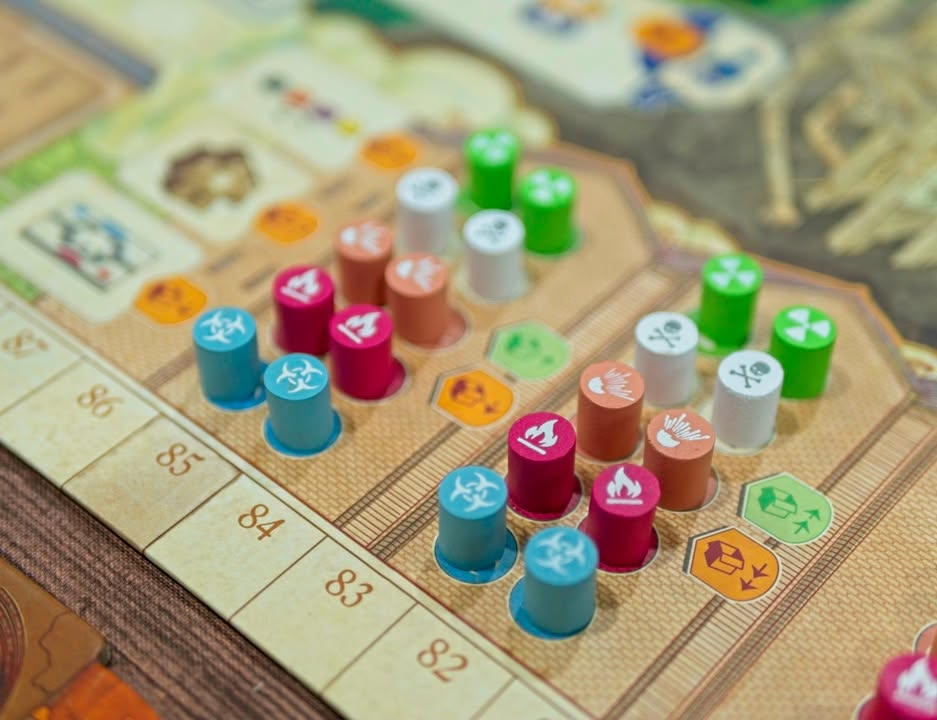

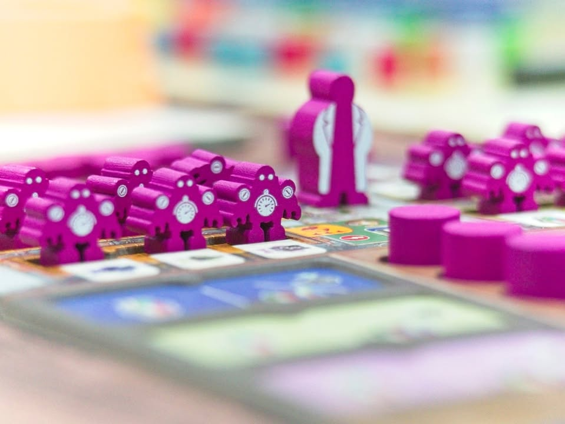

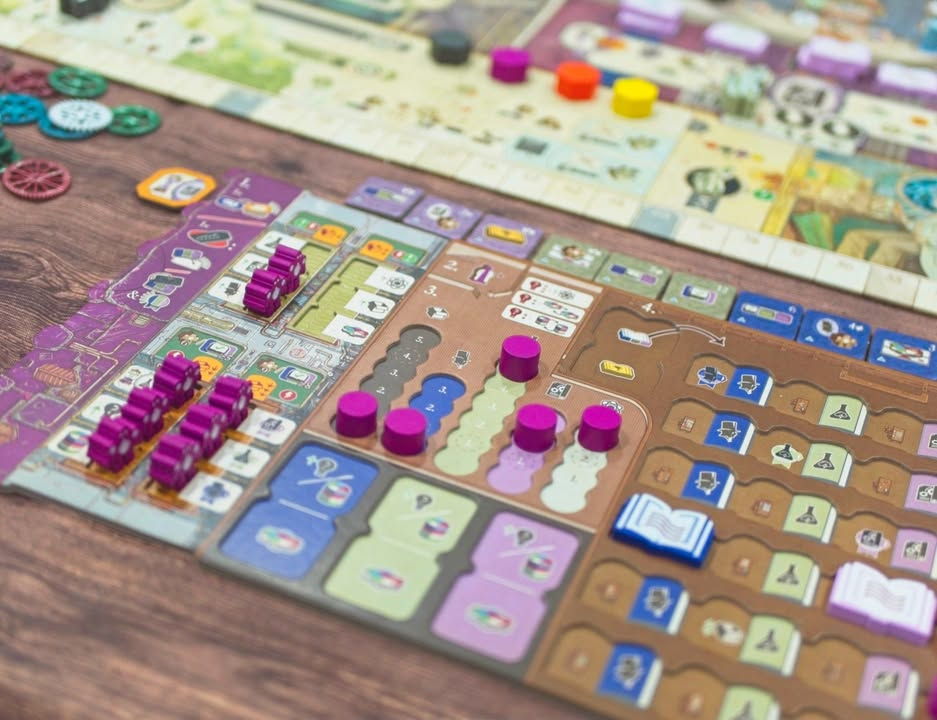

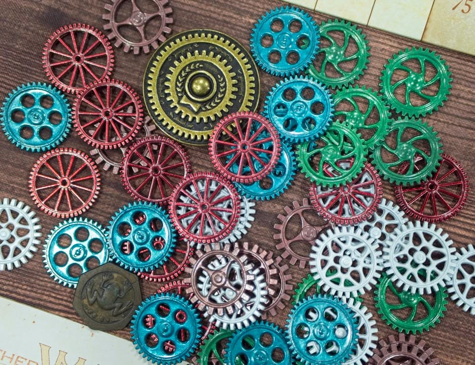

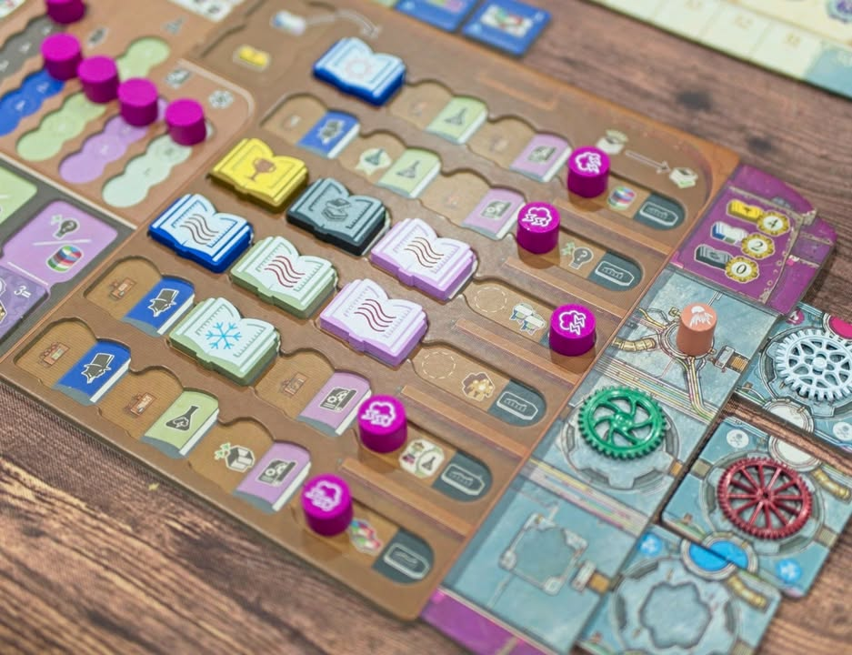

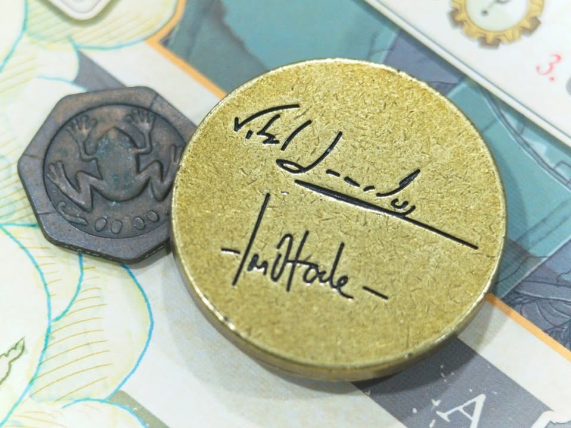

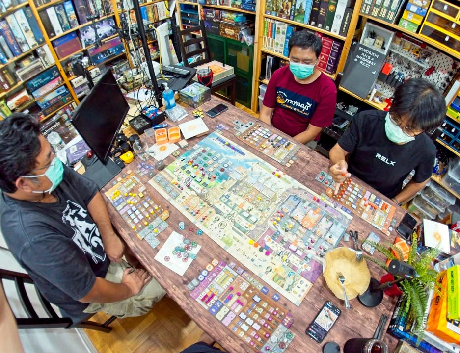

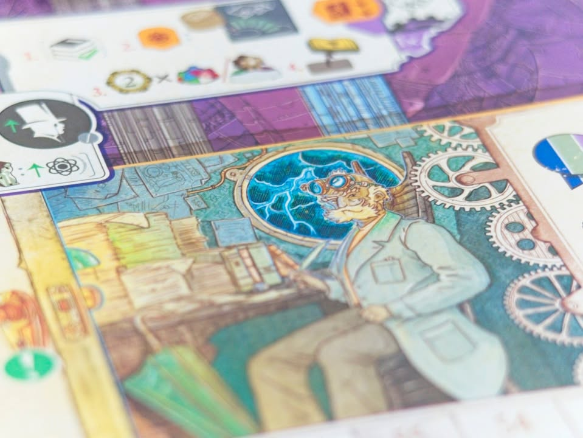
