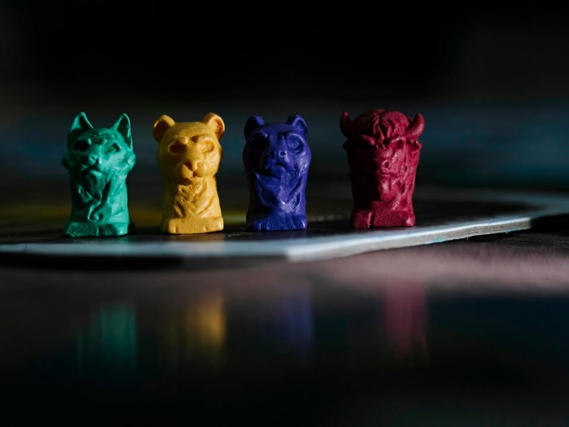
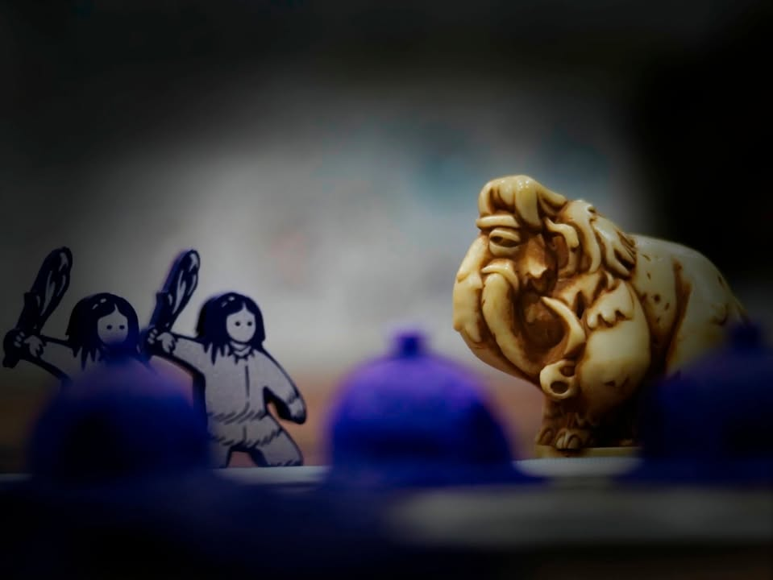
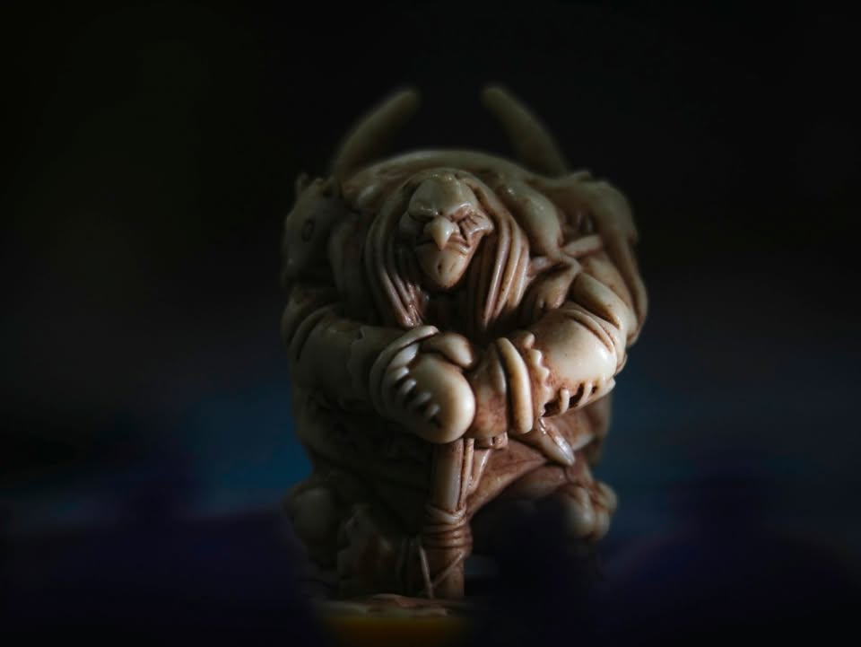
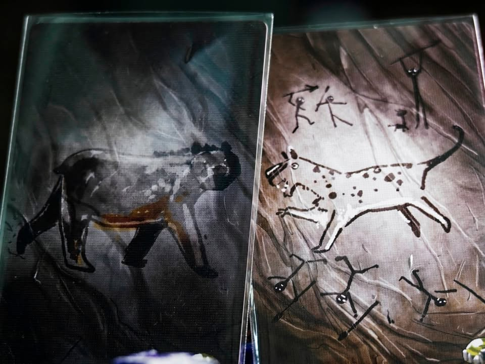
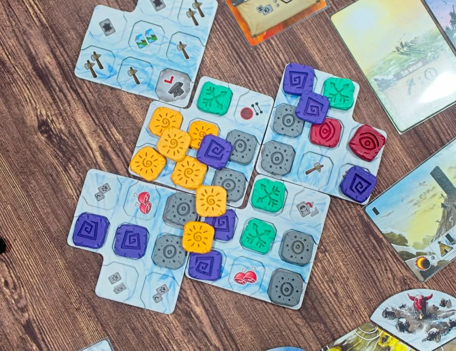
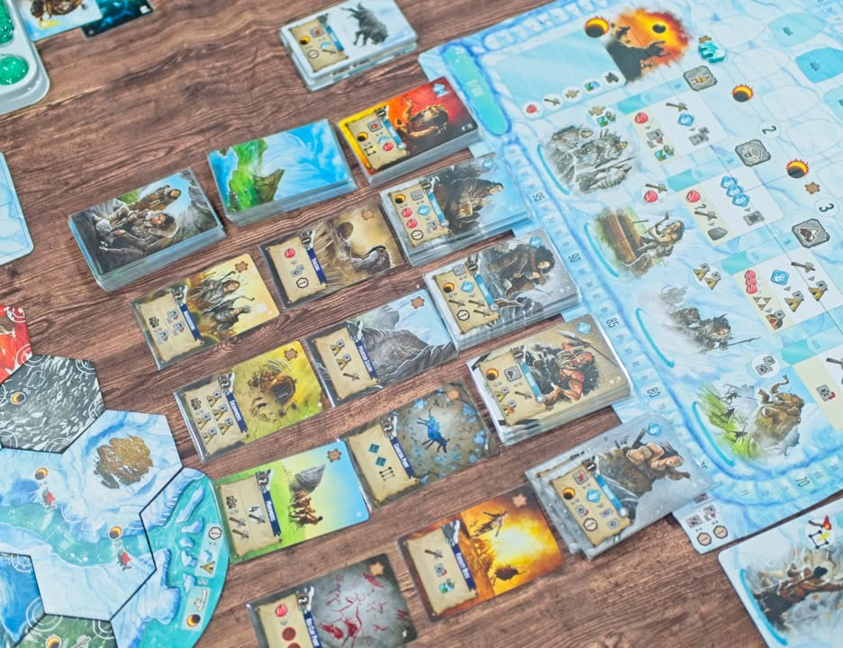
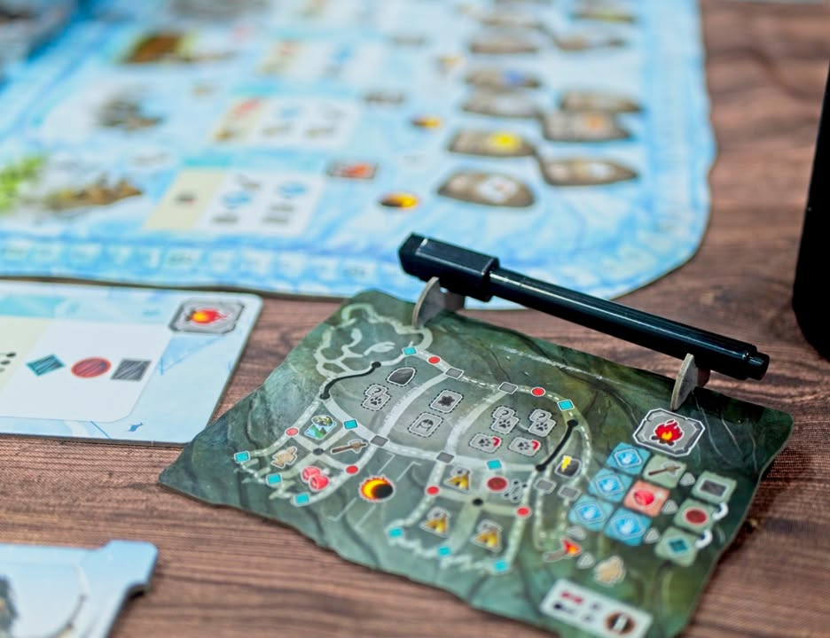
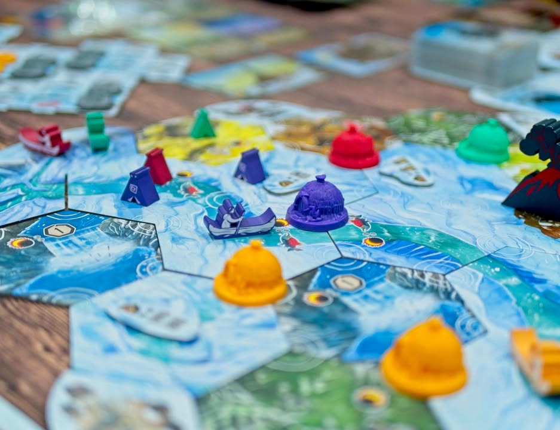
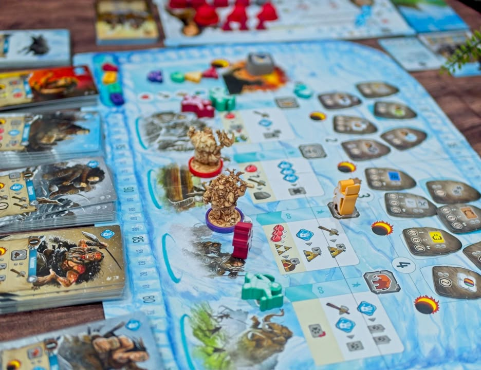
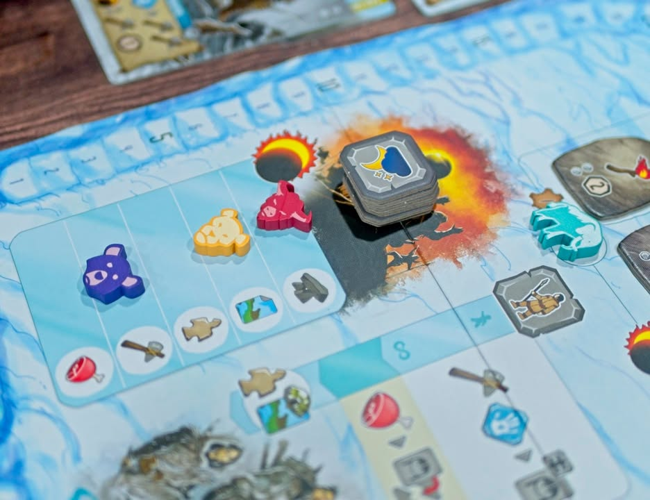

Endless Winter: Paleoamericans #bite_size

เกมยูโรระดับกลางที่ว่าด้วยการเอาตัวรอดและพัฒนาหมู่บ้านในยุคหิน ผลงานของ Stan Kordonskiy (Dice Hospital)

.
เกมนี้ใช้ระบบ Deck Building + Worker Placement โดยที่ผู้เล่นทุกคนมีคนงานเท่ากันหมด ซึ่งเกมนี้มีช่องแอคชั่นให้ลงแค่ 4 ช่องทั้งเกม (5 ช่อง ถ้ามีตัวเสริม ซึ่งแนะนำให้มี)

.
เกมนี้ถึงจะเรียกว่า Worker Placement แต่ก็ไม่ได้แย่งช่องกันเพราะลงได้ทุกคน แค่ว่าคนแรกที่ลงในช่องนั้นๆจะได้โบนัสเพิ่มนิดหน่อย พอเอาคนงานลงไปแล้วแต่ละช่องจะมีสิ่งที่ทำได้ของมันอยู่แล้วมันต้องใช้ point ในการแลก ซึ่ง point ที่ว่ามันก็อยู่ที่การ์ดในมือเรานั้นแหละ ก็ทิ้งๆลงมาเท่าที่พอใจเลย ทิ้งเยอะก็ทำได้เยอะ แต่ก็หมดมือไวนะ....

.
ตัวการ์ดเนี่ยมันก็จะมีค่าพื้นฐานอยู่คือ 1 แต่ถ้าเอาไปลงตรงกับช่องที่ match กับมันก็จะมีโบนัสงอกมาอีกหน่อย โดยการ์ดคนงานมันก็มีอยู่เท่ากับชนิดช่องนั้นแหละ ประมาณว่าเราอยากเล่นท่าไหนบ่อยก็ไปจ้างการ์ดชนิดนั้นมาใส่กองเยอะๆ (การ์ดของตัวหลักจะแบนๆหน่อย แนะนำให้ใช้ของตัวเสริมที่จะมีมิติเพิ่มขึ้นอีกนิด) ตรงนี้ก็จะมีการ์ดอีกชุดที่เอาไว้เสริมพวกลีลาต่างๆอีกชุดหนึ่งที่จะไม่ซ้ำกัน

.
ไอเดียที่ทำให้เกมนี้มันสอนง่ายและยากในเวลาเดียวกันก็คือกลไกทำแอคชั่นน่ะมันมีแค่นี้ แต่ว่าในแต่ละแอคชั่นมันก็จะเหมือนเอาแต้มไปแลกทำ mini game ของใครของมันแบบไม่เกี่ยวกันเลย แบบเล่นแอคชั่นกลุ่มสร้างถิ่นฐานมันก็คือเอาแต้มไปสร้างบ้านย้ายบ้านอย่างเดียว แอคชั่นวาดรูปก็เอาไปวาดแต่รูป แล้วมินิเกมมันจะไม่ได้เกี่ยวอะไรกันนอกจากจะมีแค่ผลิตทรัพยากรกลางกลับมาให้เราไปใช้ต่อ

.
เกมเล่นกันแค่ 4 รอบใหญ่ รอบนึงก็ลงคนงานได้แค่ 3 คนเท่ากันนั้นแหละ แต่ว่ามันจะมีกิมมิคเรื่องโบนัสตอนเล่นกับตอนจบที่จะช่วยให้เราเดินแทรค หรือได้โบนั้นโน้นนี้อยู่เยอะเหมือนกันทำให้ไม่รู้สึกว่าเกมมันมีแอคชั่นน้อยอะไร คนงานก็จะมีตัวหัวหน้าที่มี effect บางๆแตกต่างกันนิดนึง แต่ทำ mini มาเว่อร์เอาเรื่องอยู่ (แต่ก็สวยดีนะ)

.
จุดที่คิดว่าเป็นข้อด้อยนิดหน่อยคือใส่ตัวเสริมครบเกมก็แอบนานอยู่นะ เกือบ 3 ชมได้ ส่วนหนึ่งเพราะการทำแอคชั่นมันมี downtime อยู่พอควรจากการที่ผู้เล่นต้องมาเล่นการ์ดเอาแต้มหลายใบแล้วก็แบ่งไปทำมินิเกม เวลาเอาโบนัสตอนจบรอบก็ต้องรอไล่ resolve ตาม turn order อีก แล้วเกมมันก็ setup & tear down นานเพราะของมันหยุบหยับเยอะที่ไปหมด

.
คือว่ากันรวมๆก็เป็นเกมระดับกลางที่เล่นเพลินๆดี คิดว่าเหมาะกับสายเกมเมอร์มากกว่าเพราะเวลาสอนมันจะเยอะนิดๆเพราะต้องสอนแยกตามมินิเกม กับเหมาะกับคนไม่ชอบ conflict จ๋าๆเพราะเกมนี้ไม่ได้แย่งช่องแอคชั่นกัน แต่ในมินิเกมบางอันก็จะมีเบียดกันนิดๆแต่ก็ไม่ได้เจ็บปวดอะไรนะ อีกอย่างคือ presentation สวยมาก ผมก็เลยคิดว่าว่ามันเป็นเกมสายสันติที่น่าสนใจอีกเกมหนึ่ง

.
แต่ที่อยากบอกไว้คือเกมเนี่ยทุกอันคือส่วนหนึ่งของเกมเต็ม ถ้าซื้อเล่นแค่ตัวหลักอย่างเดียวเกมจะน่าเบื่อมากกกกกกกก คือมันธรรมดาแบนๆเกินไป ยังไงก็ควรเล่นแบบตัวเสริมให้ครบๆไปเลย ซึ่งมันก็จะกลายเป็นว่าถ้าจะเอาประสบการณ์เต็มอิ่มนี้ก็ถือว่าราคาสูงอยู่ถ้าเทียบกับเกมสไตล์ Worker Placement + Deck Building รุ่นพี่อย่าง Dune แล้วก็ Lost Ruins of Arnak (แต่สองเกมนั้นก็จะเน้น conflict / racing มากกว่า) แต่ด้วยความที่ของมันสวยก็คือว่าสมเหตุสมผลอยู่นะ

.
รอบนี้เล่นไปถ่ายไปไม่มีเวลาจัดฉากเลยลองทริคนิดหน่อยมาแต่งสีฉากหลังให้มันมืดๆกับลดความสดเยอะๆ ก็คิดว่าออกมาโอเคนะ แต่ว่าถ่ายทรงนี้เอาลง bgg โดน reject แน่ๆ ฮา

--------------------------------
หมวด Bite Size (พอดีคำ) นี้กะว่าจะเขียนอะไรสั้นๆประมาณนี้ล่ะกัน ใหม่บ้าง ซ้ำบ้าง เกมที่ขี้เกียจเขียนบ้าง เขียนๆไว้ก่อนเผื่อมีอารมณ์อาจจะขยายไปลง Thought บ้าง จริงๆอยากเขียนสั้นกว่านี้ แต่ยังอดไม่ได้ที่จะต้องอธิบายอะไรเพิ่มตามนิสัย เดี๋ยวค่อยๆปรับไปล่ะกัน

