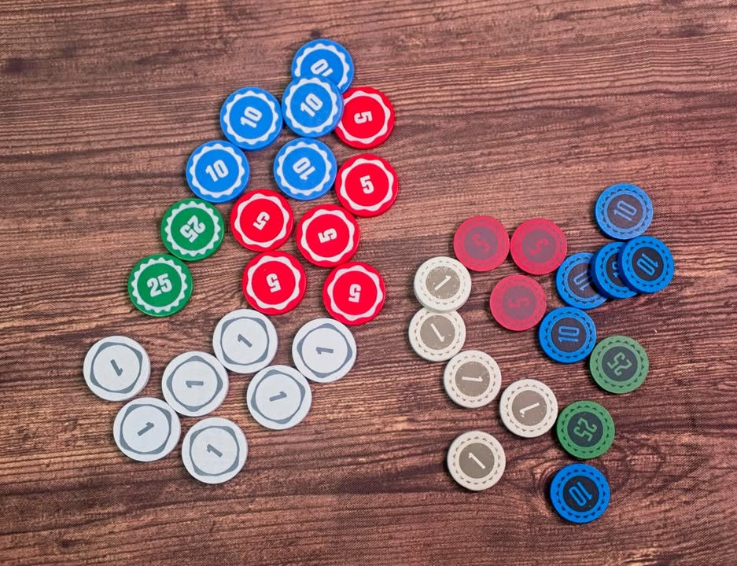
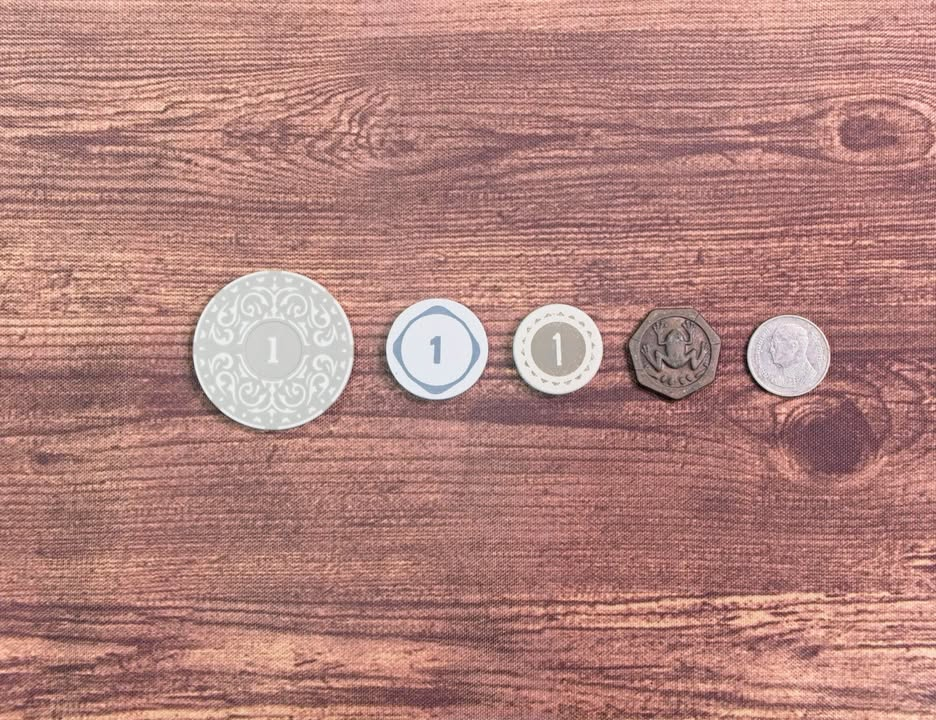
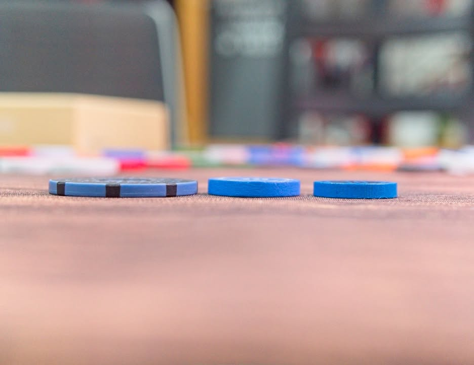
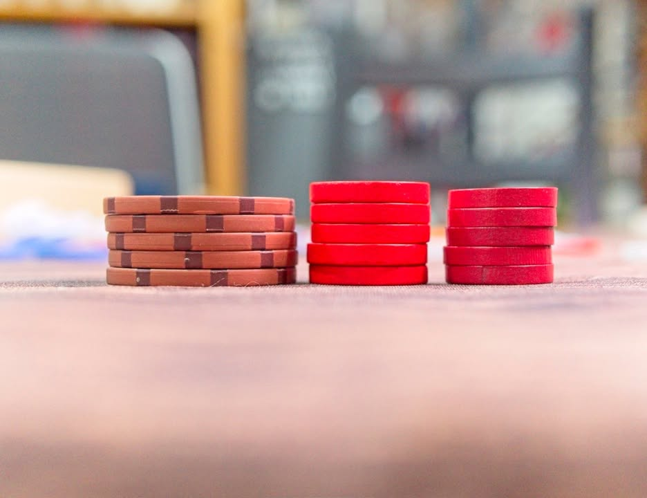
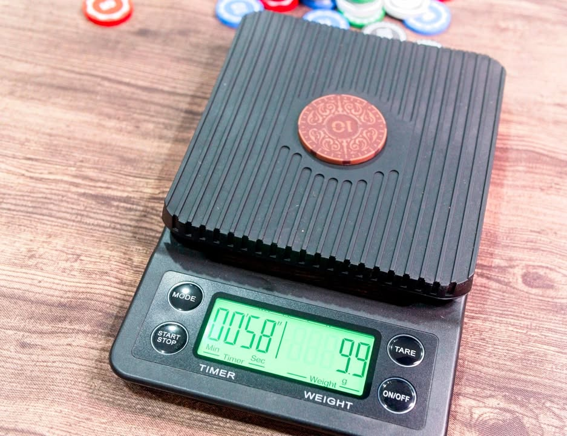
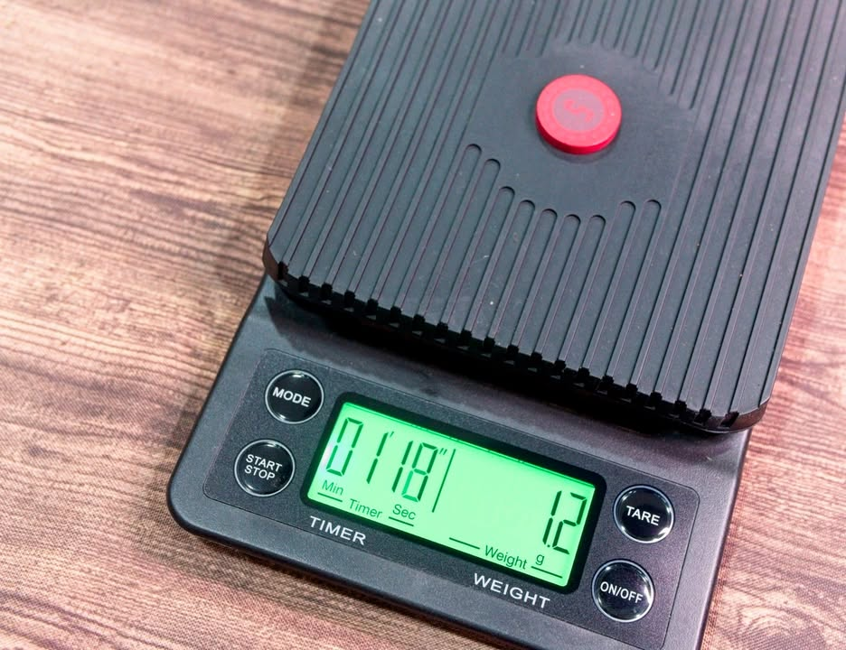
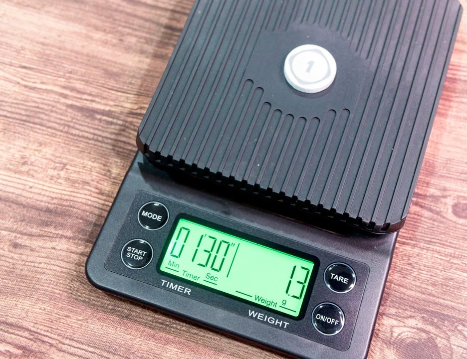

mini review: Tendays' Wood Coin

เป็นคำถามที่ผมอาจจะอยากรู้คนเดียวเพราะงั้นเลยซื้อมาให้หายคาใจ แต่เผื่อคนอื่นอยากรู้ด้วย อันนี้เทียบเหรียญ meeple sources เป็นหลักนะครับ

.
จะเห็นว่าของ tendays จะหนาและค่อนข้างสม่ำเสมอกว่าของ meeple source ส่วนขนาดนั้นใหญ่กว่าเล็กน้อยทั้งๆที่น้ำหนักแทบไม่ต่างกัน เวลาจับ tendays ก็จะรู้สึกโหวงๆกว่านิดนึงจากการกระจายน้ำหนัก

.
ส่วนสีนั้น tendays จะใช้โทนเส้นขาวบนสีพื้นในขณะที่ meeple source ใช้สีเทา

.
รวมๆก็ไม่ต่างกันมากอยู่ที่ว่าชอบลายไหน กับของ tendays มีแค่ถึงหน้า 100 แต่จะมี token ทรงสี่เหลี่ยมที่ปั๊มหน้า 500/1000 ขายอยู่ในเวบของญี่ปุ่น ในขณะที่ของ meeple sources มีหน้า 500 แบบเหรียญกลมปกติให้เพิ่มสั่งด้วย 

.
แต่เอาเข้าจริงๆ bank size 2000 +- นี้ก็แทบจะเล่นเกมยูโรได้ทุกเกมโดยไม่ติดขัดแล้ว (แต่เพื่อความชัวมีซัก 200 เหรียญก็จะครอบคลุมกว่า) ตรงนี้ถ้าเล่นเกมจำพวก 18XX ก็อาจจะต้องซื้อเพิ่มเยอะหน่อย

'
อีกนิดว่าลายของ tendays จะมีหยักถี่ตามมูลค่าเหรียญส่วนของ meeple sources จะใช้ลายเดียวกันหมด 

.
[non-sponsered post] ผมซื้อเหรียญราคาปกติมาจาก MeanBook  คู่มือ Board Game ภาษาไทย นะสนใจไปซื้อกันได้ ส่วนเหรียญพวกนี้จำเป็นไหม ส่วนตัวผมใช้บ่อยกว่าเหรียญเหล็กเยอะเพราะหน้าตามันไปด้วยกันได้กับเกือบทุกเกมและลายพวกนี้มันดูไม่ค่อยบ่อนแบบเหรียญโป๊กเกอร์ทั่วๆไป 

.
ถ้ามีช่องทางสั่งตรงจากญี่ปุ่นก็ลองติดต่อตรงดูได้ครับที่ https_://tendaysgames.shop/?pid=138157733&fbclid=IwAR1DL3aliZlzmLqS3ZUZgxvLjeRrQGZxyWbywkeKtPpu0n3ltC4mTmdsEoM

.
อันนี้ของ meeple source
https_://www.meeplesource.com/proddetail.php?prod=MoneyDiscs100

