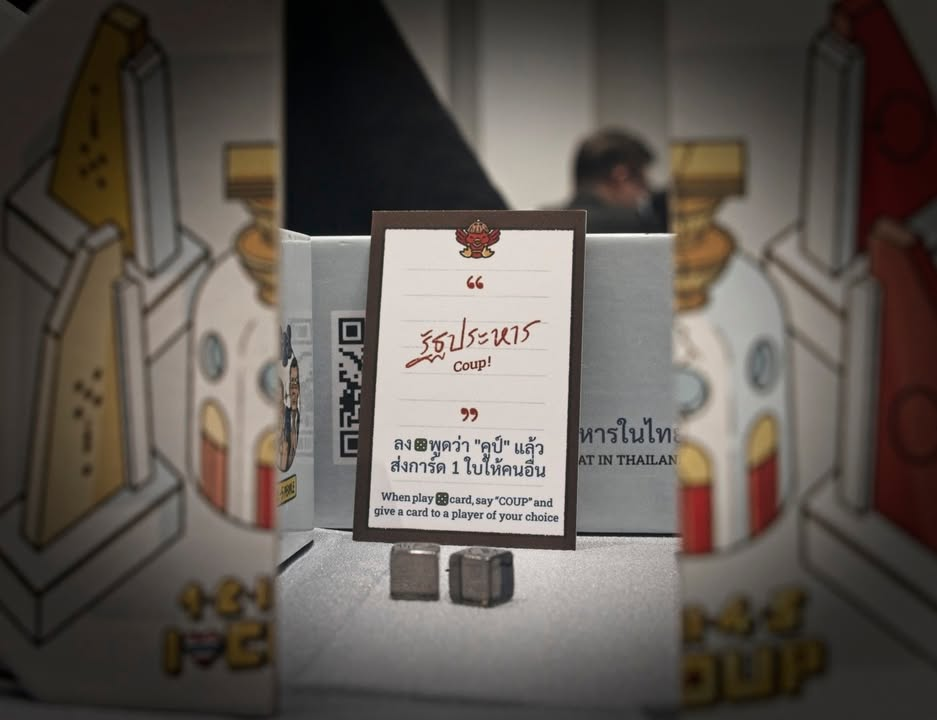

1-2-3-4-5 I Love Coup เกมเฮฮาที่จิกกัดสังคมและเหตุการณ์ในบ้านเราได้อย่างลึกถึงทรวง ผลงานของ VANTA studio

.
ก่อนอื่นต้องขออภัยที่ใช้คำนี้ แต่ตอนแรกอ่านกฎแล้วนึกว่าเกมทิ้งไพ่โง่ๆเล่นแป๊บๆจบ แต่เล่นจริงแล้วผิดถนัดเพราะมันมีความเฮฮาที่ถูกชูรสอย่างแสบสันด้วยการ 'แซะ' ที่ทำให้อินเหลือเกิน

.
โอเคระบบเกมมันก็คือเกมหาทางทิ้งไพ่ให้หมดมือธรรมดาๆ เกมจะมีไทล์อนุสาวรีย์ประชาธิปไตยอยู่ตรงกลาง ผู้เล่นก็แค่พยายามทิ้งการ์ดไปรอบๆทั้ง 4 ด้านโดยเลขจะมี 1-5 ก็วนๆไปง่ายๆแบบนี้เลย (แน่นอนว่าเลขนั้นมีรูปแซะวังวนทางการเมืองของประเทศที่มันก็วนลูปอยู่แบบนี้แหละ)

.
ความฮามันจะอยู่ตรงที่การ์ดบางใบมันลงแล้วจะทำให้กฏดิ้นนิดหน่อยอย่างต้องวางย้อนทางบาง วางข้ามบ้าง ถ้าใครลงผิดก็จะต้องรวบกองที่เล่นๆไปขี้นมือไปก่อนจะเริ่มใหม่ คือจังหวะเรากำลังมีสมาธิหาทางลงการ์ดใบต่อไปก็จะโดนเพื่อนทัก ลงผิดล่ะเมิงงงงง ก็ต้องรวบกองไปเริ่มวังวนการเมืองครั้งใหม่จากผู้เล่นหน้าเดิมดั่งเช่นการเมืองบางประเทศนั้นเอง 

.
ไฮไลท์ที่ฟังครั้งแรกนี้ถึงกับอุทานในความจีเนียสคือมันจะมีการ์ดมือที่มองไม่เห็นที่พอเล่นแล้วจะได้เลือกกติกาพิลึกๆใส่เข้าไปในเกมได้ ความเท่คือเราจะต้องฉีกแหกไทล์อนุสาวรีย์ประชาธิปไตยออกเป็นสองส่วนแล้ววางการ์ดที่ว่าไว้ตรงกลาง ซึ่งแบบต้องยอมร้องโอ้โห้ให้สามที

.
ส่วนตัวคิดว่าเป็นเกมเสียดสีการเมืองใกล้ตัวที่มีความเป็นรูปเป็นร่างมากที่สุดที่เคยสัมผัสมา โดยที่คุณจะมองข้ามเรื่องนี้ไปเลยแล้วเล่นมันแต่เกมปาร์ตี้ตลกๆก็ได้ แต่ถ้ามองดูดีๆจะเห็นความใส่ใจในรายละเอียดของทีมจัดทำได้ไม่ยาก เพราะเก็บรายละเอียดกันแม้แต่จุดเล็กๆ ตัวเกมจะไม่เสียดสีหลวมๆแบบ simmulation ลอยๆใน Coconut Empire หรือตำราท่องจำแบบ Democracy Timeline Game

.
แน่นอนว่ามันก็เกมทิ้งไพ่วนๆฮาๆนั้นแหละ แต่ไม่รู้ทำไมเล่นไปน้ำตาจิไหล

.
เกมนี้มีจำหน่ายแล้วสามารถไปถามในเพจเค้าได้เลย

