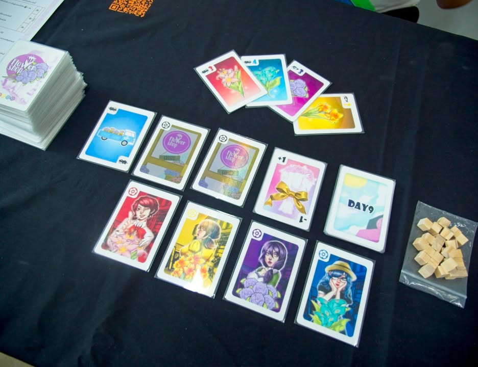

Flower Shop

เป็นอีกเกมที่ได้ลองในงาน TIBM - ตลาดนัดบอร์ดเกมอินดี้ แต่จริงๆผมเคยได้เล่นตอนเป็นกรรมการรับเชิญในงานกล่องน้อยอร่อยมากมาก่อนทีนึงละ

.
ตัวเกมจะมาสไตล์ thinky filler หน่อยๆ คือต้องใช้กลยุทธ์ในการเล่นร่วมไม่ได้เป็นเกมใสๆ ไอเดียคือเราจะต้องสะสมการ์ดดอกไม้สีเข้ามือแล้วหาจังหวะเอาการ์ดในมือไปส่งขายที่ร้านตรงกลาง

.
แต่ว่าเห้ยเจ้าของร้านไหนมันรับดอกไม้สีอะไรเราก็ดันไม่รู้น่ะสิ ก็เลยต้องเล่น effect บนการ์ดเพื่อแอบดูบ้างหรือเดาๆเอาบ้าง โดยเราจะต้องเลือกว่าจะเก็บดอกไม้ไว้ดี หรือจะรวมเอาไอคอนความสามารถไปใช้แต่อาจจะเก็บดอกไม้ได้น้อยลงหน่อยดี

.
แต่ว่าเกมมันไม่ได้จบแค่ส่งดอกไม้เพราะว่าดอกไม้ที่ส่งไปจะมาเป็นแต้มให้เราก็ต่อเมื่อมันสามารถเรียงเลขกันได้ต่อเนื่องกันเท่านั้น หมายความว่าถ้าเล่นแต่รวมสีส่งจีบเจ้าของร้านโง่ๆนี้ก็ไม่ชนะนะ

.
ก็เพลินๆดีครับ ตอนแรกว่าจะลองเล่นแค่รู้ระบบแต่ไปๆมาๆอ้าวอยู่ต่อจบเกมเฉย สนใจก็ไปดูที่เพจ Argh Game

