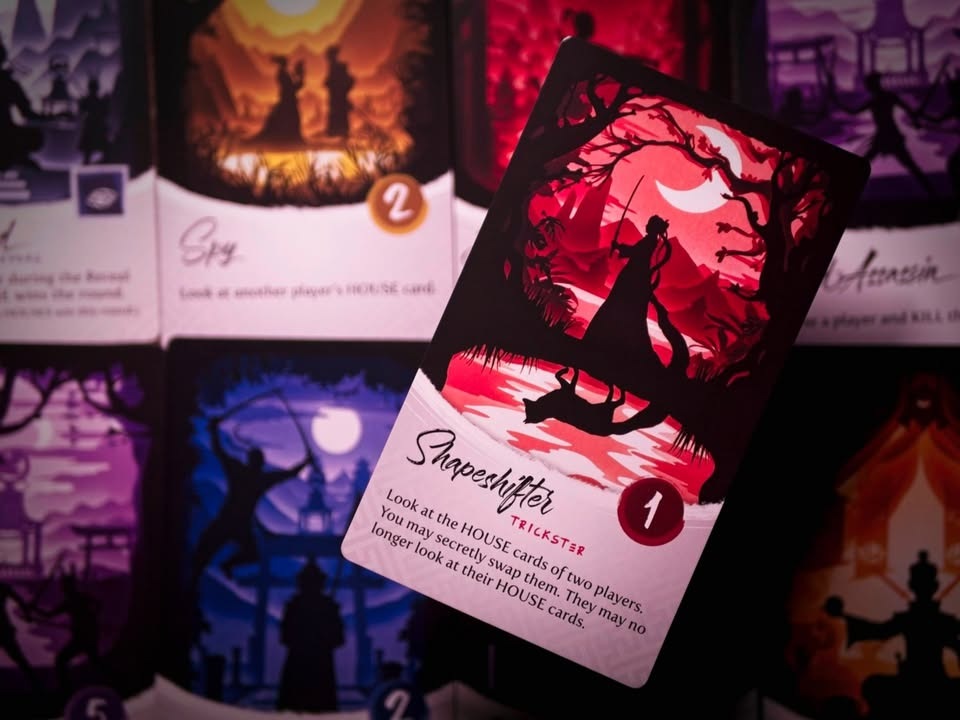
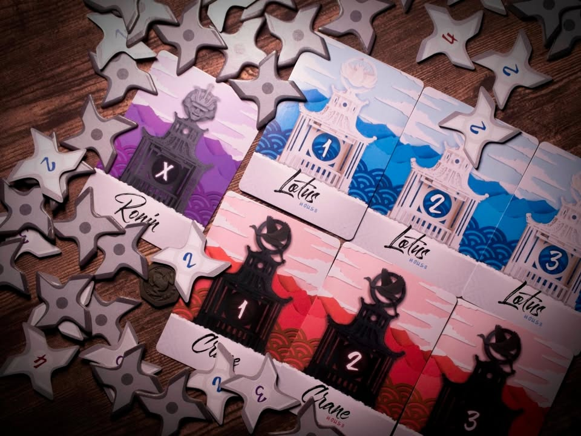
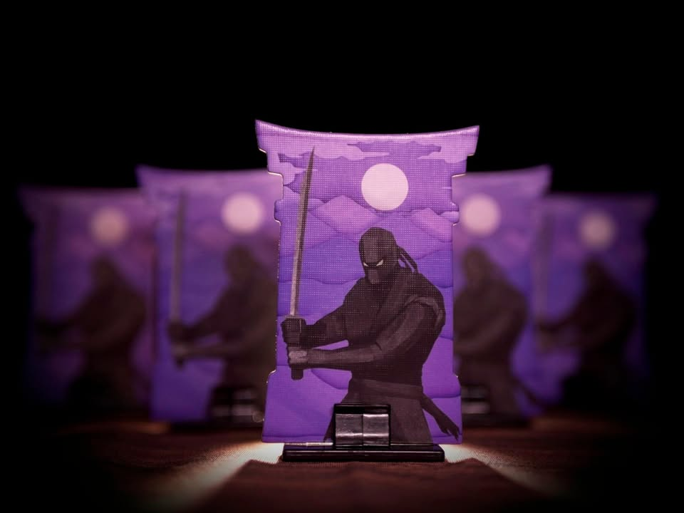

Night of the Ninja #bite_size  

เกมปาร์ตี้แนวหาพวกที่จะให้เราแฝงตัวเป็นหนึ่งในสามตระกูลและจะต้องเลือกระหว่างการรอบเร้นซ่อนตัวหรือจะบุกเข้าสู้ รวมไปถึงการแชร์ข่าวสารหาคนที่เชื่อถือได้เพื่อปกป้องหัวหน้าตระกูลให้พ้นค่ำคืนนี้ รอบหนึ่งใช้เวลาเพียง 5 นาทีเท่านั้นเอง ผลงานของ Jusin Gary

.
ถ้าว่ากันโดนส่วนผสม เกมนี้จะเรียกว่า Blood Bound ในฉบับเล่นคืนเดียวก็ได้อยู่ คือตัดแม่มไปเลยส่วนลีลาออกตัววิ่งไปรับแทนเพื่อน นั่งจำ skill หรือรำคาญเพื่อนที่แม่มไม่รู้อะไรบ้างเลยออกไปแล้วมามุ่งกับการตัดสินใจแบบคลุมเครือที่วัดใจแล้วเริ่มรอบใหม่ไปเลยดีกว่า
 
.
ไอเดียของเกมคือเราจะมีการสุ่มแบ่งทีมออกเป็นสองฝ่าย (สามถ้ามีเลขคี่) แต่ละบ้านก็จะมีเลขกำกับอยู่ พอเริ่มเกมเราก็ draft card เข้ามือคนละ 2 ใบ จากนั้นก็ไล่ resolove กันตามเฟสเลย จบรอบให้ดูว่าทีมไหนเบอร์ใหญ่ยังไม่ตายทีมนั้นก็หยิบไทล์ชูริเคนที่เป็นแต้มสุ่มไป ก่อนจะเริ่มแจกทีมเพื่อเริ่มรอบใหม่ ก็เล่นวนๆจนมีคนได้แต้มครบ 10 แต้ม (เล่นประมาณ 3-5 รอบก็น่าจะจบนะ)

.
พวกการ์ดความสามารถมันก็จะมีพื้นๆแบบขอดูบท ขอคิล ไปจนถึงใบลีลาๆ แลกบทมั่ง บังคับคิลแบบกันไม่ได้มั่ง คิลมาจะโดนสวนมั่ง ซึ่งข้อดีคือรอบนึงไม่ต้องอ่านเยอะได้ดูการ์ดแค่ไม่กี่ใบ และเกมจบเร็วมาก กติกาโคตร simple แต่ก็สร้างจังหวะให้คิดกับบลัฟกันพอสนุกโดยไม่ลีลาเยอะ

.
ไม่เชิงข้อเสียเกมประมาณนี้คนยิ่งเยอะก็ยิ่งดีนะ คิดว่าเริ่มซัก 6+ (เกมเล่นได้ถึง 11 คน) เป็นอย่างน้อยจะดีกว่า กับด้วยความที่จบเร็ว สายมโนชอบบลัฟซับซ้อน หลอกยาวๆก็คงไม่ถูกใจเท่าไร

.
สำหรับเกมปาร์ตี้ประมาณนี้ถือว่าน่าประทับใจ คือส่วนตัวรำคาญกับความลำไยและตรรกะเพี้ยนๆที่เห็นได้ตลอดเวลาในเกมทรงนี้ กับเกมไม่เครียดมากเพราะมันก็แค่ 'แต้มในรอบนี้' เท่านั้นเอง เดาผิดนิดหน่อยก็แค่ขำๆแล้ววนรอบใหม่ ในขณะเดียวกันข้อมูลมันก็ค่อนข้างกึ่งเปิดดีผ่านการซ้อนกันของข้อมูลทำให้ไม่มั่วสนิทเดาเยอะเหมือนหลายๆเกม 

.
ปกติผมไม่ค่อยเล่นสายนี้เท่าไร แต่ก็คิดว่าเหมาะกับคนที่มองหาอะไรที่ไม่ต้อง invest อารมณ์มากโดยที่ยังได้มีอะไรคิดเพลินๆอยู่นะ

--------------------------------
หมวด Bite Size (พอดีคำ) นี้กะว่าจะเขียนอะไรสั้นๆประมาณนี้ล่ะกัน ใหม่บ้าง ซ้ำบ้าง เกมที่ขี้เกียจเขียนบ้าง เขียนๆไว้ก่อนเผื่อมีอารมณ์อาจจะขยายไปลง Thought บ้าง จริงๆอยากเขียนสั้นกว่านี้ แต่ยังอดไม่ได้ที่จะต้องอธิบายอะไรเพิ่มตามนิสัย เดี๋ยวค่อยๆปรับไปล่ะกัน

