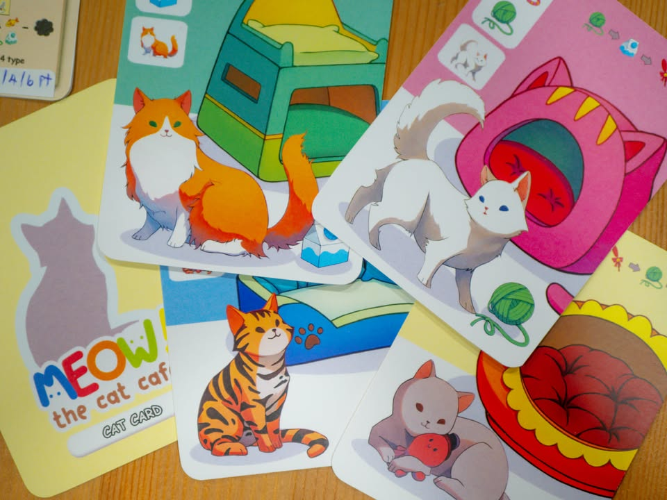
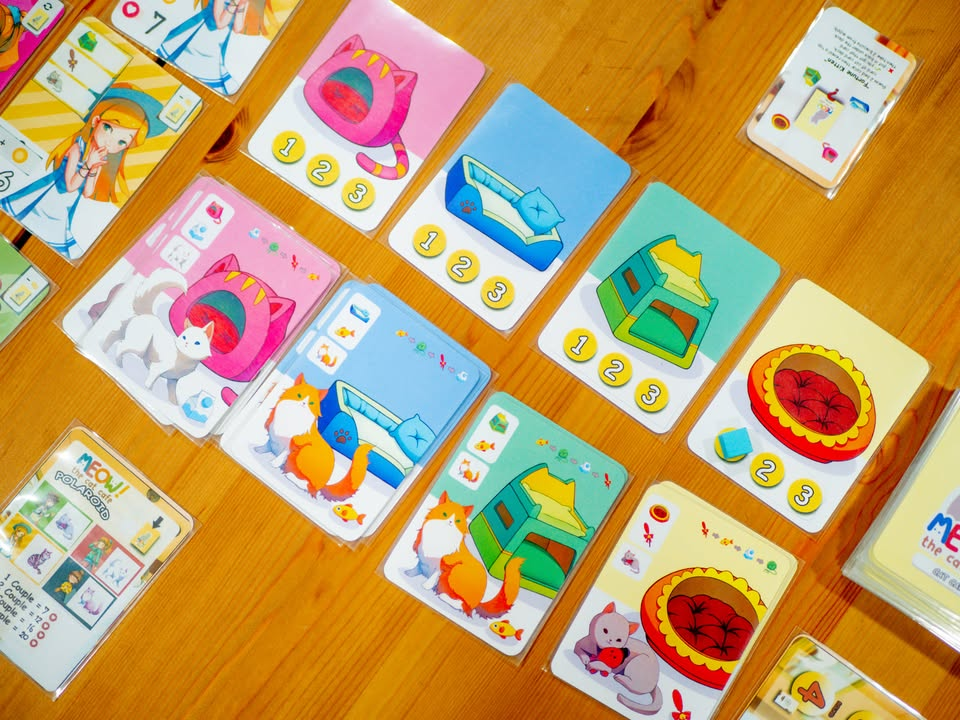
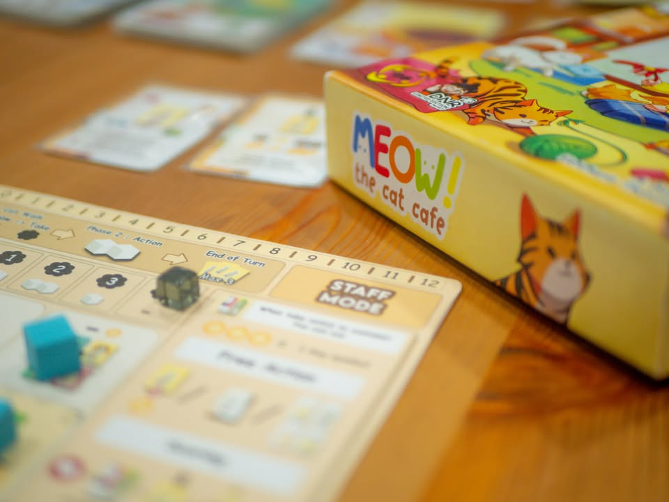
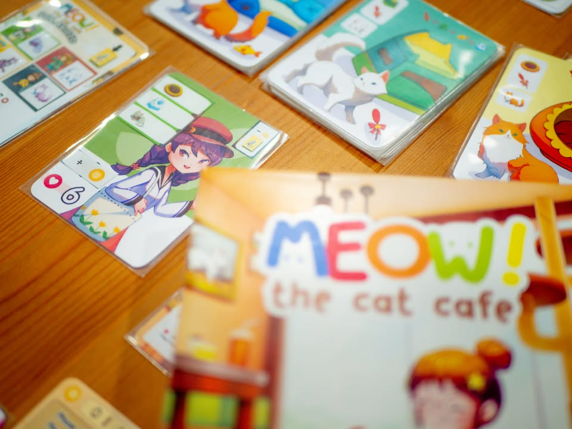
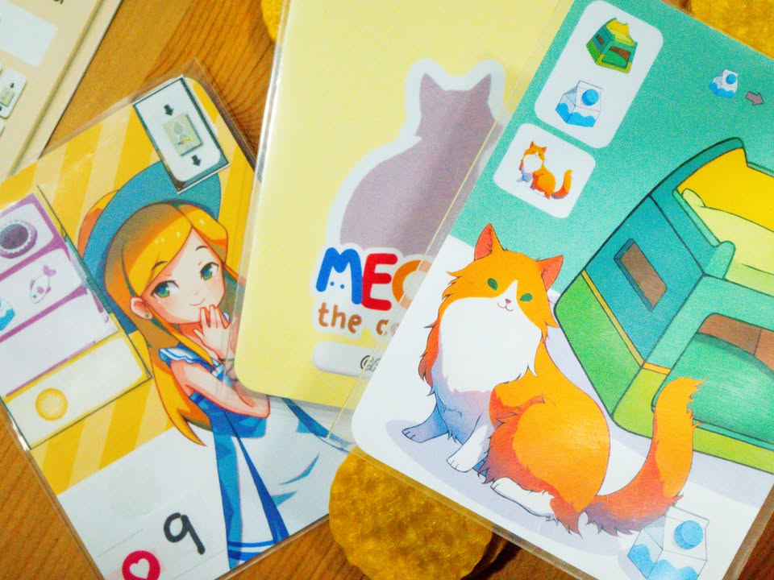
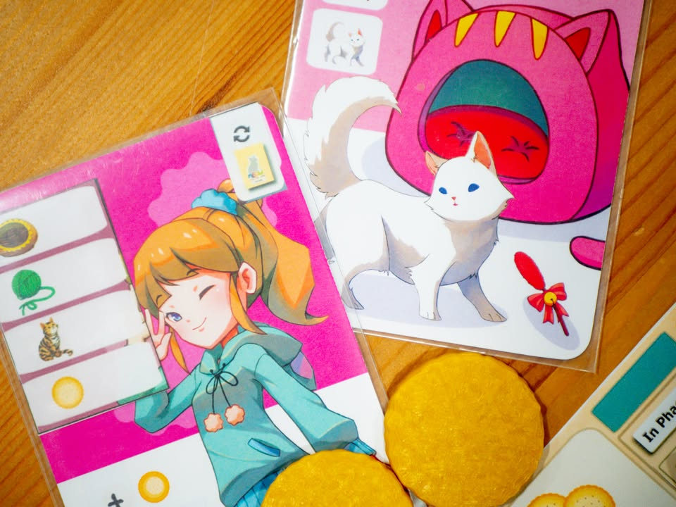
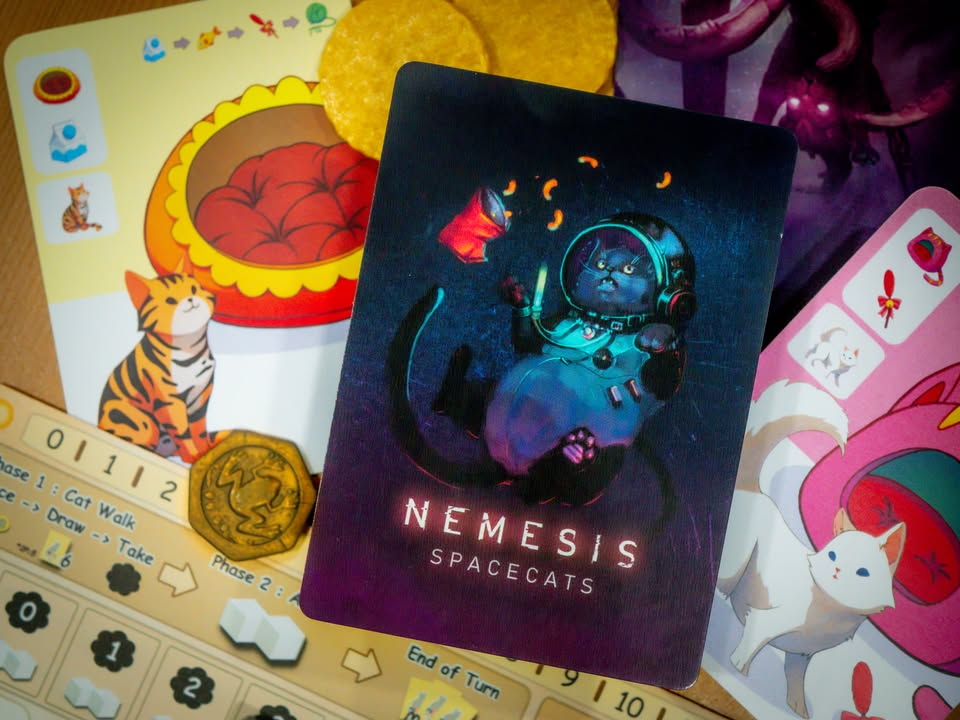

Meaw! The Cat Cafe #bite_size

ฉะ ฉัน ก็ไม่ได้อยากจะเขียนถึงเกมนี้เท่าไรหรอกนะ!!
แค่รูปมันน่ารักดีเท่านั้นแหละ!
มะ ไม่ใช่เพราะว่ามันเป็นเกมแมวด้วย!!

--------------------------------
📌 disclosure: 
เกมนี้เป็นหนึ่งในเกมที่กำลังประกวดอยู่ในโครงการ ยูเรก้า ของ Stronghold แต่ ผมไม่ได้เป็นกรรมการหรือมีส่วนใดส่วนหนึ่งเกี่ยวข้องกับโครงการ หรือมีอำนาจในการตัดสินผล เป็นแค่โพสแสดงความเห็นถึงเกมที่เล่นมาตามปกติ และตัวเกมยังไม่ใช่ฉบับสุดท้ายที่จะทำการผลิต ทุกสิ่งที่เขียนหรือเห็นอยู่นี้สามารถเปลี่ยนแปลงได้เสมอ
--------------------------------

▪️ เป็นเกมที่นักออกแบบหน้าคุ้น อาร์ม DNR (The Coding, Cabbage Farm, 27 Meters) หยิบเอามาให้ลองเล่น ที่เอาจริงๆก็ไม่รู้จะเอามาขอความเห็นทำไม เพราะเกมมันเสร็จแล้วนิหว่า เอามาขายทั้งอย่างนั้นแหละ อย่าไปเสียเวลาแก้เลย

▪️ ตัวเกมเป็นการ์ดเกมธีมแมวคาเฟ่ ไอเดียก็ set collection ทั่วไป มีลูกค้าน่ารักๆมายืนเลือกแมวแต่ละคนก็มีความสนใจต่างกันไป เราก็ไปจัดหาการ์ดแมว/ที่นอน/ของเล่นแมว มาตกลูกค้าให้มาทางเรา ตัวการ์ดแมวเป็น multi-icon มีของผสมกันหลายอย่างเราก็จะพยายามผสมให้มันคุ้มๆหน่อยเพราะ turn มีจำกัด

▪️ ส่วนที่ทำให้เกมมันกระเถิบระดับจากเกมใสๆคือการเลือกแอคชั่นที่เราจะทำได้ในในแต่ละรอบที่จำกัดคือเราต้องแบ่งแอคชั่นไปหยิบการ์ดแมวบ้าง การ์ดลูกค้าบ้าง รวมถึงการลงแมวไปวางคู่ลูกค้าให้ตรงชุดเพื่อทำแต้ม พ่วงการเก็บ collection ลูกค้าและการใช้การ์ดความสามารถพิเศษที่ทำให้เกิดการทำแต้ม และออกท่าได้หลายทาง  ตรงส่วนลูกค้าเองก็ไม่ได้เป็นสาวน้อยเรื่องมาก เพราะหลายครั้งก็หยวนๆบอกเตียงเอาได้สองแบบ น้องแมวพันธ์ไหนก็ได้ไรงี้

▪️ ไอเดียดวงๆที่ match กับความเบาของเกมคือเกมจะมีจังหวะแจกการ์ดแมวให้ผู้เล่นด้วยจำนวนหนึ่ง แต่ว่าเราก็ต้องทำการวางโทเคนเพื่อ 'เดา' ว่าสีไหนจะมา ก็จะมีการหงายเปิดให้ดูกัน ใครไม่ได้แมวก็รับเงินไปแทน

▪️ จุดที่มีปัญหาหน่อยๆก็คงเป็นความ multi-icon ที่ต้องมองกลับไปกลับมาระหว่างการ์ดบนมือกับของที่ลูกค้าจะเอานี้แหละ เนื่องจากมีหลายแบบแล้วความต้องการมันข้ามไปมาก็จะต้องมองหลายรอบหน่อย 

▪️ อย่างที่บอกว่าผมไม่ได้เกี่ยวอะไรกับโครงการ แต่ถ้าวิเคราะห์แล้วผมคิดว่าเกมอาจจะไม่ตรงปกกับโครงการนัก เพราะเกมมันไม่ได้ 'ง่าย' แบบสอนสองสามนาทีแล้วจบไปแบบที่โครงการเค้าจะเอา แต่นี้มันเป็นเกมคั่นเวลาที่มันต้องมีการคิดมองหาตัวเลือกพร้อมกับประเมินความเป็นไปได้บางอย่างที่มาอยู่ในโซน 'เกมเมอร์' หน่อยๆแล้ว - ซึ่งสำหรับผมเป็นข้อดีนะ

▪️ แต่ก็เห็นว่ามีโหมดง่ายให้เล่นด้วยแต่พอดีไม่ได้ลอง

▪️ ก็อย่างที่บอกว่าสำหรับผมเกมมันพร้อมขายแล้ว ในฉบับที่ผมได้ทดสอบก็คิดว่าเป็นตัวเลือกที่น่าสนใจสำหรับคนที่อยากหาเกมคั่นเวลาระดับครอบครัวแบบที่ต้องใช้หัวคิดหน่อยๆ รูปน่ารักเข้าถึงง่าย

--------------------------------
หมวด Bite Size (พอดีคำ) นี้กะว่าจะเขียนอะไรสั้นๆประมาณนี้ล่ะกัน ใหม่บ้าง ซ้ำบ้าง เกมที่ขี้เกียจเขียนบ้าง เขียนๆไว้ก่อนเผื่อมีอารมณ์อาจจะขยายไปลง Thought บ้าง จริงๆอยากเขียนสั้นกว่านี้ แต่ยังอดไม่ได้ที่จะต้องอธิบายอะไรเพิ่มตามนิสัย เดี๋ยวค่อยๆปรับไปล่ะกัน

