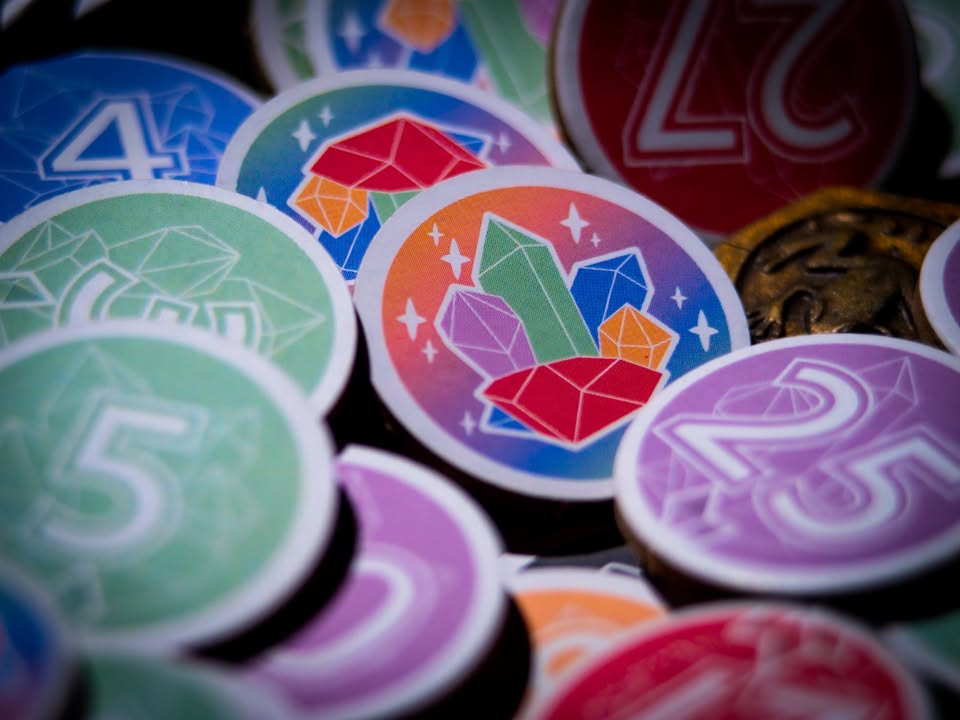

Prime Stone #bite_size

🔹 เกมเพื่อการศึกษาทางคณิตศาสตร์ที่ไม่ได้สอนด้วยวิธีเชยๆ หรือใช้กลไกเกมกระดานพื้นๆที่เห็นกันทั่วไป แต่มาในรูปของ Beg Building!! ผลงานจากนักออกแบบ กิตติพันธ์ วิบุลยศิลป์

🔹 เนื่องจากเป็นเกมที่จั่วหัวมาว่าเป็นเกมเพื่อการศึกษา แทนที่ผมจะมาพูดว่าเกมนี้มันสนุกอย่างไร ผมคิดว่าอยากจะมาเล่าในมุมว่าเกมนี้มันทำให้ 'การสอดแทรกความรู้ ผ่านความสนุกในเกมกระดานโดยไม่ฝืน' ได้น่าสนใจอย่างไรจากมุมมองคนที่เล่นเกมกระดานจะดีกว่า

🔹 โดยทั่วไปแล้วเกมกระดาน (โดยเฉพาะสายยูโร) นั้นมีตัวเลขที่ผ่านการคำนวนและทดสอบมาฝังอยู่ตลอดอยู่แล้ว อย่างเช่นจำนวนการ์ดที่เอาไว้แลกของใน Splendor หรือพวกการคำนวนลำดับการแลกเครื่องเทศไปมาใน Century : Spice Rode พอมาเกมนี้แทนที่จะซ่อนเลขไว้ให้ไปนั่งคิดกัน ก็เปลี่ยนมาเป็นเปิดเลขการคำนวนให้ออกมาชัดๆแล้วนำเสนอผ่านกลไกการเล่นไปแทน

🔹 ไอเดียเกมจะเป็น bag building ที่เราจะอยากจั่วสะสมไทล์ตัวเลข (ผลึกหิน) ให้ออกมาเป็นเลขตรงกับเป้าหมายกลางเพื่อเคลมแต้ม เราจะเริ่มที่ตัวไทล์จำนวนเฉพาะ 2 3 5 และไทล์หินกากๆไร้ประโยชน์ จำนวนหนึ่งมาใส่ถุง ตานึงเราก็แค่จั่วมาสองไทล์วางสะสมไว้แล้วเลือกว่าจะเอาเลขมารวมพลังกันแล้ว 'ซื้อ' ไทล์จากกองกลางที่มีมูลค่ารวมเท่ากับการคูณกันของเลข หรือว่าจะเอาไทล์ที่เราสะสมไว้ไปแลกการ์ดเป้าหมายตรงกลางก็ได้ ก็วนๆกันไปจนมีคนสะสมเป้าหมายได้ครบ 

🔹  กิมมิคเล็กๆที่เสริมเข้ามาคือเวลาที่เราเคลมการ์ดได้เราจะสามารถยัดเยียดไทล์หินกากๆไร้ประโยชน์ไปใส่ถุงของเพื่อนได้ด้วยนะ ในเชิงไอเดียไม่ได้แปลกอะไรแต่ว่ามันก็ถือว่าเสริม interaction ให้มีความรู้สึกแกล้งๆกันนิดนึง เพราะเวลาจั่วได้ไทล์ห่วยนี้มันก็หน้าหงุดหงิดอยู่หน่อยๆ กับเกมจะมีไอเดีย hand management ผสมเข้ามาเพราะว่าเราสะสมไทล์ไว้ได้แค่หกอัน

💭 ตอนแรกไม่อยากจะแตะเรื่องความสนุกนัก เพราะคิดว่าถ้าพูดในฐานะตัวเกมอย่างเดียวอาจจะไม่ค่อยแฟร์เท่าไร แต่ในอีกแง่ถ้าเกมมันไม่สนุกก็คงอาจจะดึงให้เราไปสนใจสิ่งที่เกมตั้งใจจะบอกเล่าไม่ได้หรือปล่าวนะ?

💭 ในแง่ความสนุกถ้ามองจากสายเล่นเกมจริงจังก็ไม่มีอะไรใหม่ เป็นกลไกเก็บของแลกเป้าหมายกลางธรรมดาๆนั้นแหละ  แต่ว่าถ้ามองว่ามันถูกจำกัดความซับซ้อนและระยะเวลาเพื่อให้มันเล่นในห้องเรียนได้ ตรงนี้ผมก็คิดว่าออกแบบโจทย์มาได้ดีว่าทำประมาณนี้แหละกำลังสวย และมันก็ช่วยการขับองค์ประกอบทางคณิตศาสตร์ อันเป็นแกนหลักที่เกมอยากนำเสนอให้เด่นขึ้น

🔸 ที่ติดนิดๆจริงๆน่าจะเป็นคือ 'การ์ดเป้าหมาย' ที่ค่อนข้างตายตัว พ่วงด้วยธรรมชาติของเกมทำให้คำตอบที่ถูกต้องน่ะมันมีอยู่แล้ว แค่จั่วไปเรื่อยๆรอเลขให้ตรงการ์ดก็พอ จนกลายเป็นมีสัดส่วนความลุ้นมากกว่าคิดวางแผน ซึ่งทำให้เชิงเกมมันอาจจะไม่น่าสนใจ แต่ว่าถ้ามองว่าเป้าหมายถือการกระตุ้นให้คิดเลขและจดจำตัวประกอบก็ถือว่าทำได้ดี คือมันสนุกกว่ามานั่งบวกเลขในกระดาษแล้วส่งให้ครูหลายเท่าเลยล่ะ (แน่นอนว่าการทำการบ้านนั้นไม่สนุก)

👁‍🗨 ถ้าพูดในฐานะคนที่ไม่ได้อยู่สนใจในวงการการศึกษาเป็นพิเศษ ก็น่าจะพอเอาไปกางเล่นกับลูกได้อยู่โดยไม่รู้สึกว่ากำลังพยายามฝืนให้เด็กมันหัดท่องสูตรคูณ อย่างพื้นๆเลยหัดจำทริคว่าเลขไหนมันประกอบมาจากการคูณแบบไหนแล้วแทนค่าได้ นี้ก็เอาไปต่อยอดได้หลายอย่างมากแล้ว 

💬 ในแง่การพัฒนา ผมคิดว่ามันน่าตื่นเต้นเหมือนกันนะ ที่เราเห็นกลไกที่เป็นเกมจ๋าๆถูกถอดถูกปรับเปลี่ยนไปสู่โลกการเรียนรู้ก้าวข้ามระบบพื้นๆน่าเบื่อหน่ายที่ใช้กันมานานนม 

--------------------------------
📌 disclosure: 
* ทางนักออกแบบส่งสินค้ามาให้ผมลองเล่น แต่ข้อเขียนนี้เป็นการแสดงความเห็นของผมที่มีต่อเกมโดยไม่ได้เป็นการรับจ้าง หรือเป็นข้อเขียนเพื่อการโฆษณา

--------------------------------
หมวด Bite Size (พอดีคำ) นี้กะว่าจะเขียนอะไรสั้นๆประมาณนี้ล่ะกัน ใหม่บ้าง ซ้ำบ้าง เกมที่ขี้เกียจเขียนบ้าง เขียนๆไว้ก่อนเผื่อมีอารมณ์อาจจะขยายไปลง Thought บ้าง จริงๆอยากเขียนสั้นกว่านี้ แต่ยังอดไม่ได้ที่จะต้องอธิบายอะไรเพิ่มตามนิสัย เดี๋ยวค่อยๆปรับไปล่ะกัน

