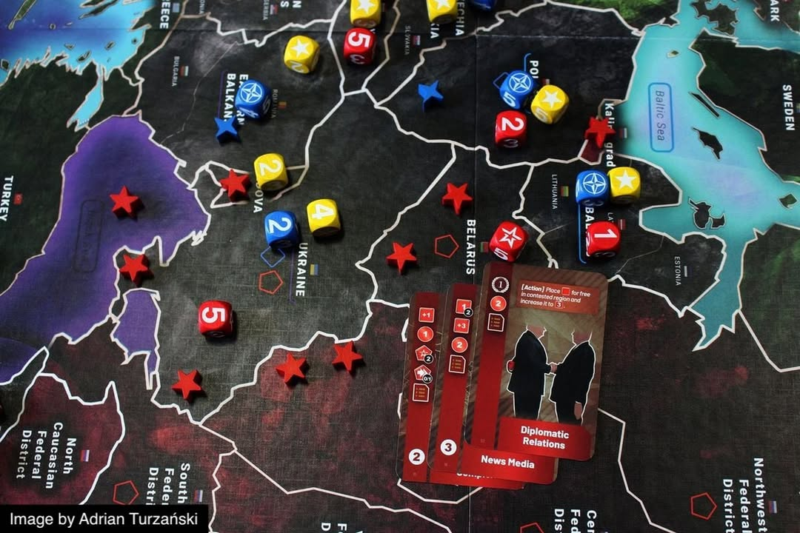

#เรียกว่าบทเรียนทางการตลาดละกัน เมื่อวันที่ 24 กุมภาพันธ์ที่ผ่านมา มีผู้ใช้ BGG ท่านหนึ่งโพสถึง "ความไม่เหมาะสม" ในการโฆษณาเกมกระดานเกมในสถานะการณ์ที่ไม่ปกติจากค่าย PHALANX

ด้วยคำโปรยที่ว่า 

-----------------
"History is happening right before our eyes. With Europe Divided, you can simulate the current crisis at a strategic level and relive the events that led to it – the new Cold War."
-----------------

เพราะว่าเกมที่พูดถึงคือ Europe Divided เกมจำลองสงครามเย็นในอนาคตสำหรับผู้เล่นสองคนที่เล่าถึงความขัดแย้งของ NATO และรัสเซีย

ซึ่งข้อความโฆษณานี้ถูกโพสในช่วงเวลาเหตุการณ์ของรัสเซีย-ยูเครนกำลังอยู่ในช่วงตึงเครียดก่อนจะถูกลบไปในภายหลัง

-----------------
โดยคำกล่าวจากผู้เกี่ยวข้องคือ

- โพสที่เป็นปัญหาได้ถูกลบไปในทันทีที่เกิดการปะทะ และตัวโพสนั้นถูกเอาขึ้น 'ก่อน' ที่จะมีการเปิดฉากยิง โดยทางค่ายไม่คิดว่าสถานการณ์จะบานปลายไปถึงจุดที่กำลังเกิดขึ้น

- ตัวนักออกแบบเองก็มีเพื่อนเป็นชาวยูเครน (ค่ายนี้อยู่โปแลนด์) ซึ่งทางนักออกแบบก็กลัวและเสียใจมากที่เหตุการณ์นี้เกิดขึ้น

- ทางนักออกแบบก็ย้ำว่าเหตุการณ์นี้ก็เป็นสิ่งที่แบบจำลองของเกมพยายามนำเสนอว่าหากพวกยักษ์ใหญ่พวกนี้ (NATO/Russia) ยังไม่หยุดจะเกิดอะไรขี้นได้บ้างกับภูมิภาคยุโรป ซึ่งเค้าเสียใจมาก ที่เหตุการณ์ที่เค้าทำนายในเกมนั้นได้เกิดขึ้นจริง

ที่มา - https://boardgamegeek.com/thread/2820959/very-bad-marketing/page/1

