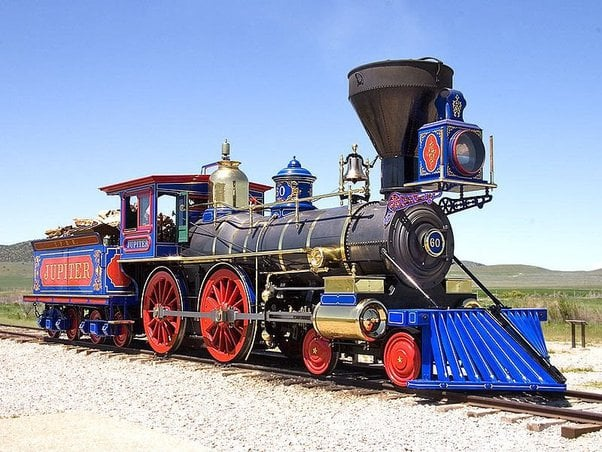

#ช่วงสาระฉันก็มีนะ ในตอนที่ผมได้รับเกม Carnige มาครั้งแรกนั้น สิ่งที่สะดุดตาผมนั้นคือ รถไฟหน้าปกทำไมมันคุ้นจังว่ะ! ก่อนจะระลึกได้ว่ามันตัวเดียวกับบนปก Age of Stream ที่มันเป็นคนละค่ายนิหว่า Ian O'Toole (นักวาด) นายเล่นง่ายงี้จะดีเหร๊อ!!

▪️ แต่ช้าก่อน! หัวรถจักรไอน้ำ (Steam Locomotive) ที่เราเห็นกันนี้มีชื่อด้วยนะ และชื่อของน้อนก็คือ จูปิเตอร์ (Jupiter) ผลิตโดยบริษัท  Schenectady Locomotive Works ในนิวยอร์คตอนปี 1868 พร้อมกับพี่น้องอีก 4 คันคือ Storm, Whirlwind, Leviathan, Gazelle (ไอ้น้องละมั่งนี้คงกูงงฉิบหาย ชื่อยังกะโดนเก็บมาเลี้ยงโคตรหลงฝูง) โดยน้อนจูปิเตอร์เนี่ยมีเบอร์ประจำตัวคือ 60

▪️ ถามว่าทำไมน้อนถึงโด่งดังเป็นไอคอนนิค นั้นก็เพราะว่าน้อนถูกใช้วิ่งในพิธีตอกหมุดทองคำ (Golden spike) ในปี 1869 อันเป็นหมุดที่เชื่อมรางรถไฟฝั่งตะวันออกและตะวันตกเข้าด้วยกัน และเป็นการเปิดศักราชของการเดินทางข้ามพื้นทวีปอเมริกาเหนือนั้นเอง (เวลาเล่นเกมธีมรถไฟก็มักจะเจอ event นี้บ่อยๆ)

▪️ เสริมอีกนิดตัวหัวรถจักรไอน้ำรุ่นนี้ใช้ระบบ 4-4-0 (เลขชุดพวกนี้คนเล่น 18XX จะคุ้นเคยกันดี) ที่หมายถึงระบบล้อที่ใช้กับหัวรถจักร ในกรณีนี้ 4 ล้อแรกเอาไว้บังคับทิศทาง 4 ล้อกลางเอาไว้ขับเคลื่อน และ ไม่มีล้อที่ส่วนท้าย

▪️ ส่วนชีวิตน้อนหลังพิธีเปิดก็ถูกเอาไปวิ่งรับงาน on line (เพราะวิ่งบนราง...) ทำงานปกตินั้นแหละมีอัพเกรดไปตามอายุงานกับยุคสมัย แต่ต่อมาธรรมเนียมตั้งชื่อหัวรถจักรแบบเรือเสื่อมความนิยมไปน้อนเลยเหลือชื่อแค่ C.P. #60. (เพราะบริษัทชื่อ Central Pacific Railroad) ส่วนหมุดทองก็แน่นอนว่าไม่ได้อยู่ตรงนั้นแล้วเพราะเค้าเอาไปเก็บไว้ที่ศูนย์แสดงงานศิลป์ที่มหาวิทยาลัยสแตนฟอร์ด

▪️ ส่วนน้อนจูปิเตอร์นั้นเกี่ยวอะไรกับลุงคาร์เนกี ก็เพราะว่าลุงเค้าสร้างตัวมาจากธุรกิจเหล็กกล้าที่ความต้องการพุ่งปริ๊ดจากกิจการรถไฟและอุตสาหกรรมหนักนั้นเอง

