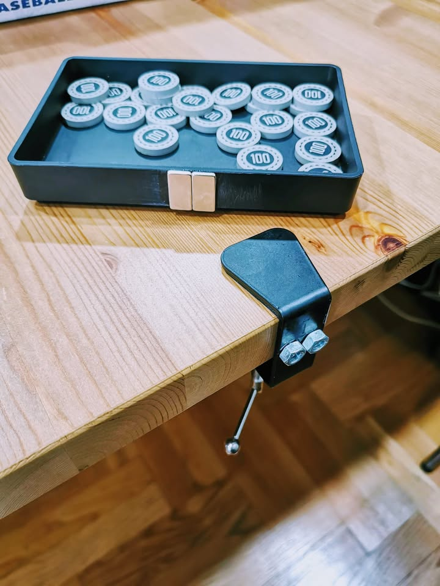

#diyไปเรื่อย หนึ่งใน item ที่ผมอยากได้อยากมีมากบนโต๊ะบอร์ดเกมก็คือ 'ถาดวางของ' แต่ไม่ใช่ถาคธรรมดานะต้องเป็นถาดที่ยืนออกไป ด้วยเหตุผลหลักก็คือเรื่องความเกะกะ

ซึ่งสำหรับคนที่มีโต๊ะบอร์ดเกมเฉพาะทางก็มักจะมี solution นี้กันอยู่แล้วผ่านระบบ rail ที่เป็นรางเซาะร่องแล้วใส่ถาดเข้าไป ตอนแรกก็มีคิดๆว่าอยากซื้อมาใช้ แต่ไปๆมาๆก็รู้สึกว่ามันใช้งานได้จำกัดไปหน่อยเลยเอาโต๊ะกินข้าวมาแทน

อันนี้เป็น prototype ที่ลองเอาไอเดียมาประกอบกับของที่มีอยู่ ทำมาจาก

* ถาดพลาสติดจาก ikea 19 บาท
* แม่เหล็ก 8 บาท x2
* แคลมป์หนีบโต๊ะ 40 บาท

ส่วนน๊อตที่เห็นคือเอาไว้รองใต้ถาดกันมันร่วงน่ะ (พอดีเน้นของใกล้มือ) เพราะแม่เหล็กมันรับแรงกระทำแนวตั้งไม่ดีเท่าไร ซึ่งจริงๆแล้วไม่ต้องใช้แม่เหล็กก็ได้เอาถาดกับกาวไปกับแคลมป์เลยก็ได้จบเลย แต่พอดีมีความรู้สึกว่าอยากให้มันเอาไปวางตรงไหนก็ได้ เบ็ดเสร็จชุดละ 60 - 80 บาท 

โดยรวมก็ถือว่าใช้งานได้ตามต้องการ (มั้งนะ) ถาดก็ถอดเอาไปติดตรงโน้นตรงนี้ได้อยู่ แต่เดี๋ยวลองหาไอเดียกับอุปกรณ์เพิ่มอีกหน่อย นี้เริ่มอยากซื้อ 3D Printer ขึ้นทุกวันๆ เพราะมีภาพในหัวที่อยากทำหลายอย่างมาก แต่ก็กลัวใจตัวเองเหลือเกินว่าซื้อแล้วยาวไปแน่ๆ

