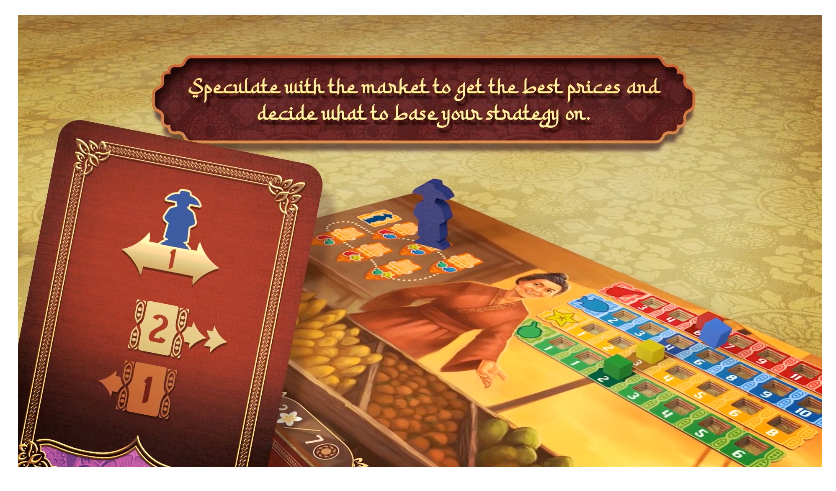

ฝรั่งเค้าสนใจประเทศไทยจนต้องทำเกมออกมา แบบนี้ต้องจัด!!!

แต่ช้าก่อน....

ตั้งแต่เข้าวงการมีผมเองก็เจอเรื่องประเภทเวลาทำเกมออกมาแล้วคนพื้นที่เค้ามาบ่นความไม่ตรงกับของจริงอยู่เรื่อยๆ เหตุเพราะส่วนมากคนที่ทำเนี่ยเค้าสวมธีมเฉยๆระดับความรู้ความเข้าใจย่อมต่างจากคนพื้นที่ (ในขณะที่ถ้าเป็นคนพื้นที่ทำเอง โดยเฉพาะแถวนี้ ก็อาจจะโดนกรอบโน้นนี้จากคนพื้นที่จนชวนไม่อยากทำเอาซะอย่างนั้น)

แต่นี้เป็นครั้งแรกๆที่มีฝรั่งมาทำเกมที่ใช้ฉากเป็นเมืองไทย ที่พอมีโอกาสได้ดูเกมแล้วก็ยอมรับเลยว่าเต็มไปด้วยความ อิหยั่งว่ะเนี่ย? ซึ่งจะพูดแค่เรื่องงานศิลป์และการเอาธีมมาสวมนะ ไม่ได้พูดถึง gameplay แล้วก็โทนจะออกแนวคุยขำๆนะไม่ใช่โทนด่า ซึ่งก็ต้องเข้าใจเหมือนกันว่าในสายตาฝรั่งเค้าก็ mix match เอาจากที่ตัวเองเห็นบ้าง ดูเอาจากหนังจากสื่อบ้างไม่เหมือนคนอยู่เอง

▪️ เกมชื่อ Phraya - พระยา - ที่หมายถึงแม่น้ำเจ้าพระยาของเรานี้แหละ แต่ว่าเกมมันเป็นธีมซื้อขายของกันในตลาดน้ำ..... แม่น้ำเจ้าพระยามันไม่มีตลาดน้ำโว๊ยยยยยยย ตลาดน้ำเค้าขายกันในคลองน้ำนิ่งๆ!!

▪️ ชุด... ดูแล้วเค้าน่าจะสับสนกับชุดเพื่อนบ้านอย่างเวียดนาม เท่าที่ทราบคือเค้าอิง resource จากยุครัตนโกสินทร์เรานี้แหละ แต่ดูเหมือนคนออกแบบจะสับสนกับชุดม่อฮ่อม แต่ถ้าเอาปกกับชื่อเกมออกไปก็คงดูไม่ออกจริงๆว่านี้เป็นฉากเมืองไทย 

▪️ เรือหลวง... โอเคเรามีเรือหลวงบนแม่น้ำเจ้าพระยา แต่พายล่องไปตามตลาดน้ำเนี่ยนะ? ส่วนรูปทรงเรือไม่ทราบจริงๆว่า ref มาจากไหนทรงดูไม่น่าลอยได้ แต่อันนี้ยอมๆก็ได้ คงต้องทำให้มันเข้ากับขนาดเกม
.
📌 Update - มีคนแจ้งมาว่าเรือมาจาก Voyage De Siam, Des Peres Jesuites, Envoyez Par Le Roy Aux Indes Et A La Chine ซึ่งดูแล้วก็เหมือนเป๊ะ

▪️ ซึ่งจริงๆเรายังไม่รวมว่าบ้านเราตลาดน้ำไม่ได้เป็นท่าเรือลอยเกะกะ แต่เป็นเรือพายกันอยู่สองฝั่งคลอง ตรงนี้น่าจะเป็นเรื่องของระบบเกมพ่วงภาพจำตลาดน้ำทำเลียนแบบให้นั่งท่องเที่ยวไปดูมั้ง

▪️ อาหารนี้ตะเกียบลอยมาเลยจ้าาาาาาา 

▪️ และสุดท้าย (เท่าที่เห็น) คือเราคนไทยเล่นเกมอะไรก็เรียกค่าเงินว่าบาทใช่มะ? มาเกมนี้เราแทนที่จะได้เรียกมันอยากเต็มภาคภูมิไม่ต้องมีคนมาล้อ แต่คือเหรียญเกมนี้มันคืออิหยั่ง ไม่เห็นมีความเป็นเหรียญไทยอยู่ซักกระกระพี้ (ร.1-ร.3 เราใช้เงินพดด้วง ส่วนที่เริ่มเป็นเหรียญนี้เริ่มมีช่วง ร.4) ดูแล้วเออ ไปเอากงจักรมาใส่ทำไมน่ะ......
.
📌 Update - มีคนแจ้งมาว่าทรงเหรียญในเกมจะเหมือนกับเหรียญเงินตราพระมหามงกุฎ พระแสงจักร

▪️อีกนิด... project นี้ font อาราบิกมาเชียว.....

ส่วน project/ตัวเกม ว่ากันโดยรวมดูแล้วไม่มีอะไรน่าสนใจเป็นพิเศษ เดินเก็บของแลกแต้มตามใบสั่งแบบยูโรทั่วไป จุดที่น่าจะเป็นทวิสก็ไม่เห็นบอกไว้ ซึ่งความน่าสนใจที่ดูไม่โดดเด่นก็เห็นได้จากจำนวน backer ที่ค่อนข้างน้อย

ลิงค์เกมอยู่นี้เผื่อใครสนใจ https_://gamefound.com/projects/dmz-games/phraya

