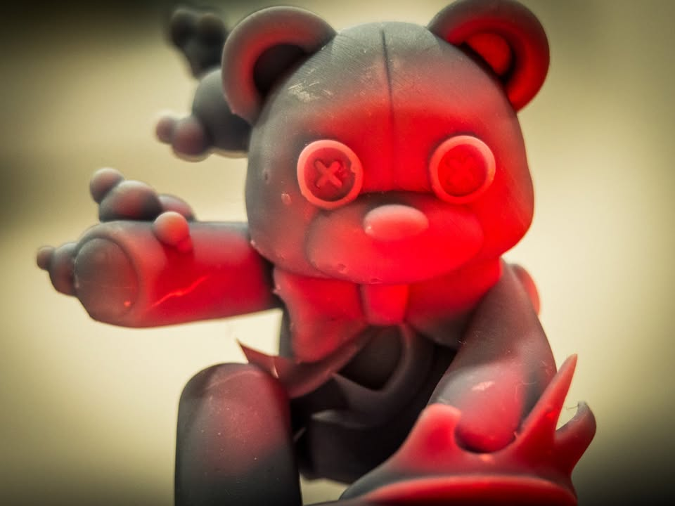
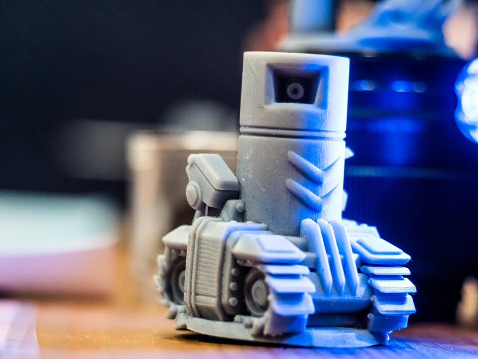
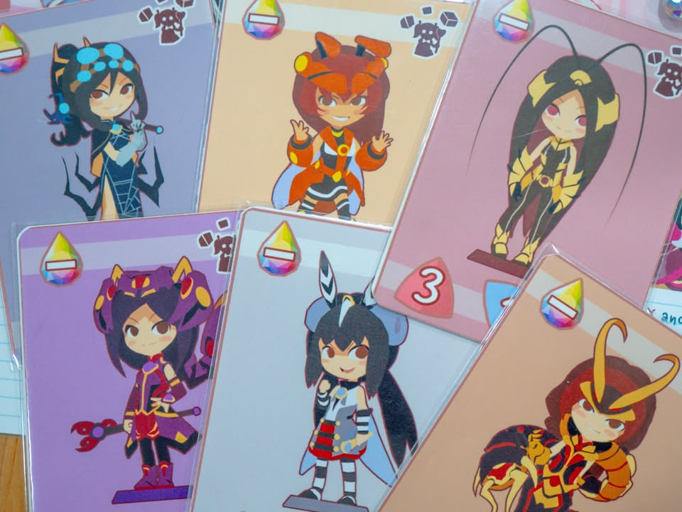
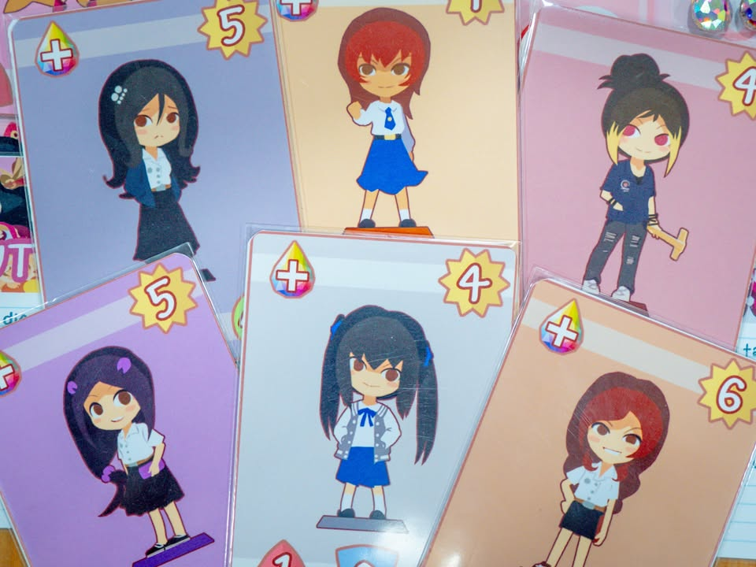
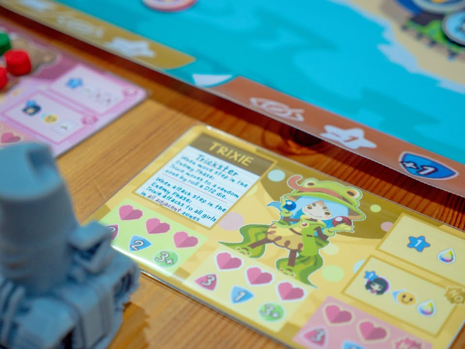
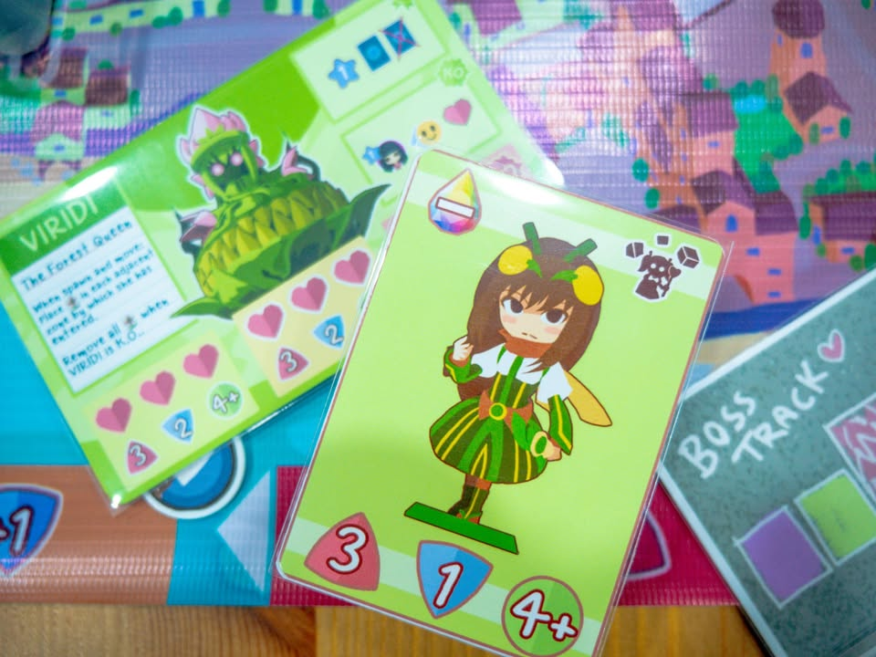

▪️ เมื่อวานพึ่งได้ลองเล่น ไททาเนีย ผลงานตัวทดสอบของนักออกแบบชาวไทย Jack's Workshop  โดยธีมแหวกมาก เพราะเราจะมาเล่นเป็นสาวน้อยเวทย์มนต์ที่ร่างจริงเป็นนักเรียน ม ปลาย - เด็กช่าง - นักศึกษา (โปรดเปิดเพลงเซเลอร์มูนประกอบ) 

▪️ เกมพยายามจะทำตัวเป็น sandbox ที่ให้ผู้เล่นทำอะไรได้หลากหลาย ถ้าว่ากันโดยโครงก็คือจะมีแผนที่เมืองให้เราพาสาวน้อยเวทย์มนต์ของเราเดินไปมา ทำความดีช่วยจับโจรมั้ง ส่งของให้คนมั้ง มีเหล่าร้ายก็มาแปลงร่างไปช่วยสู้มั้ง เล่นๆอยู่บอสตัวเบิ้อเริ่มก็มาถล่มเมืองเป็นระยะๆให้เราต้องมาร่วมพลังกันสู้ หรือจะช่างแม่งปล่อยเพื่อนสู้แล้วเราไปทำแต้มจากการช่วยคนก็ได้

▪️ จุดที่น่าสนใจคือความเป็นเอกลักษณ์ของสาวน้อยเวทย์มนต์และบอสที่คาเรกเตอร์เยอะมาก (สาวน้อยแมลงสาบก็มี......) แต่ละตัวก็มีความใส่ใจในการคิดท่ากับการออกแบบหลากหลายดี ของที่ทำได้ในเกมก็เยอะจัด เกมไม่ได้ซับซ้อนอะไรหลักก็เดินไปมาตามช่องแล้วแต่ละที่มันก็จะมีสถานที่ต่างๆกันไป อยากแปลงร่างก็ต้องใช้พลังเวทย์มนต์ พอใช้หมดก็ต้องไปหาทางชาร์ทใหม่ ชาวบ้านเจ็บก็ต้องพาไปส่งโรงพยาบาลไรงี้ 

▪️ เกมมีไม้คทาที่มีเพลงประกอบให้ด้วยนะเวลาเป็น start player ก็น่ารักดีถือแล้วอินเนอร์ออกอยู่

▪️ แต่ปัญหาเท่าที่เล่นแล้วเจอคือ...... มันเยอะไปจนสะเปะสะปะดูไม่เป็นองก์เดียวกันเท่าไร คือวัตถุดิบมันเยอะไปจนตีกันมั่วไปหน่อย อันอาจจะต้องรอให้นักออกแบบไปรื้อออกแล้วมาประกอบใหม่ พร้อมปรับโฟกัสให้เกมคมขี้น คือด้วยความที่พยายามอยากให้มันเป็น sandbox แต่ว่าสุดท้ายทุกคนคือมีอาชีพเดียวกันคือสาวน้อยเวทย์มนต์มันก็เลยดูจะแปลกๆที่จะแหกไปทำอย่างอื่นไรงี้

▪️ ถ้ามีอะไรที่ไม่ชอบนักและพูดได้เลยก็คือยังขาด character development เพราะ fixed กับท่าตายตัว ไม่มีการหาชุด หาอุปกรณ์มาเสริม หรือเพิ่ม level ท่า เลยมีแค่ state นักเรียน <> สาวน้อย ที่ไม่ค่อยมีมิติเท่าไร พ่วงเอาจริงๆผมไม่ค่อยชอบเกมทอยเต๋าที่เรา modify หน้าเต๋าไม่ได้ มันดูค่อนข้าง  vintage อ่ะ ลุ้นทอยเต๋า 50/50 เนี่ย ถ้าใส่พวก development แบบเราค่อยๆไต่พัฒนาสาวน้อยจนไปสู้เหล่าร้ายได้เจ๋งๆนี้คือจะชอบมาก (อย่าง Spirit Island งี้ เริ่มง่อยๆผีเฝ้าศาลหน้าบ้าน ท้ายเกมนี้โอ้วพระเจ้าแห่งธรรมชาติ รู้สึกอิ่มเอิบมาก)

▪️ อีกเรื่องที่อาจจะเป็นปัญหาของนักออกแบบทั่วไปคืออิงกับ common sense + คิดว่าตัวเองกำลังทำเกม digital อยู่ ทำให้พวก UI/UX หรือกติการ่วมถึงความสามารถต่างๆมันขาดๆเกินๆไปหลายที่อยู่ พ่วงความอยากจะใส่รายละเอียดแทรกให้สมกับอินเนอร์ แต่กลายเป็นกติกามันงอกแล้วลำบากคนเล่น เพราะวิธีแก้แบบหน้างานคือมักจะงอกกติกาเฉพาะตัว แทนที่จะไปปรับระบบให้มันคลีนแทน

▪️ เกมถ้าทำเป็น standee จริงๆก็น่าจะขายได้อยู่ แต่คงต้องรอระบบเกมนิ่งก่อนเพราะไปได้หลายทางมาก วัตถุดิบกับไอเดียดีๆมีเยอะ แต่ตอนนี้ล้นไปต้องส่งไปปรับสูตรใหม่ก่อน แต่ก็ดูมีศักยภาพมาก

