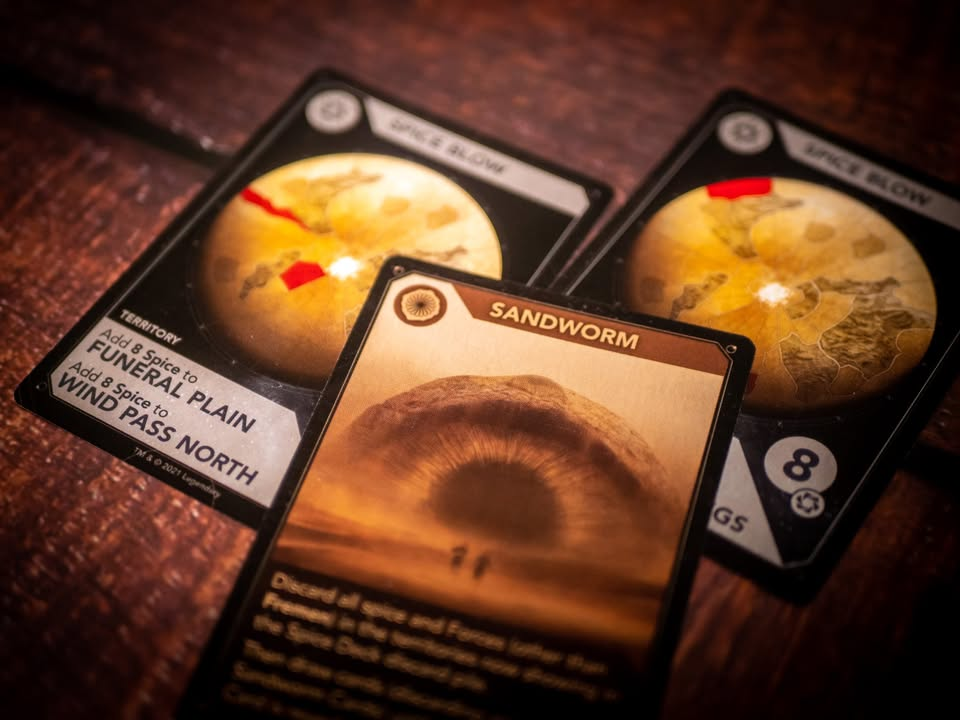

▪️ Dune: A Game of Conquest and Diplomacy (2021) เป็นเกมที่ย่นย่อเอาสุดยอดเกมขึ้นหิ้งอย่าง  Dune (1979 มี reprint อีกรอบตอน 2019) มาทำให้สั้นและเล็กลงสามเท่าจนสามารถเล่นจบได้ในเวลาเพียง 1 ชั่วโมง #bite_size #อินเนอร์เยอะ 

▪️ ติดนิดเดียว....ความสนุกก็ดูจะย่อมาเท่ากับที่ตัดออกไปนั้นแหละ

▪️ หรือถ้าพูดอีกแบบก็......เกมเหี้ยไรเนี่ยเอาไปเผา!! 

▪️ โอเคมันก็ความรู้สึกส่วนตัวนะ เพราะก็พอนึกภาพออกว่ามันจะมีกลุ่มไหนที่ enjoy กับเกมได้อยู่ แต่นั้นแหละสำหรับผมคงไม่มีรอบสอง แต่จะเหมาะมากถ้าคุณกำลังมองหาเกมส่งเบี้ยไปประมูลตีกันแบบไม่ต้องใช้กลยุทธ์อันใดในการเล่น มองหน้าวัดใจล้วนๆหงายไพ่ออกมา เอ้า! ฮาหว่ะ

▪️ ไอเดียเกมไม่ซับซ้อน คือมันจะมีพื้นที่ดาวแบ่งเป็นโซนๆ ผู้เล่นก็ผลัดๆกันจ่ายเงิน (สไปซ์) ซื้อทหารเป็น disc เล็กๆมีไอคอนตระกูลอยู่ไปลงตามพื้นที่ดาว จากนั้นก็ส่งทหารย้ายไปมา ถ้ายืนด้วยกันก็สู้กัน ถ้าตอนจบรอบมีใครยึดช่องฐานทัพได้ 3 จาก 5 ก็วินไปเลย 

▪️ ระบบ combat จะคล้ายๆใน Scythe ที่เราจะเอาล้อหมุนๆมาบอกว่าจะประมูลพลังเท่าไร แต่ว่าพลังมันต้องตามทหารที่ส่งไป แล้วบิดเท่าไรก็การันตีว่าตาย ตรงนี้เราก็ต้องไปลีลามองหน้าเพื่อนเอาว่ามันจะบิดเยอะไหม เพราะเหลือน้อยตอนรอบหน้าก็ต้องระวังคนอื่นมาเหยียบเราต่อ

▪️ แต่ทวิสคือแต่ละบ้านจะมีผู้นำให้ด้วย ก็จะมีเลขเป็นของตัวเองเอาไปช่วยบูสพลังตอนสู้ แต่ความสุดยอดของระบบนี้ในเกม (ที่ถ้าคุณไม่ชอบจะเรียกมันว่าระบบเหี้ยไรเนี่ย...)  คือตอนเปิดเกมเราจะมีโอกาสได้รับแจกการ์ด "คนทรยศ" ซึ่งถ้าตอนเล่นแล้วฝ่ายตรงข้ามเล่นผู้นำตรงกับการที่เรามีเราก็หงายได้เลย แล้วแม่งจะหอบทหารฝ่ายโดนมาสิโรราบแก่เรา........ แบบแพ้ไปงงๆโง่ๆเลยน่ะ

▪️ แต่ถ้าผู้นำเราไม่ทรยศก็ไม่เป็นไร มันจะมีระบบเป่ายิงฉุบอีกเลเยอร์คือ มันจะมีการ์ดอาวุธกับเกราะให้ส่งไปพร้อมกัน อาวุธมันจะแบบเป็น ปีน/ยาพิษ เกราะก็เอาไว้ counter ของตรง type พวกนี้แหละ ถ้าเราส่งไปแล้วอ้าวเกราะกันไม่ตรง type ก็กันไม่ได้ leader เราก็ตายเหมือนกัน....

▪️ คือระบบสู้แม่งลุ้นจัดๆ ไม่ต้องคิดอะไรทั้งนั้นไปวัดเอาหน้างานนั้นแหละ

▪️ ซึ่งจริงๆก็อาจจะไม่ใช่ปัญหานักถ้าเกมแม่งแทบจะทำเหี้ยอะไรต่อไม่ได้เลยถ้าแพ้ศึกใหญ่ๆซักครั้ง เพราะเงินที่ได้ในเกมมันไม่ได้เสกมาจากอากาศ แต่ต้องไปยึดพื้นที่ที่มีของให้ โดยที่เกิดมาแบบสุ่ม  ซึ่งถ้าเราเอามาไม่ได้ก็จะไม่มีเงิน พอไม่มีเงินก็ออกทหารไม่ได้ ซื้อการ์ดเพิ่มไม่ได้ เป็นเกมแห่ง winner take all ที่แท้ทรู ..... ซึ่งข้อดีคือเกมจบไว ไม่ทรมารนาน ถึงจะไม่รู้จะเล่นทำไมก็เถอะเพราะมันพลิกกลับมาไม่ได้เลย

▪️ ความสามารถประจำบ้านแม่งก็งัดวนกันเป็นวงกลมแบบน่ารำคาญมากกว่าจะสนุก มีขอเปิดดูมือบ้าง บังคับชนิดการ์ดที่จะลงบ้าง แบบอะไรว่ะเนี่ย ไม่มีพื้นที่การวางแผนเลย ยิ่งอีบ้านงูพิษมีคนทรยศได้สี่ใบ.....สาดดดด เหมือนโดนบังคับเล่นตลอดเวลา พื้นที่ทางการเมืองเชิงเจรจาแนวเห้ยเมิงๆช่วยกันรุมก็ม่ายมี ผู้นำก็ไม่มี theme อะไร มีแต่เลขโง่ๆเลย

▪️ แต่ข้อดีของเกมนี้ก็มีนะ ระบบมีการแบ่ง phase ที่เข้าใจง่าย กลไกการเล่นก็ไม่ได้ซับซ้อน มีจุดตัดสินใจยึกยักว่าจะเอาตังหรือจะวิ่งไปรีบยึดป้อมให้วินๆดี พ่วงความเฮฮาของการที่เปิดการ์ดมาแล้วกองทัพคุณหายเหี้ยนเลยเพราะยืนเก็บสไปซ์อยู่แล้วหนอนยักษ์วนกลับมากินกองทัพเราหมด......

▪️ กล่าวโดยสรุป.... ของเลียนแบบเกมระดับ classic ตัวเต็มที่ตอนออกแบบนี้เหมือนฟังคนอื่นบรีฟเหี้ยเล่ามาคร่าวๆ แล้วเอามาทำเกมใส่หน้าตัวละครตามหนังกันดีกว่าโดยยังไม่ได้เล่นเกมต้นฉบับ (พูดเปรียบเปรยเฉยๆนะ) ไม่ได้มีมิติหรือความสนุกอเมริเทรชเต็มขั้นแบบตัวดั่งเดิม คนที่รอตัวลีนของอันเก่าก็อาจจะผิดหวัง แต่ถ้าชอบบลัฟกันเกมไม่ได้ซับซ้อนก็อาจจะชอบก็ได้..... YMMV ครับ 

▪️ อีกเรื่องคือคุณภาพอุปกรณ์ไม่ค่อยดีเท่าไร กระดาษบางๆ ไทล์เม็ดจิ๋วๆชวนหาย แต่ด้วยความที่กล่องราคาไม่ได้แพงก็เลยหยวนๆได้ (กล่องผมดันให้ตาไก่มาแค่อันเดียวไม่ครบอีก -_-)
--------------------------------
หมวด Bite Size (พอดีคำ) นี้กะว่าจะเขียนอะไรสั้นๆประมาณนี้ล่ะกัน ใหม่บ้าง ซ้ำบ้าง เกมที่ขี้เกียจเขียนบ้าง เขียนๆไว้ก่อนเผื่อมีอารมณ์อาจจะขยายไปลง Thought บ้าง จริงๆอยากเขียนสั้นกว่านี้ แต่ยังอดไม่ได้ที่จะต้องอธิบายอะไรเพิ่มตามนิสัย เดี๋ยวค่อยๆปรับไปล่ะกัน

