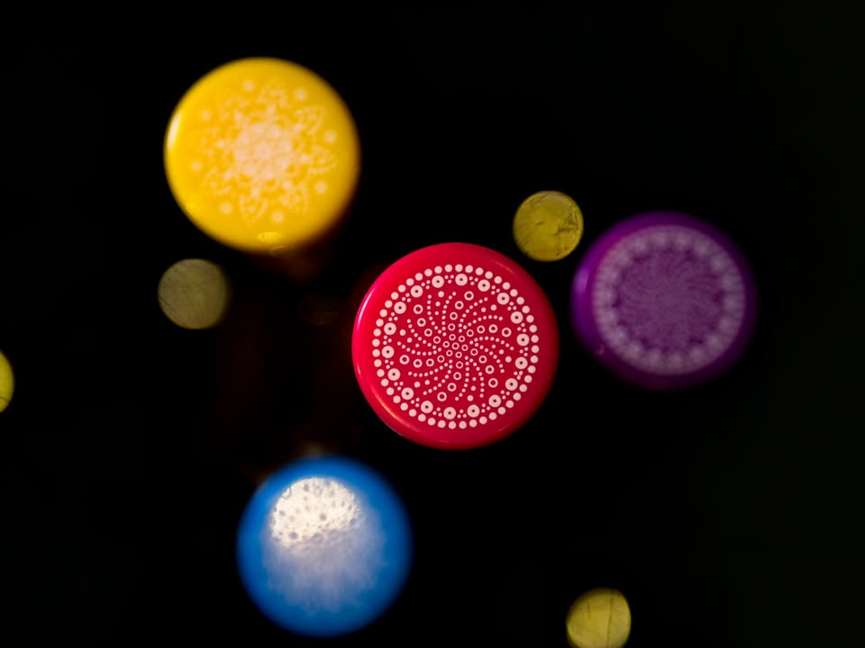
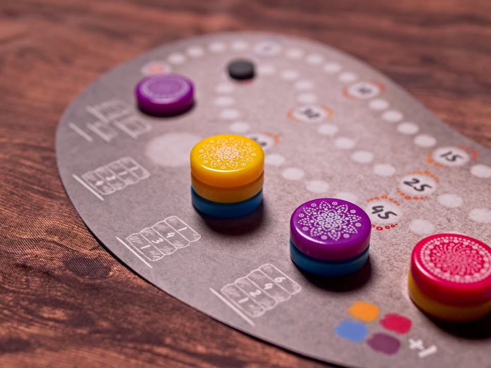
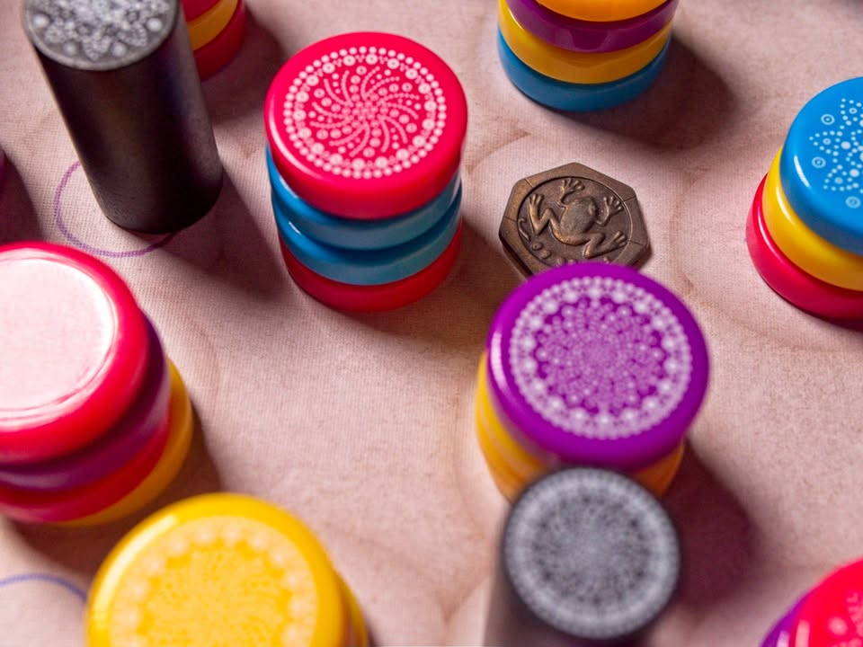

ศิลามันดาลา - mandala stones #bite_size

-เพราะทุกสิ่งในจักรวาลนั้นหมุนวนเป็นวงกลม ไม่มีจุดเริ่มต้นและไม่มีจุดสิ้นสุด-

▪️ เกมแนว abstract ที่จะให้เรามาเก็บหินมันดาลามาจัดชุดทำแต้มกัน ผลงานของ Filip Głowacz (Beer Empire, Founder of Teotihuacan, Shadow of the Obelisk)

▪️ ไอเดียการเล่นของเกมจะมีสองส่วนสำคัญ ส่วนแรกคือวิธีในการเก็บหินมาสะสม และส่วนที่สองคือการเคลมแต้มจากหินที่เก็บที่สะสมไว้ในบอร์ดของเรา

▪️ พื้นที่หลักของเกมจะอยู่ที่กระดานกลางซึ่งจะมีหิน (เป็นก้อนกลมหนา) สุ่มสีเรียงกันอยู่หลายกองวางแบบเป็นตารางช่องเว้นช่อง และจะมีแท่ง 'ศิลปิน' สีดำอยู่ 4 แท่ง ในตาของเราก็จะหยิบแท่งที่ว่าอันหนึ่งย้ายไปวางซักช่องที่ว่างๆอยู่แล้วเก็บหินที่อยู่รอบๆมา

▪️ แต่ความไม่ง่ายคือมันมีเงื่อนไขสองอย่าง อย่างแรกคือหินที่เก็บต้องมี 'ลวดลาย' ตรงกับแท่งศิลปินที่เราย้ายไป และอย่างที่สองคือหินที่เก็บจะต้องไม่มีศิลปินแท่งอื่นวางติดกัน พ่วงด้วยการหยิบจะต้องเก็บแบบเรียงลำดับมาตั้งเป็นแท่ง ณ ตอนที่เก็บ 'สี' นั้นไม่มีความหมายอะไร

▪️ เวลาจัดเก็บในกระดานเราเนี่ยมันต้องวางเป็นตั้งในกองที่แตกต่างกัน และการจะเคลมแต้มเราต้องประกาศ 'สี' ที่จะใช้ กองไหนด้านบนสุดมีสี่ที่เราประกาศไว้มันก็จะทำการคิดแต้ม พ่วงกับมีทริคอีกว่า แต่ละกองจะคิดแต้มไม่เหมือนกัน บางกองใช้ความสูง บางกองเตี้ยกว่าได้แต้มเยอะกว่า บางกองเน้นสีต่าง และถ้าเราเรียงลำดับชั้นสีเอาไว้ดี เราก็สามารถทำการเคลมติดๆกันได้บ่อย

🔹 หมายความว่าจุดสนุกที่สุดของเกมนี้ก็คือตอนจะหยิบของมาใส่ เราต้องคิดว่าจะหยิบแบบไหน ให้ได้จำนวนชิ้นและลำดับสีที่จะประหยัดแอคชั่นและทำแต้มได้มากที่สุด ตรงนี้มันสำคัญตรงที่เกมไม่ได้มุ่งเน้นให้หยิบได้เยอะแต่เพียงอย่างเดียว 

🔸 ซึ่งจุดนี้ก็เป็นติดขัดหลักของเกมเหมือนกัน เพราะ 'มันวางแผนล่วงหน้าได้ยาก' เพราะด้วยความที่แท่งมันมีสี่แท่งแล้วผู้เล่นก็ผลัดกันเดินมา บางทีตรงนี้เล็งไว้ อ้าวเพื่อนย้ายศิลปินมาวางข้างๆพอดี บางทีเปิดไทล์มาอ้าวหน้าไม่ตรงหยิบไม่ได้อีก ทำให้มันเป็นเกมที่เน้นการปรับแผนหน้างานให้ดีที่สุด จนหลายครั้งมันเหมือนกับโดนบังคับหยิบอยู่บ่อยๆเพราะมันดีสุดได้แค่นี้แหละ ตรงนี้คิดว่าเล่น 2 คนจะเหมาะกว่าเพราะรูปแบบกระดานจะไม่เปลี่ยนไว

▪️ เนื่องจากเป็นเกมต่างคนต่างเก็บของก็จะไม่มีการแย่งอะไรกันเป็นพิเศษนะ interaction ก็จะไม่มีกันโดยตรง แต่ก็มีช่วงขัดใจเวลาเพื่อนย้ายตัวศิลปินมาแล้วแผนเปลี่ยนเหมือนกัน เกมจะมี mission ตอนจบแจกให้ตอนต้นเกมด้วย ก็จะมีผลในทิศทางการเล่นทำแต้มของเราอยู่นิดหน่อย 

▪️ ในเรื่องอุปกรณ์ตัวหินคุณภาพดีมาก พลาสติกหนามาเลย เคาะแล้วฟิลลิ่งดี แต่กระดาษนี้บางไปจนอีกนิดก็เรียกกระดาษแข็งไม่ได้แล้ว แต่โดยรวมก็คุ้มค่าคุ้มราคา  ส่วนธีมนี้เรียนตามตรงรู้สึกว่าฝืนๆอิหยังว่ะใส่มาทำไมอยู่หน่อยๆ เป็นเกมที่ presentation ดูงงๆตั้งแต่หน้าปกยันตอนกางแล้ว ลายสองแบบบางทีก็ดูคล้ายกันจนมองผิดไปหลายที แต่เกมมันก็เพลินๆดี แนวเล่นเบาๆคั่นเวลา ถ้าลืมๆไปว่ามันพยายามยัดธีมอะไรมาแล้วมองที่มันเป็นเกม abstract อย่างเดียวก็สามารถสนุกไปกับกลไกของเกมได้ตามปกติครับ

💬 เช่นเดียวกับเกม abstract ทั่วไปที่การอธิบายว่ามันเล่นยังไง รวมไปถึงสนุกยังไงค่อนข้างอธิบายยากนิดนึง แต่โดยกติกาแล้วไม่ยุ่งยากอะไร ส่วนตัวคิดว่าถ้าเป็นกลุ่มที่ชอบเกมอย่าง Azul กับ Sagrada เกมนี้ก็น่าจะเข้าทางเลยนะ แต่ถ้าไม่ชอบ puzzle ทรงนี้ก็ผ่านได้เลย เกมเล่นได้ 4 คนก็จริง แต่ผมคิดว่า 2 คนจะสนุกกว่า เนื่องจากจะสามารถวางแผนการวนรอบกลับได้ด้วย

--------------------------------
หมวด Bite Size (พอดีคำ) นี้กะว่าจะเขียนอะไรสั้นๆประมาณนี้ล่ะกัน ใหม่บ้าง ซ้ำบ้าง เกมที่ขี้เกียจเขียนบ้าง เขียนๆไว้ก่อนเผื่อมีอารมณ์อาจจะขยายไปลง Thought บ้าง จริงๆอยากเขียนสั้นกว่านี้ แต่ยังอดไม่ได้ที่จะต้องอธิบายอะไรเพิ่มตามนิสัย เดี๋ยวค่อยๆปรับไปล่ะกัน

--------------------------------
📌 disclosure: 
* Box & Brew Café and Board Games ผู้แปล/นำเข้า/จัดจำหน่าย ส่งสินค้ามาให้ผมลองเล่น แต่ข้อเขียนนี้เป็นการแสดงความเห็นของผมที่มีต่อเกมโดยไม่ได้เป็นการรับจ้าง หรือเป็นข้อเขียนเพื่อการโฆษณา
--------------------------------

