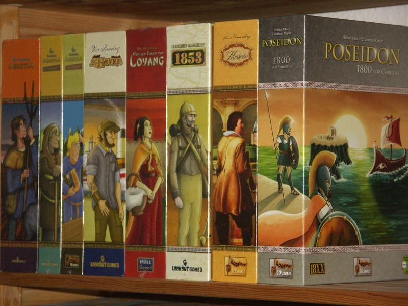

▪️ ในขณะที่บ้านเรากำลังมีหัวข้อเรื่องสมรสเท่าเทียม ใน BGG ก็มีประเด็นเรื่องการเหยียดสีผิวเกิดขึ้นอีกครั้ง

▪️ จากหน้าปกเกม Atiwa ที่เป็นรูปค้างคาว.......

▪️ งงอะเด้! มันเกมเกี่ยวกับค้างคาว มันก็ต้องปกเป็นรูปค้างคาวสิ!

▪️ ตอนแรกผมก็ไม่รู้เรื่องนี้หรอกพอดีเพื่อนส่งมาถามก็เลยไปดูหน่อย อ่านแล้วก็อ้ออออออออออออออออออออ

▪️ ต้องปูพื้นกันก่อนว่าค่าย Lookout Games เนี่ยปกติชอบทำปกด้านข้างเกมเป็นรูปคนยืนอยู่ข้างกล่อง เรียกได้ว่าเกือบทุกเกมเลยแหละ (ตามรูปประกอบ)

▪️ ทีนี้ประเด็นคือ ทำไมเกมนี้มันเป็นรูปค้างคาวว่ะ? เพราะเห็นว่าเป็นเกมในพื้นที่แอฟริกาที่มีแต่คนผิวสีเลยไม่วาดคนลงไปข้างกล่องหรือไง? จุดนี้แหละที่เป็นประเด็นของกระทู้นี้

▪️ ซึ่งก็มีคนแย้งมาเหมือนกันว่า ก็เกมนี้มันเกี่ยวกับค้างคาวไงโว๊ยยยยย จะใส่คนมาทำไมเนี่ย? 

▪️ แต่ก็มีคนแย้งมาเหมือนกันว่า หลายๆเกมมันก็ไม่เห็นพูดถึงคนมันยังใส่รูปคนด้านข้างเลย (แถมต้องเป็นคนขาวด้วยนะ อย่าง Barenpark งี้ หรือใน Le Harve เกมท่าเรือยังใส่คนแบกของมาได้เลย)

▪️ ก็ต้องยอมรับว่าประเด็นเรื่องผิวสีเป็นเรื่องที่ละเอียดอ่อนมานานในสังคมตะวันตก เรื่องนี้ลากมายาวพอดู คอมเม้นต์โดนลบไปบานเลย ซึ่งก็อาจจะเป็นเรื่องที่คนไทยไม่ได้อินกัน เพราะไม่ได้มีประวัติศาสตร์ร่วมตรงนี้

---
ที่มา: https://boardgamegeek.com/thread/2876963/lets-talk-about-cover-art

image ref: https://boardgamegeek.com/image/880518/poseidon

