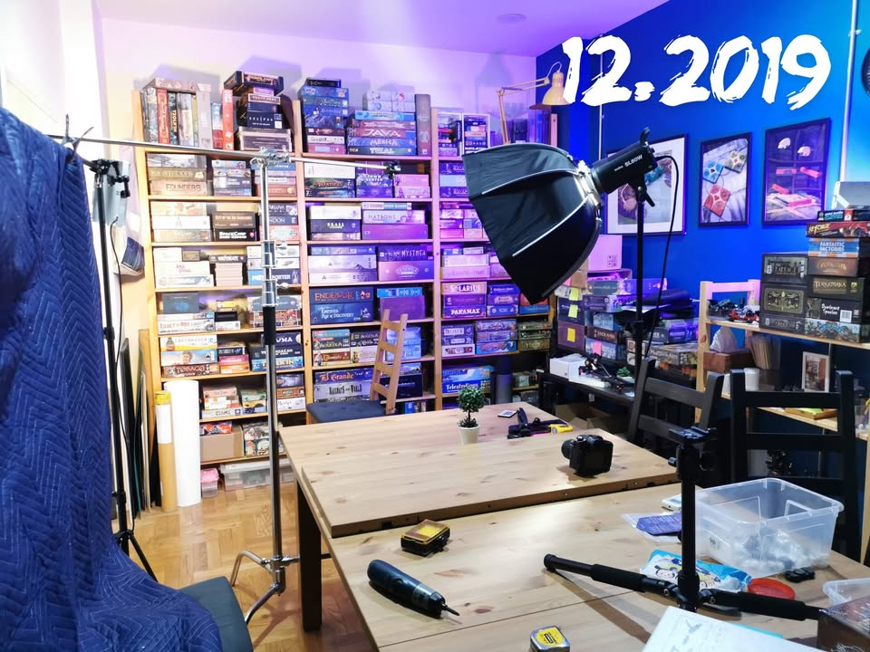

#เล่าไปเรื่อย พอดีไปเห็นคลิป reel ของคนในกลุ่มใหญ่ บอกว่าเกมมันแน่นเต็มตู้ไปหมดแล้วววววางซ้อนๆกันบังมิดมองไม่เห็นเกมข้างหลัง ก็เลยลองไปคุ้ยๆหารูปชั้นวางเกมตัวเองบ้าง เป็นการสำรวจชั้นวางตัวเองไปในตัวว่าจำนวนเกมมันโตเร็วแค่ไหน 

▪️แต่เอาเข้าจริงเนื่องจากในเฟสส่วนตัว วันๆโพสไรมั่วไปหมดหารูปยากจัดก็เลยสกิมๆมาได้ประมาณนี้แหละ

🔹 ผมเริ่มเล่นบอร์ดเกมช่วงปี 2009 ตอนนั้นบอร์ดเกมหาซื้อในไทยยากกกกกกกกกกก เพราะไม่มีร้านเกมเลย ต้องรอเกมกลุ่มเล็กๆจากร้านคิโนะคุนิยะ (ที่เป็นร้านหนังสือนั้นแหละ) ไม่ก็เกาะรอคนเค้าสั่งเกมที่นานๆจะมีที ช่วงนั้นเด็กใหม่จัดๆซื้อเกมเถื่อนจีนมาเพียบเลย คุณค่าเชิงลิขสิทธ์ในหัวไม่ดีเท่าไร เน้นปริมาณเอามากๆอยากลองไปหมด 

▪️ซึ่งผมไม่ได้บอกว่าดีหรือสนับสนุนนะ ไอ้การซื้อเกมเถื่อนเนี่ย แต่ตอนนั้นผมเป็นแบบนั้นก็ว่าไปตามที่เป็นแหละ ซึ่งมันจะผิดกับการโผล่มาเล่นในสมัยนี้ที่ร้านเพียบ เกมมือสองก็เยอะ มือหนึ่งที่เอาเข้ามาก็ไวจัดแถมถูกกว่าสั่งเอง บริบทมันจะต่างกันค่อนข้างมาก ซึ่งเกมแท้ที่เล่นสมัยสิบปีโน้นส่วนมากก็ยังอยู่มาถึงตอนนี้นะ Agricola, Bsg, Ticket to ride, Taluva งี้

🔹 วาร์ปอีก 8 ปีมาโผล่ 2017 เลย เพราะช่วงก่อนหน้านั้นเก็บเกมตามซอกกับในรถ เลยไม่ค่อยมีรูป ตอนนั้นผมพึ่งแยกมาสร้างบ้านเองก็เลยคิดว่ายังไงก็ต้องมีห้องสไตล์ mancave เอาไว้เล่นเกมกับนั่งทำ diy โน้นนี้ให้ได้ ก็เลยมีรูปชั้นวางเกมติดกล้องบ่อย 

▪️พอมามองย้อนไปผมก็ไม่ได้ซื้อเกมอะไรเพิ่มเยอะแยะเท่าไร ทั้งๆที่ก็นัดเล่นเกมถี่ๆมันอาทิตย์ละสองสามวัน ส่วนหนึ่งผมคิดว่าเพราะตอนนั้นเพื่อนสายซื้อยังมีกันหลายคน ก็เลยแนวๆช่วยกันซื้อช่วยกันเล่น เกมใหม่ๆก็ไม่ได้เข้ามาบ้าคลั่งเหมือนตอนนี้ ตอนนั้นคือคิดว่าคงอยู่ได้ซักสี่ห้าปีก่อนชั้นจะเต็ม

🔹 พูดเสร็จปี 2019 นี้ผ่านมาแค่สองปีแม่งเต็มชั้นเฉย ลามจนต้องไปต่อชั้นวางเพิ่ม (แต่ก็ชั้นเตี้ยๆวางนิดหน่อย) ส่วนหนึ่งคิดว่าเพราะเกมหาง่ายมากแล้วก็เป็นยุค KS ที่เกมมาสั่งรัวๆ

🔹 วาร์ปมาอีกปีกว่าๆ 2022 ที่เต็มหมดแบบจรดเพดานสองฝั่ง ส่วนหนึ่งมันมาจากข้อสังเกตก่อนหน้าว่าตอนนี้ผมเหลือตี้ขนาดเล็กแล้วซื้อคนเดียว อยากได้อะไรเลยต้องจัดเองหมดที่เลยเต็มไว จากเมื่อก่อนไม่มีเกมนอนรอในซีลตอนนี้ก็เริ่มมีแล้ว กด KS แบบไม่คิดเยอะเกินไป  นี้คิดว่าต้องจำใจขายเกมราคาแบบช่วยเอาออกไปที ที่บนชั้นเต็มแบบขาดทุนแล้วซักทีเหมือนกัน เพราะเอาจริงๆนี้คือมันมีเกมวางกองตรงพื้นแล้วด้วย......

ชั้นวางผมใช้ IKEA IVAR ส่วนหนึ่งก็เพราะคิดไว้แล้ววางงอกแน่เลยเลือกอันที่สามารถต่อเติมปรับเปลี่ยนเพิ่มได้ง่าย แต่ก็ไม่คิดว่าจะต้องเพิ่มเร็วขนาดนี้นะ......

