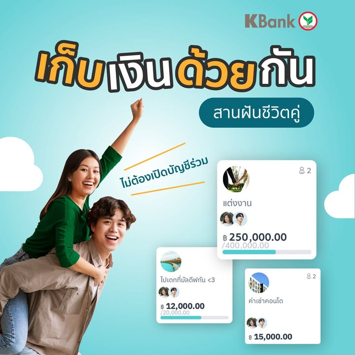

🔹 จำโพสเนเมซิสกล่องสองพันกว่ารอบก่อนได้มะ จะบอกว่าที่ประมูลนั้นคืองบซื้อเกมที่เหลืออยู่ทั้งหมดเมื่อเดือนที่แล้ว ที่รู้เพราะกันงบไว้แล้วมันเหลือเท่านั้นแหละ (จริงๆเหลืออีก 20 บาท)

📌TLDR: โปรดัก Make (เมฆ) นี้ผมทำงานเป็นทีม dev ล่ะ อยากชวนมาใช้ถ้าสมัครแล้วฝากใส่ REF: SR7484 โหน๋ยยยย .... โหลดได้ที่นี้เลยครับ https://makebykbank.kbtg.tech/

📌สมัครเดือนนี้เปิดแอคเค้าไว้โง่ๆไม่ต้องทำไรก็มีลุ้นรับ iPhone ด้วยนะฮะ

🔹 โพสนี้ขายของ 95% ที่ไม่ได้มีใครจ้าง แล้วก็ไม่ได้เกี่ยวกับบอร์ดเกมขนาดนั้น...แต่ผมก็คิดว่าโปรดักมันอาจจะช่วยตอบโจทย์การบริหารเงินให้กับหลายๆคนได้ก็เลยมาช่วยขายหน่อย

🔹 แน่นอนเขียนให้ดูดราม่าไปงั้น แต่เอางบซื้อของเล่น (เดือนก่อนหน้า) ไปซื้อเกมหมดอ่ะเรื่องจริง หยอดประมูลไปงงๆต่ำกว่ามูลค่าที่ควรจะเป็นตั้งเยอะ ทำไมไม่มีคนมาปาดไปฟระ!! กล่องขาดนิดหน่อยจ่ายถูกลงไปสองพัน!! 

🔹กลับมาขายของต่อ คือหนี่งใน pain point ของการบริหารเงินเนี่ยผมเชื่อว่าหลายๆคนก็คงมีหลายบัญชีไว้แบ่งสำหรับค่าใช้จ่ายเรื่องโน้นนี้ต่างๆกันไป หลายคนก็ใส่ไว้ที่เดียวกันแล้วจดๆเอา ซึงทั้งสองวิธีนี้ก็ไม่ได้ยุ่งยากมากแต่ก็อาจจะไม่สะดวกนัก

🔹 และมันจะดีกว่าไหมถ้าแอปบันทึกรายจ่ายมันผูกกับบัญชีเงินจริงๆไปเลย?

🔹โดยของเล่นที่ผมจะมานำเสนอก็คือ Make (เมฆ) by KBank 

🔹มันจะเป็น app ธนาคารที่แยกตัวออกมาจาก K+ อีกที โดยมีเป้าหมายอีกแบบต่างจากตัว mobile banking ตามขนบทั่วไป พอสมัครใช้ไปมันจะสร้างบัญชี e-saving ของ K-Bank มาให้เราอันหนึ่งซึ่งก็เหมือนบัญชีออมทรัพย์ทั่วไปนั้นแหละ

🔹จากนั้นเราก็จะสามารถสร้างหมวดหมู่ซอยกระเป๋าได้เลย โดยจะแยกไว้เก็บเงินเฉยๆ หรือจะตั้งเป้าหมายการเก็บเงินไปเที่ยว ไปซื้อเกมก็ได้ ถ้าตั้งเป้ามันก็จะมีหลอดพลังให้ดูว่าเราทำตามเป้าได้แค่ไหนไรงี้

🔹 จุดเด่นอีกอย่างก็คือสามารถสร้างกระเป๋ากลางเอาไว้ให้เพื่อนๆส่งเงินมากองไว้ทีเดียวกันสำหรับการจัดการบัญชีโครงการง่ายๆ หรือเอาไว้ทวงตังค่าข้าวก็สบาย แบบจะเป็นพ่อแม่โอนตังให้ลูกใช้ก็ได้เหมือนกัน ตรงนี้ก็ท่าให้ประยุกต์ได้หลายแบบ ยิ่งพอเป็นเพื่อนกันใน MAKE นี้รับส่งเงินได้ง่ายปรู๊ดปร๊าดกว่าใช้ mobile banking แน่นอน

🔹ส่วน feature พื้นๆแบบที่คนปกติเค้าใช้กันอย่างจ่ายผ่าน QR Code หรือโอนเงินก็มีตามปกติ เพราะเป้าหมายของแอปตัวนี้คือสำหรับคนที่อยากบริหารเงินสดในบัญชีเดียว แล้วก็กลุ่มที่พึ่งทำงานหรือพึ่งเริ่มเปิดบัญชีเป็นครั้งแรกอะไรแนวๆนั้น 

🔹ถ้าถามว่าเอามาเขียนทำไม คือพอดีผมพึ่งย้ายงานใหม่แล้วก็ได้มาอยู่ทีมทำ Product นี้ครับ ง่ายๆแค่นั้นแหละ แล้วเห็นว่าตัวสินค้ามันก็มีลูกเล่นบางอย่างที่อาจจะเหมาะกับพวกเราในบางมุม

🔹อันนี้ที่ทำงานเค้าไม่ได้ขอให้มาทำนะ บังเอิญว่ามีสตอรี่ที่มันเข้ากับงานที่เราทำก็เลยมาจับมาเล่าให้ฟัง พ่วงถ้ามีคนสมัครใส่รหัสของผม ผมก็จะได้ค่า ref ด้วยนะ (ซึ่งเยอะมากจ้าาาาาา สมัครมาสิบคนผมจะได้พันนึง เยอะกว่านั้นก็ไม่ได้ตังเพิ่มนะ...ยังไม่ได้ค่าอาหารอบเชยเลย)  แต่ถ้า ref เยอะผมจะได้เอาเพจไปโม้ในที่ทำงานได้ถนัดๆหน่อยไรงี้.......... 

🔹 จริงๆก่อนหน้านี้ผมทำแบงค์อื่นมาสองเจ้าละ แต่ว่าก็เป็นโมบายแบงค์กิ้งธรรมดาไม่รู้จะเอาอะไรมาโม้ให้ฟังเพราะใช้แบงค์ไหนมันก็ต้องโหลดอยู่แล้ว พอดีตัวนี้เป็นแนวๆโปรเจคน้องหนูของแบงค์อีกที

โหลดได้ที่นี้เลยครับ https://makebykbank.kbtg.tech/

ส่วนใครใช้อยู่แล้วมี feedback ก็บอกได้นะมีประชุมกันตลอดครับ

#MAKEbyKBank #MAKEreferral #ชวนเพื่อนใช้MAKE

