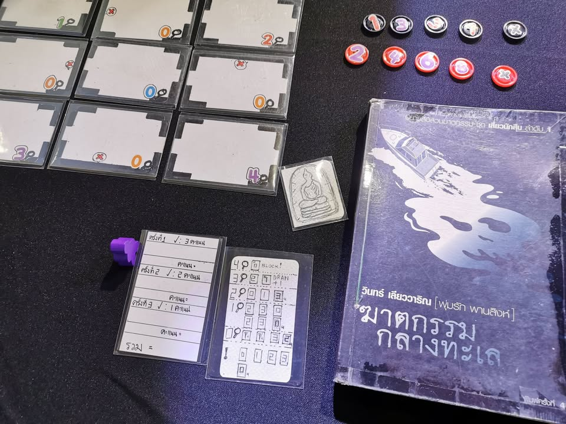

▪️ เมื่อวาน แวะ (โดนหลอก) ให้ไปร่วมงานกิจกรรมบอร์ดเกมจากหนังสือของทาง TK Park มาครับ ก็ได้มีโอกาสลองดูหลายๆเกมเลย แต่ด้วยความที่ผมประมาทไปไม่รู้ว่าแค่ห้าโมงเย็นเค้าก็เก็บโต๊ะกันแล้ว ก็เลยใช้เวลาในแต่ละโต๊ะนานเกินไป ทำให้ได้ลองเกมของผู้เข้าประกวดได้แค่สามเกมเท่านั้นเอง ก็จะมาเล่าเท่าที่ได้ประสบมานะครับ (ขออภัยเรื่องรูปด้วย แสงที่งานบัดซบมาก)

---

▪️ อนึ่งงานเค้าแบ่งผู้ร่วมประกวดเป็นสองกลุ่มคือกลุ่มที่ไม่เคยเข้าประกวดมาก่อน กับกลุ่มที่เคยมีผลงานมาแล้วนะครับ จะเรียกว่ากลุ่ม new face / veteran ก็ได้

▪️ กลุ่มหน้าใหม่ผมได้ลองหนึ่งเกม เป็นเกมที่อิงจากหนังสือเพชรพระอุมา ที่เอามาแต่ชื่อสถานที่แล้วก็ทำเกมเกี่ยวกับตัวละครเดินไปมาในแผนที่พร้อมกับหาทางทำเป้าหมายลับของตัวเองให้สำเร็จ ว่ากันโดยระบบก็คือทอย เดิน เปิดevent วนๆกันไป ในแง่หนึ่งก็อารมณ์เหมือนเกมกระดาษ (เด็กยุคนี้รู้จักเกมกระดาษไหมว่ะ?)

▪️ ถ้าว่ากันโดยเชิงเกมเนื่องจากคุยๆมาวัตถุดิบก่อนหน้าคือแนวๆ monopoly, werewolf ผมก็เลยคิดว่าเห้ย! เคยลองมาเท่านี้ปั้นไอเดียมาต่อได้เท่าที่เห็นก็ค่อนข้างน่าประทับใจทีเดียว แต่ก็แน่นอนว่ามันยังขาดระบบกับเหตุผลรองรับการเล่นหลายอย่าง ถ้าค่อยๆได้รับคำแนะนำเรื่องเทคนิคการออกแบบกับได้เล่นเกมอื่นๆจนมีวัตถุดิบเยอะกว่านี้ก็น่าจะปั้นอะไรออกมาได้น่าสนใจได้มากกว่านี้อีกครับ งานออกแบบเกมที่ดีคืองานออกแบบที่มีชิ้นงานออกมาให้ทดลองแล้วปรับปรุงต่อ

---

▪️ ส่วนงานของฝั่ง seasoned designer เนี่ยลองไปแค่สองเกมแต่ว่า "โคตรประทับใจ" เท่าที่ฟังงานของคนที่เหลือก็ยิ่งเสียดายว่าอดลองให้ครบเพราะน่าสนใจทุกอัน

▪️ ต้องบอกไว้ก่อนว่าทั้งสองงานนั้นโดยสไตล์เกมแล้วไม่ตรงจริตส่วนตัวของผมอย่างรุนแรงคืออันหนึ่งเป็นแนว solo/co-op programing อีกอันเป็นแนว deduction แต่ว่าผมสัมผัสได้เลยว่าดีทั้งคู่

▪️ เกมแรกเอามาจากหนังสือ Bicentennial man ที่ผมเองเคยอ่านมาแล้วหลายรอบ เล่าถึงหุ่นยนต์ที่เกิดความนึกคิดแบบมนุษย์ขี้นมาจึงมีความใฝ่ฝันที่จะได้เติบโตและตายลงอย่างมนุษย์ ซึ่งการตายของเค้านั้นต้องไม่ใช่เพียงแต่ในพฤตินัย  แต่ยังต้องเป็นในทางนิตินัยด้วย เค้าจึงต่อสู้ทางกฎหมายเพื่อให้ได้การรับรองว่าเค้าคือมนุษย์คนหนี่งเหมือนกัน

▪️ เกมนี้เอาแค่ตอนเล่ากติกานี้ผมก็ sold ล่ะ ดึงเอาหนังสือมาเล่าผ่านกลไกการเล่นง่ายๆได้น่าประทับใจ คือเราจะค่อยๆ programing ทางเดินของหุ่นตัวเอกไปตามจุดพักในแต่ละฉาก โดยที่ทุกครั้งที่ไปถีงเราจะได้รับร่างกายของมนุษย์มาพร้อมกับข้อเสียทางกายภาพของคนที่ทำให้เกมค่อยๆยากขึ้น

▪️ ระบบดีเข้าใจง่ายและท้าทาย แค่จั่วการ์ดโปรแกรมการเดินทางมาพร้อมกับค่อยๆเดินไป แต่ว่าการ์ดมันสุ่มและในแต่ละครั้งจะเดินได้ไม่เท่ากัน ฉากเองก็มีการสุ่มทำให้สามารถเล่นซ้ำได้เรื่อยๆ เป็นเกมพร้อมขายแล้วนะในมุมของผม

---

▪️ อีกเกมเล่นไม่จบแต่ขอไปร่วมเล่นรอบหนึ่ง เป็นเกมแนวสืบสวนจากนิยายของวินทร์ เลียววาริณ  ไอเดียคือการสืบคดีที่มีตัวเลขลับซ่อนอยู่สี่ตัว เราจะมาสืบหาตัวเลขผ่านการ์ดตัวเลขที่อยู่ในมือตัวเองกับตัดตัวเลือกความเป็นไปได้จากหลังการ์ดในกลุ่มเดียวกัน 

▪️ กลไกอธิบายยากนิดหน่อยแต่ถ้าเข้าใจแล้วก็ค่อนข้างตรงไปตรงมาพร้อมกับมีการบริหารความเสี่ยงที่ดี เกมค่อนข้าง complex และ complete ละ แต่สำหรับคนที่ไม่ใช่สายนี้แบบผมมันค่อนข้างมี learning curve ที่ชันเอาเรื่องอยู่ เล่นแบบโง่ๆไปนิดนึงคือเหงาไปเลย ซึ่งตรงนี้ก็ไม่ใช่ข้อเสียอะไรแต่ก็แอบคิดว่ามันน่าจะมี hint โดยระบบที่ไม่ทำให้คนเล่นมูฟโง่ๆอยู่เหมือนกัน เป็นเกมที่เห็นคนที่เค้าใจว่าเกมมันเล่นยังไงแล้ววืบว๊าบเล่นให้ดูแล้วอ๋อมันอย่างนี้นี่เอง

▪️ อย่างที่บอกคือเกมมันค่อนข้าง complex เพราะมี layer รองซ้อนมาหลายจุดซึ่งทำให้เกมสนุกและมีชั้นเชิงในการคิดมากขี้น แต่เล่นครั้งแรกจะเอ๋อๆหน่อย (โอเค....อาจจะเป็นที่ผมคนเดียว) แต่ดูแล้วรู้เลยว่าถ้าชอบนี้แม่งสนุกแน่ เรียกว่าใครชอบเกมอย่าง Alchemist ไรงี้น่าจะชอบกัน ถ้ามี comment ส่วนตัวมากๆก็คงอยากให้แยกเป็น level ชัดๆแล้วเอาคอร์เกมเป็นเกมหาเลขแยกออกมาสอนก่อน พอโปรแล้วค่อยเอาเลเยอร์อื่นๆมาเป็นโมดูลใส่ตามหลังมากกว่า คือฟังตอนแรกแรมผมไม่พอจริงๆ

---

ตัวกิจกรรมยังไม่จบนะครับสามารถแวะไปลองเล่นได้ที่ TK Park ครับ เกมที่เหลือของท่านอื่นๆก็น่าเสียดายมากที่ยังไม่ได้เล่น แต่ฝั่ง seasoned นี้งานที่เล่นมาตราฐานสูงมาก เท่าที่ฟังส่วนที่เหลือก็เจ๋งเหมือนกัน อาจจะรอไฟล์ PnP ออกมาก่อนค่อยไปลองเล่นดู

