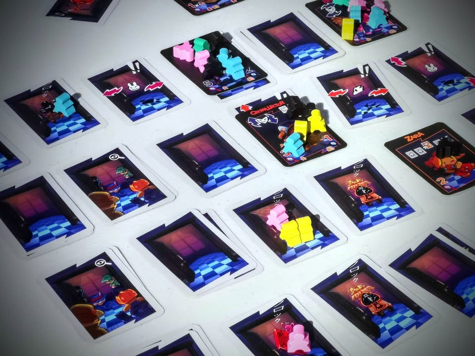

▪️ วันก่อนได้ไปลองเล่น Meeple Detective เกมแนวตัดตัวเลือกแบบเบาๆ ของนักออกแบบชาวไทย Nutthapol Oripipath ก็พบว่าน่าสนใจดีครับ #bite_size

▪️ ไอเดียของเกมคือเราจะมีการ์ดที่แทนถึงห้องวางเรียงเป็นตาราง ในตาหนึ่งๆผู้เล่นจะพลัดกันหงายการ์ดห้องหนึ่งใบไปพร้อมๆกับแอบดูห้องข้างๆได้อีกหนึ่งใบ เป้าหมายของเกมคือเราจะต้องหาห้องเป้าหมายซี่งมีเงื่อนไขแตกต่างกันไปให้ได้มากกว่าคนอื่น โดยห้องที่เราจะต้องหาก็อย่างเช่น ห้องที่เป็นจุดตัดของการ์ดเบาะแสสองใบ หรือห้องที่ชุดสัญลักษณ์ไม่ครบคู่

▪️ เกมจะให้โอกาสเราส่งนักสืบไปวางตามการ์ดห้อง 4 ครั้ง ความน่าสนใจคือในเงื่อนไขง่ายๆนี้ เราดันดูห้องได้ไม่หมดครับ เรียกว่าไม่ถีงหนึ่งในสาม ดังนั้นนอกจากการหาข้อมูลแล้วเรายังต้องดูคนอื่นด้วยว่าเค้าดูการ์ดใบไหนไปแล้วบ้าง และเค้าเลือกวางห้องใบไหน แล้วเราอยากจะวางตามเค้าไหม

▪️ ไอ้การวางตามโดยข้อมูลไม่ครบนี้แหละมันเลยสนุกปนลุ้นหน่อยๆว่ามันจะหลอกเราไหม เพราะว่าถ้าหลอกให้คนมาเลือกห้องตามเราได้ละก็คนหลอกจะได้แต้มเพิ่มด้วยนะ ตรงนี้เลยทำให้เกมมันไม่แห้งแต่ต้องสังเกตผู้เล่นอื่นตลอดว่าเห็นการ์ดไหนแล้วมันทำอะไรต่อ

▪️ จุดที่คิดว่าทำได้น่าสนใจอีกอันคือการ์ดความสามารถพิเศษที่ผู้เล่นจะสามารถแหกกฏเกมได้ อย่างตัวที่ผมเล่นก็สลับห้องได้ครั้งหนึ่ง หรือบางคนก็วางได้สองทีติดพร้อมกับล็อกไม่ให้คนอื่นวางตามงี้ ก็ช่วยเพิ่มสีสันได้ดี

▪️ โดยรวมผมไม่มีข้อติอะไรนะ ค่อนข้างประทับใจในความพยายามจะใส่ความดิ้นและสีสันลงไปในเกมที่เหมือนจะเรียบๆแค่ดูการ์ดบางส่วนแล้วเดาสิ่งที่ต้องหาจากข้อมูลจำกัด โดยใส่เลเยอร์ที่ค่อนข้างธรรมชาติไม่รู้สึกว่าฝืนอะไร ถึงจะเป็นเกมที่ไม่ใช่แนวผมนักแต่ก็เล่นได้สนุกเพลินๆดี

▪️ ถ้าใครมองหาเกมที่เน้นการใช้ตรรกะและการเติมเต็มข้อมูลที่ไม่ซับซ้อนหัวระเบิดแต่ก็ไม่ใช่เดามั่วให้มันจบๆไป เกมนี้ก็เป็นตัวเลือกที่น่าสนใจครับ 

▪️ เกมกำลังเปิดพรีออร์เดอร์อยู่ (เข้าใจว่าใกล้ส่งละ) สนใจก็สามารถติดต่อไปทางเพจ Meeple Geek ได้โดยตรง

---
▪️ เกลียดแสงที่งานฉิบหาย ไม่ชอบถ่ายรูปโต๊ะพื้นขาวด้วยอ่ะ ไม่สวยเลย -_-
---
📌 disclaimer - ไม่ได้รับการสนับสนุนใดๆจากทางค่าย/นักออกแบบ เป็นการเล่นแล้วเอามาเขียนเล่าตามปกติ
---
หมวด Bite Size (พอดีคำ) นี้กะว่าจะเขียนอะไรสั้นๆประมาณนี้ล่ะกัน ใหม่บ้าง ซ้ำบ้าง เกมที่ขี้เกียจเขียนบ้าง เขียนๆไว้ก่อนเผื่อมีอารมณ์อาจจะขยายไปลง Thought บ้าง จริงๆอยากเขียนสั้นกว่านี้ แต่ยังอดไม่ได้ที่จะต้องอธิบายอะไรเพิ่มตามนิสัย เดี๋ยวค่อยๆปรับไปล่ะกัน

