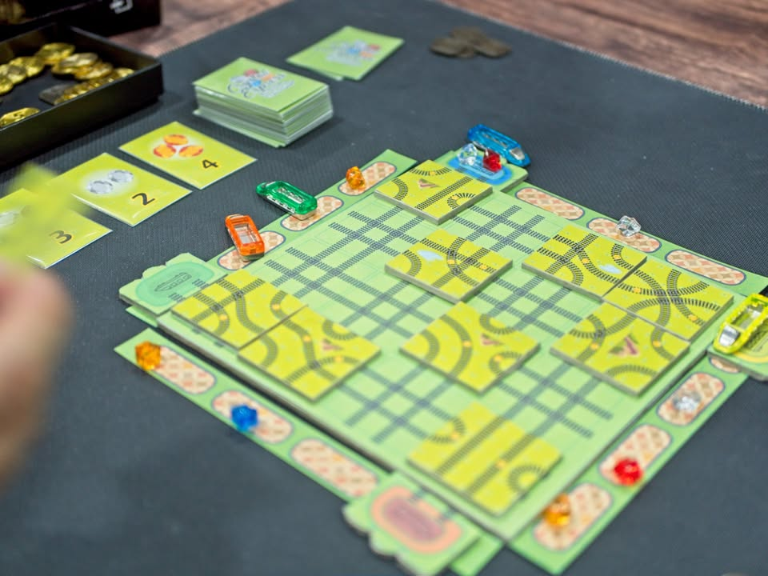

▪️ วันก่อนมีโอกาสได้ทดสอบเกมที่กำลังออกแบบของคุณ Benz Preeda ก็เลยจะเอามาเล่าให้ฟังครับ แต่ทั้งนี้อย่าลืมว่าทุกอย่างเป็นตัวระหว่างการพัฒนาที่สามารถเปลี่ยนแปลงทุกอย่างได้ตลอดเวลานะครับ 

🔹 เกมแรกเป็นเกมเกี่ยวโชคชะตาของจักรราศีต่างๆที่เราจะต้องดำเนินชีวิตใต้โชคชะตาไปทำตามความฝันอันยิ่งใหญ่ ที่ถ้าพูดในเชิงกลไกแล้วเราก็จะเดินตัวหมากของเราไปตามแผนที่แล้วก็เก็บ resource ธาตุไปแลกไปแลกมาตามบอร์ด แล้วแปลงเป็นความรู้ ความมั่นใจ ความเห็นอกเห็นใจ ที่จะเพิ่ม stat ในการเล่นให้กับเรา เพื่อไปเคลมเป้าหมายชีวิตอีกที (ไปชนะโอลิมปิค, แต่งงาน, ซื้อบ้านไรงี้) 

▪️ ถ้าพูดให้เข้าใจง่ายสุดน่าจะเป็นเกมที่ให้อารมณ์เดินไปมาแบบ Istanbul  แต่ไม่ได้ต้องมาหยอดลูกน้องน่ะ

▪️ จุดเด่นที่น่าสนใจของเกมนี้คือเราอยากจะเดินไปลงที่เดียวกับเพื่อนบ่อยๆ เพราะว่าผู้เล่นทุกคนจะมีทักษะบางอย่างที่ถ้ามาลงช่องเดียวกันจะสามารถจ่ายทรัพยากรเพื่อแลกเปลี่ยนของได้ด้วย ฟังดูเหมือนไม่มีอะไรแต่มันช่วยเพิ่มน้ำหนักในการเลือกเส้นทางเดินได้น่าสนใจมากขึ้นเยอะเลย ยิ่งเพื่อนมายืนซ้อนกันเยอะๆแต่ไม่มีของจ่ายนี้ยิ่งปวดใจ

▪️ เกมมีฐานความคิดที่ค่อนข้างอยู่ตัวแล้วก็จริง แต่ปัญหาที่รู้สึกคือแต่ระบบที่ขับเคลื่อนเกมยังฟุ้งๆรอการเกลาอยู่ จุดที่คิดว่าไม่ชอบนักคือเกมมีระยะเวลาการเล่นที่ไม่สัมพันธ์กับ weight คือเกมประมาณ 2.7-2.9 แต่เล่นนานถึงสามชั่วโมง ซึ่งตอนเล่นมันเป็นสามชั่วโมงที่เพลินนะ แต่ถ้าบอกว่าจะชวนเล่นทีหลังแล้วบอกว่าใช้เวลาเท่านี้น่าจะไม่ได้กางอีก เพราะคู่แข่งกลุ่มสามชั่วโมงของผมมันแกร่งมัก

▪️ แต่ในเชิงระบบออกมาดีละถ้าหาจังหวะจัดจบตอนกำลังพีคแล้วมีคนบ่นว่าถ้ามีอีกตานะ!ในช่วง 60-90 นาที นี้คือดีเลย กับเกมมันไม่มี sense of progress เลยเหมือนนั่งเล่นวนๆไปเรื่อยๆมากเกินไปคือสามชั่วโมงเหมือนเล่นเกมเดิม 3 รอบมากกว่า  กับธีมที่ไม่ได้รู้สึกขับเคลื่อนการเล่นอะไร 

🔹ต่อมาเป็นเกมสั้นๆ (ไม่มีรูป) ที่ไอเดียเหมือนเล่น Tic Tac Toe แต่ว่าเล่นในแบบสามมิติ แกนไอเดียดีมากเลยก็จั่วๆวางๆคิวป์สีสร้างเส้นตรงในทุกระนาบมีกิมมิคเรื่องการบล็อกเส้นทางและสีไวล์การ์ด แต่เล่นจริงยังต้องหาไอเดียที่จะใส่ระบบเล็กๆเพื่อให้เกมมันไม่แบนราบอยู่

🔹 ถัดมาเป็นเกมรถไฟที่ผมเข้าใจว่าถูกส่งไปประกวดยูเรก้าด้วย ไอเดียคือเราจะต้องควบคุมรถไฟให้วิ่งตามรางไปเก็บเพชรให้ครบชุดเพื่อไปแลกของ โดยสิ่งที่น่าสนใจคือเราจะมีการวางไทล์เพื่อเปลี่ยนเส้นทางของรางพร้อมๆกับมีการ์ดแกล้งเพื่อนมากมายให้ใช้กัน ไปขโมยของเพื่อนก็ได้ เป็นเกมที่มีความเป็น take that ประมาณหนึ่ง ความตลกเลยอยู่ที่วางขัดกันเองมากกว่าจะไปวิ่งเก็บของ (ฮา)

▪️ โดยรวมค่อนข้างน่าประทับใจ เป็นความสนุกระดับทำขาย แต่เกมมันยังนานไปนิดกับวุ่นวายเรื่องการมองเส้นไปหน่อย แต่ทรงเกมนี้มาดีล่ะ 

🔹 เกมสุดท้ายเป็นแนว abstract ที่เราจะต้องมาวางเรียงสัญลักษณ์ให้เป็น pattern ที่จะทำให้เราชนะ หลักก็คือการเลื่อนอันใหม่เข้าแล้วผลักอันเก่าให้เราไปวนเล่นต่อ โดยที่ไทล์หนึ่งๆนั้นมีสองหน้า ซึ่งต้นเกมมันจะ fixed มาแล้วว่าเราต้องชนะท่าไหน เราก็ต้องมองดูว่าเพื่อนจะชนะได้ยังไง เราต้องการจะผลักอันไหนออกมาให้วนกลับมาจัดท่าให้เราชนะไรงี้

