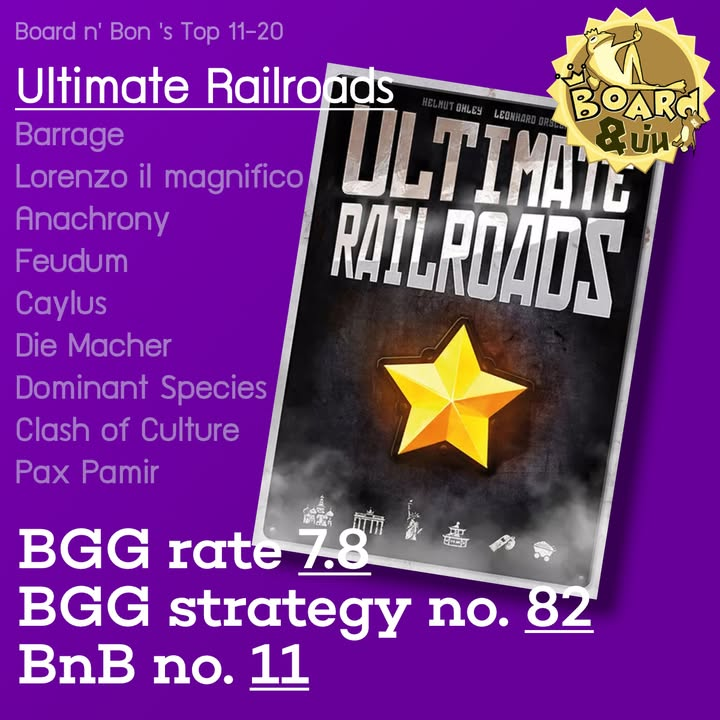
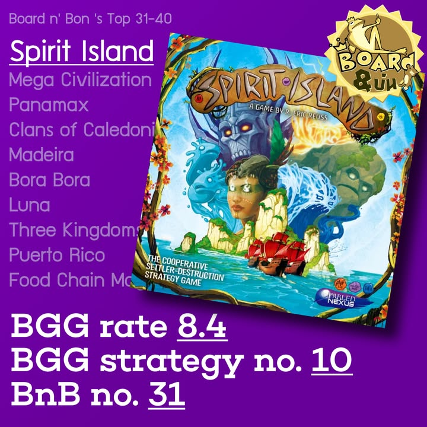
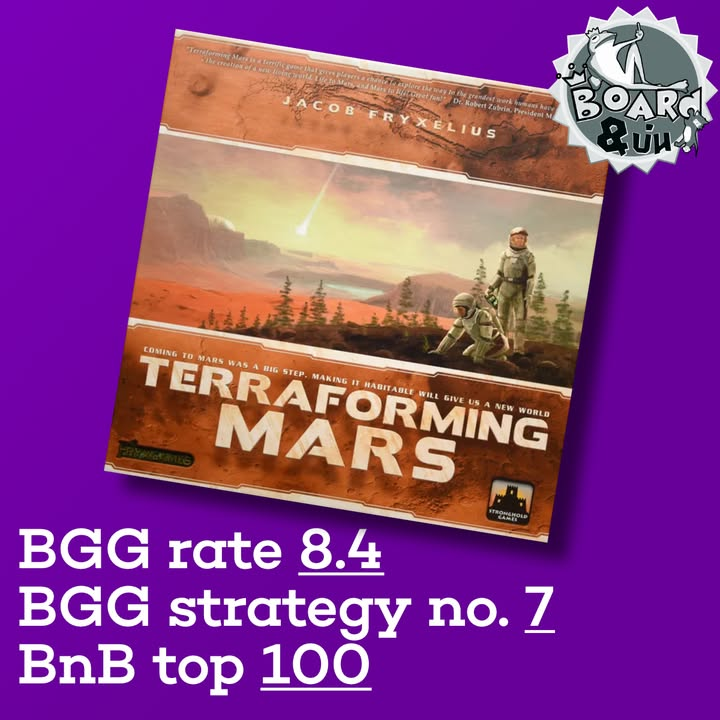
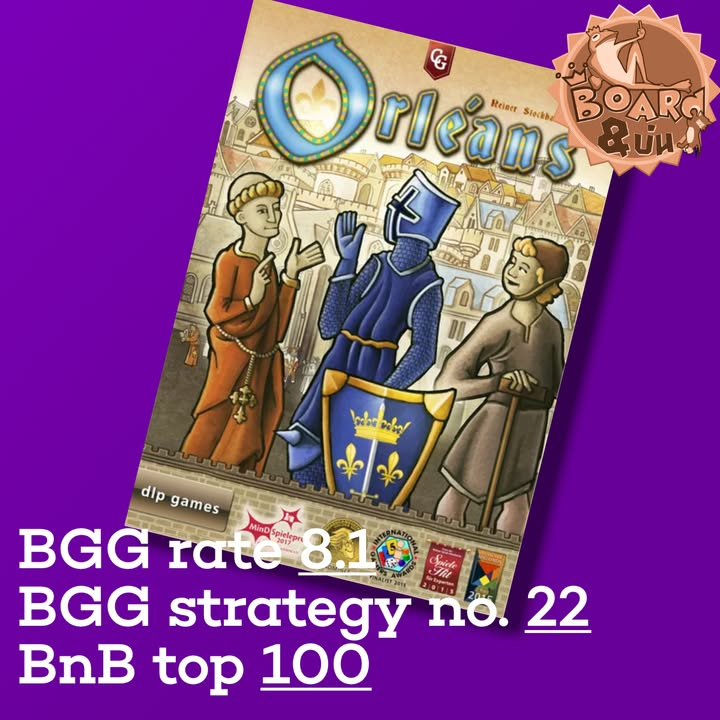
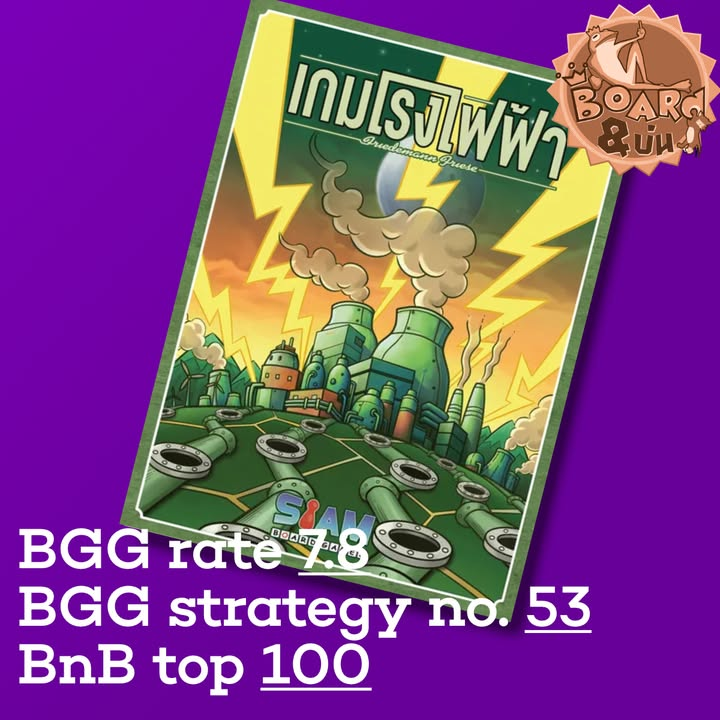

▪️ ช่วงสองสามปีนี้ผมคิดว่าเป็นช่วงเวลาที่น่าตื่นเต้นของคนที่ชอบเล่นเกมที่มีความซับซ้อนระดับกลางขึ้นไปเป็นอย่างมาก เพราะบรรดาค่ายไทยต่างก็ทยอยนำเสนอเกมแปลไทยในกลุ่มนี้ออกมาเรื่อยๆ โดยเฉพาะผมเองที่ถ้านับแล้วตอนนี้มีเกมระดับกบโปรด Top 50 อยู่ถึง 5 เกม

▪️ ก็เลยว่าจะขอยกเกมยูโรระดับกลางหนักสำหรับสายคิดคำนวนที่ได้รับ localized ในไทยที่ผมมีประสบการณ์มา recap บางส่วนกันนิดนึง

• บางเกมที่ไม่มี ก็แค่รู้สึกไม่ตรงหมวดที่เขียนเฉยๆนะ ไม่ก็ลืมแหละ ไม่มีอะไรซับซ้อน (Mansion of Madness, Dead of Winter, Wingspan, Everdell, Kemet ไรงี้)  คือจริงๆตั้งใจเขียนเกมที่อยู่ใน Top 50 ผมเฉยๆอันอื่นตัวแถม

▪️ เกมแรกที่อยากจะพูดถึงเลยก็คงเป็น Power Grid ที่นับได้ว่าเป็นเกมแรกๆในไทยเลยที่เริ่มทำการ 'ปลดล็อก' เกมยูโรระดับกลางให้เข้ามาสู่ตลาด และตัว Power Grid เองก็เป็นยูโรระดับคลาสสิกที่เล่นง่ายเข้าถึงง่ายโดยที่ยังต้องใช้ทักษะอยู่อย่างเต็มเปี่ยม

▪️ ข้ามมาอีกทีก็ Terraforming Mars เพราะมันก็ถือเป็นการแปลในระดับการ์ดทุกใบของกลุ่มยูโรกลางหนักที่ช่วยตอกย้ำว่าตลาดนี้มันมีคนเล่นอยู่มากเพียงพอ และ Spirit Island เกมที่ผมคิดว่าเป็นเกม Co-Op ที่ยอดเยี่ยมไม่กี่เกมที่ผมยอมเล่นก็มากับเค้าด้วย คือจะหาเพื่อนเล่นได้ง่ายขึ้นอีกมาก

▪️ ในฝั่งของ Brass หนึ่งใน Board N Bon's Trinity เนี่ยความเจ๋งขั้นสุดคือการเอาเกมเข้ามาในช่วงที่พูดได้ว่าตลาดคนเล่นเกมส่วนใหญ่ -มีกันหมดแล้ว- แต่ก็ยังสามารถเอามาขายและเปิดตลาดจนขายหมดได้ ตรงนี้ทำให้ผมตื่นเต้นมากๆที่รู้ว่าคนเล่นเกมระดับกลางหนักมันมีเยอะขี้นเรื่อยๆจริงๆ การตามมาของ Ultimate Railroads ก็เป็นที่น่าชื่นใจว่าเกมแนวที่ผมโปรดปรานมันจะต้องมาอีกเรื่อยๆแน่นอน

▪️ ในช่วงที่ตลาดเกมแปลไทยกำลังคึกคักอีกเจ้าที่ทำให้ผมตื่นเต้นได้อีกก็คือ Root เกมสงครามที่ผ่านการเคลือบน้ำตาลมาหนาปึก และแน่นอนว่าเกมสุดยอดในดวงใจของผม อีกหนึ่ง Board N Bon's Trinity ที่ไม่เคยคิดฝันว่าจะมีค่ายยอมแปลอย่าง Agricola นั้นเอง คือดีใจจริงๆที่เห็นเกมกลุ่มแปลยันการ์ดทุกใบเพิ่มขี้นเรื่อยๆ

▪️ ตามด้วย หนึ่งเกมเบอร์ต้นๆของฝั่งคนเล่นเกมหนักที่เน้นความช่ำชองอย่าง Terry Mystica ที่แบบเห้ย กลุ่มนี้จัดได้ว่าเกมหนักขั้นปลายแล้วก็ยังมีการนำเข้ามา คือดูแล้วพร้อมที่จะนำไปสู่เกมหนักระดับนี้ได้อีกหลายเกม ในขณะเดียวกัน Orleans เกมสาย bag building ชื่อดังที่ให้เรามาสาละวนสร้างถุงจั่วเพื่อขับเคลื่อนการเล่นของเราไปข้างหน้า

▪️ ในกลุ่มหน้าใหม่เราก็เริ่มเห็นค่ายที่เอาเกมนอกกระแสเกมเทพฐานแน่นมาเปิดตลาดด้วยเช่นกัน โดยเกมอย่าง Praga Caput Regni  ทีแม้จะเป็นเกมใหม่แต่ก็มาจากนักออกแบบชื่อดังที่มีฐานแฟนคลับหนาแน่น ระบบกงล้อเลือกแอคชั่นก็ทำออกมาได้อย่างน่าสนใจ

▪️ และอีกเกมที่ลืมไม่ได้ก็คือเกมหนักระดับเข้มข้น weight 4+ อย่าง Kanban ที่ค่ายอาจหาญมากนำเกมหนักระดับนี้ออกมาให้เหล่าสายร้อนแรงได้เล่นนำมาเล่นกัน พร้อมกับแผนที่จะเอาเกมเข้มข้นระดับนี้มาเจาะตลาดอีกเรื่อยๆ

▪️ จริงๆมีหลายเกมมากที่ไม่ได้กล่าวถึง เน้นยกมาแต่ที่ผมสนใจ ในฐานะคนที่เล่นบอร์ดเกมมาตั้งแต่สมัยที่ยังไม่เห็นทางเลยว่าเกมกระดานในไทยมันจะบูมได้ยังไง มาตอนนี้ก็ขอขอบคุณทุกค่ายในไทยจริงๆครับที่ลงมือลงแรงในธุรกิจนี้ให้มีคนสนใจงานอดิเรกที่ผมรักมากขี้น (รวมถึงที่เอาเกมอื่นๆทุกระดับเข้ามาด้วยนะ)

▪️ จริงๆฝั่งอเมริเทรชนี้อยากให้แปล Unfathomable มากๆเลยเพราะ BSG สุดยอดเกมคนทรยศหาไม่ได้ล่ะ

