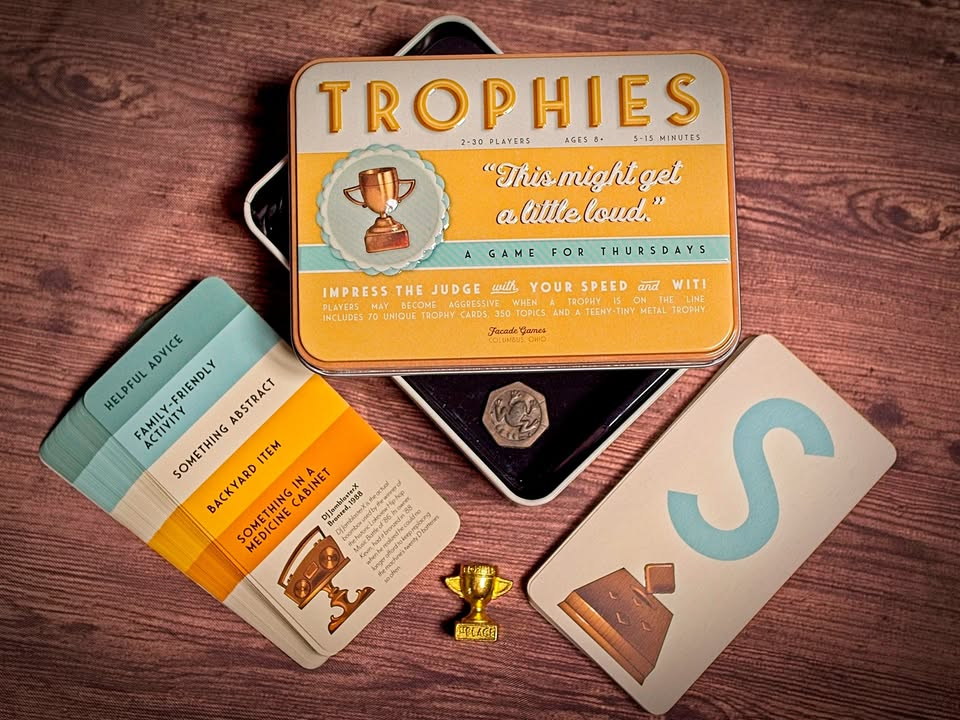
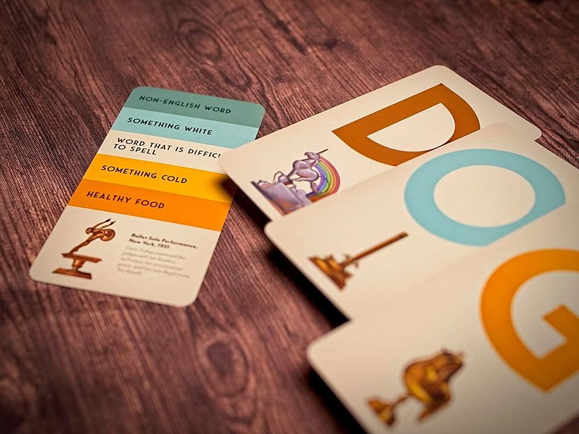

Trophies #bite_size 

▪️ เกมปาร์ตี้ง่ายๆที่อุปกรณ์มีแค่การ์ดหนึ่งกองและกติกาที่อธิบายในหนึ่งประโยคนั้นคือ "หาคำที่ตรงกับหมวดที่เลือกมา โดยต้องขึ้นต้นด้วยคำที่กำหนดไว้" ใครตอบได้ก่อนก็เอาไปหนึ่งแต้ม

▪️ คือการ์ดหนึ่งใบด้านหลังจะมีหมวดคำถามลิสรอไว้อยู่แล้ว 5 แบบ เราก็แค่อ่านคำถามแล้วก็หงายมาดูว่ามันต้องใช้ตัวอักษรอะไร ที่เหลือก็เป็นเรื่องของความไว CPU ในหัว......

▪️ เหมือนจะไม่มีอะไรก็แค่เกมนึกคำธรรมดา (ซึ่งมันก็แค่นั้นแหละ) แต่ตอนเล่นจริงประทับใจมาก จะเล่นวงเล็ก 5 คนหรือกิจกรรม 30 คนบวกก็ยังสนุกเพราะเกมมันคลีนมากใครก็ร่วมเล่นได้ เป็นกิจกรรมสันทนาการที่เหนือความคาดหมายไปเยอะอยู่

▪️ ข้อเสียก็คือด้วยความที่การ์ดมันมีเท่านี้เล่นซักพักก็จะซ้ำๆหน่อยแต่ด้วยหมวดที่มีกับนานๆเล่นทีเรื่องนี้ก็ไม่น่าใช่ประเด็นอะไรนะ 

▪️ เกมนี้เส้นทางมาถึงผมนี้แปลกหน่อยคือจริงๆเกมนี้เป็นเกมที่ non-gamer ซื้อมาฝากเพื่อนผมอีกที แต่เอามาเล่นแม่ง blast เฉย ก็เลยเอาไปเล่นต่อที่ทริปของ office ซึ่งผลตอบรับก็ดีนะ

--------------------------------
📌 disclosure: non-sponsored content 
--------------------------------
▪ หมวด Bite Size (พอดีคำ) นี้กะว่าจะเขียนอะไรสั้นๆประมาณนี้ล่ะกัน ใหม่บ้าง ซ้ำบ้าง เกมที่ขี้เกียจเขียนบ้าง เขียนๆไว้ก่อนเผื่อมีอารมณ์อาจจะขยายไปลง Thought บ้าง จริงๆอยากเขียนสั้นกว่านี้ แต่ยังอดไม่ได้ที่จะต้องอธิบายอะไรเพิ่มตามนิสัย เดี๋ยวค่อยๆปรับไปล่ะกัน

