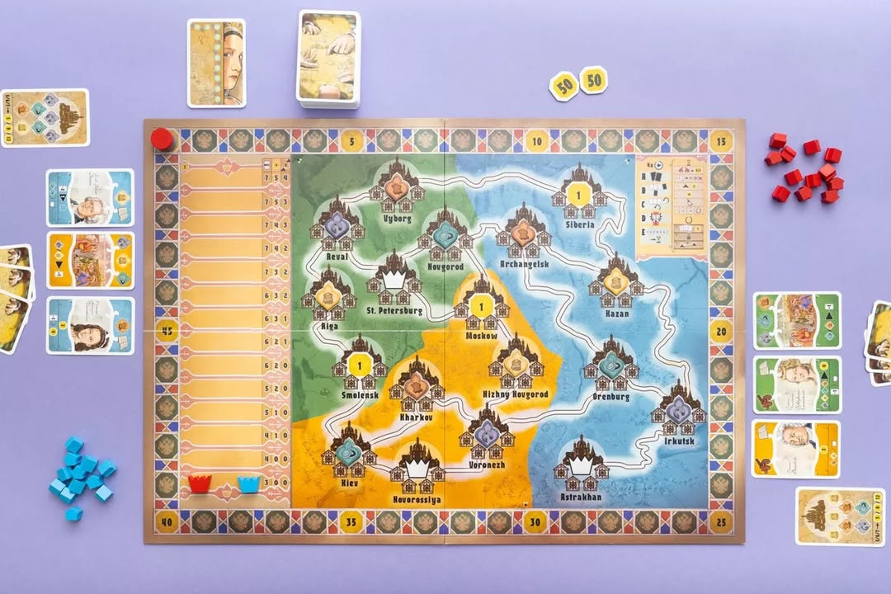
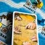
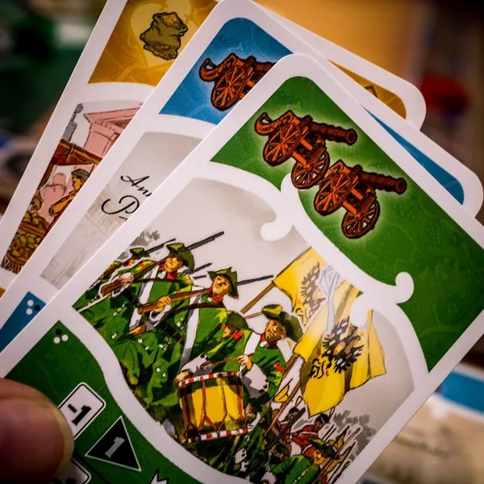

มันก็แค่เกมจะเอาอะไรกับมันนัก? โดยทั่วไปแล้วก็ถือว่าไม่ใช่เรื่องใหญ่แต่มันอาจจะกลายเป็นเรื่องดราม่าได้ถ้าเกมมันออกมาในจังหวะไม่ดี อยากเช่นเกมเกี่ยวกับการรุกรานประเทศในช่วงที่สงครามกำลังเกิดขึ้นจริงๆ

.
Catherine: The Cities of the Tsarina เกมที่พึ่งออกในปี 2022 กำลังโดนถล่มอย่างหนักจากชาวยูเครน เพราะสิ่งที่ผู้นำของรัสเซียเมื่อหลายร้อยปีก่อนอย่าง Catherine นั้นแสนสาหัสนัก ทั้งการรุกรานฆ่าล้างเผ่าพันธ์ เผาทำลายเมือง ทำลายภาษาของชาวยูเครน ฯลฯ

.
โดยบริบทปกติมันก็อาจจะเป็นแค่ประวัติศาสตร์หน้าหนึ่งที่เกิดขึ้นจริง แต่การฉายซ้ำในช่วงเวลาแห่งการรุกรานนั้นทำให้เกิดเสียงต่อต้านอย่างรุนแรงเกิดขึ้นตามมา

.
และน้ำมันอีกชุดที่ราดเข้ากองไฟก็คือตัวสะกดชื่อเมืองในเกมนี้ยึดตามภาษารัสเซียทั้งหมด ไม่ได้เขียนตามแบบยูเครน มันก็เลยประหนึ่งเหมือนกับว่า ค่ายนั้น 'สนับสนุนการรุกราน' และเห็นว่ายูเครนนั้นเป็นของรัสเซียมาแต่เดิมนั้นเอง

.
ส่วนตัวผมคิดว่าค่ายคงไม่ได้คิดลึกอะไรขนาดนั้น เกมมันทำมาแล้วก็เอามาขาย ตัวเกมเองก็ยูโรทั่วไปไม่ได้ฉายภาพรุนแรงแบบเกมสงคร๊ามสงคราม ก็วางตึกยึดพื้นที่ทั่วไป (แต่ถ้าคนจะหาเรื่องด่าก็จะโดนเรื่องการทำให้เรื่องโหดร้ายถูกลดทอนลงไปอยู่ดี) แต่ไม่ว่าอย่างไรก็ตามผลกระทบก็เกิดขี้นแล้ว 

.
จริงๆมีอีกมุมว่า การรุกรานโดยรัสเซียนั้นเริ่มมาตั้งแต่ปี 2014 โน้นแล้วตั้งการตอนบุกเข้ามายึดไครเมียไปจากยูเครน ทางค่ายก็ควรจะคิดซักหน่อยแล้วไหมนะ?

.
ขณะเดียวกันเรื่องพวกนี้ก็อาจจะเป็นแค่หนึ่งในวิธีการระบายความคับข้องใจของเหล่าคนที่ตกอยู่ในภาวะสงครามนั้นเอง 

.
ในโลกยุคนี้เกมแนวประวัติศาสตร์นี้ต้องระมัดระวังตัวมากขึ้นเยอะจริงๆ

.
📌 มีการสรุปข้อมูลจากกระทู้ใน bgg - https://boardgamegeek.com/thread/2918074/offensive-content

📌 รูปประกอบจาก bgg user: Cookie Monster

