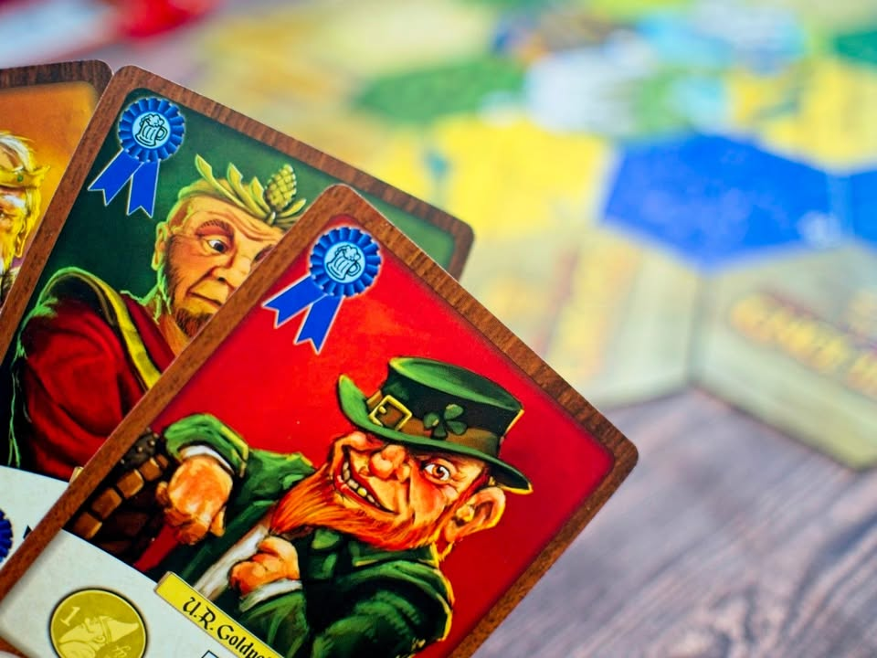
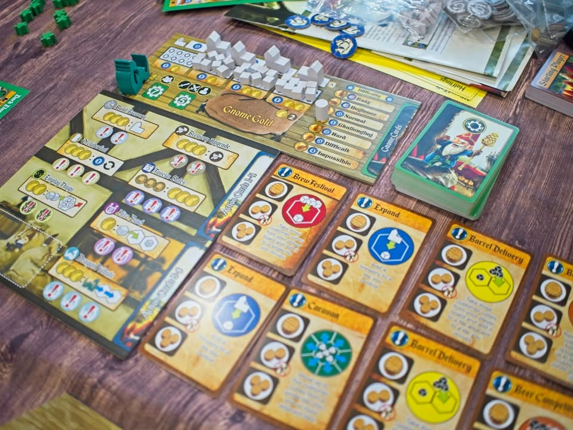

Rise of The Gnomes #thought #first_impression 

ในโลกแฟนตาซีที่ทุกเผ่าพันธุ์ล้วนดื่มด่ำกับเบียร์เลิสรสอยู่ทุกเมื่อเชื่อวัน ทว่าวันหนึ่งเหล่าโนมผู้เป็นแรงงานหลักในการผลิตเบียร์นั้นหาได้ทนกับค่าแรงอันต่ำเตี้ยไม่ไหว จึงลุกขึ้นมาปฎิวัติ! 

.
แต่ว่าคุณไม่ได้เล่นเป็นโนมพวกนี้หรอกนะ เราจะเล่นเป็นบรรดาเผ่าพันธุ์แฟนตาซีที่พอไร้แรงงานของเหล่าโนมแล้วก็ต้องมาทำเบียร์แข่งกันแทน ผลงานของ Daniel A. George (I) 

.
ไอเดียมันคือเป็นเกม area control ทั่วไปนั้นแหละส่งคิวป์ที่จริงๆแล้วไม่ใช่คนงานของเรา แต่เป็นลูกค้าที่ชอบซื้อเบียร์เราไปวางกองๆแล้วสร้างบ้าน... เออโรงเบียร์ จบ. 

.
กลไกที่จะใช้เดินเกมคือ worker placement ที่เราจะต้องมาวางแย่งช่องแอคชั่นบนกระดานกลาง โดยจะมีทั้งช่องแบบให้ผลทันทีกับแบบต้องรอ resolve แบบ programming หลังทุกคนผ่านหมด แอคชั่นหลักๆก็มีแค่เพิ่มตัวกับสร้างโรงเบียร์นั้นแหละ

.
ความน่าสนใจในเชิงการทำแต้มคือในเกมนี้จะไม่ได้มีแต้มจากการไปยึดพื้นที่หรือหาทำเลทำแต้มอะไรเลย การส่งคิวป์ไปยืนนั้นมีหน้าที่หลักอยู่อย่างเดียวคือพอได้เป็น majority เราจะได้สร้างโรงเบียร์ในพื้นที่นั้น และการทำแต้มในเกมจะมาจากการที่เราได้ปลดโรงเบียร์กับคิวป์จากบอร์ดของเราออกไปให้เยอะๆ และด้วยเหตุนี้แต้มในเกมมันก็จะค่อนข้างขยับได้บางๆช้าๆ

.
ระบบที่จะว่าดีเด่นหรือจะว่าเกมเหี้ยอะไรเนี่ยดวงฉิบหายของเกมนี้จะอยู่ที่มังกรที่เดินไปมาในแผนที่ ที่โผล่ไปไหนเราก็จะมีตัวเลือกระหว่างยอมให้มังกรกินคิวป์ลูกค้า พร้อมพังโรงเบียร์เราทิ้ง หรือเราจะเลือกจ่ายเงินเพื่อป้องกันก็ได้ 

.
โดยตัวมังกรนั้นจะเคลื่อนที่ด้วยการ์ดที่ในมือผู้เล่นแต่ละคนจะมีถืออยู่ โดยมันจะบอกว่าจะให้มังกรไปไหนต่อไรงี้ แต่ตรงนี้มีข้อเสียตรงวิธีเช็คการเดินของมังกรมันยุ่งยากหลาย step มากจนน่ารำคาญไปหน่อยจนบางทีเปิดสุ่มๆให้มันจบๆไปเลยอาจจะดีกว่าก็ได้ ซึ่งตรงนี้มันดวงเยอะอยู่เพราะถ้ามังกรมันเอาแต่เดินวนแถวที่เราอยู่เราจะเหนื่อยมากกับการจ่ายเงินส่งส่วย

.
ว่าแต่คุณจำได้ใช่ไหมว่าเรื่องราวในเกมนี้มันคือโนมปฎิวัติ เอาจริงๆก็คือมันจะเป็นผู้เล่น bot อีกคนที่จะมาเกิดมาสร้างมาป่วนเราเหมือนเป็นผู้เล่นอีกคนหนึ่งน่ะ โดยที่เราเลือกระดับความยากได้ด้วย และทุกครั้งที่เราขยับมังกร มันก็จะมีแอคชั่นให้โนมทำด้วย ซึ่งไอ้เจ้าพวกนี้ถ้าเรามัวแต่ตีกันเองนี้แต้มโนมจะวิ่งเอาๆ กลายเป็นเล่นตั้งนานแพ้ AI เฉยก็ได้ ตรงนี้ก็แนะนำให้เลือกโหมดยากหน่อยไม่งั้นกระจอกจนเสียเวลามานั่งวางคิวป์
 
-----------------------------------------
🐸 [กบชอบ] 
-----------------------------------------

.
highlight สำคัญของเกมนี้ที่ทำให้ผมชอบคือเผ่าแม่มเยอะดี เล่นได้ 6 สีโดยทีแต่ละสีมีเผ่าแตกต่างกัน 6 แบบ คือแม่มมี 36 เผ่า! แต่ละอันก็จะมีบอร์ดมีท่าเป็นของตัวเอง ตรงนี้เลยทำให้แต่ละรอบมีกลยุทธ์ที่แตกต่างกันไป อีกอย่างคือถ้าไม่นับระบบมังกรแล้วเกมค่อนข้างคลีน

.
พวกวัสดุอุปกรณ์ในเกมนี้ค่อนข้างธรรมดาๆนะ อาร์ทก็ถือว่าเชยๆ แต่โดยรวมไม่มีอะไรให้บ่น มันค่ายอินดี้

.
เล่นละมีความผสมโน้นนี้มาจางๆเยอะดี ระบบ programming แบบสุ่มจังหวะ resolve แอคชั่นทุกรอบก็ช่วยให้ dynamic ในการเล่นแตกต่างกันไป พวกความสามารถไม่ได้ซับซ้อนกับออกได้หลายสายทำให้ดูน่าจะเล่นซ้ำลองท่าได้เยอะอยู่

.
ที่แบบบอกไม่ถูกจริงๆก็คือมังกรเนี่ยแหละ ในเชิงไอเดียมันก็เกือบๆดีละ แต่ว่ามันควบคุมยากกับวิธีเช็คเงื่อนไขสัญลักษณ์นี้โคตรวุ่นวายจนน่ารำคาญ

.
ถ้าชอบเกมแนว area/majority control ละก็ผมคิดว่าเป็น hidden gem ที่น่าสนใจเกมหนึ่งครับ แค่อาจจะไม่เหมาะกับผู้เล่นที่ชอบการวางแผนคมๆแม่นๆเพราะมังกรมันวิ่งพังบ้านมั่วมาก (แต่ผมเฉยๆนะ มันเหมือนเป็นกลไกบริหารความเสี่ยงมากกว่า) ระบบแข่งกับโนมนี้ก็ช่วยให้เกิดอารมณ์มาช่วยกัน 'รุม' common enemy เหมือนกัน เพราะถ้าไม่ช่วยกันกดหัวนี้แต้มวิ่งอย่างไกล

.
ส่วนขนมในวันนี้เป็นขนมปังกระเทียมครีมชีส ที่ใช้ยีสต์ธรรมชาติจากข้าวโคจิพร้อมกับครีมชีสฟิลลาเดเฟียและหน้ากระเทียมแบบจัดเต็มเน้นๆ ของ Yokie baker (non-sponsored แต่ไม่ได้จ่ายตังเองเพราะเพื่อนหิ้วมาให้ฝาก ไม่ได้รู้จักร้านเป็นการส่วนตัว) ส่วนรสชาตินี้คือชีสแน่นๆเน้นๆจริงจัง ส่วนยีสต์นี้ไม่มีความเห็นเพราะแยกไม่ออกว่ามันมีผลอะไรกับขนมปัง (ร้านเค้าบอกว่าจะช่วยให้ท้องไม่ค่อยอืดแบบยีสต์ปกติ) แต่อร่อยแหละ....

.
ให้เรท BGG เท่าไร?: 7/10
.
เกมตรงสไตล์กบไหม? :  แน่นอน นี้มัน area control นะ!
.
กบชอบไหม? : yes
.
กบซื้อไหม? : yes.
.
ทำไม?: เผ่าเยอะดีโดยที่ไม่มั่วมาก เกมค่อนข้างคลีน(ยกเว้นมังกรเดิน)
.
ห้ามคนอื่นหน่อยไหม?: ช่วงมังกรเดินพังบ้านแม่มดวงฉิบหาย ไม่เหมาะกับ mindset วางแผนหนักๆ

-----------------------------------------

😍 กบโปรด - อวยไส้แตก ยากมากที่เล่นแล้วจะรู้สึกไม่สนุก
.
😁 กบชอบ - พร้อมจะเล่นตลอด 
.
🙂 กบโอเค - ชอบในบางแง่มุม แต่อาจจะเล่นไม่บ่อยหรือเล่นแค่บางอารมณ์
. 
😐 กบเฉย - ไม่ได้เกลียดอะไร ถ้าไม่มีตัวเลือกอื่นก็เล่นได้อยู่
.
🖕 กบไม่เล่น - ไม่ตรงจริต (ไม่ได้แปลว่าห่วยหรือไม่ดี) ขอเล่นเกมอื่นล่ะกัน
.
อนึ่ง : เป็นความรู้สึกในความ "อยากจะหยิบมาเล่นไหม?" ของผมเอง ไม่ได้เกี่ยวอะไรกับคุณภาพของเกม ดูให้เป็นแค่ "อีกความคิดเห็นหนึ่ง" เท่านั้นก็พอนะครับ :)
-------------------------------------------

