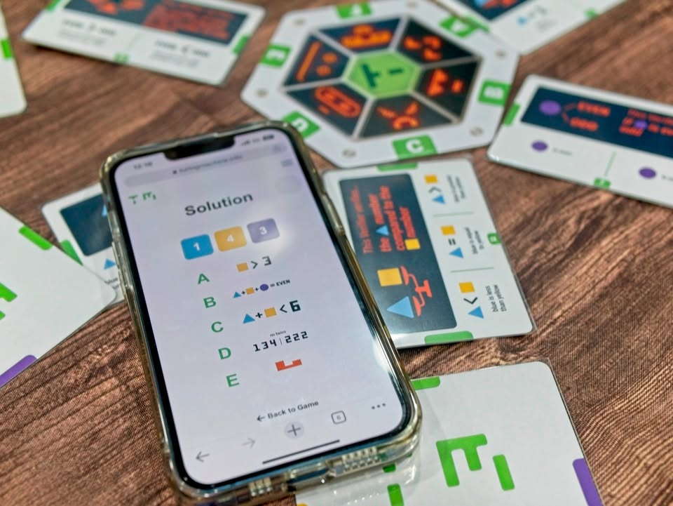

Turing Machine #bite_size 

เกมแนว deduction หาคำตอบที่นำเสนอผ่านการทำงานของ 'เครื่องจักรคำนวน' ในยุคสมัยที่ยังไม่ใช้ไฟฟ้า แต่ทำงานผ่านบัตรเจาะคำ

.
ไอเดียมันเป็นเกม fixed puzzle ที่มีตัวเลข 1-5 มาเรียงกัน 3 ตัวแล้วเราไม่รู้ว่าเลขอะไร (ก็คือมีความเป็นไปได้ระหว่าง 111-555) โดนแต่ละ puzzle นั้นจะมีการเลือกตัวช่วยมาให้เราจำนวนหนึ่งเพื่อใช้หาคำตอบ

.
ความเท่ของเกมคือการที่ตัวช่วยมันเฉลยคำถามที่เราอยากรู้ได้ด้วยการที่เอาบัตรตัวเลขเจาะรูมาวางซ้อนกันและสามารถให้คำตอบกับเราได้อย่างน่าอัศจรรย์

.
ตัวอย่างเช่นการ์ด 'หลักที่ 2 มากกว่า/น้อยกว่า/เท่ากับ หลักที่ 3' ซึ่งคำตอบมันก็จะมีทั้ง YES และ NO เราก็จะหยิบการ์ดเลขที่เราอยากทดสอบออกมา อย่างเป็น 354 ละกัน การเรียงแบบนี้คือการตั้งใจถามว่าหลักที่ 2 'มากกว่า' 3 ไหม ถ้าคำตอบเป็น NO เราก็จะรู้ว่าหลักที่ 2 มันห้ามเยอะกว่าหลักที่ 3 (แต่มันไม่ได้เป็นคำตอบนะ แค่มันบอกว่าเงื่อนไขที่เราถามมันถูกหรือผิดเฉยๆ)

.
ซึ่งในแต่ละ puzzle มันก็จะมีตัวช่วยหลายแบบ (มากสุด 6 ตัวในระดับยากสุด และตัวช่วยจะคลุมเครือมากกว่าแบบง่าย) ที่ในรอบหนึ่งเราส่งเลขไปถามตัวช่วยได้ 3 ครั้ง เกมก็มีแค่แข่งกันใช้รอบที่น้อยที่สุดเพื่อหาเลขที่ซ่อนไว้

.
เกมมี puzzle ให้เลือกแบบเยอะมากๆหลายระดับ แต่ต้องไปใช้ app ดึงมาหรือจะเล่นบนเวบก็ได้ 

.
ในเชิงการนำเสนอคือเท่มากกับการหยิบบัตรคำมาซ้อนแล้วถามเพื่อให้ได้คำตอบมาก แต่ถ้าไปเล่นในคอมเกมจะรู้สึกด๋อยทันทีเหลือแค่เกมจัดเลขถามส่งๆ แต่กระนั้นมันก็เป็นเกมหาคำตอบที่ปวดหัวแบบสนุกๆดี

.
ถ้าเอาง่ายๆมันก็เกม master logic ที่มีหมุดสีนั้นแหละ แค่พัฒนาให้การเฉลยเป็นหมุดขาวดำมันซับซ้อนขึ้นเยอะ ส่วนใครเป็นสายโปรแกรมเมอร์แล้วคุ้นๆ ก็เออมันก็เหมือนเขียน unit test แหละ..... นี้เล่นเกมหรือทำงาน งื้อออ

.
ส่วน Turing Machine ของจริงนี้เป็นเครื่องจักรมโนเฉยๆนะ เป็นหลักการทางคณิตศาสตร์อันหนึ่ง แต่ก็เป็นพื้นฐานของของคอมพิวเตอร์สมัยนี้เลย ไอเดียคือมันจะมีการ์ดคำสั่งใส่ๆเข้าไปแล้วจะมีหัวอ่านคอยเขียนข้อมูล 01010100... ตามคำสั่งและเงื่อนไขที่ได้ จบ...

--------------------------------
หมวด Bite Size (พอดีคำ) นี้กะว่าจะเขียนอะไรสั้นๆประมาณนี้ล่ะกัน ใหม่บ้าง ซ้ำบ้าง เกมที่ขี้เกียจเขียนบ้าง เขียนๆไว้ก่อนเผื่อมีอารมณ์อาจจะขยายไปลง Thought บ้าง จริงๆอยากเขียนสั้นกว่านี้ แต่ยังอดไม่ได้ที่จะต้องอธิบายอะไรเพิ่มตามนิสัย เดี๋ยวค่อยๆปรับไปล่ะกัน

