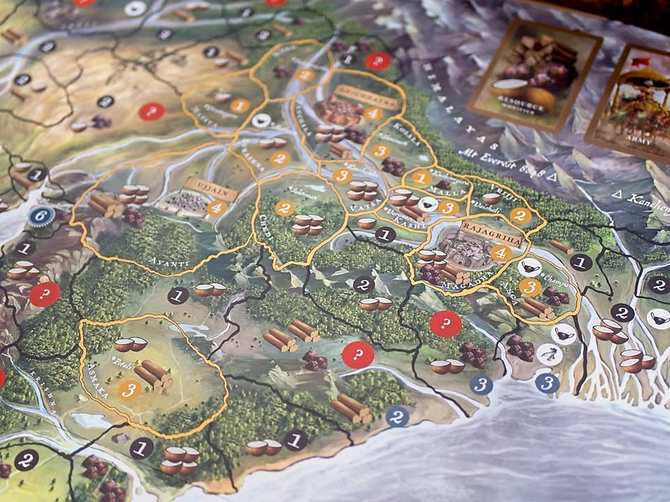
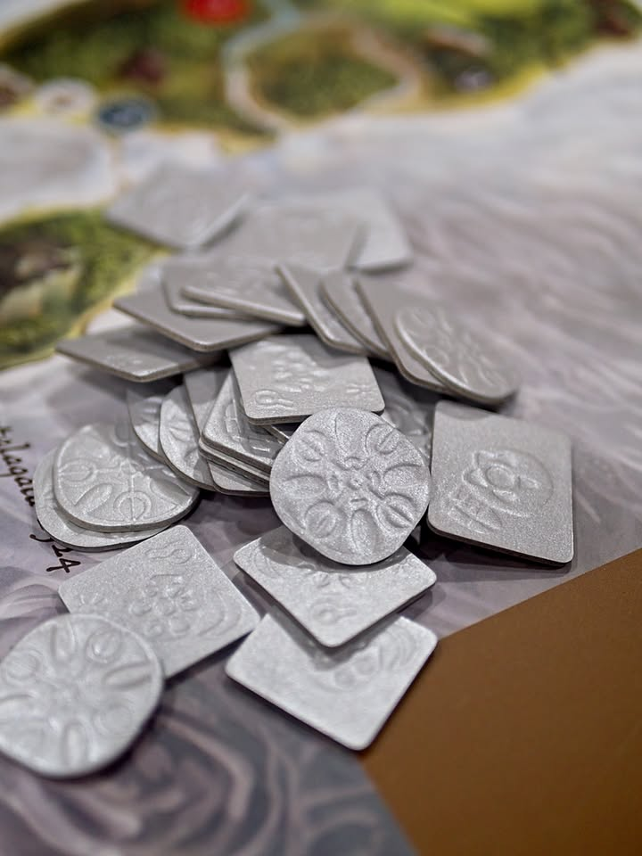
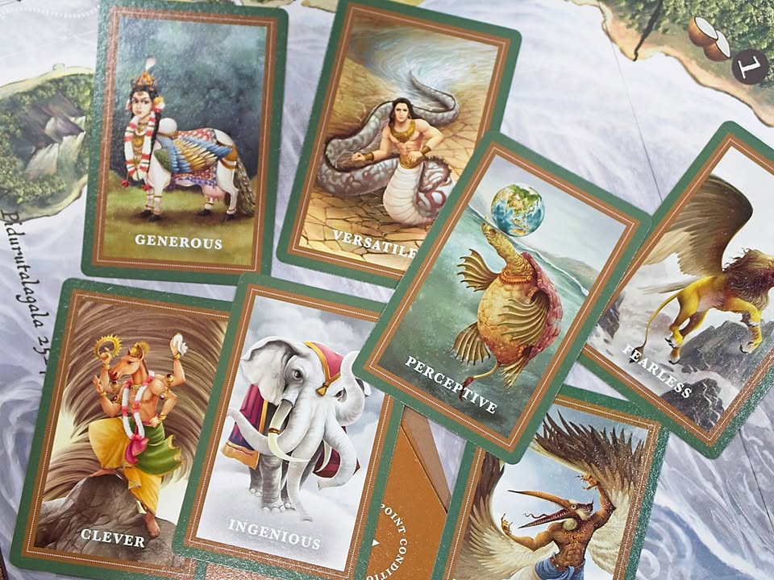

มาดูเกมจากประเทศใกล้บ้านกันบ้างกับ Bharata 600 BC จากประเทศอินเดีย คือเกมนี้ บอร์ดเกมสนุก - Boardgame Sanook เพื่อนบ้านเค้าจัดมาก็เลยมีโอกาสได้ลอง

.
ขอเริ่มเรื่องการนำเสนอกันก่อน คือเกมนี้จุดเด่นที่ไม่ต้องบอกก็คือคุณภาพงานศิลป์ดีมาก ภาพแผนที่นี้ระดับ Brass เลย แล้วก็มีไอเดียการผลิตจากข้อจำกัดโรงงานพื้นบ้านที่น่าสนใจ 

.
ตัวเงินเกมนี้จะใช้กระดาษแข็งธรรมดาเนี่ยแหละแต่ปั้มให้มันยุบเอาเป็น texture สวยๆในขณะที่หมากตัวเดินนี้คือเอาไม้มาเคลือบด้วยยางอะไรซักอย่างที่ออกมาสีลูกกวาดสวยงามจัด แถมแสดงความเป็น OTOP ด้วยการอธิบายที่มาที่ไปของการผลิตตัวหมากนี้อย่างละเอียดในคู่มือ (แถมย้ำในปกเกมอีกว่านี้งานคราฟนะจ๊ะ)

.
ไอเดียการผลิตเค้าน่าสนใจดี ใส่ใจเรื่องกล่องเก็บข้างในที่วางพอดี เพราะไม่มี insert แล้วก็แถมยางรัดมาด้วย ... แล้วยางรัดมันดียังไงน่ะ? คุณอาจจะถาม ผมก็ตอบว่ามันยางรัดแบบยางรัดผมที่มีปลอกทองด้วย คือมันไม่ได้แพงอะไรแต่ชอบในความพยายามนำเสนอนะ

.
ส่วนที่พูดเรื่องการผลิตแบบเน้นๆเพราะว่าในส่วนของการออกแบบเกมเพลย์นั้น....... หายนะสัดๆ

.
โอเคพูดแบบนี้อาจจะเกินไป แต่มันเป็นกลไกที่ยังอยู่ในยุดมืดไม่ได้รับแสงจากยุคเรเนซองส์ของเกมกระดานสมัยใหม่แต่อย่างใด ก็จะเพลนๆหน่อย

.
เกมชนะจากการยึดเมืองต่างๆในกระดานให้มีแต้มถึงที่กำหนด ไปยึดที่ไหนได้ก็วางบ้านไว้ โดยเราจะมีกองทัพอยู่ 2 กองซึ่งจะมีการซื้อการ์ดกองทัพ (มีเลข 1-3 สุ่มๆมา) ใส่ไว้ เวลาสู้กับเพื่อนก็เปิดเลขกองทัพมาวัดกัน ส่วนเวลาตีบ้านโล่งๆก็เอาเงินฟาดไป

.
แล้วระบบหาของในเกมแม่มคืองงฉิบหายเพราะผลิตเองไม่ได้ ต้องเดินไปบุกให้ชนะถึงจะมีของมาให้ (นัยว่าอยากให้เดินตีกันบ่อยๆ) แล้วของมันก็ไม่ได้ทำอะไรเลยแค่เอาไปแลกเงิน แล้วเงินมาซื้อทหาร แบบไม่มี depth หรือการใช้งานแบบอื่นใดๆทั้งสิ้น (แบบจะซื้ออันนี้ต้องใช้ทรัพยากรแบบนั้นไรงี้) พ่วงด้วยความ classic ขั้นสุดของการสุ่มเปิด event แจกของทุกตา..... แล้วมันแจกแบบเฟ้อมาก

.
หายนะชิ้นอื่นคือ event พังของ..... แบบเปิดสุ่มหาเมืองพัง ถ้าโดนเมืองเราก็ต้องหาของมาจ่าย ซึ่งดวงเกิ๊นนน ไปดูเรทติ้งใน bgg แม่ม account ม้าเพียบเลยให้คะแนนเยอะจากหลายประเทศแต่กดดูแล้วเรทอยู่เกมเดียว....

.
เอาเป็นว่าถ้าไม่คิดอะไรมากหยิบเกมมาเล่นกับเด็กๆหรือคนที่ไม่ได้สนใจเรื่อง optimal move count ไปยึดเมืองให้ได้แต้มจบๆไปก็ถือว่าเล่นเอาเพลินๆได้ ของสวยมาก 

.
กระนั้นก็ขอทำนายไว้เลยว่าเกมจากฝั่งอินเดียมาแน่ รอให้นักออกแบบกับตลาดเค้าพร้อมรับกับกลไกเกมกระดานสมัยใหม่ก่อนเถอะ

