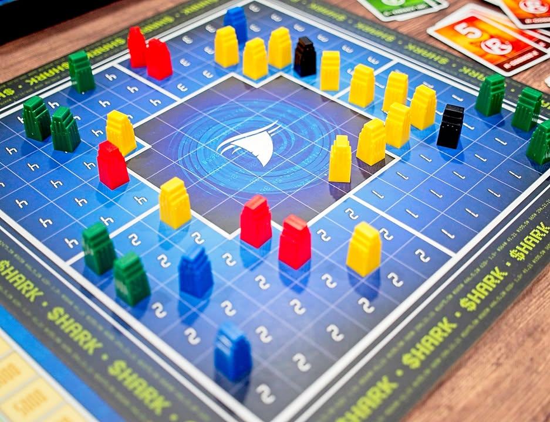
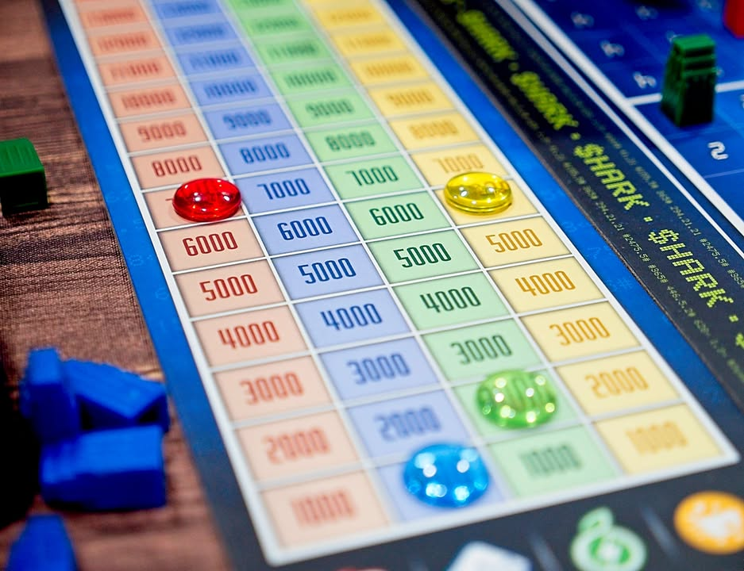
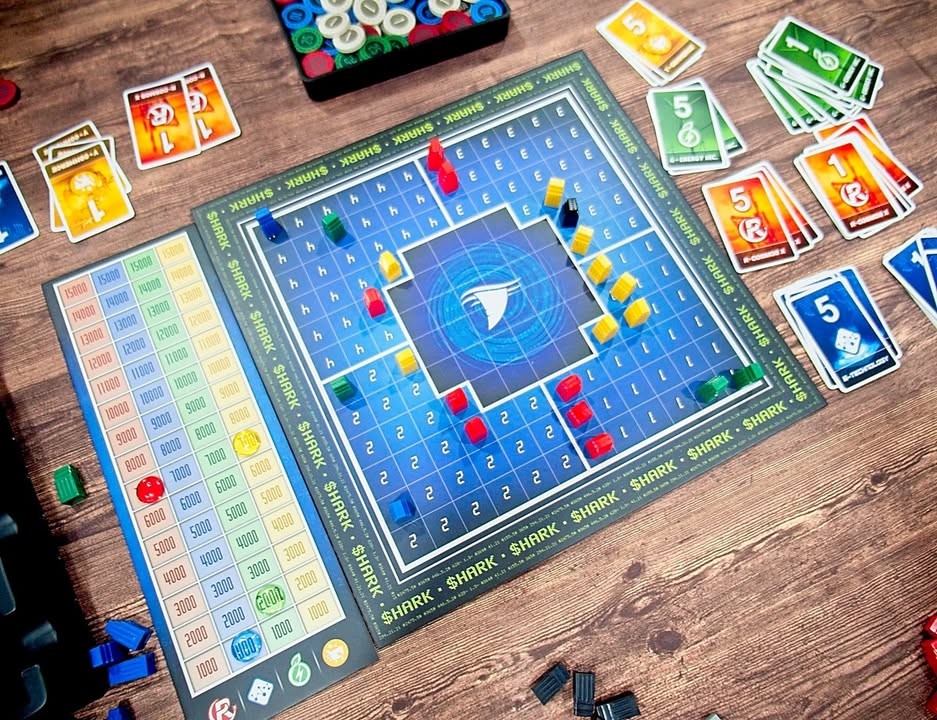

Shark เพชฌฆาตตลาดหุ้น #bite_size
.
เกมแนว Stock Holding ว่าด้วยการบุกทุบกิจการคู่แข่งของเหล่าฉลามที่จะย้อมทะเลธนบัตรให้เป็นสีแดงฉาน

.
ไอเดียเกมไม่ได้ยุ่งยากอะไร เราจะทอยเต๋าเพื่อกำหนดว่าจะต้องว่าตึกธุรกิจสีไหนในพื้นที่ใด กับสามารถซื้อหุ้นของบริษัทไหนก็ได้มาเก็บไว้ เวลาบริษัทมันมี token เพิ่มขึ้นราคาหุ้นขึ้นตามแถมได้เงินมาใช้ด้วย วู้ฮู้

.
แต่เห้ยเกมนี้มันเกมเพชฌฆาตตลาดหุ้น มันก็ต้อง take that! 

.
คือเกมนี้เวลาเราเอาตึกชุดใหญ่กว่าไปติดอันเล็กเนี่ยมันจะระเบิดธุรกิจเล็กหายไปหมดเลย แล้วหุ้นก็แน่นอนว่าลดฮวบ แถมด้วยผู้เล่นต้องคืนเงินตามสัดส่วนที่ลดลงไปด้วย คือมันเป็นเกมขึ้นแรงลงแรงเอาเรื่องอยู่ ถือหุ้นอะไรเยอะแล้วโดนรวมหัวทุบทิ้งนี้ก็ต้องมีดิ้นกำหมัดแน่นๆกันบ้าง

.
ก็ทอยๆสร้างๆทุบๆกันจนหุ้นหมดหรือตึกหมด ไม่ก็มีสุดยอดบริษัทที่กินเรียบหุ้นทะลุเพดานก็จบเกม

.
ในแง่ว่าใครมองหาเกมสไตล์เฮฮาทรงเล่นร้านเกม คือไม่ต้องคิดเยอะทอยๆปั่นๆลุ้นๆ take that เจ็บๆไม่เครียดเกมแต่อยากต่อยคนก็ถือว่าน่าสนใจครับ แต่ส่วนตัวผมชอบโทนแบบมีดูจังหวะมีคิดขยักวางแผนนับเงินนับหุ้นแบบ Acquire มากกว่านะ

--------------------------------
📌 disclosure: 
* Board Game Academy ผู้แปล/นำเข้า/จัดจำหน่าย ส่งสินค้ามาให้ผมลองเล่น แต่ข้อเขียนนี้เป็นการแสดงความเห็นของผมที่มีต่อเกมโดยไม่ได้เป็นการรับจ้าง หรือเป็นข้อเขียนเพื่อการโฆษณา
--------------------------------
หมวด Bite Size (พอดีคำ) นี้กะว่าจะเขียนอะไรสั้นๆประมาณนี้ล่ะกัน ใหม่บ้าง ซ้ำบ้าง เกมที่ขี้เกียจเขียนบ้าง เขียนๆไว้ก่อนเผื่อมีอารมณ์อาจจะขยายไปลง Thought บ้าง จริงๆอยากเขียนสั้นกว่านี้ แต่ยังอดไม่ได้ที่จะต้องอธิบายอะไรเพิ่มตามนิสัย เดี๋ยวค่อยๆปรับไปล่ะกัน

