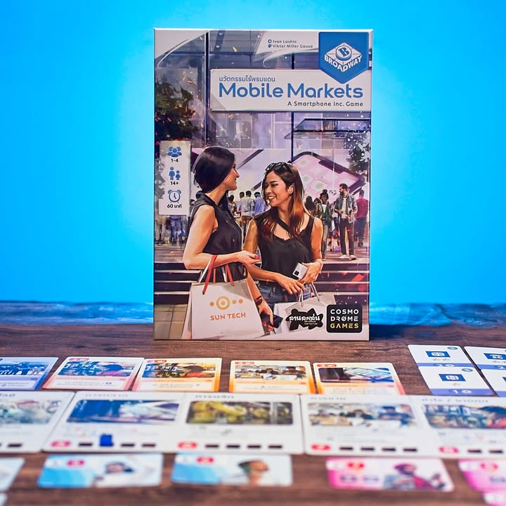
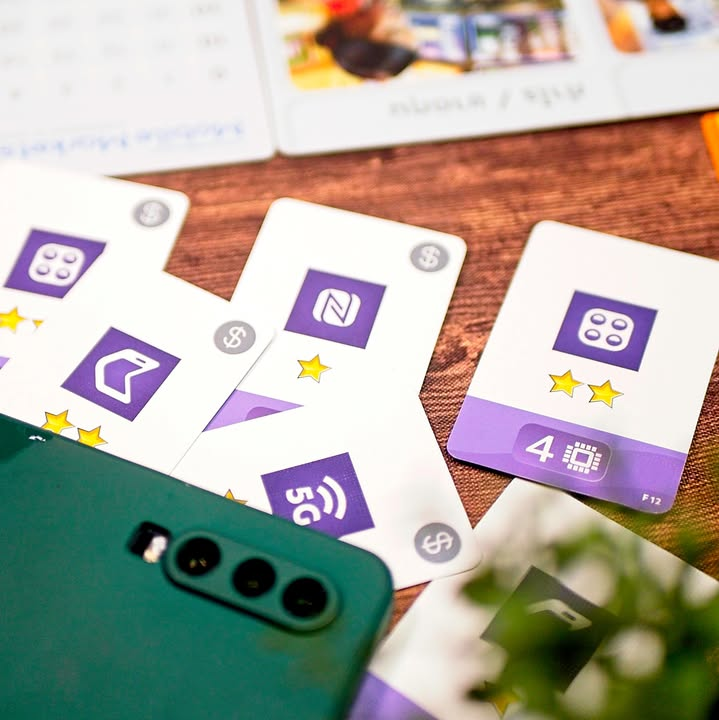

Mobile Markets: A Smartphone Inc. Game - นวัตกรรมไร้พรมแดน #thought 

เกมแนว Economic ที่จะให้เรามารับบท CEO บริษัทผลิตมือถือที่จะต้องพัฒนาฟีเจอร์ให้ตรงกับความต้องการของตลาด โดยที่ต้องไม่ลืมที่จะควบคุมราคาและต้นทุนพร้อมการพัฒนาเทคโนโลยีการผลิตให้ล้ำสมัยและการตลาดสุดดึงดูด ผลงานของ Ivan Lashin (Smartphone Inc. , Furnace, Skytopia)

.
ไอเดียของเกมนี้คือตลาดมันจะ seed ลูกค้าที่มีความต้องการอยู่ 2 อย่างคืองบซื้อมือถือที่ราคาไม่เกิน X และ/หรือ มือถือที่มีฟีเจอร์ตามที่ต้องการ จำพวก กล้องเทพ จอชัดตาแตก อะไรแบบนั้น เป้าหมายเราก็คือพยายามผลิตของแล้วกวาดลูกค้ามาให้มากที่สุด

.
เกมจะเล่นกันหลายรอบ ในแต่ละรอบเราจะต้องวางแผนระยะยาวของบริษัทให้เรียบร้อยว่าอยากจะทุ่มทรัพยากรไปส่วนไหน จะเน้นผลิต จะเน้นวิจัย หรือจะการตลาดอะไรก็ว่าไป โดยการที่ต้องเอา pad คำสั่งมาผลิกไปมาแล้ววางซ้อนกัน ออกหน้าไอคอนไหนก็แปลว่าทั้งรอบนี้เราก็จะมีทรัพยากรแบบนั้นแหละเอาไว้เล่น

.
ทรัพยากรที่ว่าก็ค่อยๆมาไล่ resolve ในแต่ละ phase ของเกมอย่างกำหนดราคาขายไว้เท่าไรเราจะกำไรมากน้อยก็อยู่ที่ฟีเจอร์ที่เรายัดไว้ในมือถือของเรา  จะผลิตของได้กี่ชิ้น มีแต้มชิปไปซื้อการ์ดฟีเจอร์ใหม่กี่แต้ม มีแต้มไปซื้อการ์ดการตลาดที่ให้ผลแนว engine ของเราเท่าไรก็จะเป็นไปตามที่เราวาง pad คำสั่งตรงนี้เลย ไม่มีการเปลี่ยนกลางทางทำให้ต้องคิดล่วงหน้าชัดๆว่าอยากได้อะไรกันแน่

.
ในตอนขายเนี่ยเกมจะให้คนที่ตั้งราคาถูกสุดได้ขายก่อนก็ไล่ไปถามการ์ดลูกค้าทีละใบ ซึ่งแต่ละคนก็จะมีงบสูงสุดที่จะซื้ออยู่แล้ว แต่พวกสายประหยัดเนี่ยบางทีเกินงบแต่ฟีเจอร์ครบก็พร้อมขายไตมาซื้อเหมือนกันนะ ในขณะที่สายไฮโซก็จะเรื่องมากกว่า โดยเงินที่ได้ต่อลูกค้าแต่ละคนจะเท่ากันหมดเพราะเราผลิตมือถือขายแค่รุ่นเดียว เอาราคาตั้งมาลบราคาทุน ซึ่งหมายความว่าสิ่งที่สำคัญคือกำไรต่อหน่วย แต่ถ้าตั้งแพงไปก็อาจจะโดนคนที่ตั้งราคาถูกกวาดลูกค้าไปหมดก่อน ตรงนี้ก็ต้องมีเดาใจกันนิดนึง

----------------------------------------
🐸 [กบชอบ] 
---------------------------------------
.
ว่าง่ายๆเลยคือเกมนี้มันเป็น Smartphone Inc ที่ทำเสร็จแล้ว นึกไม่ออกเลยว่าจะกลับไปเล่นตัวใหญ่ทำไมนิ ตัดเอาส่วนเป็นปัญหาออกไปหมดแล้วเพิ่ม replayability อย่างสวยงาม (แต่ถ้าตัวใหญ่มันเอาของใน Mobile Market ย้อนไปทำตัวเสริมเพิ่มให้ก็น่าสนใจนะ) เกมตอบสนองกลุ่มผู้เล่นกว้างขึ้นเพราะ phase ชัดเจนตรงไปตรงมาทำให้มือใหม่ตามเกมได้อย่างรวดเร็วและมือเก่าก็ยังสามารถเล่นมูฟตัดราคาและทำ engine ได้อย่างสนุก แต่เกมมันก็มีความแอบโหดตรงที่ตั้งราคาผิดนิดเดียวอาจจะไม่เหลือลูกค้าให้ขายของเลยก็ได้

.
ข้อดีอันนึงที่ต่อยอดมาจากอันเก่าคือ UI/UX ทำมาดีมากเลยทั้งการไล่ phase ในบอร์ด การวางราคากับ turn order ทำให้เกมอธิบายง่ายมากทำให้เราไปโฟกัสกับเรื่องเทคติกได้เต็มที่ 

.
ในเชิงเกมไม่มีตรงไหนที่เป็นข้อเสียเป็นพิเศษ แค่ในเชิงธีมตามความจริงก็อาจจะรู้สึกขัดๆนิดหน่อยแบบมือถือจะมีรุ่นเดียวทั้งปีเลยหรือไงฟระไรงี้ กับด้วยความที่ overall เกมมันไม่มีอะไรมากกว่าวนลูปซื้อขายสำหรับมือเก๋าก็อาจจะรู้สึกมันซ้ำไวนิดนึงเลือกแต่ท่าเดิมๆไม่ต้องคิดใหม่มาก แต่ผมคิดว่ามันเป็นตัวเลือกระดับ hybrid สำหรับผู้เล่นสองกลุ่มที่ดีนะ

--------------------------------
📌 disclosure: 
* Lanlalen ลานละเล่น ผู้แปล/นำเข้า/จัดจำหน่าย ส่งสินค้ามาให้ผมลองเล่น แต่ข้อเขียนนี้เป็นการแสดงความเห็นของผมที่มีต่อเกมโดยไม่ได้เป็นการรับจ้าง หรือเป็นข้อเขียนเพื่อการโฆษณา

-----------------------------------------

😍 กบโปรด - อวยไส้แตก ยากมากที่เล่นแล้วจะรู้สึกไม่สนุก
.
😁 กบชอบ - พร้อมจะเล่นตลอด 
.
🙂 กบโอเค - ชอบในบางแง่มุม แต่อาจจะเล่นไม่บ่อยหรือเล่นแค่บางอารมณ์
. 
😐 กบเฉย - ไม่ได้เกลียดอะไร ถ้าไม่มีตัวเลือกอื่นก็เล่นได้อยู่
.
🖕 กบไม่เล่น - ไม่ตรงจริต (ไม่ได้แปลว่าห่วยหรือไม่ดี) ขอเล่นเกมอื่นล่ะกัน
.
อนึ่ง : เป็นความรู้สึกในความ "อยากจะหยิบมาเล่นไหม?" ของผมเอง ไม่ได้เกี่ยวอะไรกับคุณภาพของเกม ดูให้เป็นแค่ "อีกความคิดเห็นหนึ่ง" เท่านั้นก็พอนะครับ :)
-------------------------------------------

