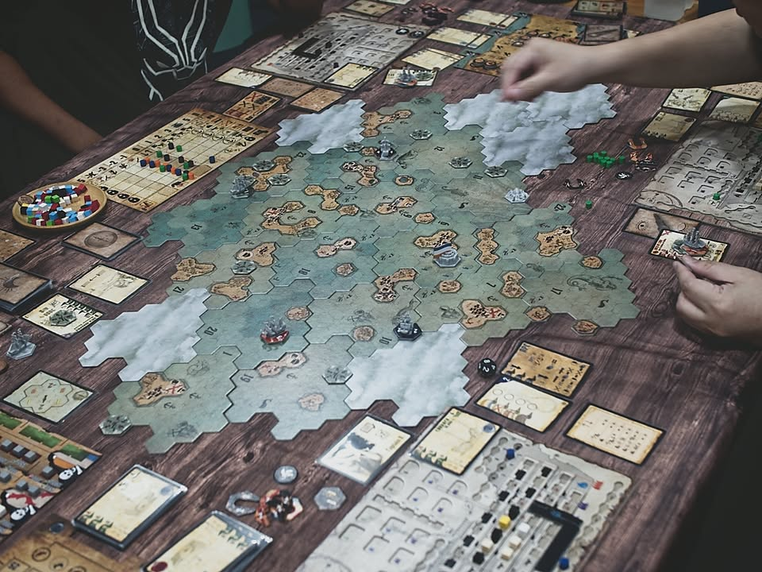
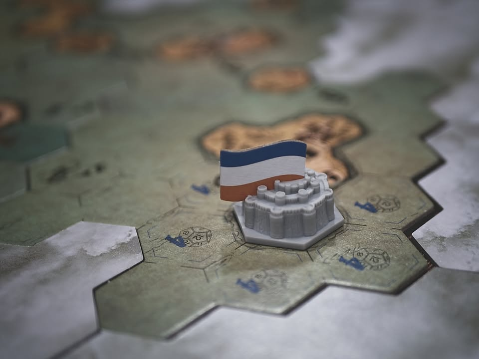
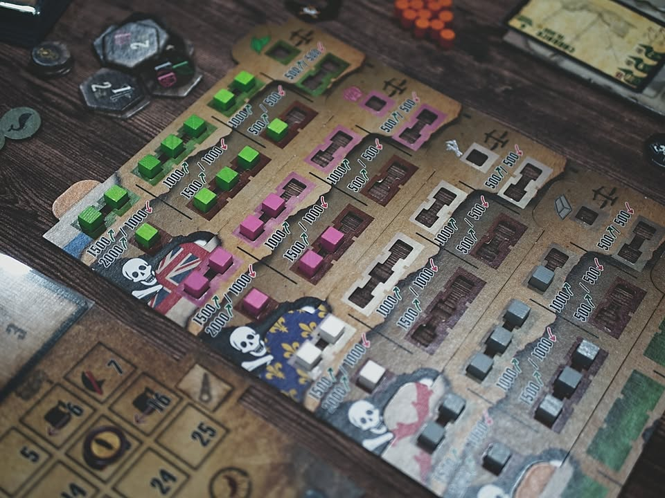

Captain's Log #bitesize #first_impression 

เกมแนว Sandbox ที่จะให้เราเป็นอะไรก็ได้ในยุคสมัยแห่งโจรสลัด เกมระดมทุนแรกของนักออกแบบ Anastasio Martinez 

.
ไอเดียก็แบบเกม sandbox ทั่วไปเราก็เดินเรือเปิดแผนที่แวะเกาะนี้ซื้อของไปขายเกาะโน้น มีเควสตามหาวันพีชที่ทุกคนมาร่วมแข่งกันหาเบาะแส จะชนะแบบเน้นค้าขาย เน้นไล่ตีเรือชาวบ้าน หรือเน้นทำเควสแวะไปโน้นนี้ส่งของก็ได้

.
ระบบที่น่าสนใจก็คือเรื่องของความสัมพันธ์ระหว่างประเทศในนั้นที่จะมีการแขม่นกันไปมา ช่วยจมเรือประเทศนี้ก็ได้โบนัสเพิ่มแต่จะไปจอดเข้าเมืองอีกที่ไม่ได้แทนไรงี้ก็ทำให้เกมมีไดนามิกที่น่าสนใจ และในเกมนี้ผู้เล่นจะสลับกันขยับ NPC ที่จะมีหลายชนิดเปลี่ยนไปเรื่อยๆตลอดเกมทำให้เกมมีสีสันไม่นิ่งดี

.
ระบบเรือที่หลายคนอาจจะไม่ชอบแต่ผมชอบนะคือเรือมันมีทิศทางการเดินกับทิศทางลมด้วยซึ่งมีผลทำให้ระยะเดินมันเพิ่มลดได้ ขนาดระวางกับอัตราการกินน้ำของเรือก็มีผลต่อการเดินเข้าในบางพื้นที่ด้วย จะกลับเรือกลางทางนี้มูฟลดเยอะมากเพราะต้องตีโค้ง และเรือก็นอกจากจะสามารถติดปืนได้แล้วยังมีกระสุนให้เลือกหลายแบบด้วย มีบางจังหวะผมต้องโยนของทิ้งลงทะเลเพราะต้องแล่นผ่านช่องแคบที่น้ำตื้นเพราะรีบกลับท่าไปทำเควสก็มี

.
ข้อเสียจริงๆก็มีแค่รูลที่เขียนได้ส้นติงจัดๆ ต้องขอบคุณหมอพีทที่อ่านมาให้ด้วยครับ กับส่วนที่ไม่ค่อยชอบเท่าไรคือเกมมันไม่มีวาร์ปแบบเกมอวกาศทำให้กว่าจะเดินทางไปโน้นไปนี้มันค่อนข้างนาน (แต่ก็ได้อารมณ์ล่องเรือดีละมั้ง?) แต่จุดที่คิดว่าน่าเสียดายคือเกมมัน pacing ต้นเกมช้าไปหน่อยกว่าจะได้เก็บเงินทำโน้นนี้แต้มอย่างอึดเรือก็กาก

.
ถ้าเทียบกับ Xia แล้วเกมมันจริงจังกว่าไม่ค่อยแฟนตาซี ไม่มีฉากฮาๆแบบขุดแร่แล้วยานระเบิด วาร์ปเข้าดวงอาทิตย์ น้ำมันหมดอะไรแบบนั้น จุดที่ผมคิดว่าคือๆกันคือระบบโมเรือที่เกมทำมามีหลายแทรคไปได้หลายท่าดูมีมิติมากกว่า แต่ก็แลกมากับการที่เรือไม่ได้มีความสามารถอะไรแบบใน Xia 

.
ในฐานะเกม Sanbox ก็สนุกดีเล่นเพลินๆเก็บอารมณ์ความเป็นเกมโจรสลัดล่องเรือไปมาดี แต่ก่อนมาเล่นเกมนี้คิดว่าไปหา Xia, Western Ledgend, Merchants & Marauders มาลองก่อนดีกว่าเกมนี้มีอะไรน่าสนใจหลายอย่างก็จริงแต่ก็ไม่ได้โดดเด่นข้ามตัวเด่นที่หาได้ง่ายกว่าเยอะนะ เพราะเกมมันนอกกระแสมากในไทยน่าจะมีคนกดมาไม่กี่คน ผมเองก็กดไว้แต่ยกเลิกไปเหมือนกันเพราะคิดว่าเกม sandbox กล่องเดียวก็น่าจะพอละถ้าไม่ได้เล่นบ่อย

--------------------------------
หมวด Bite Size (พอดีคำ) นี้กะว่าจะเขียนอะไรสั้นๆประมาณนี้ล่ะกัน ใหม่บ้าง ซ้ำบ้าง เกมที่ขี้เกียจเขียนบ้าง เขียนๆไว้ก่อนเผื่อมีอารมณ์อาจจะขยายไปลง Thought บ้าง จริงๆอยากเขียนสั้นกว่านี้ แต่ยังอดไม่ได้ที่จะต้องอธิบายอะไรเพิ่มตามนิสัย เดี๋ยวค่อยๆปรับไปล่ะกัน

