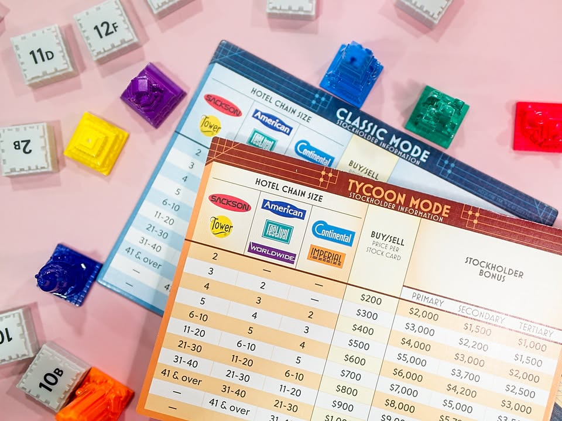

Acquire  #bite_size 

.
เกมสุดเก๋าอายุปีหน้าก็ครบ 60 ปี ถูกเอามาตีพิมพ์ใหม่ซ้ำแล้วซ้ำอีกธีมว่าด้วยการขยายและควบรวมกิจการโรงแรม โดยนักออกแบบ Sid Sackson เองนี้ก็ถือว่าเป็น iconic  ในยุคโน้นที่ทำเกมอย่าง I'm the boss และ Can't Stop มาให้เราเล่นกัน

.
ไอเดียเกมคือมันจะมีตารางที่มีเลขช่องกำกับไว้ ผู้เล่นจะมีไทล์ในมือจำนวนหนึ่งก็ผลัดกันวางไป ถ้าวางไทล์ติดกัน 2 อันก็จะสามารถเปิดกิจการโรงแรมได้หรือจะวางไทล์ขยายที่ดินให้โรงแรมเดิมก็ได้ ระหว่างน้้นเราก็สามารถลงทุนซื้อหุ้นโรงแรมเอาไว้เพราะว่ายิ่งโรงแรมไหนมีจำนวนไทล์เยอะราคาหุ้นมันก็จะพุ่ง ซึ่งเราก็จะมี inside information อยู่นิดหน่อยจากไทล์ที่เรามีในมือกับดูอาการเพื่อนในวงว่ามันพยายามถือหุ้นอะไรเยอะๆ

.
ทีนี้พอวางๆไปโรงแรมก็จะขยายขึ้นเรื่อยๆในขณะที่พื้นที่ว่างก็จะน้อยลง แล้วพอมีคนวางไทล์ให้โรงแรมสองเจ้ามาชนกันก็บู๊ม!! โรงแรมเจ้าใหญ่กว่าจะทำการควบรวมกิจการเจ้าเล็ก ซึ่งไม่ใช่เรื่องแย่แต่อย่างใดเพราะว่าผู้ถือหุ้นตัวท็อปของกิจการเล็กจะได้รับเงินส่วนแบ่งให้เอาไปลงทุนต่อ และหลังจากนั้นผู้เล่นที่มีหุ้นเจ้าเล็กก็จะมีตัวเลือกว่าจะแลกหุ้นตัวเองกับหุ้นเจ้าใหม่ หรือจะเก็บเอาไว้เผื่อโรงแรมเล็กจะเปิดใหม่ก็ได้จะได้ไม่ต้องเสียเทิร์นไปซื้อหุ้นใหม่เพราะตานึงมันซื้อได้แค่ 3 ใบ

.
เกมมันก็เล่นวนๆกันจนกระดานเต็มนี้แหละ จบเกมก็เอาเงินกับมูลค่าหุ้นมาวัดกันหาคนรวย

.
กลยุทธ์และความสนุกของเกมจริงๆก็คือการถือหุ้นเจ้าเล็กให้เยอะเป็นอ้นดับต้นๆแล้วหาทางทำให้มันถูกกลืนเพื่อเอาเงินมาหมุนต่อ โดยเราก็ต้องอาศัยดูเอาจากมือเรานี้แหละว่ามันจะมีพอจะไปทางไหนได้ ไม่ก็พยายามซื้อหุ้นเกาะๆเพื่อนที่มีแนวโน้มว่าจะทำได้เอาไว้ แต่ว่าเรามีเงินจำกัดและตานึงก็ซื้อหุ้นได้ไม่กี่ใบก็ต่องบริหารกันหน่อย

.
ซึ่งอย่างที่บอกว่าเรื่องการควบรวมกิจการมันสำคัญ เพราะฉะนั้นใครที่มีไทล์ที่ทำให้กลุ่มโรงแรมมันเชื่อมกันได้บ่อยๆก็มักจะชนะ ตรงนี้ก็เป็นเรื่องดวงของเกมที่ผมคิดว่ามันก็เหมาะสมใน weight ของมันนะ ไม่รู้สึกว่ามันดวงเว่อร์อะไร ออกไปในทาง manageable (ถ้าใครอยากลดดวงลงอีกหน่อยผมเสนอวาเรี้ยนส่วนตัวโดยให้จั่วสองเลือกหนึ่งดูนะ)

.
ข้อเสียที่น่ารำคาญหน่อยๆคือระหว่างเล่นมันต้องมาคอยนับไทล์ว่าตอนนี้โรงแรมมันขนาดไหนแล้วเพราะมีผลกับราคาหุ้น กับต้องมาทอนๆกับแลกเงินบ่อยตรงนี้ก็จะสะดุดนิดนึง เมื่อก่อนนี้ผมถึงกับ print ตารางแทรคนับจำนวนหุ้นมาเลยนะ คือสมัยเล่นเกมกระดานใหม่ๆผมเล่นเกมนี้บ่อยมากกกกกก นี้คือผ่านมาสิบปีก็ค่อยมาซื้อตัวใหม่อีกรอบนี้แหละเพราะตีก 3d มันสวยดี

.
สำหรับผมแล้วเกมนี้ถือเป็น classic เกมที่กาลเวลาพิสูจน์มาเป็นอย่างดี ถ้าใครกำลังมองหาเกมเข้า collection บอร์ดเกมก็คิดว่าน่าจะมีเกมนี้ติดไว้ เพราะกติกาน้อย หน้าตาดูไม่แหวกจากเกมบ้านๆพวก scrabble ไรงี้ มีสัดส่วนดวงแบบไม่เหวี่ยงต้องมาลุ้นตัวเกร็งทำให้มันรองรับกลุ่มค่อนข้างกว้าง หยิบมาเล่นในวงครอบครัวยันเกมเมอร์ก็ยังสนุกเพลินอยู่เหมือนกัน โดยรวมก็ถือว่าคุ้มค่า แต่ไม่ชอบนิดหน่อยตรงที่ตึกมันจะทำป้ายสีส้มๆมาทำด๋อยอะไรใส่ละดูตลก ก็เลยไม่ได้ใช้ กับ edition นี้ไม่มีเทรย์ให้วางไทล์กับไม่มีถุงให้ก็รู้สึกว่างกไปหน่อยแต่ก็ไม่ใช่อะไรเมเจอร์นะ

.
ส่วนตัวรุ่นใหม่ๆ (ตั้งแต่ฉบับปี 2016) จะมีกติกาที่ผู้ถือหุ้นอันดับสามจะได้เงินปันผลด้วยจากปกติได้แค่อันดับหนึ่ง-สอง ก็จะช่วยให้ผู้เล่นมีเงินไหลมามากขึ้น (แต่ก็ทำให้ความเข้มข้นของการแข่งเก็บหุ้นลดลงนะ) 

--------------------------------
หมวด Bite Size (พอดีคำ) นี้กะว่าจะเขียนอะไรสั้นๆประมาณนี้ล่ะกัน ใหม่บ้าง ซ้ำบ้าง เกมที่ขี้เกียจเขียนบ้าง เขียนๆไว้ก่อนเผื่อมีอารมณ์อาจจะขยายไปลง Thought บ้าง จริงๆอยากเขียนสั้นกว่านี้ แต่ยังอดไม่ได้ที่จะต้องอธิบายอะไรเพิ่มตามนิสัย เดี๋ยวค่อยๆปรับไปล่ะกัน

