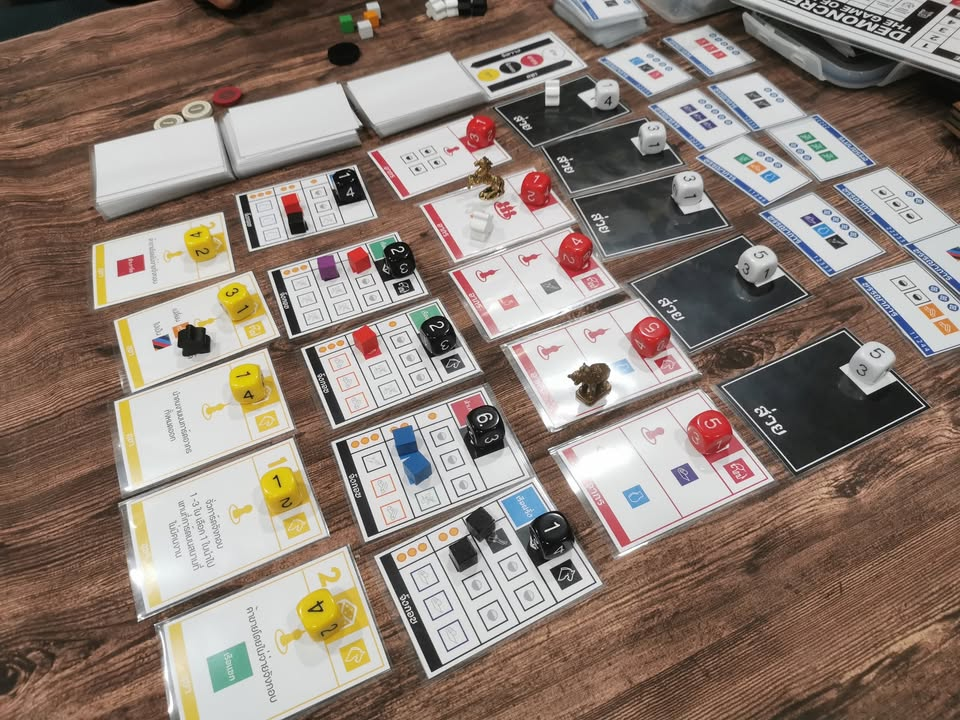
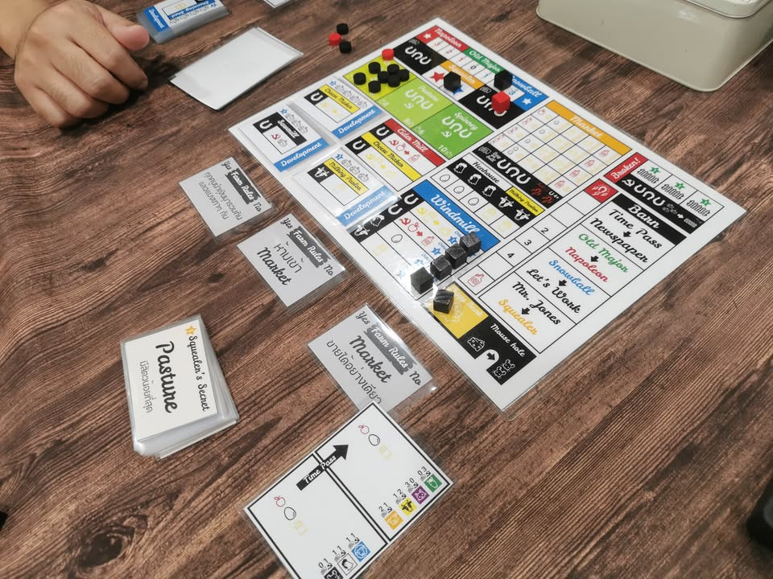

วันนี้เทสเกมของคุณ Kittitath Tanyavanish ไปสี่เกม (ของอาร์มเทสเมื่อวานแต่เห็นเค้าลงของตัวเองละเลยข้ามคิวนิสนึง) เป็นวันที่สนุกสนานมากอีกวันหนึ่ง ทุกเกมที่เห็นอยู่ในนี้เป็นแค่ตัวทดสอบทั้งหมดนะครับไม่มีอะไร final ระหว่างนี้ใครสนใจ playtest ก็ลองไปติดต่อได้ที่ร้านกาแฟ Polyfolk สะพานควายได้ครับ

.
.
//////////// Pax Ayudhaya (ชื่อชั่วคราว) 
.
.
เกมนี้เทสครั้งที่สองหลังจากครั้งแรกนั้นผมอ่านกติกาแล้วสนใจมากจนไปขอนัดเล่นที่งานเอเชียนบอร์ดเกม เราจะได้รับบทเป็นเจ้าพระญาในสมัยอยุธยา เกมจะเน้นกับการที่เราต้องส่งคนในสังกัดไปคุมกระทรวง เวียง วัง คลัง นา และส่งคนไปประจำสนามรบทั้ง 4 ทิศ เกมจะเน้นอิงอยู่กับการเจรจาเพื่อผลประโยชน์ของแต่ละกรมที่ต้องการการอนุมัติทรัพยากรจากกรมอื่นๆ (สมุหกลาโหมอยากได้ทหารก็ต้องไปเจรจากับกรมวัง อยากได้ปืนก็ต้องคุยกับกรมคลัง แต่กรมคลังจะมีปืนก็ต้องมีกรมนาผลิตสินค้าเพื่อไปค้าขายแลกปืนมา ไรงี้ และนี้คือแค่หนี่งในตัวอย่าง) 

.
รอบนี้เกมปรับส่วนที่รุงรังของรอบก่อนไปหลายจุดเลย จนแทบจะเรียกได้ว่าสิ่งที่น่าทำเพิ่มมันคือเรื่อง UI ในการอธิบายละว่าควรจะใส่อะไรตรงไหนเพื่อให้ผู้เล่นเข้าใจได้เร็วมากขึ้น และนี้จะกลายเป็นเกมเบอร์ต้นของเกมอิงประวัติศาสตร์ไทยที่เล่นสนุกได้อย่างไม่ยากเย็น!

.
แต่มันเกมแนว Experienced อ่ะนะ ไม่ได้คิดเข้มแบบยูโร ธีมเน้นแบบอเมริเทรช แล้วก็ไม่ได้เจรจาปาร์ตี้ ตามสไตล์เกมแบบ Pax ที่กติกามันไม่ได้รุงรังนัก ใครไม่เคยเล่นเกมด้วย mindset แนวนี้มาก่อนเลยอาจจะรู้สึกอิหยั่งๆนิดนึงว่ามานั่งเล่นอะไรนิไม่สุดซักทาง...... เหมือนเล่น wargame ตามขนบนี้เอาจริงๆมันก็เฉิ่มๆไม่ตูมตามหรอกนะ แต่สนุกในเวย์ของมันไรงี้

.
เอาไป Board N Bon Seal of Buy Di Wa prototype. แค่ favor text ก็อ่านสนุกแล้ว!

.
.
/////////// Merchant of Ayudhaya (ชื่อชั่วคราว)
.
.
ในบรรดาเกมกลางแนวเก็บของแลกแต้มออร์เดอร์ที่ได้เล่นช่วงนี้เกมนี้ถือว่ามาแถวหน้าเลย เพราะทวิสได้สวยในขณะที่ยังเก็บ core พื้นๆของเกมแนวนี้ไว้โดยที่ยังไม่รู้สีกว่าน่าเบื่อหรือซ้ำซาก

.
ไอเดียคือเราจะมีแถวแอคชั่นอยู่ 4 แบบคือ 
- ส่วย.สีขาว: ที่จะแจกคนงานให้เอาไปลงช่องอื่น
- อากร.สีแดง: ช่องลงแอคชั่นไว้ผลิตของ
- จังกอบ.สีดำ: ช่องเอาไว้ซื้อขายของ
- ฤชา.สีเหลือง: ช่องเทคแหกกฎ
ชึ่งช่องพวกนี้จะเปลี่ยนทุกรอบ เราก็แค่ลงคนงานหยิบของไปส่งบรรณาการตามสี ตรงนี้อีซี่ไม่มีอะไรซับซ้อน

.
ทวิสที่สำคัญมีสองอย่าง อยากแรกคือเราจะผลัดกันคุมคนละสีเวียนกันไปในแต่ละรอบ และในแต่ละรอบจะมีการทอยเต๋าให้เรามากำหนดราคาการทำแอคชั่นแต่ละช่อง โดยแน่นอนว่าเงินจะเข้ากระเป๋าเจ้าของสีนั้นๆ

.
อีกอย่างคือเราจะมีคนงานประจำสีที่ลงแอคชั่นกลุ่มตัวเองไม่เสียเงินด้วย ในขณะที่ถ้าเอาคนงานไปทำแอคชั่นสีอื่นก็ต้องจ่ายเงินให้คนอื่นเวลาไปทำแอคชั่น

.
ส่วนตัวคิดว่ามันแทบจะไม่ต้องอะไรเพิ่มมากละ เหลือพวกปรับเลขบางอย่างกับการ์ดแหกกฎสีเหลืองที่ยังต้องทำให้มันแรงกว่านี้ แต่แค่นี้ผมก็คิดว่ามัน ก็มาอยู่ในแถวหน้าของเกมในแนวเดียวกันแล้ว

.
เอาไป Board N Bon Seal of Buy Di Wa prototype. ถ้าไม่ใช่ค่ายก็ต้องงาน TIBM ต้องมาแล้วละเกมนี้ ของดีเลย!

.
.
/////////// Democrezy:  The Game of Power (ชื่อชั่วคราว)
.
.
เกมธีมการเมืองที่หลังจากบรรดา สส ถูกเลือกเข้ามาในสภาเรียบร้อย ขั่วการเมืองสองข้างก็ได้เวลามาห้ำหั่นกันเพื่อแย่งสสมาตั้งพรรคร่วมรัฐบาลผ่านการแจกเก้าอี้กระทรวงที่แต่ละฝ่ายหมายตาเอาไว้

.
ตัวเกมไอเดียยังฟุ้งๆอยู่แต่ว่าดำเนินเกมแบบ Card Driven Game ที่เราจะต้องใช้พลังในการดึง สส มาให้เห็นด้วยกับเราในการจัดตั้งรัฐบาล โดยผู้เล่นที่เป็นฝั่งขั่วอำนาจก็จะพยายามเสนอเก้าอี้ให้พรรคเล็กอื่นๆมาร่วมเอนเอียงและเปลี่ยนขั่วการเมืองให้มาทางฝั่งตัวเองกัน

.
สนุกดี เอาแนวคิดพรรคการเมืองแบบสุดโต่งมาดึงชักเย่อแทรคได้น่าสนใจ ระบบเสนอเก้าอี้กระทรวงเพื่อดึงคนนี้คือเจ๋งเลยแซะการเมืองได้กำลังสวย แต่เกมยังไม่ลงตัวนักในการเลือกทำแอคชั่นเพื่อดึงคนหรือการทำแอคชั่นพิเศษตามพลังหนุนของผู้สนับสนุนทางการเมืองยังไม่รุนแรงพอ แต่ชอบแหละรอในตกผลึกกว่านี้อีกหน่อยก่อน

.
.
/////////// Animal Farm (ชื่อชั่วคราว)
.
.
จากนวนิยายเสียดสีการเมืองขึ้นหิ้งที่เราจะได้รับบทเป็นหนึ่งใน 4 สัตว์ที่จะมาพัฒนาฟาร์มทุนนิยมไปพร้อมๆกับป้องกันการบุกรุกของเหล่ามนุษย์ อันนี้ไอเดียยังฟุ้งสุดแต่แนวคิดน่าสนใจก็จะเป็นการมี worker สัตว์หลายชนิดที่มีคุณค่าในการทำงานแต่ละพื้นที่ไม่เท่ากันเอาไปทำโน้นนี้ ในขณะที่ผู้เล่นเองจะรับบทที่แตกต่างกัน 4 แบบที่มีเงื่อนไขในการทำแต้มและชนะที่แตกต่างกัน (ลองนึกถึงการอิงแอบทั้ง 4 ฝ่ายใน hegemony ละกัน แต่เกมนี้ไม่ได้นิ่งๆ scripted แบบนั้น)

