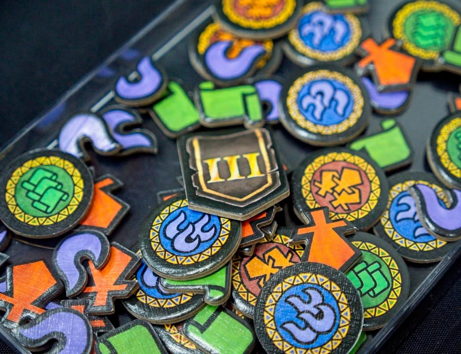
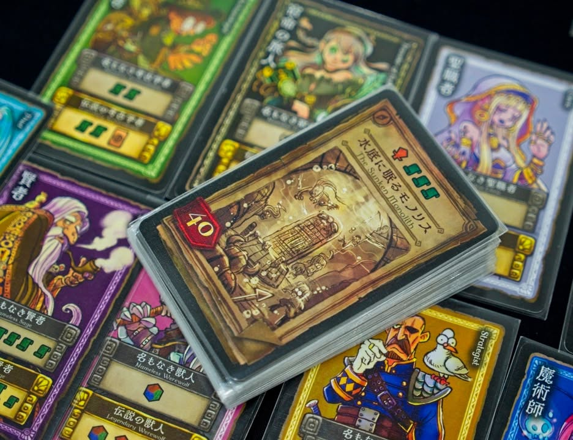

Fellowships of fate เป็นเกมคั่นเวลาที่ได้ลองเล่นตอนแวะไปงาน TIBM ซึ่งอันนี้ไม่ใช่เกมทำมือนะแต่เป็นเกมที่ค่ายไทยกำลังจะเอามาแปล (เข้! พูดได้ใช่ไหมนะ?) #bite_size

.
ว่ากันสั้นๆคือ ดีกว่า Witch's Brew เยอะ!

.
ส่วนยาวหน่อยคือธีมมันประมาณว่าเราจะมีการ์ดฮีโร่หน้าตาเหมือนกันอยู่ชุดหนึ่ง เป้าหมายคือการสะสมทรัพยากรไปบุกตะลุยดันเจี้ย!!

.
ซึ่ง translate ง่ายๆว่าคือสะสม สัญลักษณ์ ดาบ/เวทย์/ความรู้ ไปแลกการ์ดดันเจี้ยนมาเป็นแต้ม อันเป็นกลไก set collection ยอดนิยมทั่วไป

.
กระบวนการคือแต่ละคนจะเลือกการ์ดฮีโร่มา 4 ใบ จากนั้นผลัดกันลงทีละใบโดยที่ลงได้สองแบบ คือแบบเอาของเลยแต่จะได้น้อยหน่อย กับอยากได้ของแยะ แต่ว่าของมันจะได้ตอนที่วนกลับมาตาเรา 

.
เพราะไอ้แบบได้เยอะอ่ะ ถ้าคนอื่นมันลงตัวเหมือนเราลงมาเราจะอดได้ของไปเลย ซึ่งก็เป็น high risk high return กันไป แล้วพอเล่นๆไปก็จะมีการแย่งอัพเกรดอีโร่เราด้วยทำให้ได้ของเยอะขึ้น

.
กลไกแบบนี้ปกติจะเรียก double guessing เพราะว่าทุกคนมีของที่มองเห็นเหมือนกันก็พยายามหยิบการ์ดที่เสกของที่ตรงกับที่อยากได้มา แต่ว่าพออยากได้ของเยอะก็ต้องพยายามเดาเพื่อ out played เพื่อนด้วย

.
ซึ่งมันดีกว่าเกมอื่นตรงเกมอื่นมันจะให้เปิดพร้อมกัน คือถ้าชนกันนี้มันจะเหนื่อยมากๆเพราะไม่ได้อะไรเลย แต่เกมนี้มันสร้างจังหวะให้เกิดการรอดูทิศทาง ทำให้เรารู้สึกถีงการควบคุมมากขึ้น

.
ผมชอบนะ ก็เป็นเกมเฮฮาๆดี แต่ก็แอบเสียดายคิดว่าเกมมันน่าจะลึกได้มากกว่านี้อีกซักครึ่งเสต็ป แต่รวมๆคือใครมองหา filler สนุกๆในกลุ่ม gateway ที่สายเก๋าก็ยังเล่นเพลินๆนี้ก็แนะนำเลย (เค้าบอกว่าจะแปลแต่ผมไม่รู้ว่าเมื่อไรจะมา กับตัวเกมมีสองภาษา EN/JP นะ)

.
[non-sponsored post] เอามาเล่าให้ฟังเฉยๆไม่ได้รับตังมาโปรโมต

--------------------------------
หมวด Bite Size (พอดีคำ) นี้กะว่าจะเขียนอะไรสั้นๆประมาณนี้ล่ะกัน ใหม่บ้าง ซ้ำบ้าง เกมที่ขี้เกียจเขียนบ้าง เขียนๆไว้ก่อนเผื่อมีอารมณ์อาจจะขยายไปลง Thought บ้าง จริงๆอยากเขียนสั้นกว่านี้ แต่ยังอดไม่ได้ที่จะต้องอธิบายอะไรเพิ่มตามนิสัย เดี๋ยวค่อยๆปรับไปล่ะกัน

