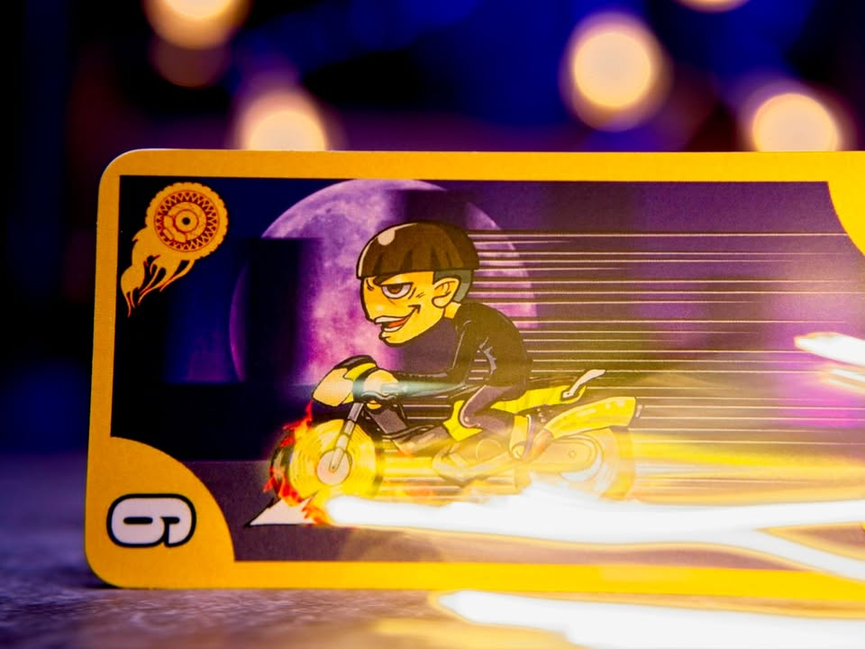
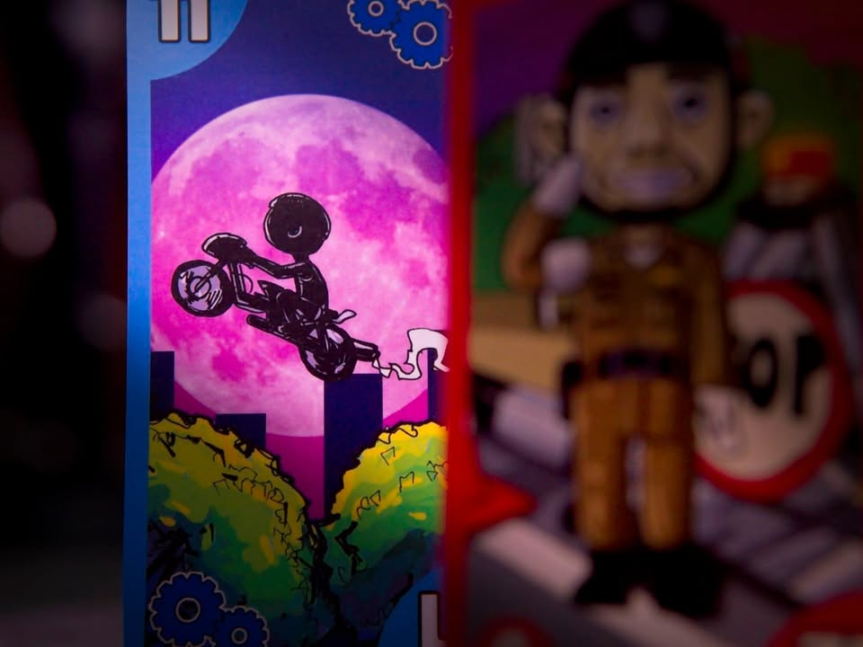
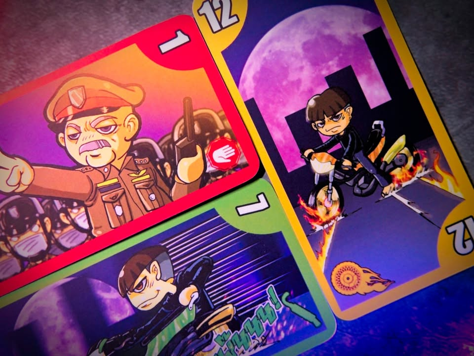
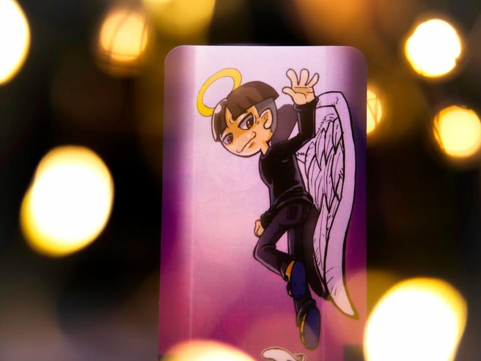
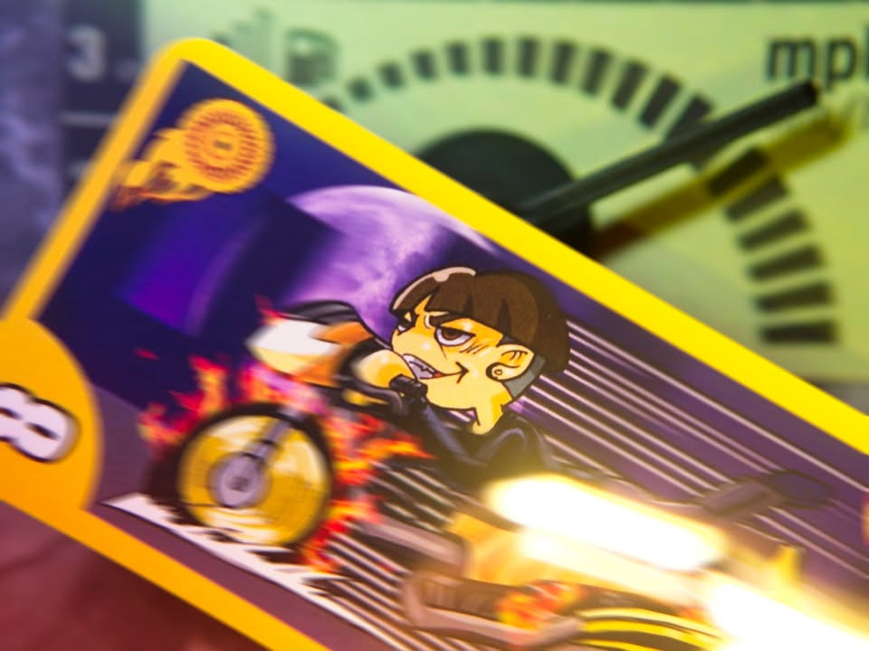

Trick Speed เป็นอีกหนึ่งเกมทำมือที่นำมาขายในงาน TIBM - ตลาดนัดบอร์ดเกมอินดี้ โดยจะเป็นการ์ดเกมแนว Trick-taking หรือเกมแนวกินรวบกองกลาง ผลงานของวุฒิกร เหล่าชูเจริญกิจ

.
ไอเดียของเกมคือเราจะมีการ์ดอยู่ 5 สีโดนเป็นการ์ดเด็กแว้นมอเตอร์ไซซะสี่ ส่วนอีกอันคือเจ้าหน้าที่ตำหนวดที่จะมาจ้องจับแก๊งนักซิ่งของเรา เกมก็เริ่มแบบ Trick taking ทั่วไปคือมีคนนำลงการ์ดมาใบหนึ่ง คนที่เหลือก็ต้องเล่นสีเดียวกันตามๆมา พอลงครบทุกคนใครลงใบใหญ่สุดก็จะได้กองนั้นไป

.
ทีนี้เกมจะมีทวิสคือจะมีการสุ่มการ์ดมาใบหนึ่ง (ที่แจกไม่หมด) เพื่อจะบอกว่ารอบนี้มีสีพิเศษที่จะใหญ่กว่าใบที่คนเล่นนำใช้อยู่ด้วย พร้อมกับสามารถทิ้งการ์ดที่เลขตรงกันเพื่อทิ้งการ์ดที่ไม่ต้องการและเก็บใบที่อยากใช้เอาไว้รอบถัดไปได้

.
จุดน่าสนใจอีกอย่างคือระบบแต้มที่จะเอากองที่ได้คะแนนมาเรียงกันเป็นแต้มยิ่งแว๊นทำคะแนนได้ต่อเนื่องท่อดังก็จะได้แต้มทบกันแรง ในขณะที่กองไหนมีพี่ตำรวจอยู่ด้วยจะกลายเป็นติดลบแทน

.
ในความรู้สึกส่วนตัวต้องบอกก่อนว่าผมไม่ค่อยได้เล่นเกมแนวนี้เยอะเท่าไร แต่ผมนึก mindset ที่จะใช้เล่นเกมนี้ไม่ค่อยออกว่าต้องคิดแบบไหนดี อันเกิดจากการที่เกมมันควบคุมหรือวางแผนอะไรได้ไม่เยอะ คือจะเล่นแนวคิดๆก็อ้าวมันมีการ์ดสีที่เจ๋งกว่าคนนำโผล่มาเรื่อยๆ กลายเป็นมือฉันทำอะไรได้บ้าง สุดท้ายก็โดนบังคับลง หรือถ้าเล่นมุมเอาฮามันก็จะกลายเป็นเกมแข่งกันหาทางยัดตำรวจให้วงแข่งเพื่อนเฉยๆไหมนะ? คือมันไม่ได้มีอารมณ์ต้องคิดเท่าไรว่าอยากลงอะไรเพราะคนลีดมันบังคับท่ามาอยู่แล้ว เหมือนเกมวัดใจว่าจะโดนยัดตำรวจไหมมากกว่า

.
คือผมรู้สึกว่ามันมีไอเดียที่น่าสนใจนะ แต่ execution รู้สึกไม่คมเท่าไร ทั้งนี้ทั้งนั้นลองเล่นดูก่อนได้ เพราะจริงๆแล้วอาร์ทเกมนี้มันกวนๆดี มีความล้อเลียนวัยรุ่นสองล้อและเหล่าผู้พิทักษ์กฎหมาย เอาไปเล่นถูกวงอาจจะเฮฮาก็ได้ พอดีผมไปลองเล่นกับวงจริงจังเกมมิ่งหน่อยแล้วก็งงๆกันว่าจะต้องเล่นยังไงกันนิ

.
สนใจก็ติดต่อ Level Up+ Board Game Cafe ได้เลย เห็นว่ากำลังจะเริ่มฉบับพิมพ์ครั้งที่สองล่ะ

.
[disclosure] นักออกแบบส่งเกมมาให้ลอง (พอดีที่งาน TIBM ไม่มีจังหวะไปเล่นเลย) แต่การแสดงความเห็นเป็นสิทธิ์ของผมตามปกติ ไม่ได้มีการรับตัง
--------------------------------
หมวด Bite Size (พอดีคำ) นี้กะว่าจะเขียนอะไรสั้นๆประมาณนี้ล่ะกัน ใหม่บ้าง ซ้ำบ้าง เกมที่ขี้เกียจเขียนบ้าง เขียนๆไว้ก่อนเผื่อมีอารมณ์อาจจะขยายไปลง Thought บ้าง จริงๆอยากเขียนสั้นกว่านี้ แต่ยังอดไม่ได้ที่จะต้องอธิบายอะไรเพิ่มตามนิสัย เดี๋ยวค่อยๆปรับไปล่ะกัน

