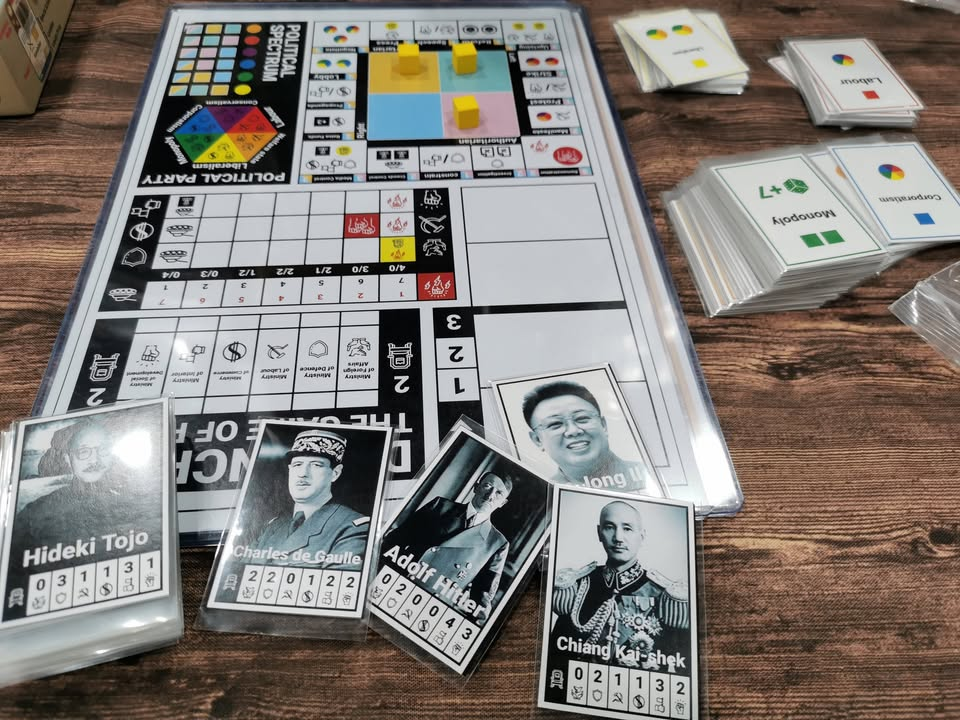
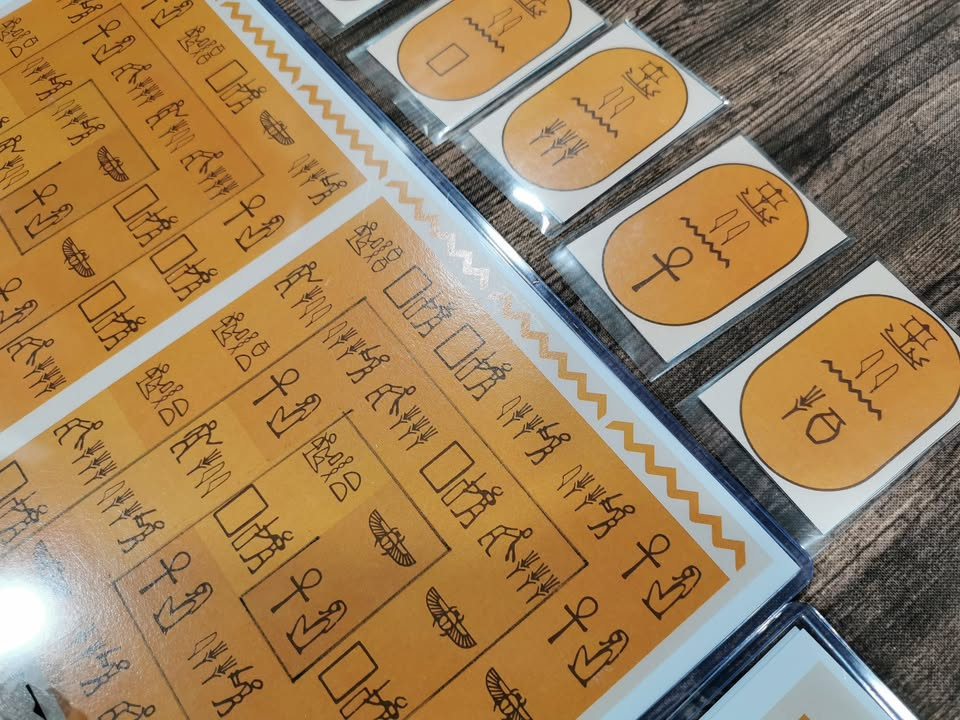
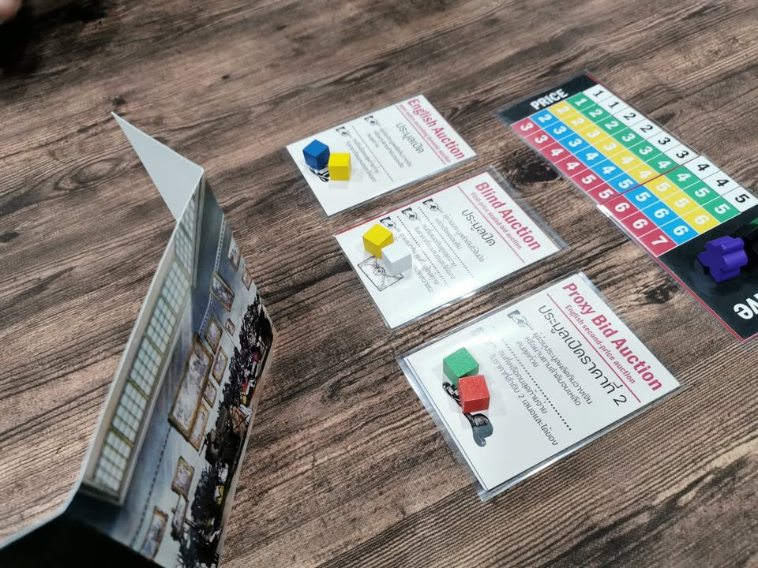
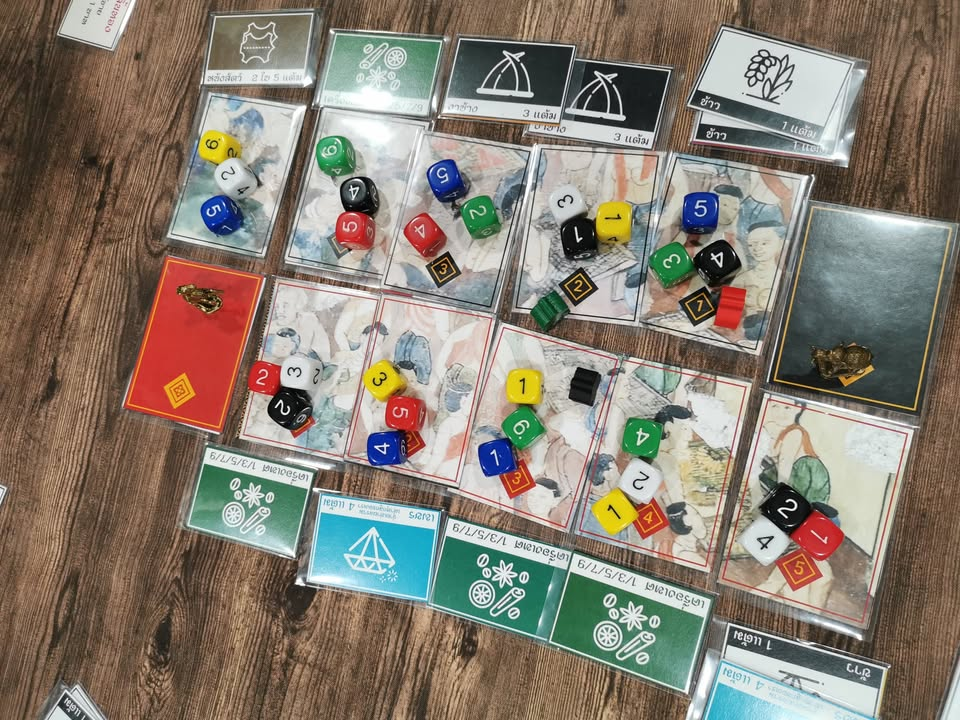

วันนี้มีโอกาสเทสเกมไป 4 เกมจากคุณ Kittitath Tanyavanish เจ้าเดียวกับที่ทำเกม Pax Ayutthaya (ชื่อชั่วคราว) ที่มารอบที่แล้วนะ และ 4 เกมที่ว่านี้มันเกมใหม่ทุกเกม!! ด้วยอัตรานี้  Vatcharis ArmArs Thanomsub ต้องมีหนาวบ้างแหละ

.
//-------------------------
เกมแรกธีมประมาณว่าตลาดขายของในอยุธยา ไอเดียจะเป็นหมากหลุม (มาคาล่า) ที่เราจะหยอดลูกเต๋าสีไปรอบๆแทน ตัวลูกเต๋าจะแทนทักษะของพ่อค้าของผู้เล่น ตลาดไหนใครมีเลขน้อยสุดจะต้องขายของจากมือเข้าตลาดเป็นเงิน ในขณะที่คนที่เลขเยอะสุดจะต้องซื้อเหมาแข่งในราคาตาเลขเต๋า ความน่าสนใจก็จะอยู่ที่การทวิสให้มีการซื้อและขายเพื่อบริหารเงินด้วย ไม่ได้มีแค่จ้องจะทำมูฟที่ดีทีสุดเพื่อ set collection ให้จบๆไป รวมถึงต้องบริหารความเสี่ยงจากการที่เพื่อนขยับเต๋าของเรา ตัวเกมมีพวกทักษะแหกกฏหลายอัน สนุกดี คิดว่าทำอีกหน่อยก็ขายได้ละ

.
//-------------------------
เกมที่สองที่คิดว่า complete ที่สุดในวันนี้ ในบางแง่มุมผม enjoy กว่า Modern Art อีก เป็นเกมที่เราจะมาประมูลเพชรพลอยเมืองจันทบุรี (ก็ธีมหลวมๆอ่ะนะ)  แต่ที่น่าสนใจคือเกมนี้ใช้ระบบประมูล 30+ แบบที่ -ไม่ซ้ำ- กันเลยแม้แต่ใบเดียว ไอเดียเกมก็ไม่ยุ่งยากอะไรคือจะมีการสุ่มใบกติกาประมูลพร้อมกับวางพลอยไว้ 2 เม็ด ถึงตาใครก็หยิบมาพร้อมกับเลือกว่าตัวเองจะประมูลด้วยเพื่อเอาของ หรือทำตัวเป็นคนจัดงานที่จะได้เงินที่คนอื่นประมูลของไป เกมก็มีกลไกเรื่องการเพิ่มมูลค่ากับเก็บชุดเพิ่มเพื่อไปเป็นแต้มทีหลังอีกต่อ

.
จริงๆที่ชอบอีกอย่างคือเป็นเกมที่ใส่ favor text ประวัติการประมูลเข้าไปด้วยน่าจะสวยดี

.
//-------------------------
เกมที่สามนี้โคตรชอบในการใช้ไอคอนอธิบายเกมเพราะเอาเฮียโรกลิฟส์มาทำเป็นตัวบอกเลยว่าช่องแอคชั่นจะทำอะไร  ไอเดียคือเราจะต้องแข่งกันจ้างคนงานแบกหินของเราเดินวนๆเพื่อไปทำแอคชั่นของพีระมิดแห่งกีซ่าทั้งสาม   ตัวเกมจะค่อยๆให้เราจ้างคนงานกลิ้งหินเราไปพร้อมกับทำแอคชั่นตรงที่เหยียบไปเรื่อยๆ ทรัพยากรก็จะเอามาวนเพื่อจ้างคนงานเก่งๆมาแหกกติกาเพิ่ม

.
ข้อเสียของเกมคือมันอธิบายให้เข้าใจแต่แรกยากว่าจะต้องทำอะไรบ้างเป็นเกมที่ค่อนข้าง Opque แบบเล่นไปจะจบค่อยอ่อออออออ ซึ่งตลาดบ้านเราค่อนข้างใจร้ายกับเกมระดับกลางที่กว่าจะเก็ทก็ตอนจบเกมพอควร (คือเกมมันสนุกตอนซ้ำรอบสองสามแต่คนเห็นรอบแรกไม่ฮุกก็ไม่ซ้ำละ) แต่ถ้าแก้ตรงเรื่องอธิบายกับโน้นนี้อีกนิดหน่อยก็เป็นเกมที่สนุกนะ 

.
//-------------------------
เกมที่สี่นี้ออกแนวลองไอเดียมากกว่าก็ลองคุยรับส่งกันหลายท่าอยู่ แต่เท่าที่ลองแล้วคิดว่าอาจจะไปทำต่อคือเป็นเกมแนว bidding โดยใช้คนงานลูกเต๋าเดินไปมาตามช่องแอคชั่นที่มีธีมเป็นไพ่ทาโรต์ จะเอาเต๋าไปลงเพื่อทำแอคชั่นก็ได้ หรือจะโยกเต๋าเดินจากกระดานก็ได้แต่ว่าเลขน้อยจะเดินไกลกว่า แต่ก็มีพลังบิดสู้เค้าไม่ได้ เกมนี้ยังค่อนข้างวุ้นๆอยู่แต่คิดว่าเป็นเกมสองคนที่น่าจะไปทำอะไรต่อได้แหละ

.
//-------------------------
เกมห้าไม่ได้เล่นแต่เป็นฉบับปรับปรุงของ Democrazy : The Game of Power เกมส่ง สส. มาโหวตแย่งเก้าอี้ รมต ในสภาที่เคยเล่นรอบก่อน เค้าทำออกมากระฉับขึ้นมาก พร้อมกับใส่ความโรลเพลย์ไปอีกขั้นด้วยเหล่าผู้นำที่สื่อถึงระบบการปกครองของตัวเองที่อาจจะเอามาจับคู่สนุกๆอย่างพี่คิมกับเสรีภาพสุดขั่วงี้

.
เค้าบอกว่าผู้นำไทยก็อยากใส่นะแต่พอดีลูกยังไม่โตขอผ่านก่อน......

.
//-------------------------
ช่วงนี้มีโอกาสเล่นเกมสนุกๆจากนักออกแบบไทยบ่อยก็ดีใจมากจริงๆครับ ตอนนี้คือหวังแค่ตลาดกับค่ายไทยละว่าพร้อมรับขนาดไหน หรืออย่างน้อยๆก็อยากให้มีระบบ self publish ที่้แข่งแกร่งทำราคาในระดับโอเคจนนักเล่นที่ติดตามผลงานสามารถซื้อกันได้เนี่ยแหละ หวังว่าตอนไปงาน ตลาดนัดบอร์ดเกมจะมีอะไรสนุกๆให้เล่นอีก

.
ส่วนนักออกแบบคนไหนถ้าว่างแล้วอยากหาคนเทสก็ลองมาคุยได้ครับ แต่ปกติผมสะดวกแค่ที่บ้านแถวสวนสยามนะ

.
ส่วนอันที่เทสรอบก่อนอยู่ตรงนี้ - https://www.facebook.com/boardnbon/posts/799841605483221

