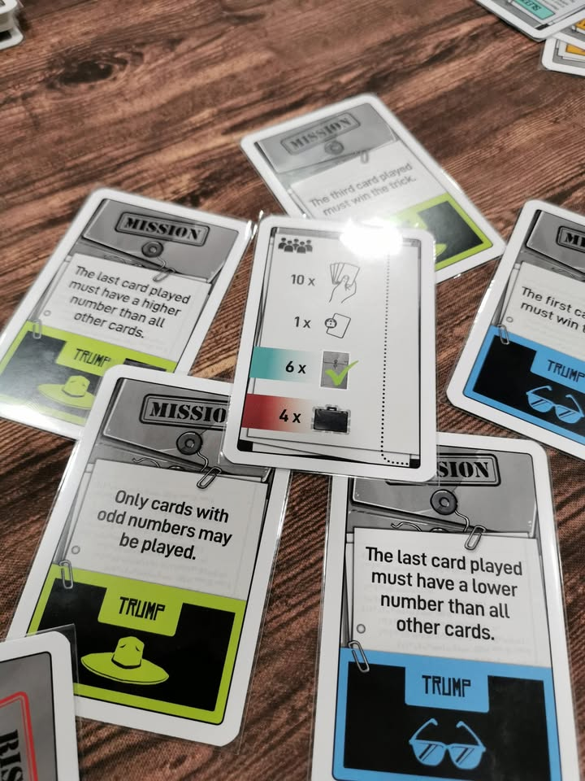

Inside Job #first_impression 

เกมจั่วหัวไว้ว่าเป็น The Mostly Cooperative Trick-Taking เพราะว่าในบรรดาสายลับที่มาร่วมทำภาระกิจนั้นจะมีอยู่หนึ่งคนที่ไม่อยากให้ทุกคนประสบความสำเร็จ!

.
เกมนี้หมอพีท Heavy Meeple บอกไว้ว่าอยากได้จนต้องไปสั่งตรงจากอเมซอนเลยทีเดียวนะ

.
ไอเดียเกมมันก็ Trick-Taking นั้นแหละแต่จะมีทวิสคือผู้เล่นจะได้เปิดดูการ์ด mission 2 ใบแล้วเลือกมาใบหนึ่งตัวการ์ดมิชชั่นจะบอกว่าต้องเล่นการ์ดจากมือแบบไหนทุกคนถึงจะภาระกิจสำเร็จ รวมถึงกำหนดสี Trump หรือสีที่การันตีว่าชนะสีอื่นเสมอไว้ด้วยกัน ภาระกิจมันก็ประมาณต้องเล่นคู่เท่านั้น หรือเล่นให้เลขสูงขึ้นเรื่อยๆ ไรงี้ ไม่ได้เข้าใจยากอะไร

.
พอได้มิชชั่นแล้วเราก็จะผลัดกันลง คนนำก็ลีดสีคนอื่นก็ลงตามแต่ถ้าไม่มีสีตรงก็ลงใบอื่นได้ แต่ถ้าคุณเป็นคนทรยศละก็จะลงอะไรก็ได้นะไม่ต้องสนกฎนี้ (แต่ต้องระวังคนอื่นจับได้) เกมมีทวิสอีกนิดตรงทีเราสามารถทิ้งกระเป๋าข้อมูลลับ (intel) เพื่อเปลี่ยนสีการ์ดได้ และผู้เล่นที่ชนะใน trick (รอบ) นั้นจะได้กระเป๋าไปเป็นรางวัล

.
เกมจบเมื่อฝ่ายสายลับชนะมิชชั่นถึงจำนวนหนึ่ง หรือคนที่เป็นคนทรยศเก็บ intel ได้ถึงจำนวนหนึ่ง หรือถ้าทำมิชชั่นครบแล้วยังไม่มีใครชนะเราก็จะมารุมโหวตหาคนทรยศแทน

.
ส่วนตัวคิดว่าก็เพลินๆดี จะมีข้อเสียนิดหน่อยตรงตอนอธิบายให้คนไม่เข้าใจคำว่า Trick-Taking มันวุ่นวายนิดนึงเพราะระบบเกมมันเสริมมาจากตรงนี้ แต่ถ้ารู้แล้วก็บอกส่วนที่ต่างได้ทันที ทวิสของเกมที่ตอนแรกคิดว่ามันขาดๆเกินๆแต่เอามารวมก็เออไปกันได้มากกว่าที่คิดเยอะคือมันเสริมความ duduction ไปว่าใครมันทิ้งมั่วกะพังมิชชั่นว่ะหรือมันไม่มีการ์ดจริงๆนะ ใครชอบพวกแนว Trick-Taking อยู่แล้วก็คิดว่าน่าลองอยู่ แต่ถ้าอยากได้ deduction หาคนโกงเข้มๆคุยเยอะแยะนี้กลับไปเล่นอวาลอนได้เลย

--------------------------------
หมวด Bite Size (พอดีคำ) นี้กะว่าจะเขียนอะไรสั้นๆประมาณนี้ล่ะกัน ใหม่บ้าง ซ้ำบ้าง เกมที่ขี้เกียจเขียนบ้าง เขียนๆไว้ก่อนเผื่อมีอารมณ์อาจจะขยายไปลง Thought บ้าง จริงๆอยากเขียนสั้นกว่านี้ แต่ยังอดไม่ได้ที่จะต้องอธิบายอะไรเพิ่มตามนิสัย เดี๋ยวค่อยๆปรับไปล่ะกัน

