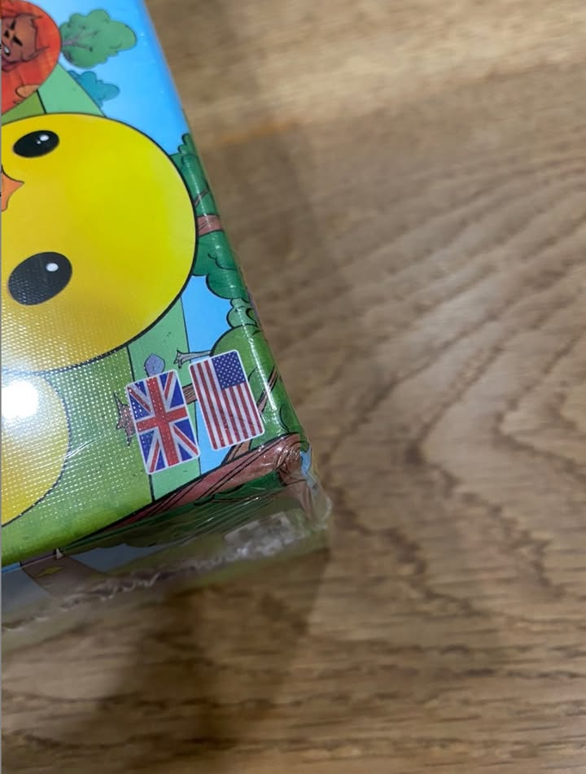

#เล่าไปเรื่อย พอดีเห็นเพจ 'บอร์ด "นิวส์" เกมส์ - Board Game' (เพจเค้าแท็กยากเหลือเกิน...) เค้าลงเกม Challengers ไว้ก็เลยเออหว่ะ กดไปเล่นกะที่ทำงานดีกว่า ซักพักร้านเค้าติดต่อมาเพื่อบอกว่าพอดีกล่องบุบยังจะรับอยู่ไหมพร้อมกับส่งรูปมาให้ดู.....
.
.
.
.
ผมก็แบบว่า.....นี้มันบุบแล้วเหรอว่ะ!!!! คือสำหรับผม  ถ้าไม่บอกผมคิดว่ามันเป็นรอยธรรมชาติตามสภาพกล่องกระดาษด้วยซ้ำ

.
โอเค..คือผมเข้าใจแหละว่า damage tolerance ของคนมันมี spectrum ที่กว้างแล้วก็หลากหลายมากๆเพราะมุมมองทางความคิดมันไม่เหมือนกัน ทางร้านก็ต้องเจอลูกค้าหลายแบบการพูดคุยสอบถามกับลูกค้าก่อนนี้ก็เป็นเรื่องที่ถูกต้องมากๆครับ (จริงๆร้านเค้าใส่ใจดีเลยทักมาทั้งช่องทาง platform, fan page, ผ่าน muture friend ใน fb แต่พอดีเคสนี้พอดีผมมีช่องทางติดต่อหลายทางอ่ะนะ) 

.
แต่คิดแล้วก็เหนื่อยแทนทุกร้านจริงๆ (คือผมเป็นสายที่ก็ไม่ได้รักษ์โลกขนาดนั้นแต่ก็ไม่เข้าใจว่าจะต้องห่อพลาสติกเยอะขนาดนี้เลยเหรอว่ะกับทุกสินค้าในโลกเนี่ย บางทีก็งงๆเหมือนกัน)

.
ถ้านอกเรื่องไปเรื่องใกล้เคียงก็เวลาไปดูพวกดราม่าการซื้อขายหลายๆครั้งมันก็เกิดจากเรื่องการมองคุณค่าต่อราคาในมุมที่แตกต่างกันอยู่เหมือนกัน อย่างด้วยความที่ผมเป็นคนสไตล์ขี้เกียจ ถ้าเจอคนซื้อสไตล์ขอดูมุมกล่องหน่อยเนี่ยก็รู้สึกละว่าจริตไม่ตรงกันแน่ๆ เลยมักจะได้ซื้อขายกับคนที่มี passive mindset ประมาณว่าของราคาเท่านี้ควรคาดหวังประมาณไหนหรือมีมุมมองต่อการใช้งานบอร์ดเกมที่ใกล้เคียงกันมากกว่า 

.
ซึ่งใดๆก็แล้วแต่การที่คนขายพยายามให้ข้อมูลให้มากที่สุดก็เป็นเรื่องดีครับ ถ้ามีอะไรอยากจะบอกก็คือสายเนี๊ยบอย่าไปคิดว่าคนอื่นเค้าเนี๊ยบเหมือนเรา กับสายชิลก็อย่าไปคิดว่าคนอื่นเค้าชิลกันหมด คุยกันให้ดีก่อนนะ ไอ้ที่ชอบมาพูดๆกันว่า common sense น่ะไม่ได้ always หรอกนะ

