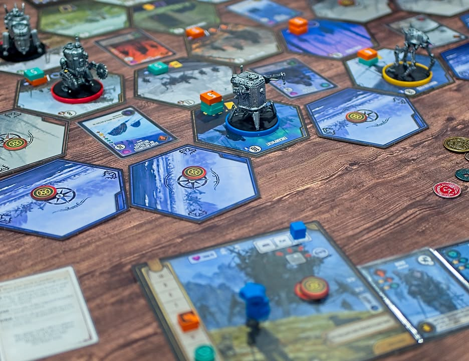
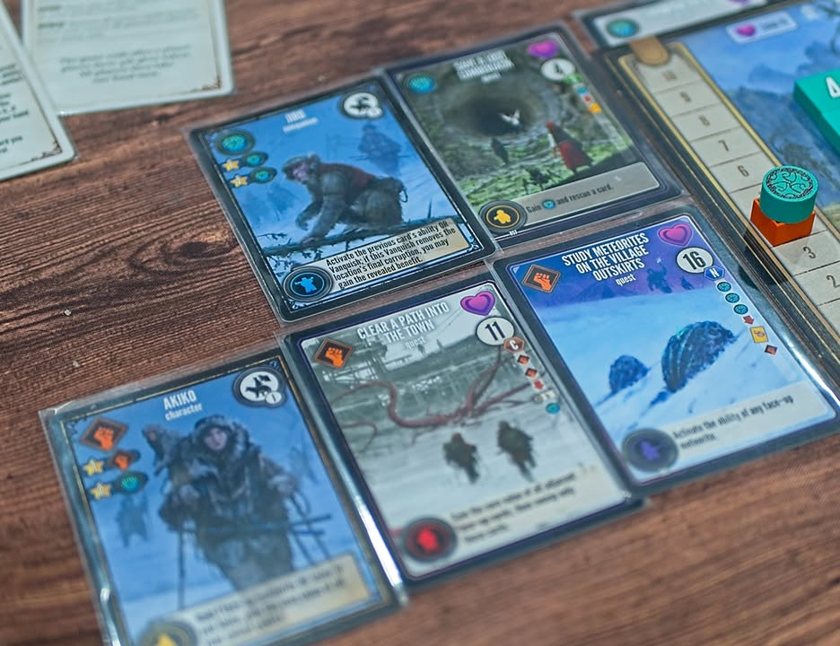
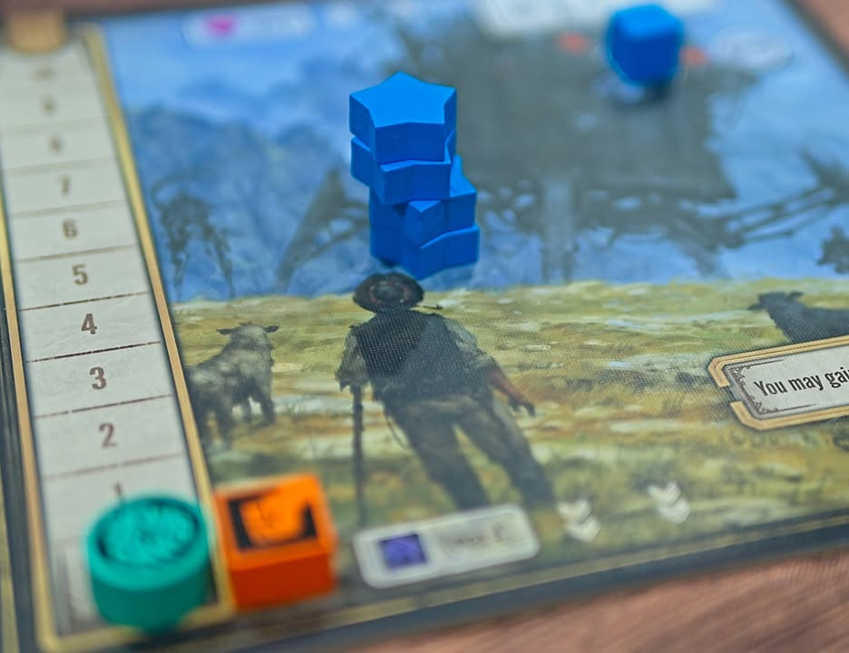
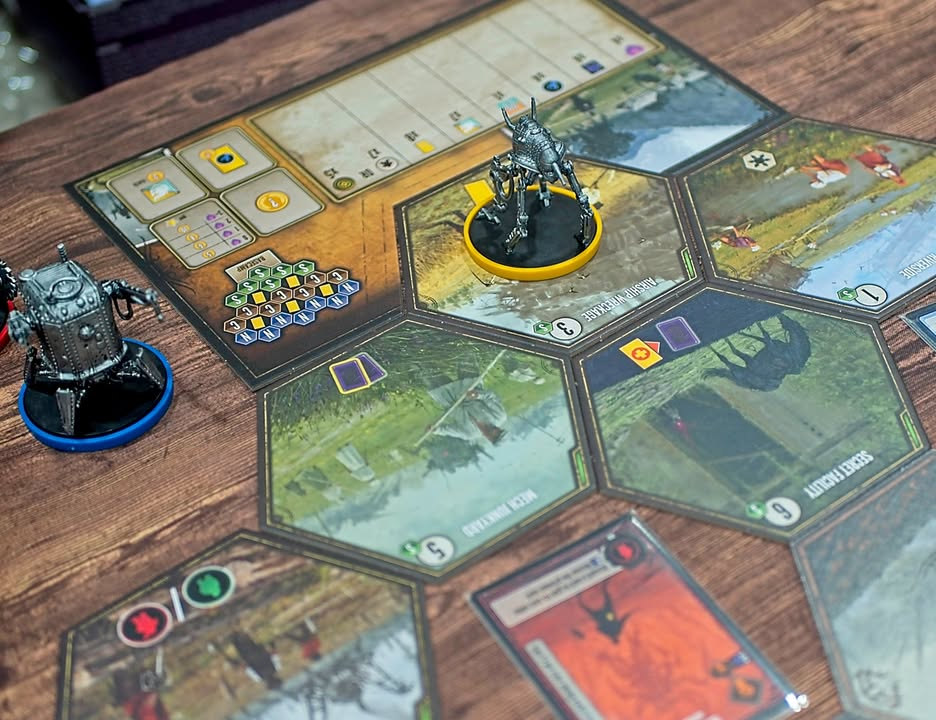
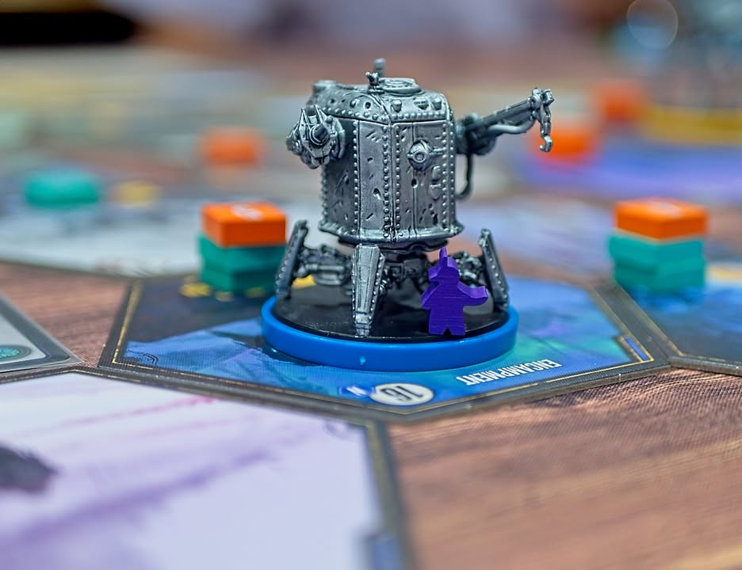

Expeditions #first_impression 

.
เกมใหม่ในจักรวาล 1920+ ที่ what if... ว่าในสงครามโลกครั้งที่หนึ่งเรามีหุ่น mech ออกมายืนรบกัน โดยตัว Expeditions นี้จะเป็นเกมที่ต่อเนื่องกันจากเกม เออ.... ทำ engine ปลดล็อกของยึดพื้นที่ ของสวยงานอาร์ทงามที่รู้จักกันดีอย่าง Scythe (hints.... โปรดอย่าเรียก Scythe ว่า 4X)

.
คือธีมเกมเนี่ยประมาณว่าสงครามใน Scythe จบไปเรียบร้อยคนในประเทศต่างๆก็อยู่อย่างสงบกันดี แต่อยู่ๆดันมีอุกกาบาตตกมาแล้วทำให้เกินความวุ่นวายบางอย่าง นานาประเทศก็เลยต้องมาออกสำรวจกัน

.
รูปแบบเกมจะไปทาง engine building ที่ใช้การ์ดในขับเคลื่อน ในตาหนึ่งๆเราจะได้เลือกทำแอคชั่น 2 จาก 3 อย่างคือ เดินขยับหุ่น หรือ ทำแอคชั่นในช่องที่หุ่นยืนอยู่ หรือว่าเล่นการ์ดที่เรามี ก็วนๆแค่นี้เลย แต่ว่าการ์ดมันใช้ได้แค่ครั้งเดียว ทำให้พอเล่นไปซักพักเราจะต้องเลือกที่จะ reset เพื่อดึงการ์ดให้วนกลับมาใช้ใหม่ และเกมนี้ไม่มีการตีกันนะ แนวยูโรเดินทำแต้มทั่วไป คือเกมมันมันจะผสมๆตลาดการ์ดกับแผนที่กับ worker placement  ให้ไปอยู่ที่เดียวกันเลย ตรงนี้ถือว่าสวย
 
.
ในช่วงแรกจะเป็นการให้เราเอาหุ่นไปเดินเปิดแผนที่ ทวิสที่น่าสนใจของเกมมีหลายอย่าง อย่างแรกคือความ multi use ของการ์ดที่โดยเบสิคแล้วมันจะได้ของทรัพยากรแค่นิดเดียวแต่ถ้าเรามี 'คนงาน' ที่เป็นทรัพยากรแบบที่ต้องไปเก็บมาตามไทล์ที่สีตรงกันกับการ์ดก็จะสามารถเอาไปยืนช่วยเพิ่มความสามารถการ์ดได้อีก ซึ่งคนมันจะวนกลับมาให้เราใช้ตอน reset

.
ตัวการ์ดยังมีหลายชนิดย่อยจำพวก passive, scoring แล้วก็ quest ไรงี้ โดยอย่างการ์ด quest คือเราจะต้องเดินทางไปในพื้นที่ๆการ์ดนั้นกำหนดแล้วก็ให้ตัวละครเราทำการเคลม ซึ่งพอทำแล้วเนี่ยการ์ดมันจะหายไปแต่กลายเป็นตัวคูณแต้มแทน พวกเครื่องมือหรือทำแต้มก็คล้ายๆกันคือเราต้องเลือกว่าจะเก็บมันวนใช้ความสามารถนานแค่ไหนดีก่อนที่เราจะแปลงมันไปเป็นอย่างอื่น

.
เกมเล่นกับ timing ค่อนข้างดี คือตัวไทล์แอคชั่นที่เราจะทำทำแอคชั่นเนี่ยมันจะมีสิ่งที่เรียกว่า corruption token เป็นไทล์มีเลขกำกับไว้ที่ผู้เล่นจะต้องมาช่วยกัน 'ขุด' มันออกไป เมื่อหมดแล้วแต่ละไทล์ก็จะมีแอคชั่นในหมวดที่เกี่ยวกับการเคลมแต้มเพิ่มขึ้นมาให้

.
เกมจะจบคล้ายๆกับ Scythe คือจบเมื่อมีการวาง 'ดาว' ครบ 4 ดวงโดยการจะวางดาวได้นั้นเราจะต้องสะสมเงื่อนไขบางอย่างให้ครบก่อน ซึ่งมันก็จะมีหลายหมวดหลายสายแบบเก็บโน้นนี้ให้ครบ x ชิ้นไรงี้

.
โดยรวมผมชอบนะ คือถ้ามองจากมุมว่ามันมาจาก Scythe นี้ก็คือถือว่าต่อยอด puzzle วนๆ unlock ของที่ค่อนข้างนิ่งจากเกมเดิมได้ดี เพราะว่าเราไม่รู้เลยว่าการ์ดจะออกอะไรมา และ interaction ของการที่เราอยากทำ engine แต่ทำไม่ได้เพราะมีคนอื่นยืนขวางช่องนี้ก็ขัดใจในแบบที่กำลังสนุกเลยคือมันบังคับให้เราต้องหาทาง work around ตลอดเวลา ไม่ใช่เกมก้มหน้าทำ engine งึมงำ 

.
ถ้ามีอะไรที่ไม่ชอบนิดหน่อยก็คงเป็นกล่องมันดูใหญ่ไปสำหรับเกมประมาณนี้กับหุ่นมันไม่ค่อยเท่อ่ะ...... แต่เอาจริงๆก็ด้วยธรรมชาติของการ์ดเกมมันก็มีช่วงแบบที่เราอยากได้การ์ดบางแบบแต่มันเปิดไม่เจอซักที หรือเปิดมาโดนเพื่อนล้างทิ้งไปก่อนไรงี้ก็ชวนหงุดหงิดอยู่เหมือนกัน กับแม้ว่าของจะทำมาสวยมาดี แต่ถ้ามองเทียบกับ Scythe ตัวกล่องใหญ่แล้วตัวนี้ราคาก็เอาเรื่องอยู่นะ แล้วก็คิดว่า 4-5 คนมันนานไปหน่อยเหมือนทำไว้ขายของมากกว่า คิดว่าซัก 3 คนกำลังดีไม่งั้นจะรอน๊านนานจนหงุดหงิด

.
ใครมองหาเกม engine building ระดับกลาง หรือชอบ Scythe จากแง่มุมทำ puzzle ของมัน แต่ว่าอยากได้อะไรที่มันไม่นิ่ง มีบรรยากาศของการขัดขากันอยู่ในที แต่ก็ยังเป็น racing game ที่วิ่งแข่งทำแต้ม ก็แนะนำครับ แต่ถ้าอยากได้เกมเน้นปะทะ (ซึ่ง Scythe เดิมมันก็ไม่ได้มีอ่ะนะ บางจ๋อย) ก็ข้ามไปได้เลย

.
ขอบคุณหมอพีท Heavy Meeple ด้วยครับที่หยิบมาให้เล่น

--------------------------------
หมวด Bite Size (พอดีคำ) นี้กะว่าจะเขียนอะไรสั้นๆประมาณนี้ล่ะกัน ใหม่บ้าง ซ้ำบ้าง เกมที่ขี้เกียจเขียนบ้าง เขียนๆไว้ก่อนเผื่อมีอารมณ์อาจจะขยายไปลง Thought บ้าง จริงๆอยากเขียนสั้นกว่านี้ แต่ยังอดไม่ได้ที่จะต้องอธิบายอะไรเพิ่มตามนิสัย เดี๋ยวค่อยๆปรับไปล่ะกัน

