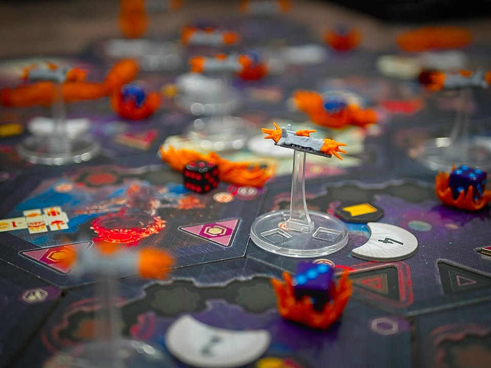
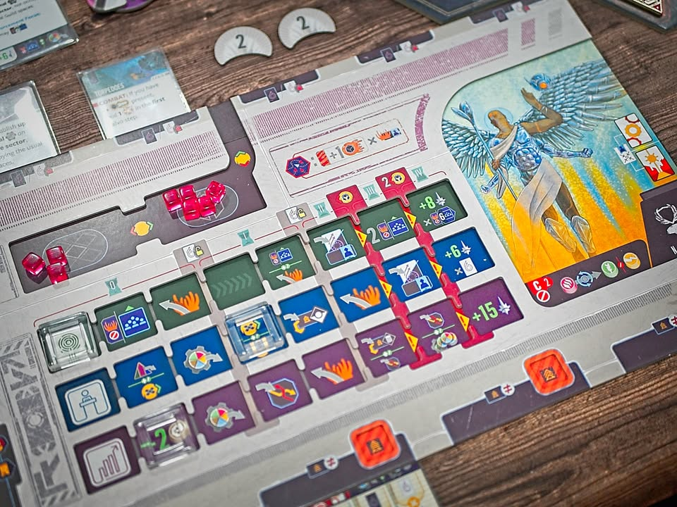
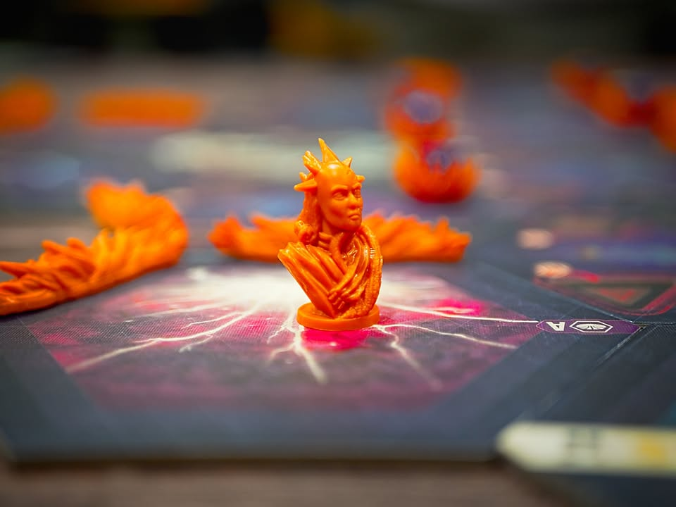

Voidfall #first_impression 

verdict: เกมยูโรธีมอวกาศระดับหัวแถวของปี!!  แม้จะเป็น 4X ห่วยๆที่ไม่รู้จะยกคำนี้มาโปรโมทตอนระดมทุนทำไม ชื่อนักออกแบบกับคุณภาพเกมก็ขายได้แล้ว 

.
เกมยูโรระดับหนักธีมว่าในจักรวาลอันไกลโพ้นที่เราจะมาพัฒนาตระกูลของเราให้ยิ่งใหญ่

.
ในแง่การเล่นคือเกมมันเป็นแนว objective base ที่เราจะได้มีโอกาสหยิบการ์ดโน้นนี้มาช่วยในการคิดทำคะแนนของเรา ทุกครั้งที่ทำตามเงื่อนไขตอนจบรอบก็จะได้แต้มไป ทำให้ผู้เล่นแต่ละคนมีเป้าหมายในการพัฒนาอาณาจักรไม่เหมือนกัน

.
eXplore - ไม่มี - เป็น fixed map ที่มี random bonus นิดหน่อย ในมิติ 4X คือเบาบาง แต่เข้าใจได้เพราะว่านี้คือ heavy euro ที่ต้องพยายามลดการสุ่มที่มีผลในการสวิงเกมให้มากที่สุดจะได้เป็นเกมเน้นการบริหารทรัพยากร

.
eXpoilt + eXpand - พื้นที่ของเกมคือในแต่ละ sector จะสามารถสร้างกิลด์เอาไว้ผลิตทรัพยากรได้ตามใจเราเลยโดยแต่ละพื้นที่ก็จะแตกต่างกันนิดหน่อย

.
eXterminate - เป็นแบบไม่มีดวง 100% ระบบถ้าว่ากันง่ายๆคือพอบุกเข้าไปจะโดนป้อมปืนที่เค้ามีสอยเอา cube ออกก่อน จากนั้นก็ผลัดกันหยิบออกทีละอัน ว่าแบบง่ายๆคือเอาเม็ดไปเยอะกว่าก็ชนะแต่เราจะมีพวก tech มาโมตรงนี้นิดหน่อยเพิ่มความสามารถในการตี/ป้องกัน 

.
เกมเดินด้วยระบบใช้การ์ดที่ทุกคนมีเกือบเหมือนกัน (คือบางบ้านบางเผ่าจะเปลี่ยนการ์ดบางใบ) พอลงแล้วก็ทำแอคชั่นตามการ์ด ง่ายๆแค่นั้นเลย หนึ่งใบก็จะมี 3 แอคชั่นให้เลือกทำแค่ 2 อัน ก็จะเป็นพวกเก็บของ สร้างของ วิจัย เดินนาย ส่งไปตี ไม่มีอะไรซับซ้อน แต่มันยากตรงจำนวนแอคชั่นมันจำกัดแล้วเราก็อยากทำอะไรให้มันคุ้มๆ 

.
ระบบรองอื่นๆที่เอามาประกอบกันนั้นดีถึงดีมาก ทั้งการวิจัยที่มีสองขั้นและของมีจำนวนจำกัด การปลดล็อกเดินแทรคเพื่อเอาโบนัสระหว่างเล่น การทำตัวคูณแต้มเพื่อ shape การเล่น คือคิดกันดี งึมงำกันสนุกสนาน

.
สิ่งที่ดีอีกอย่างคือเผ่าเยอะมาก และแต่ละตัวจะมีสายย่อยอีก 2 สายให้ไปลองเล่นต่อ เกมมีการอธิบายอย่างดีว่าตัวไหนสายไหนควรเล่นอะไร

.
สิ่งที่ต้องระวังไว้คือเกมมี player interaction แบบ direct conflict ต่ำมาก อาจจะตีกันทีสองทีและไม่ได้ตื่นเต้นอะไร ขนาดผมเองเล่น setup ที่มีส่วนวาร์ปให้ตีกันง่ายๆยังแทบไม่รู้สึกอะไร ถ้าเล่นตามปกติก็เป็นเกมที่อยู่กับตัวเองเยอะหน่อย (ก็นักออกแบบเค้าเก่งเรื่องทำเกมเล่นกับบอทอ่ะนะ ออกแบบเกมแบบนี้ทำ automa ง่ายด้วย) แต่ก็ไม่ใช่ว่าไม่มีการตีกันนะเพราะเราต้องสร้างยานกันบ้านจาก NPC ตลอดแล้วก็การออกไปตบมันนี้ก็แต้มใช้ได้เลย เป็นอีกสายทำคะแนน

.
ในแง่ไอคอนมหาศาลนั้นคิดว่าไม่ได้ยากมากเทียบกับหลายๆเกม มีอันงงๆนิดหน่อยกับตัวมันเล็กๆแต่เล่นไปซักรอบสองรอบก็จำได้หมดละ แบบไม่ต้องพึ่ง player aid เลย (เพราะไม่มี.... ฮา) แต่ที่แน่ๆคือน้อยกว่า Perseverance เยอะ อันนั้นผมตาลอยเลย ม่ายไหว

.
เกมนี้ผมไม่ได้ซื้อดูผ่านๆใน KS แล้วมัน 4X ยังไงนิ  ไปตามอ่านฟอรั่มมาก็โอเค....อีโกนักออกแบบทะลุโลกเลยกู่ร้องว่านี้ไงๆๆเกมผมมันไม่ 4x ยังไง กับเอาจริงๆรู้อยู่แล้วว่า Mindclash ส่วนมาก setup นานสอนนานไอคอนเป็นล้านจนน่ารำคาญก็เลยรอออกมาก่อนละกัน แต่เล่นแล้วก็เออดีหว่ะ เกมดีย์ ดีจริง ใครสายยูโรเน้นทำ action คุ้มๆ unlock ยับๆ ไม่เน้น interaction แบบโดนตบทีพังยับ (และไม่มีปัญหากับ down time จากความ AP) ก็คือซื้อเลย!! 

.
ขอบคุณหมอพีท Heavy Meeple ที่หยิบมาให้เล่นกับช่วยสอนด้วยครับ เพราะทำใจซื้อเองไม่ได้จริงๆเกมนี้ หมั่นไส้คนออกแบบ...... ส่วนเล่นแล้วชอบมาก แต่ก็คงไม่ซื้อเพราะมันมีหลายอย่างที่น่าจะทำให้ไม่ค่อยได้กาง

