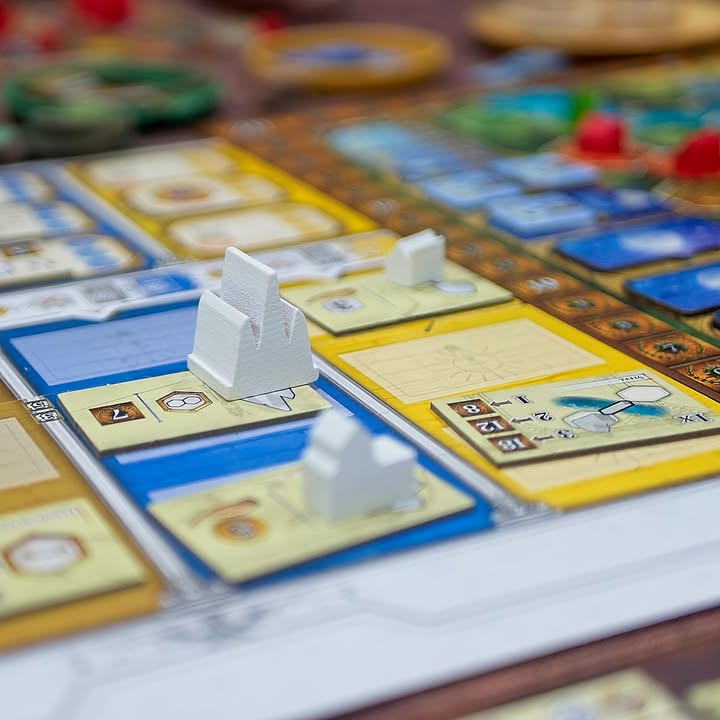
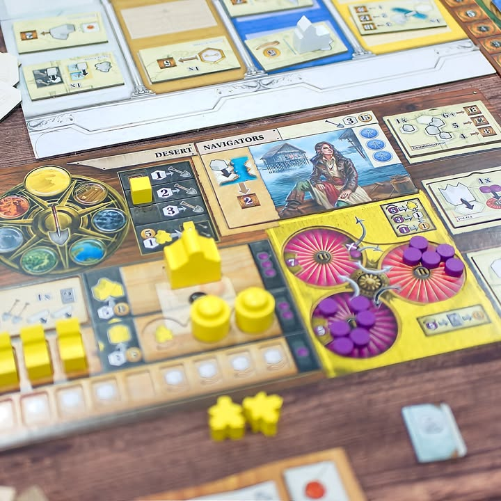

Age of Innovation #first_impression 

verdict: อีกหนึ่ง spin off จากเกมยูโรระดับท็อปที่ควรได้ลองเล่นซักครั้ง มีกลิ่นและรสเป็นของตัวเอง เสริฟรสชาติหลากหลายที่แฟนๆจะต้องชอบ!

.
เกมนี้เป็น standalone น้องใหม่จากจักรวาลของ Terra Mystica และ Gaia Project ที่ถ้าพูดแบบคนที่รู้จักสองเกมอยู่แล้วก็จะประมาณ Terra Mystica 1.5 หรือถ้าเทียบเป็น Brass ก็ตีซะว่า TM เดิมเหมือนตัว Lancashire ที่เกมเข้มข้นพลาดเป็นโดนล้อม ในขณะที่ AoI นั้นเหมือนกับ Birmingham ที่คลายตัวลงเล็กน้อยใสนมลงนิดหน่อยเหยาะอบเชยลงอีกนิดเพิ่มลีลาและความหลากหลายในการเล่นโดยที่ยังเข้มข้นอยู่ (ส่วน Gaia Project นี้ไปทางฟรีฟอร์มออกท่าสบายใจกว่า) 

.
พูดแบบลงรายละเอียดหน่อยมันก็ TM นั้นแหละ แต่เผ่าไม่ fixed ละ เปลี่ยนเป็นจะหยิบบอร์ด terrain type 7 แบบที่มีความสามารถประจำพื้นที่นิดหน่อย มาสุ่มจับคู่กับเผ่า 14 อันเพื่อให้เกิดส่วนผสมใหม่ๆ พร้อมกับเพิ่มไทล์ชนิดใหม่ให้มาวางอัพเกรดต่อเติมความสามารถได้อีก และ Stronghold ความสามารถยังไม่มีต้องรอสร้างก่อนค่อยหยิบไทล์ที่สุ่มมาในเกมนั้นเอามาประกบอีกที...คือเกมสุ่มไปได้หลายท่ามาก ใครไม่ชอบเกมคิดท่ามาจากบ้านก็ถูกใจแน่นอน

.
ของเล่นใหม่จริงๆคือ Innovation tiles ที่สุ่มมาในแต่ละเกม ไอเดียมันก็ไม่มีอะไร เป็นไทล์เสริมโน้นนี้แย่งกันหยิบธรรมดาแหละ แต่มันเพิ่มมิติในการเล่นได้ดีเลยเพราะทำให้แต่ละคนฉีกกันไปอีก และไอเดียสำคัญที่มันเพิ่มขึ้นมาคือสิทธิ์ในการวางตึก natural สีขาวจำนวนหนึ่งที่จะช่วยให้เราฟอร์มเมืองเพิ่มได้ง่ายและไวมากขึ้น (มีตึกนึงบอกนับเป็น 4 power แล้วขอแค่มี 2 ตึกก็สร้างเมืองได้แล้วไรงี้ โหดสัด)

.
[ถ้าไม่รู้จัก Terra Mystica เลย] แบบสั้นๆก็ไอเดียของเกมคือการที่เราอยากจะขยายพื้นที่สร้างบ้านเมืองของเราให้เยอะๆ แต่ว่าเราจะไปอยู่ที่ไหนเราก็ต้องปรับพื้นที่ให้เราอยู่อาศัยได้ก่อน โดยเกมมีพื้นที่ 7 ชนิดเรียงเป็นวงกลม อยากจะเปลี่ยนไปที่ชนิดติดกันก็จ่ายถูกหน่อย จริงๆเกมมันก็แค่นี้แหละ แต่ระบบรองแม่งเยอะแบบไม่รก แต่มีผลต่อการตัดสินใจหนักๆ ทำให้คิดกันหัวแตก... คือถ้าเขียนมันจะยาวมาก.... แบบสร้างบ้านติดกันได้โบนัสบางอย่างแต่อาจจะโดนล้อมเหงาออกไม่ได้, ระบบ blow of power ที่เราจะมาหมุนเม็ดพลังไปแลกโบนัส, ระบบเสาวัดอัพทำแต้ม บลาๆ

.
ส่วนตัวแล้วจุดที่ผมไม่ชอบใน TM  ก็ยังอยู่เหมือนเดิมนั้นคือ..... downtime นานสาดดดดดดดดดดดดอยู่เช่นเดิม เจอวงคิดนานคือเล่นมือถือรอ เพราะท่ามันเยอะ resources ก็น้อย โดนบล็อกแบบใครขยับมีร้องเหมือนเดิม  (แต่อย่างที่บอกคือภาคนี้มันดิ้นง่ายกว่าหน่อยเพราะมี Innovation Tile)

.
ถ้าบอก 3 กล่องนี้กล่องเดียวเอาตัวไหนผมก็คงเอา AoI เนี่ยแหละ (เหมือน Brass กล่องเดียวเอา Birmingham คือมันไม่ได้ดีกว่าแต่มันกลมกล่อมกว่า) แต่ถึงจะเหมือนตัวปรับปรุงแต่ถ้าไม่ชอบ TM อยู่แล้วก็ไม่น่าจะชอบ AoI อยู่ดีนะเพราะมันก็แบบเดิมนั้นแหละ ในขณะที่ชอบอยู่แล้วก็อาจจะไม่ชอบก็ได้เพราะเกมมันแหลมคมน้อยลงนิดหน่อย (แต่แลกกับความสุ่มที่หลากหลาย)

. 
ใครเป็นแฟนยูโรสายหนัก ไม่มีปัญหาคนลีลาคิดนานกับโดนตัดทีร้องเหี้ยก็แนะนำมากๆครับ

--------------------------------
หมวด Bite Size (พอดีคำ) นี้กะว่าจะเขียนอะไรสั้นๆประมาณนี้ล่ะกัน ใหม่บ้าง ซ้ำบ้าง เกมที่ขี้เกียจเขียนบ้าง เขียนๆไว้ก่อนเผื่อมีอารมณ์อาจจะขยายไปลง Thought บ้าง จริงๆอยากเขียนสั้นกว่านี้ แต่ยังอดไม่ได้ที่จะต้องอธิบายอะไรเพิ่มตามนิสัย เดี๋ยวค่อยๆปรับไปล่ะกัน

