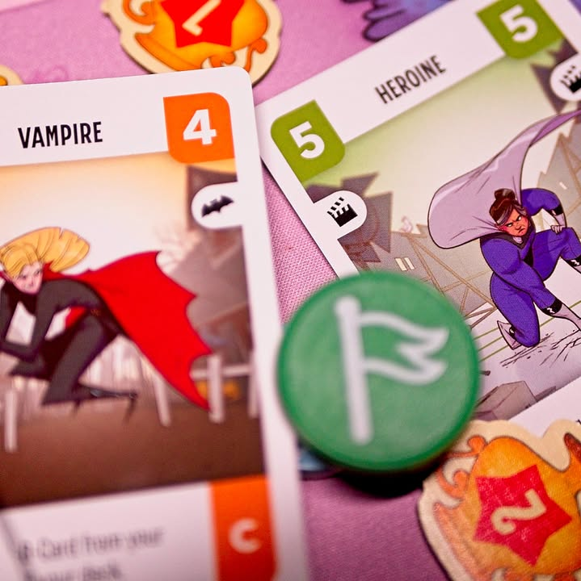
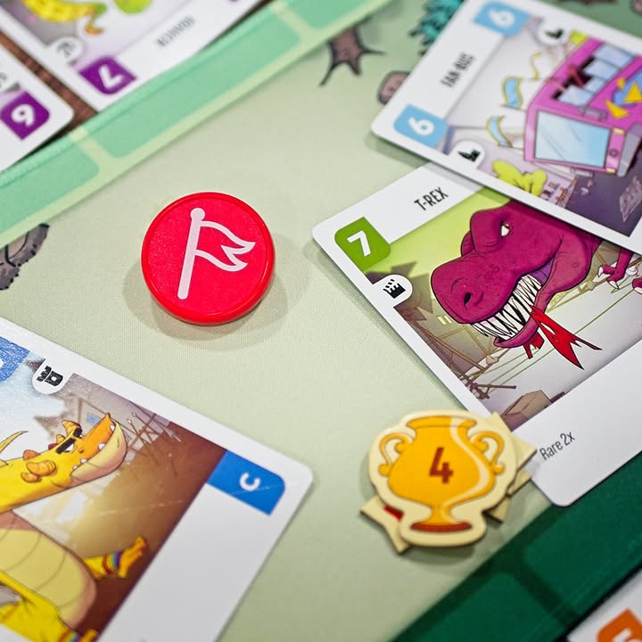

Challengers! #first_impression 

verdict:  เกมปั้นเด็คมาสู้กันแบบออโต้เน้นลุ้นเอาฮา สนุกเพลินๆเล่นพร้อมกันได้ถึง 8 คน

.
เกมนี้ซื้อมาแบบไม่ได้คิดมากอะไรเพราะเห็นเป็นเกมถ้วยดำ (2023 Kennerspiel des Jahres Winner) ซึ่งเล่นแล้วก็ฮาดีสมป้าย ตอนเล่นแล้วคิดถึงเกมสไตล์ Auto Chess อยู่หน่อยๆเหมือนกันนะ

.
ไอเดียคือเกมจะแบ่งผู้เล่นออกเป็นคู่ๆแบบเจอกันหมดเล่นกันเจ็ดรอบในแต่ละการแข่งขันผู้เล่นจะเริ่มจากเปิดการ์ดในเด็ค 1 ใบพร้อมวางธงเอาไว้ จากนั้นอีกฝ่ายก็จะเปิดเพิ่มไปเรื่อยๆจนมีพลังรวมมากกว่า พอถึงตรงนี้ฝ่ายที่แพ้ก็จะดีดการ์ดตัวเองออกไปนั่งข้างสนาม แล้วก็วนลูปจนผู้เล่นฝั่งใดฝั่งหนึ่งแพ้

.
ซึ่งเราจะแพ้ได้สองแบบ อย่างแรกแน่นอนคือกองหมดและอีกอย่างคือที่นั่งข้างสนามเต็มเพราะมันเก็บได้แค่ 6 แบบ ส่วนระหว่างเล่นนี้พวกการ์ดมันก็จะมีความสามารถของมันไปตามเรื่อง

.
ทีนี้พอจะเริ่มรอบใหม่ผู้เล่นก็จะมีโอกาสได้เติมการ์ด tier ต่างๆเข้าไปในกองตัวเองพร้อมกับคัดการ์ดที่คิดว่าไม่เหมาะออกไป เกมก็มีแค่นี้แหละ แต่การเพิ่มการ์ดก็ต้องระวังด้วย เพราะว่าถ้าใส่หลายชนิดเกินไปเวลาแพ้ที่นั่งข้างสนามจะไม่พอนะ

.
ส่วนตัวแล้วคิดว่าเหมาะกับผู้เล่นสายที่ชอบเล่นการ์ดเกมหรือพวกทำ engine deckbuilding คือเท่าที่ไปลองมาถ้าเป็นคนไม่อินก็จะแบบเรามาเล่นเกมอิหยั่งกันนิแค่เปิดๆการ์ดทิ้งป่ะว่ะ? กับตอนสอนอาจจะดูงงๆหน่อยเพราะมันมี concept บางอย่างที่พูดแล้วเข้าใจยากแต่ทำตามจริงๆก็ง่ายมาก เกมค่อนข้างเข้าใจง่ายตอนเอาไปเล่นนี้ช่วงแข่งรอบท้ายๆก็จะมีเสียงเฮฮากันละเพราะเด็คที่จัดมามันเริ่มเข้าทางไม่เหมือนรอบแรกที่จะนิ่งๆหน่อยเพราะการ์ดเริ่มต้นมันไม่หวือหว่า

.
เกมฉลาดดีตรงเวลามีเลขคี่จะให้คนหนึ่งวนไปสู้กับบอทแทน ซึ่งเก่งขึ้นเรื่อยๆ และตัวเกมให้ธีม deck มา 6 แบบให้เราสลับใส่ โดยที่ตัวเสริมที่กำลังจะออกก็จะเพิ่มส่วนนี้เข้ามาเพิ่มความหลากหลายให้อีก แต่ทั้งนี้ด้วยความที่มี pooling จำกัดเล่นรัวๆก็อาจจะเบื่อเร็วหน่อยนะ

.
ข้อเสียเอาจริงก็ไม่ได้รู้สึกอะไรเพราะเกมมันก็แค่ประมาณนี้อ่ะนะ แต่รู้สึกกติกาอ่านแล้วงงต้องไปเปิดคลิปดูถึงอ๋ออออ เกมมันก็แค่นี้นิหว่า กับคุณภาพการ์ดมันไม่ค่อยดีกล่องผมนี้แอ่นจัดเลย ซึ่งส่วนตัวผมไม่มีปัญหาอะไร เพราะปกติไม่ได้ใส่ซองด้วยซ้ำ แต่ถ้าเป็นคนจริงจังก็น่าจะหงุดหงิดหน่อย ตัวอุปกรณ์เกมทำมาค่อนข้างดีมีเทรย์การ์ดกับ playmat สวยๆให้เลยไม่ต้องซื้อเพิ่ม

.
ถ้ามองหาเกมที่ซับซ้อนไม่มากแต่รับผู้เล่นได้ถึง 8 คนและมี dynamic ดีๆเฮฮาแบบมีกลยุทธ์อารมณ์จัดทีมนักกีฬาแล้วปล่อยมันไปแข่งดูหน่อยก็แนะนำเลย กับมีอีกนิดว่าต่ำกว่า 4 ไม่น่าจะสนุก(มั้ง)

--------------------------------
หมวด Bite Size (พอดีคำ) นี้กะว่าจะเขียนอะไรสั้นๆประมาณนี้ล่ะกัน ใหม่บ้าง ซ้ำบ้าง เกมที่ขี้เกียจเขียนบ้าง เขียนๆไว้ก่อนเผื่อมีอารมณ์อาจจะขยายไปลง Thought บ้าง จริงๆอยากเขียนสั้นกว่านี้ แต่ยังอดไม่ได้ที่จะต้องอธิบายอะไรเพิ่มตามนิสัย เดี๋ยวค่อยๆปรับไปล่ะกัน

